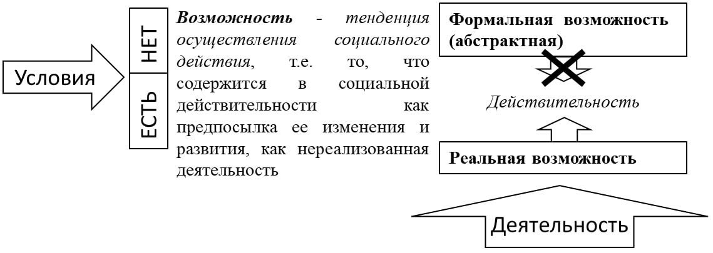
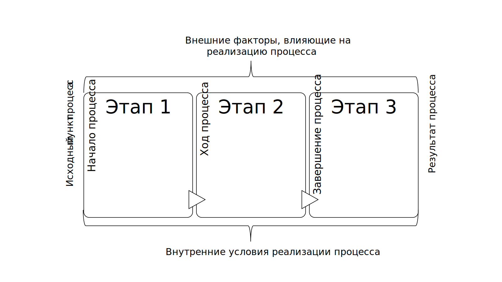

> **И. А. Газиева. Формирование профессионального потенциала молодёжи в системе высшего образования: ценностный подход** — диссертация на соискание учёной степени доктора социологических наук (5.4.4, РАНХиГС, Москва, 2025, 468 с.). Раздел: **Глава 1**.
>
> [Оглавление репозитория](README.md) · [Как цитировать](#как-цитировать-этот-текст) · [Правила для ИИ](AI-INSTRUCTIONS.md)

# Глава 1. Профессиональный потенциал молодёжи в системе высшего образования как социологическая категория

## **1.1 «Возможность» и «потенциал»: социологический анализ понятий**

Профессиональный потенциал являет собой комплексную характеристику, включающую целый ряд переменных, определяющих положение человека на рынке труда, если речь идет об индивидуальном профессиональном потенциале, либо определяющих возможности отдельных социально-демографических, профессиональных групп, составляющих ресурс социально-экономического развития общества. В то же время, когда мы говорим о профессиональном потенциале, с необходимостью обращаемся к тем условиям, наличие которых может обеспечить эффективную реализацию характеристик, составляющих его содержание. В силу комплексности и широты понятия профессионального потенциала, оно, безусловно, нуждается в серьезном уточнении, что необходимо начать с центрального понятия «потенциал».

Любая сфера деятельности человека содержит потенциал организационно-вещественных факторов и отношений по поводу конкретного объекта производства, распределения, обмена и потребления. Он может представлять собой запасы, средства, источники, которые могут быть мобилизованы, приведены в действие или использованы для достижения определенной цели, осуществления плана, решения какой-либо задачи, а также – определенные возможности самореализации отдельного лица, семьи, предприятия, фирмы, города, региона, области, республики, государства, коммерческих структур, общества и общественных организаций, государственных и представительных структур в определенной для каждого из них области.

В своем изначальном понимании потенциал (от лат/ potencia – сила) относится к сфере «возможного», которое как философская категория выражает способность материи в процессе движения принимать различные формы; отсюда можно допустить, что любое социальное явление при известных условиях может изменить форму своего существования или превратиться в другое явление. В социологической традиции «возможное», равно как и производный от него термин «возможность», не являясь ключевым понятием, нередко используется классиками социологии в качестве смыслоопределяющего в ходе их понятийной концептуализации.

Так, например, в контексте методологического подхода М.Вебера к смысловому описанию социального отношения, представляющего собой «поведение нескольких людей, соотнесенное по своему смыслу друг с другом и ориентирующееся на это», которое «полностью и исключительно состоит в возможности того, что социальное поведение будет носить доступный (осмысленному) определению характер»[^87], именно возможность взаимного осмысления поведения делает социальное отношение особенным и отличным от простого физического взаимодействия. Субъекты социального отношения осознают, что их действия имеют смысл не только для них самих, но и для других. Однако социальное отношение не сводится к конкретным действиям, а будучи основанным на потенциале того, что действия могут быть осмысленно поняты, предполагает существование именно возможности понимания смысла, даже если по факту сам смысл непонятен.

В контексте определения возможности проявления осмысленного социального поведения в среде студенческой молодёжи будем говорить об ориентации студентов и преподавателей на определенные цели и ценности, связанные с освоением обучающимися будущей профессии, что может быть достигнуто и усвоено в ходе структурированного и систематизированного обучения посредством использования совокупности учебно-методических материалов (учебных программ, учебных материалом, методов обучения), создающих определенный смысл для участников обучения. Определенный объем знаний наряду с ценностями может быть сформирован и усвоен при наличии необходимых для этого способностей у каждого отдельного студента; при отсутствии таких способностей, а также определенных условий результаты образовательного процесса могут оказаться весьма скудными, однако возможность их получения может быть, и она обеспечивается конкретным вузом.

С этой точки зрения можно говорить и о том, что социальные действия не предопределены и сложно предсказуемы в отличие от действий животных, в некотором роде запрограммированных инстинктами. Об этом говорит и Т. Парсонс в контексте пояснения двойной контингенции, которую, несмотря на разночтения в переводах и подходах к его пониманию[^88], исходя из концептуального контекста Т.Парсонса, мы склонны понимать как двойную возможность.

Так, Парсонс говорит о двойной возможности в контексте двойной зависимости от обстоятельств, присущей социальному взаимодействию, где «с одной стороны, удовлетворение эго зависит от того, какие альтернативы он выбирает из числа имеющихся»; с другой стороны, «реакция "другого" будет зависеть от осуществляемого эго выбора и, сверх того, определяется еще и выбором со стороны "другого"»[^89]. Таким образом, мы не знаем заранее, как поведет себя другой человек и, соответственно, не можем предсказать свою собственную на это реакцию, поскольку каждое социальное действие зависит от ожиданий относительно поведения других акторов социального взаимодействия, которые, в свою очередь, опосредуются социальными нормами, ценностями, социальными ролями, знаниями и опытом социальных субъектов.

Такая взаимозависимость действий и ожиданий в образовательной среде вуза создает ситуацию, когда каждый студент во время взаимодействия сталкивается с двойной возможностью («двойной контингенцией»), опосредованной, с одной стороны, неопределенностью в том, как поступит другой человек (студент или преподаватель); с другой, - неопределенностью в том, как он сам должен реагировать, учитывая неизвестность поведения своего социального контрагента. Ситуация двойной контингенции в образовательной среде чаще всего проявляется, безусловно, в ходе прохождения различных оценочных мероприятий, когда у студента есть возможность целенаправленно продемонстрировать полученные знания по конкретной учебной дисциплине, которой он может воспользоваться более эффективно либо менее эффективно в зависимости от уровня подготовленности, что в свою очередь определяется его системой ценностей. В то же время у оценивающего преподавателя также есть возможность проявить бОльшую лояльность или меньшую, в зависимости от различных факторов, набор которых не всегда известен студенту и является для него мало предсказуемым.

Очевидно, что двойная возможность делает социальное взаимодействие непредсказуемым еще и в силу того, что, говоря словами Н. Лумана, «латентности трансформируются в контингенции»[^90], когда скрытый потенциал (латентность) всегда может быть активирован и трансформирован в новые возможности (контингенции), которые требуют от общества выбора и принятия решений.

Таким образом, двойная возможность является фундаментальной характеристикой социального взаимодействия, делая его непредсказуемым, и в то же время открывая широкие возможности для разнообразия развития и креативности существования социальных субъектов; определяя предпосылки для появления возможности скорее реальной или скорее формальной (абстрактной) в рамках социальной действительности не обязательно в контексте социального взаимодействия. Возможность может быть **реальной**, имея необходимый характер и обладая для своей реализации *всеми необходимыми условиями*, а может быть **формальной (абстрактной) –** возможностью, *для осуществления которой нет всех необходимых условий.*

Реализуемость или нереализуемость возможности определяется рядом обстоятельств, факторов, условий. Например, в ситуации формирования возможностей для профессионального развития студенческой молодёжи реальную возможность представляют собой практические занятия в профессиональной среде. Так, студенты медицинских вузов, проходя практику в клиниках, где они могут работать с настоящими пациентами, получают реальные навыки, необходимые для будущей профессии. Студенты инженерных специальностей могут участвовать в проектах, связанных с разработкой и тестированием реальных инженерных решений. Кроме того, реальную возможность представляют собой и стажировки, предлагаемые компаниями-работодателями, где студенты могут работать над реальными проектами и задачами, знакомясь с профессиональной средой.

Формальной возможностью чаще всего являют собой учебные программы и образовательные курсы. Заметим, что мы имеем в виду не только потенциальное устаревание даваемых теоретических знаний или оторванность их от практической деятельности, но и противоположный процесс, когда в учебные планы закладываются образовательные курсы по инновационным технологиям, которые на практике могут быть не доступны из-за отсутствия необходимого оборудования или программного обеспечения на предприятиях.

Соответственно, реальная возможность рано или поздно реализуется, что определяет ее как *закономерную тенденцию развития и реализации социальной действительности, связанной с объективной необходимостью*; формальную же возможность отличает наличие очевидной тенденции развития какой-либо социальной деятельности, но вместе с тем, в каких-то конкретных условиях либо само развитие невозможно, либо его результативность минимальна.

В то же время всякая возможность, начиная свое существование в виде формальной, способна реализоваться в качестве реальной, но только при наличии совокупности условий необходимых и достаточных для ее реализации, поскольку при отсутствии всех необходимых условий и реальная возможность не трансформируется в действительность, т.е. не произойдет реализации потенциала. Так, к безусловно формальным возможностям отнесем теоретические знания, которые могут быть важны для общего кругозора, но редко находят применение в ежедневной профессиональной деятельности, либо вообще любые теоретические профессиональные знания, которые не применяются на практике либо в связи с оторванностью от нее, либо по причине трудоустройства выпускника не по специальности получения этих знаний. Однако обладание глубокими теоретическими знаниями может стать реальной возможностью в случае углубленного погружения выпускника в научную деятельности своей отрасли.

К формальным возможностям можно отнести и различные аккредитации и сертификаты, которые составляют индивидуальный потенциал молодого специалиста и отнюдь не гарантируют возможности их эффективного применения в практической деятельности. Дополнительные сертификационные курсы могут быть очень полезны формально, однако полученные благодаря им навыки могут стать полезными лишь в условиях их практического применения.

Заметим, что, по мнению З.Баумана, чем более различаются шансы возможных реакций на действия социальных субъектов, чем менее случайны последствия этих действий, тем больший, если так можно сказать, существует в мире порядок, а любая попытка «привести вещи в порядок» сводится к оперированию вероятностями тех или иных событий[^91], которые могут произойти, могут не произойти, продемонстрировав была ли это реальная возможность или формальная.

Практическая значимость различия формальной и реальной возможностей основана на том значении, которое имеют условия для перехода возможного в действительное (реализации потенциала). В терминах категории возможного*: успешной может быть лишь та социальная деятельность, которая не только исходит из реальных возможностей, но и управляет условиями трансформации возможности в действительность.* Формальные же возможности могут в этом плане учитываться как более отдаленная перспектива развития, а практические задачи по отношению к ним состоят в организации деятельности, направленной на создание определенных условий, в которых они могут быть реализованы.

В более близком для контекста нашего исследования понимании категории возможности о ней говорит П.Штомпка в ходе анализа понятия «социокультурного поля», которое вводится им в социологический оборот, чтобы подчеркнуть многомерность и взаимосвязь различных аспектов общества. Он использует этот термин, чтобы описать общество как сложную систему, где идеи, нормы, действия и возможности тесно переплетены. Категория «возможности» играет ключевую роль в предложенной модели, определяя одно из четырех его измерений – «возможное измерение» («социальная иерархия», включающая «жизненные шансы, возможности, доступ к ресурсам»[^92]), на котором, равно как и на трех других уровнях измерений (идеальный, нормативный, интеракционный), социокультурное поле непрерывно подвергается изменениям. Так, Штомпка подчеркивает, что «мы постоянно наблюдаем: (…) кристаллизацию, утверждение и перегруппировку возможностей, интересов, жизненных перспектив, подъем и падение статусов, распределение и упорядочение социальных иерархий»[^93], акцентируя внимание на динамике, обеспечивающей неравномерное распределение ресурсов, шансов и власти в обществе.

Возможность получения высшего образования и как процесса, и как результата опосредуется его доступностью: экономической (финансовой), транспортной (географической), содержательной, социальной[^94] и т.д. Возможность реализации полученных в результате обучения знаний и навыков, составляющих потенциал, определяется динамикой перегруппировки жизненных шансов, стечением обстоятельств в окружающей индивида социальной среде в стыковке с сформированным в ходе обучения ценностными ориентациями и установками.

Отсюда можно сделать вывод о том, что возможность как социологическая категория определяет не только то, что может быть в будущем, но и то, что человек готов сделать, чтобы реализовать свой потенциал, какова его ценностная основа деятельности. Кроме того, как мы смогли убедиться, «возможность» есть динамичная категория, которая постоянно меняется в зависимости от контекста, условий и ожиданий акторов социального взаимодействия и деятельности, демонстрируя различные пути развития и самореализации. Такие возможности определяются непрерывным и зачастую неравномерным развитием всех социальных явлений и социальных процессов, что, в свою очередь, способствует их изменению. При таких условиях можно также говорить о том социальном прогрессе, который, согласно Г.Риккерту[^95], характеризуется приростом новых ценностей на каждом этапе развития общества.

Направление социальных изменений как в обществе в целом, так и в молодёжной среде, в частности, подчиняясь определенным социологическим законам, не всегда зависит от условий или обстоятельств, подчиняющихся воле и сознанию людей. Поэтому **возможность,** как социологическая категория, *есть тенденция осуществления социального действия*, т.е. то, что содержится в социальной действительности как предпосылка ее изменения и развития, как нереализованная деятельность, дальнейшая реализация которой зависит от наличия существующих для этого условий; здесь *возможность есть основа потенциала.*

*Результатом реализации некоторой возможности либо совокупности реализованных возможностей является* **действительность (**Рисунок 1.1**).** Отметим, что возможность и действительность, будучи двумя сторонами развития, не являются абсолютно противоположными. Относительная противоположность этих социально-философских категорий обусловлена их взаимосвязанностью: «возможность и действительность как модальные характеристики бытия выражают тенденцию становления и ставшую реальность»[^96]. Они диалектически взаимопереходят друг в друга: возможность по отношению к действительности, как к результату развития, является моментом развития. Но если бы все возможное было одновременно и действительным, то не существовало бы никакого развития в природе и обществе. П.Штомпка, перенося категории «возможности» и «действительности» на социологическую почву, называет их «способами существования социальной реальности — в качестве потенциальной возможности и в действительности», которые «могут быть обнаружены в основных компонентах социального мира»[^97]. Таким образом, здесь мы можем говорить о том, что результатом перехода социального состояния из возможного в действительное является реализация потенциала.

Рисунок 1.1 Схематичное отображение трансформации «возможности» в «действительность» – реализации потенциала

В контексте профессионального развития студенческой молодёжи трансформация возможности в действительность представляет собой процесс реализации его потенциала, демонстрирующей реальные достижения. По сути, это путь от мечты и абстрактных планов - к конкретным действиям, которые формируют профессиональную траекторию молодого специалиста.

Условия трансформации возможности в действительность следует различать в зависимости от среды ее возникновения. В природе возможность может стать действительностью в результате ее стихийного развития. В общественной жизни этот процесс зависит от объективных и субъективных факторов. Здесь к объективным факторам следует относить условия материальной жизни либо процессы, не зависящие от людей; к субъективным – социальную деятельность, включая и социально-управленческую деятельность.

Для формирования и реализации профессионального потенциала необходимо создать подходящие для этого *условия,* которые составляют суть *профессионализации или профессиональной социализации* как процесса становления и развития профессионализма*.* Данный процесс *включает два этапа: вузовский этап, когда происходит* формирование профессионального потенциала в ходе овладения студентами необходимыми профессиональными знаниями, умениями и навыками, формирования смысложизненных ценностей; *послевузовский этап,* когда происходит развитие и реализация профессионального потенциала в ходе включения в профессиональную среду и адаптации к ней.

В силу того, что объектом нашего внимания является студенческая молодёжь, в данной работе мы останавливаемся на изучении необходимых существующих и еще не существующих условий для формирования профессионального потенциала в вузе, описывающих в том числе содержание молодёжной кадровой политики. Не выпускаем при этом из внимания и послевузовский этап профессионализации, поскольку потенциал, выступая в единстве пространственных и временных характеристик, концентрирует в себе одновременно три уровня связей и отношений[^98]: отражающих прошлое (свойства, ранее накопленные системой), репрезентирующих настоящее (актуализированные, применяемые сейчас способности) и ориентированных на будущее (возникающие новые силы и способности). Поэтому для того, чтобы в вузовской среде был сформирован такой потенциал, который должен будет эффективно реализовываться в рабочей среде, необходимо ориентироваться на его целевые и описательные характеристики, которые составляют социологический портрет профессионала.

Понимание диалектической связи возможного и действительного помогает выявлять возможности, обоснованные совокупностью действительных отношений. Отсюда можно сказать, что в социологии «возможное» подчеркивает, что жизненные шансы людей на место в социальной структуре общества не являются предопределенными, а зависят от сложных и многогранных факторов, которые формируются в результате социального взаимодействия и зависят от целого ряда разноплановых процессов, протекающих в обществе. Что касается потенциала, то он в процессе своей реализации приводит к достижению цели, поэтому существует объективная необходимость развития реального потенциала, связанного с деятельностью, имеющей ту или иную направленность.

Заметим, что цель чаще всего определяется необходимостью удовлетворения потребности, которая, в свою очередь, определяется представлением человека о желаемом уровне своего жизненного благополучия: «Благополучие, удобная жизнь, а не просто присутствие в мире как таковое и есть главная человеческая потребность, или потребность потребностей»[^99], которая, согласно Ортега-и-Гассету, является «величиной изменчивой, бесконечной переменной*»*[^100] не только исторически, но и в одно и то же время, в одном и том же месте у различных людей.

Необходимо учесть, что имеющаяся возможность достижения какой-либо цели воплотится в действительность лишь в результате совершения некоторой работы, реализации деятельности и при наличии соответствующих для этого условий, объективных и субъективных факторов. Здесь речь идет о том, что социальная деятельность, с одной стороны, нацелена на формирование профессионального потенциала, а с другой, - на его дальнейшую реализацию. Как и в случае с «условиями», здесь тоже выделяется два этапа: вузовский и послевузовский. В рамках вуза речь идет о тех усилиях, которые прилагают студенты по формированию своего индивидуального профессионального потенциала. Поэтому одной из исследовательских задач, стоящих перед нами, является определение того, является ли для респондентов профессиональное становление реальной ценностью; что они реально делают для достижения профессионального успеха.

Профессиональный успех есть не просто везение или случайность, это результат целенаправленных действий, определенных усилий, умного планирования, учета объективных и субъективных факторов в ходе достижения профессиональной цели. Представители студенческой молодёжи, осознавая все возможности, которые им даются в ходе получения высшего образования, должны активно действовать в направлении реализации своего потенциала на рынке труда, опираясь на сложившуюся индивидуальную систему ценностей, учиться на своих ошибках, адаптироваться к изменениям, искать поддержку и упорно двигаться к своей цели.

Несмотря на кажущуюся схожесть, категории «возможного» и «потенциального» отнюдь не идентичны. «Возможным» является то, что может случиться, то есть это теоретический шанс на реализацию чего-либо; абстрактная идея без конкретной привязки к времени, месту или ресурсам. «Потенциал» же, в свою очередь, есть скрытая способность или запас ресурсов, которые могут быть реализованы в будущем; можно сказать, что это реальная возможность для развития и достижения целей, ограниченная конкретными условиями и ресурсами.

Таким образом, можно говорить о том, что изначально философская природа потенциала как родственной категории «возможного» является источником понимания его социологического смысла, раскрывающегося в реализации потенциала как результате трансформации возможного в действительное, что схематично представлено на Рисунке 1.1 В данной работе мы будем исходить из того, что ***потенциал есть нереализованная возможность, будущее развитие которой вариативно, а реализация зависит от наличия необходимых для этого благоприятных условий, а также качества и характера деятельности социального субъекта, направленной на нее.***

## **1.2 «Профессиональный потенциал молодёжи в системе высшего образования» как социологическая категория: операциоанализация понятия**

Наиболее часто используемыми характеристиками применительно к понятию потенциала и являющимися своеобразными регуляторами объема данного понятия является отнесение его к общности людей («человеческий потенциал») и отнесение к индивидууму или личности («личностный потенциал»), каждое из которых требует дополнительного пояснения.

Понятие человеческого потенциала, будучи в фокусе внимания как социологов, так и экономистов, объединяет в себе «совокупность способностей, знаний, навыков и личностных характеристик человека вне зависимости от того, в какой мере они находят или могут найти конкретное применение в производительной деятельности»[^101]. По мнению авторов монографии «Человеческий капитал российских профессионалов: состояние, динамика, факторы», рассматривающих «человеческий потенциал» как понятие, наряду с «социальным капиталом»[^102] и «культурным капиталом»[^103], дополняющее более основательное и устоявшееся в науке понятие «человеческий капитал»[^104], в «человеческом потенциале» должны «интегрально учитываться все существенные характеристики человека как работника»[^105]. Таким образом, человеческий потенциал представляет собой понятие, охватывающее все возможности и способности человека, как врожденные, так и приобретенные; он присущ всем людям, независимо от их индивидуальных особенностей.

Поскольку человеческий потенциал, в отличие от личностного, относится к различным человеческим общностям, он часто фигурирует в одном контексте не только с понятием «человеческий капитал», но и с такими социально-экономическими категориями, как «трудовой потенциал», «трудовые ресурсы»[^106], на которых в данной работе детально останавливаться не будем.

Более узким, частным понятием по сравнению с «человеческим капиталом» является «личностный потенциал», который представляет собой «сложную систему характеристик, связанных с движущими силами духовного развития, с мотивацией и самооценкой»[^107], обеспечивая социально-психологическую устойчивость личности.

Заметим, что в зарубежных работах чаще всего рассматривается именно «личностный потенциал» в контексте разработки прикладных инструментов управления талантами (Talent Management) в организации[^108] как практики выявления, поощрения, развития, удержания и управления преемственностью сотрудников. Этот процесс привлекает внимание компаний по всему миру, поскольку становится все более сложной задачей в оценке потенциала, поиске и удержании специалистов с высоким потенциалом роста и преемственности. В данном контексте оценка потенциала есть способ измерения способностей каждого сотрудника в отдельности достичь профессиональных целей с помощью изучения личных качеств, осознания своих природных талантов, а также постоянного обучения и саморазвития. Например, по мнению С. Тэнсли (C. Tansley), потенциал связан со способностью человека продвигаться к более высоким и руководящим должностям, которые она определяет как «человек, обладающий способностью, вовлеченностью и стремлением подняться до более высоких и критически важных должностей и добиться успеха»[^109]. На наш взгляд, здесь предполагается уже более узкая категория, чем личностный потенциал, - управленческий потенциал, в основе которого лежат лидерские качества, которые у индивида могу быть, а могут и не быть.

Оценка личностного потенциала является результатом определенного момента или ситуации, это не значит, что профессионалы всегда будут классифицироваться как одни и те же[^110]. Результатом является перспектива на будущее с учетом текущей ситуации[^111], после чего важно продолжить оценку для разработки плана преемственности, удержания, развития и привлечения новых сотрудников в организацию.

Резюмируем, что в контексте работ, посвященных управлению талантами, потенциал определяется как «будущее измерение таланта», где «потенциал таланта включает в себя приверженность и отношение сотрудника к выбору, росту и продвижению в компании и оказывает мультипликативное влияние на будущие показатели»[^112], а измеряется «будущей способностью человека адаптироваться к стратегическим потребностям компании, учиться и прогрессировать, что материализуется в более высоких показателях в будущем» [^113].

doi:10.1186/s40172-014-0012-2

Cite this article as: Teixeira: Gary Becker’s early work on human capital –collaborations and distinctiveness. IZA

Journal of Labor Economics 2014 3:12

doi:10.1186/s40172-014-0012-2

Cite this article as: Teixeira: Gary Becker’s early work on human capital –collaborations and distinctiveness. IZA

Journal of Labor Economics 2014 3:12.

Человек, имеющий личностный потенциал умений и способностей в определенной сфере жизнедеятельности общества, является частью человеческого потенциала в этой сфере. Вместе с тем человек одновременно может иметь склонности к самореализации в нескольких сферах и в зависимости от сложившихся объективных и субъективных условий его потенциал может быть раскрыт либо не раскрыт. Удачное раскрытие и последующая реализация потенциала может способствовать качественному улучшению развития данной профессиональной сферы.

Однако говоря о «человеческом потенциале», мы рискуем углубиться в экономику; говоря о «личностном потенциале», рискуем отклониться в психологию. Своеобразной промежуточной характеристикой, определяющей потенциал как социологическую категорию, является ее видовое отнесение к профессии (лат. professio, от profiteor - объявляю своим делом), отраженное в понятии «***профессиональный потенциал».*** Безусловно, профессиональный потенциал может изучаться и как личностная характеристика, однако в нашей работе речь идет о профессиональном потенциале социально-демографической группы – студенческой молодёжи.

Термин «профессия», включенный в структуру понятия «профессиональный потенциал», чаще всего употребляется в значении рода трудовой деятельности, «занятий, определяемых производственно-технологическим разделением труда и его функциональным содержанием», либо как «большая группа людей, объединенная общим родом занятий, трудовой деятельности»[^114]. Отсюда очевидно, что «профессиональное» есть категория, объясняющая совокупность определенных черт, характеристик того или иного качества действий, связанных с человеческим трудом, что демонстрирует нам деятельностную природу профессии и связывает определяемый нами профессиональный потенциал с возможностями будущих работников включиться в профессиональную среду организации, понимая ее цели.

Что касается понятия ***«профессионал»,*** как целевого результата реализации профессионального потенциала, то в ходе анализа научных источников, где разъясняется данное понятие, выделяется два подхода к его определению и толкованию, которые мы укрупненно определили как нормативный и научный.

Согласно ***нормативному подходу***, «профессионалы» есть, чаще всего, «профессиональная группа специалистов высшего уровня квалификации» либо определенный социальный статус, который, согласно авторам монографии «Человеческий капитал российских профессионалов: состояние, динамика, факторы», подготовленной научным коллективом ФНИСЦ РАН[^115], присваивается изучаемому объекту исследования в соответствии с двумя наиболее распространёнными в нашей стране классификаторами: Международным стандартом классификации занятий ISCO (International Standard Classification of Occupations)[^116], принятым в качестве официального классификатора занятий Международной организацией труда и адаптированной статистической службой России к условиям нашей страны версией ISCO – ОКЗ (Общероссийский классификатор занятий)[^117], согласно которому к профессионалам относятся «специалисты высшего уровня квалификации».

По результатам анализа нормативных подходов к описанию содержания понятия «профессионал», говоря о нем, авторы монографии подразумевают «работников на позициях, предполагающих высшее образование и не занятых при этом выполнением руководящих функций как основным видом деятельности» [^118]. Мы склонны согласиться с данным определением, поскольку считаем его исчерпывающим в рамках нормативного подхода.

Что же касается ***научного подхода,*** то здесь принято говорить о профессионале преимущественно через призму проявления индивидом профессионализма как показателя качества профессиональной деятельности, представляющей собой сложную систему отношений. В таком контексте профессионализм выступает как некая «социальная перспектива, которая в той или иной мере доступна каждому специалисту»[^119]. Кроме того, профессионализм, согласно Т.Г. Калачевой, есть «интегральная характеристика целеполагающей, мотивированной и эффективной деятельности, требующей для своего осуществления специальной подготовки и соответствующих организационно управленческих условий»[^120], поэтому профессионал должен «не только соответствовать требованиям сферы своей деятельности, но и предвидеть ее последствия, чувствовать и нести за них личную ответственность, что сегодня и придает профессионализму статус нравственного императива»[^121].

Поскольку работа в профессиональной сфере представляет собой сложную сеть взаимоотношений, уровень профессионализма, на наш взгляд, также зависит от социально-организационного контекста, в котором эта деятельность осуществляется. Поэтому формирование профессионализма не только определяется усилиями и целями индивида, но и влиянием соответствующих рабочих систем, в которых играет ключевую роль управление. Руководствуясь таким подходом, в своих более ранних работах мы расширили приведенное ранее определение, данное Т.Г. Калачевой. В нашем понимании профессионализм определяется не только совокупностью знаний, опыта и умений работника, но и его включенностью в деятельностную профессиональную среду через взаимосвязанное осознание целей деятельности организации и его смысложизненных целей, связанных с профессиональной деятельностью[^122].

Однако, говоря о перспективах становления профессионала, еще находящегося в стенах вуза и не включенного в организационную среду места приложения своего труда, согласимся с коллегами из Университета короля Хуана Карлоса (King Juan Carlos University)[^123] в том, что профессиональный потенциал профессионала определяется в том числе и как способность прогрессировать и быстрее обучаться, что приводит к способности адаптироваться к будущим потребностям будущей компании.

Кроме того, анализ влияния проявления профессионализма как реализации профессионального потенциала через призму перспективы качества деятельности можно увидеть в работах американских ученых Р. Силзера и А.Х. Черча (R. Silzer, A.H. Church)[^124], которые подчеркивают, что профессиональный потенциал редко используется в отношении текущей работы, но обычно используется для того, чтобы предположить, что человек обладает качествами, позволяющими ему эффективно работать и вносить вклад в реализацию более широких функций в организации в какой-то момент в будущем. Очевидно, речь идет о том, что характеристиками профессионального потенциала профессионала являются не только его текущие навыки, но и способность к обучению и адаптации в будущей организации, что в свою очередь, во многом, определяется и его ценностными ориентациями и установками[^125].

Отсюда сформулируем ключевые *характеристики профессионального потенциала будущего профессионала: не только и не столько наличные, сформированные компетенции, сколько готовность и способность индивида развиваться, а также готовность индивида к возможным изменениям в будущей своей организации и готовность брать на себя новые функции.*

Несмотря на ведущее влияние профессиональной среды на реализацию профессионального потенциала и, как следствие, формирование профессионала, перефразировав и несколько дополнив предложения В.А. Цвыка[^126], обозначим еще несколько характеристик профессионального потенциала будущего профессионала как предпосылки к его формированию, закладываемые в вузе:

1.  *Умение видеть свою профессию во всей совокупности ее широких социальных связей, что предполагает потребность в интеграции в профессиональное сообщество, включая не только коллег, но и внешних экспертов.*

2.  *Знание требований, предъявляемых к профессии и ее представителям.*

3.  *Понимание содержания и специфики своей профессиональной деятельности.*

4.  *Умение ориентироваться в круге профессиональных задач и быть готовым разрешать их в меняющихся социальных условиях.*

5.  *Готовность нести ответственность за результаты своей профессиональной деятельности.*

Таким образом, профессионал – работник, обладающий глубокими знаниями, умениями и навыками в той сфере деятельности, в которой трудится и занимает позицию, предполагающую наличие высшего образования, соблюдающий профессиональную этику и несущий высокий уровень профессиональной ответственности за результаты своей работы; нацелен на постоянное профессиональное развитие и совершенствование. Заметим, что приведенные описательные характеристики образа профессионала можно назвать своеобразным результатом следования конкретным смысложизненным ценностям.

Успех интеграции сотрудника в профессиональную среду зачастую определяется особенностями его системы ценностей. Во-первых, совпадением его ценностей с ценностями организации, составляющими ее корпоративную культуру; во-вторых, уровнем сформированности ключевых смысложизненных ценностей, а также ценностей профессионального развития и самореализации, определяющие целевые профессиональные установки сотрудника.

Здесь необходимо принять во внимание тот факт, что то, что для одних является ценным и желанным, для других может не быть таковым, поскольку цели, как правило, происходят из объективных условий жизни человека, из необходимости удовлетворения его конкретных потребностей, в т. ч. в самореализации, для которой, в свою очередь, должны быть созданы необходимые условия. Осознавая состояние и структуру организации общественных отношений, человек делает выбор в сторону желаемого и должного для себя, руководствуясь этим выбором в своей деятельности на основе общественных норм и социальных ценностей.

Норма, будучи формой отражения социальной реальности и фактором, жестко детерминирующим социальную деятельность, определяет средство или способ ее осуществления. В свою очередь, на основании результатов ценностного отражения действительности формируются соответствующие смысложизненные цели человека в определённой сфере деятельности. Здесь и формируются базовые социальные установки личности, которые объясняют направленность личности на определённую сферу деятельности, тип и качество отношения к этой сфере. Целеполагание на этом уровне направленности личности, считает В.А. Ядов, «... представляет собой некий «жизненный план», важнейшим элементом которого выступают отдельные жизненные цели, связанные с главными социальными сферами деятельности человека в области труда, познания, семейной и общественной жизни».[^127]

Таким образом, хотя детерминированность личности внешними условиями осуществляется только посредством ее субъективности, наличие норм ограничивает эту субъективность объективными рамками должного и ценностного. Именно это объективное ограничение позволяет изучать и типологизировать поведение молодёжи, находящейся на этапе определения сферы своей профессиональной деятельности, находясь одновременно в пространстве смысложизненного целеполагания, связанного с будущей деятельностью. В этом случае цель осознается как должное, ценностное, что можно получить через профессиональную деятельность, а сами ценности инструментализируются как осознание факторов, влияющих или способных влиять на трудовую активность. Заметим, что в случае несовпадения либо конфликта смысложизненных целей работника с целями организации, включения в профессиональное пространство не происходит, что препятствует профессиональной самореализации работника, а значит – реализации его профессионального потенциала.

Таким образом, профессиональный потенциал студенческой молодёжи рамочно можно охарактеризовать как *детерминированные смысложизненными ценностями имеющиеся, но скрытые и пока еще не использованные либо невостребованные профессиональные возможности осуществления молодёжью целенаправленной продуктивной трудовой деятельности,* где «профессиональные возможности» представляют собой индивидуально-психологические свойства личности, отвечающие требованиям конкретной профессии, и являются своеобразным показателем эффективности профессиональной ориентации.

Фрэнк Парсонс, заложивший научные основы профориентационной деятельности и определивший ключевые принципы поиска наилучшего соответствия между личностью и конкретной профессией, подчеркивал важность понимания как индивидуальных особенностей, так и факторов, присущих различным профессиям, для обеспечения успешного и удовлетворительного выбора профессии[^128]. Его метод включает ряд шагов, направленных на самооценку респондентов, изучение профессии и, в конечном счете, на сопоставление этих двух факторов для оптимального выбора профессии.

Исходя из предложенного Ф. Парсонсом подхода, современные ученые определяют профессиональную ориентацию как «процесс осознания индивидом существующих в обществе конкретных видов трудовой деятельности – профессий, собственных склонностей и способностей к одному (или нескольким из них), путей или средств овладевания знаниями и навыками, необходимыми для выполнения профессионально-трудовых функций»[^129]; «сложный процесс, где личные желания и способности человека часто сталкиваются с требованиями рынка труда»[^130]. По мнению ряда ученых, это столкновение нередко приводит к разочарованию в выборе профессии, поскольку ожидания не всегда совпадают с реальностью[^131], кроме того, профессиональные ориентации студенческой молодёжи в принципе носят весьма неустойчивый характер[^132]. В результате - возникает желание сменить профессию, что запускает новый виток профориентации. Этот процесс продолжается на протяжении всей жизни человека, формируя профессиональный ландшафт общества. И именно поэтому говоря о профессиональном потенциале, мы не делаем акцент на какой-то одной конкретной профессии, а ориентируемся на способности молодёжи быть субъектами профессиональной деятельности без привязки к конкретной профессии, но с опорой на их систему ценностей.

Такой подход дает нам возможность определить **профессиональный потенциал студенческой молодёжи** как ***детерминированную социальными ценностями готовность молодёжи использовать свои личностные свойства и сформированные в вузе профессиональные компетенции для осуществления целенаправленной продуктивной трудовой деятельности.***

Заметим, что здесь ключевым термином являются не сами личностные свойства или компетенции, а именно готовность к их использованию, что обусловливает сознательный уход автора от измерения этих свойств и компетенций. Однако в связи с тем, что профессиональный потенциал принято описывать преимущественно через оценку компетенций, дополнительно обоснуем свой уход от нее, описав наиболее популярные подходы к оценке профессиональных компетенций, лежащих в его основе.

На сегодняшний день существует немало методов оценки сформированных компетенций студента, которые делятся на две большие группы: методы оценки hard-skills и soft-skills.

Наиболее распространенным и очевидным методом оценки сформированности «жестких» профессиональных компетенций (hard-skills), используемым в вузовской среде, безусловно, является оценка текущей академической успеваемости и оценка в рамках итоговой аттестации (сдача государственного экзамена и/ или защита выпускной квалификационной работы), в основе которой лежат профессиональные стандарты[^133], федеральные государственные стандарты (ФГОС ВО 3++)[^134] либо собственные образовательные стандарты, принятые вузом[^135] согласно Указу Президента РФ «Об утверждении перечня федеральных государственных образовательных организаций высшего образования, которые вправе разрабатывать и утверждать самостоятельно образовательные стандарты по образовательным программам высшего образования»[^136]. Об эффективности данной системы оценивания сформированных профессиональных компетенций однозначно говорить сложно, поскольку, с одной стороны, фонды оценочных средств (ФОС) выстроены в четком соответствии с указанными стандартами, с другой стороны, ни работодатели, ни сами выпускники практически не ориентируются на результаты такого оценивания. Безусловно еще существует широкий спектр оценочных средств, используемых в ходе профессиональной сертификации, которые разработаны далеко не для всех профессий, а также комплексы оценочных средств, используемых при отборе на должность, которые не представляют собой единую систему.

Что касается оценки «мягких» профессиональных компетенций студенческой молодёжи (soft-skills), то ключевым методом, который становится все более популярным в нашей стране, является система оценки «компетенций, наиболее востребованных у работодателей и при создании своего дела»[^137], разработанная в 2021г. и применяемая в рамках одного из проектов Президентской платформы «Россия – страна возможностей» - Центра компетенций. В результате тестирования на платформе Центра компетенций студенты получают оценку следующих компетенций: партнерство и сотрудничество; планирование и организация; ориентация на результат; анализ информации и выработка решений; клиентоориентированность; следование правилам и процедурам; коммуникативная грамотность; саморазвитие; лидерство; стрессоустойчивость; эмоциональный интеллект.

Согласно планам, заявленным создателями Центров компетенций, студенты после прохождения диагностики своих универсальных компетенций («мягких навыков») будут работать над ними в рамках траектории самореализации, которую должен сформировать для них вуз. Таким образом, Центры компетенций должны нести одновременно функцию и оценки потенциала, и их развития. Однако единство системы тестирования в данной ситуации не предполагает единства подходов к формированию траекторий для самореализации, поскольку дальнейшая работа отдается на откуп вузов, включенных в данный проект (на начало 2024г. - их более 200). Каждый вуз предлагает свои наборы развивающих средств, которые централизованно не регламентируются, равно как и не регламентируется централизованно оценка эффективности функционирования Центров компетенций, что пока делает размытой перспективу реализации данного проекта.

Очевидно, что инструментарий, используемый в рамках Центров компетенций, не представляется нам полноценно решающим задачи профессиональной компетентностной диагностики студентов, поскольку, не вдаваясь в содержательные особенности и самого инструментария, можно сказать, что здесь оцениваются, преимущественно soft-skills, в то время как специфические знания по получаемой профессии не учитываются совсем, что не дает полной картины сформированности профессионального компетентностного потенциала студента и выпускника.

Заметим, что на сегодняшний день разработан целый ряд механизмов, позволяющих оценить и soft-skills, и hard-skills. К таким механизмам относятся, например, симуляторы, компетентностные экзамены[^138] и подобные им оценочные механизмы. Однако автор, будучи многие годы включенным в процесс интеграции указанных механизмов в образовательный процесс, не берясь оценивать их методическую состоятельность, вынужден констатировать, что ни один из них, а также ни один из приведенных ранее инструментариев оценивания профессиональных компетенций студенческой молодёжи не имеет достаточных оснований для того, чтобы говорить о том, что высоко оцененная одним из измерителей молодёжь с большой долей вероятности сможет, а главное, захочет эффективно применять полученные компетенции в практической деятельности, а также нацелена на дальнейшее совершенствование своих навыков, находясь в профессиональной среде.

Мы не можем быть полностью в этом уверены по двум причинам. Во-первых, современная система профессиональной социализации, элементом которой является система профессиональной ориентации, не вполне эффективна: *«Национальная система профессиональной социализации малоэффективна, разбалансирована, функционирует в условиях отсутствия связей с потребностями общества»*[^139]*.* Соответственно, студенты, имеющие высоко развитые компетенции по своей будущей профессии, не обязательно пойдут дальше трудиться по этой профессии, применяя полученные в вузе знания и реализуя себя в ней. Во-вторых, студенты, у которых не сформирована, например, ценность созидательного труда или ценность профессионального развития, с очень малой вероятностью будут составлять собой реальный потенциал социально-экономического развития общества. Более того, человека приводят в профессию не столько высоко сформированные компетенции, соответствующие ей, сколько ценность этой конкретной профессии, независимо от того, в чем выражается эта ценность (доход, статус, профессиональные перспективы и т.д.).

Все эти обстоятельства свидетельствуют о том, что одним из подходов к диагностике профессионального потенциала студенческой молодёжи должен быть именно ценностный. Что же касается его формирования, то в контексте данной работы оно видится как социальный процесс, на чем остановимся более подробно далее.

## **1.3 Формирование профессионального потенциала молодёжи в системе высшего образования как социальный процесс**

Г. Риккерт, первым описавший связь ценности с действительностью, устанавливает ее через понятие прогресса, которое определяет как «повышение в ценности (Wertsteigerung) культурных благ»[^140], подчеркивая при этом «бытийную» значимость ценности и представляя ее одной из важнейших характеристик предметов и процессов, благодаря которым они поднимаются на уровень выше подобных предметов и явлений. Таким образом, сущность прогресса описывается Г.Риккертом как процесс изменений во времени при наличии дополнительной ценности на каждой последующей стадии по сравнению с предыдущей.

Ориентируясь на подходы Г.Риккерта, мы видим формирование профессионального потенциала студенческой молодежи именно как сложный и многоуровневый социальный процесс, который связан с ее подготовкой к будущей профессиональной деятельности, поэтому в данном контексте важно не только провести терминологический анализ данного понятия, но и наметить этапы реализации этого процесса.

Этимологический анализ термина «формирование» затруднено обширной многозначностью основного понятия «форма» (9 значений)[^141] и при этом – заметно меньшим, согласно словарю иностранных слов, кругом значений производного термина «формирование» (2 значения)[^142]. Для нас весьма важным является вопрос определения содержания понятия формы, поскольку она является результирующей процесса формирования. Поэтому, не уходя в подробности размышлений над каждым словарным значением, проложим следующие логические параллели между двумя наиболее соответствующими контексту данной работы значениями основного и производного понятия – «формы» как результата «формирования» как процесса: формирование - как процесс образования чего-либо, результатом которого является «устройство, структура чего-либо, система организации чего-либо»; формирование - как процесс придания некой формы как «наружного вида», «внешнего очертания».

В контексте формирования профессионального потенциала студенческой молодежи мы не склонны явно разделять приведенные два значения, поскольку они, дополняя друг друга, придают бóльшую содержательность изучаемому нами понятию. Так, термин «формирование» мы рассматриваем как создание структуры или основы профессионального потенциала молодежи, что включает в себя придание ему определенной формы, наполняемой содержанием — знаниями, навыками, социальным и профессиональным опытом, ценностями. Таким образом, «формирование» охватывает и процесс создания структуры профессионального потенциала, и ее последующее наполнение, что закладывает основу для дальнейшего комплексного развития профессионального потенциала как процесса последующего формированию. Данные понятия, «формирование» и «развитие», являясь родственными, нередко ставятся учеными в один ряд, рассматриваясь вместе[^143], а иногда и подменяя друг друга, поэтому уделим отдельное внимание их разграничению.

Многие ученые в сфере общественных наук благодаря этим общенаучным понятиям описывают и характеризуют общественные процессы и их последствия. Однако в данной работе понятия «формирование» и «развитие» разводятся. Безусловно, оба понятия являются характеристиками поэтапного изменения социальных объектов, однако формирование больше соответствует начальному этапу этих изменений, который завершается созданием некоего объекта, а развитие – «непрерывный процесс закономерного целенаправленного изменения»[^144], «необратимое направленное изменение материальных и идеальных социальных объектов и социальных процессов»[^145], предполагающее «качественное изменение в структуре объекта», под которым Б.А. Грушин предлагает понимать изменение «внутренних составляющих объекта, его существенные связи и зависимости», изменение «его внешних, непосредственно воспринимаемых стороны, его формы», «возникновение новых структурных составляющих объекта – элементов, связей и зависимостей, слагающих его структуру»[^146], чего не может происходить в ходе формирования как социального процесса.

Заметим однако, что даже в Российской социологической энциклопедии понятие «формирование», определяемое как «последовательное изменений состояний или элементов социальной системы и ее подсистем, любого социального объекта», предполагает не любой социальный процесс, а <u>процесс развития</u>, который «обусловливает переход объекта к качественно новому состоянию»[^147].

Еще одним важным отличием «формирования» от «развития» является определяющая роль внешних факторов в ходе реализации обоих процессов. Процесс развития как таковой включает в себя как внешние, так и внутренние аспекты. Например, развитие личности человека представляет собой изменение, происходящее под воздействием различных факторов: внешних и внутренних, управляемых и неуправляемых, социальных и природных. Достижение определенных целей, завершение долгосрочных проектов также можно считать процессом формирования синонимичного созданию, который завершается и достигает зрелости. В педагогической литературе[^148] «формирование» рассматривается как процесс, проходящий под влиянием социальных факторов, которые осуществляют неконтролируемое воздействие на человека, что по сути, говоря социологическим языком, представляет собой процесс социализации.

Кроме того, формирование предполагает создание структуры, которая обозначает порядок и системность на основе организации существующих качеств в целостное образование. Образовательный процесс в вузе, который включает обучение и воспитание, фокусируется на формировании профессиональных компетенций, оценить качество которых можно лишь в ходе профессиональной деятельности, в ходе реализации профессионального потенциала.

Говоря о студенческой молодежи и ее профессиональном потенциале необходимо заметить, что его развитие происходит при личностной активности и желании каждого конкретного индивида, в то время как формирование может происходить пассивно, без согласия на то социального объекта под влиянием из вне[^149], поскольку, соглашаясь с позицией Р.И. Иванова о том, что формирование человеческого потенциала является составной частью общего процесса социализации[^150], мы еще раз подтверждаем роль воздействия на него разного рода внешних факторов. Напомним, что поскольку «человеческий потенциал» является родовым понятием для понятия «профессиональный потенциал», мы можем проводить аналогии в части определения его как процесса, скорректировав, однако, описание цели в силу большей широты объема родового понятия. Исходя из этого рамочно определим понятие формирования профессионального потенциала студенческой молодежи как *совокупность целенаправленных действий его субъектов, нацеленных на создание условий для образования детерминированной социальными ценностями готовности молодёжи использовать свои личностные свойства и сформированные в вузе профессиональные компетенции для осуществления целенаправленной продуктивной трудовой деятельности.*

Таким образом, еще раз обратим внимание на то, что в данной работе делается акцент именно на формировании профессионального потенциала, поскольку мы говорим о создании таких условий, которые помогут сформировать этот потенциал и будут способствовать его развитию в будущем. При этом избегаются попытки его четкого отграничения «формирования» от «развития», которое является своеобразной надстройкой, продолжением формирования, что затрудняет понимание того, где заканчивается формирование профессионального потенциала, а где начинается его развитие. По сути, развитие и реализация профессионального потенциала происходит уже за пределами вуза. Безусловно, начальный этап как развития, так и реализации потенциала возможен и в рамках вуза, если речь идет о реализации профессиональных функций в ходе трудовой деятельности в вузе, а также учебной практической или внеучебной деятельности.

Изучение формирования профессионального потенциала студенческой молодежи как социального процесса, предполагает его понимание не с позиции статики, а с позиции динамики в логике, предложенной П.А. Сорокиным, который видит процесс как характеристику изменчивости, понимая его как «любой вид движения, модификации, трансформации, чередования или «эволюции», … любое изменение данного объекта в течении определенного времени, будь то изменение его места в пространстве, либо модификация его количественных или качественных характеристик»[^151]. Предполагая в процессе формирования профессионального потенциала наличие неких его изменений, включая развитие, не будем забывать о том, что «процесс» обозначает последовательность действий или событий, ведущих к определенному результату. Он структурирован, имеет начало и может иметь конец. Что же касается изменения, то оно в свою очередь относится к факту перехода из одного состояния в другое, что может происходить как результат процесса. В то же время изменение может произойти и спонтанно, без четко определенной последовательности шагов. Проще говоря, процесс — это путь, а изменение — это финальный результат этого пути, результат формирования профессионального потенциала.

Из приведенного размышления видно, что значение понятия «процесс», как и понятие «форма» может варьироваться в зависимости от контекста, например, как «полифоническая деятельность людей и сопряженность различных событий»[^152], однако в целом можно согласиться с достаточно конкретным определением, данным П.Штомпкой: «понятие *процесс* служит для описания хода, наступающих последовательно друг за другом и взаимно обусловленных изменений системы (в этом случае мы называем их фазами или этапами)»[^153]. Соответственно, любой процесс всегда предполагает наличие начальной и конечной точки, а также промежуточных этапов, что определяет его структуру. В то же время, говоря о социальном процессе, нельзя не отметить, что ему свойственна значимая длительность, часто - без конкретной точки завершения; социальный процесс предполагает стремление к идеалу, который, по словам Э.Дюркгейма[^154], недостижим, в том числе и потому что имеет свойство меняться во времени.

Однако не будем забывать, что объектом нашего изучения является формирование профессионального потенциала студенческой молодежи не просто как процесс, но как социальный процесс, который имеет в современной социологии целый ряд определений. Выделим из них наиболее значимые для данной работы. Так, формирование как социальный процесс определяется как:

- *совокупность изменений объекта:* «серия изменений какого-либо объекта, имеющего своего носителя, который придает содержанию процесса определенную специфику»[^155];

- *последовательность смены состояний объекта*: «последовательная смена состояний социальной организации в целом или ее отдельных структурных элементов»[^156];

- *совокупность социальных действий, направленных на объект:* «совокупность однонаправленных и повторяющихся социальных действий, которые можно выделить из множества других действий»[^157];

- *характеристика социальной действительности в ее динамике, движении и развитии:* «динамическое выражение социальной реальности»[^158]; «полисубъектное образование, состоящее из множества отдельных деятельностей и приводимое в движение индивидами»[^159];

- *способ подготовки к реализации потенциала:* «способ осуществления движения социального бытия из потенциального в реальное»[^160].

Можно сказать, что предложенные определения характеризуют социальные процессы с позиции последовательной изменчивой динамики социального объекта, обеспечиваемой социальными субъектами через их деятельность, исходя из чего с*оциальный процесс* можно определить как последовательное динамическое изменение социального объекта, которое осуществляется совокупностью направленных на него социальных действий, нацеленных на реализацию потенциала социального объекта. Однако данной информации еще недостаточно, чтобы сформулировать исчерпывающее операциональное понятие нашему объекту изучения.

Поскольку формирование профессионального потенциала в данной работе рассматривается как социальный процесс, который, согласно Г.Спенсеру, предполагает приспособление элементов и способностей социального объекта «в зависимости от их употребления или неупотребления», а также «непрерывное формирование организмов то в одну, то в другую форму, в зависимости от окружающих условий», оно с необходимостью протекает в определенных условиях, «ибо формирование это всегда идет в согласии с изменением этих окружающих условий»[^161]. Сами же условия социального процесса, определяемые Б.А. Грушиным как «те составляющие его механизма, которые обеспечивают превращение исходного пункта процесса в его результат»[^162], могут представлять собой такую совокупность обстоятельств, которые не только способствуют, но и препятствуют осуществлению социальных изменений и взаимодействий. Кроме того, Б.А. Грушин также понимает под условиями «внутренние составляющие объекта, которые, находясь в объективной связи с образующими процесса, как раз превращают исходный пункт в результат»[^163].

Обратим внимание на то, что условия, в целом, представляют собой обстоятельства или среду протекания процесса, в то время как факторы, часто ошибочно приравниваемые к условиям, представляют собой конкретные причины, влияющие на результат процесса. Условия чаще всего порождаемы внутренней средой, а факторы - внешней.

С учетом появившихся уточнений значения понятия социального процесса формирования профессионального потенциала студенческой молодежи определим его следующим образом***: совокупность социальных действий, направленных на создание условий для интериоризации ценностей и воспитания готовности студенческой молодежи к развитию и использованию профессиональных компетенций, а также своих личностных свойств и качеств.***

Современные отечественные социологи, говоря о формировании человеческого потенциала, подчеркивают немалую трудоемкость реализации этого процесса. Безусловно, нельзя не согласиться с Т.И. Заславской в том, что «характер менталитета, структура ценностей, типы личностей сравнительно слабо изменяются на протяжении жизни людей, в значительной мере передаются от поколения к поколению»[^164], в то же время находясь в зависимости не только от генофонда страны и особенностей национальной культуры, но условий социализации, которые формируются в том числе в вузовской среде. Безусловно, «человеческий потенциал больших социальных общностей (населения, народа, этноса, молодежи, женщин, слоев, классов и т.п.) недоступен для непосредственного воздействия», предполагается, что «такие потенциалы можно формировать опосредованно»[^165], однако мы говорим о более узком понятии - профессиональном потенциале студенческой молодежи, который формируется в первую очередь в вузовских условиях под воздействием различных факторов.

Что касается структуры формирования профессионального потенциала студенческой молодежи как социального процесса, то с одной стороны, ее можно понимать как структуру социального взаимодействия, поскольку наличие связей и взаимоотношений между людьми, их взаимных ориентаций является обязательным атрибутом всякого социального явления. С другой стороны, данный социальный процесс необходимо рассматривать как серию событий, образующих в своей совокупности органическое единство.

Поскольку согласно Б.А. Грушину, «всякий процесс может и должен быть охарактеризован прежде всего с точки зрения его составляющих – тех элементов, связей и зависимостей объект, которые участвуют в процессе»[^166], выделим наиболее общие универсальные характеристики структуры процесса, который схематично отражен на рисунке 1.2.

Рисунок 1.2 Структура социального процесса

**1. Образующие социального процесса:**

- «исходный пункт процесса» - состояние социального объекта в его исходной точке;

- «результат процесса» - состояние социального объекта в его конечной точке.

В контексте данной работы, безусловно, речь идет о профессиональном потенциале студенческой молодежи, состояние которого может диагностироваться в начале и в конце каждого образовательного периода (учебного года), а методологической основой такой диагностики может стать эмпирическая модель социологической диагностики профессионального потенциала студенческой молодежи, предложенная автором в одном из разделов данной работы.

Говоря о результате формирования профессионального потенциала студенческой молодежи как социального процесса важно отметить, что не представляется возможным дать исчерпывающий ответ на вопрос о том, что им является, в силу отсутствия нормативной модели и невозможности ее построения. Здесь согласимся с Н.Гартманом в том, что «ценности могут быть реализованы, и, быть может, реализованы в значительной мере. Но они также могут быть и не реализованы. В их сущности не заключено как принцип, чтобы действительное им соответствовало. Здесь могут царить сколь угодно широкие расхождения и даже крайние противоречия. Это «не вредит» ценности как принципу; ее сущность не есть сущность закона бытия. (…) По сравнению с действительным они означают лишь некое требование, долженствование бытия, но не означают безусловной необходимости, реального принуждения»[^167]. Отсюда очевидно, что в ходе формирования профессионального потенциала студенческой молодежи, безусловно, должно присутствовать разумное стремление к достижению идеального образа, характеризующегося максимальным уровнем сформированности смысложизненных и профессиональных ценностей, предполагающее невозможность полного достижения данного идеала в силу специфики природы общественного развития вообще и отдельных социальных групп, в частности.

**2. Этапы социального процесса:** по сути, речь идет о содержательных стадиях в развитии социального объекта, выстроенных в определенную последовательность. В терминологии П. Штомпки процесс формирования профессионального потенциала можно определить как *направленный процесс,* что предполагает наличие у него двух отличительных признаков*.* Во-первых, «ни одна фаза такого процесса не совпадает с другой, не может быть ей идентична (то есть процесс является необратимым)», во-вторых, «каждая позднейшая по времени фаза приближает состояние системы к определенному выбранному образцу – предпочитаемому, желанному или, наоборот, негативному (то есть к какой-то определённой цели, к стандарту данного направления – к прекрасному идеалу или, наоборот, неизбежному фатальному концу)»[^168]. Такой подход демонстрирует вполне конкретные требования к выстраиванию этапов любого социального процесса: прямолинейность; неповторяемость, уникальность этапов; последовательность приближения к искомому результату.

В ходе процесса формирования профессионального потенциала студенческой молодежи можно выделить крупноблочно три ключевых этапа:

- **Начало процесса**: предполагает поступление студента в вуз, первичные адаптационно-ознакомительные мероприятия.

- **Ход процесса (основной этап):** он делится над подэтапы по учебным годам, включая ***обучение*** ***и воспитание,*** направленные на создание знаниевого базиса и обеспечение формирования профессиональных качеств*,* а также ценностей, обеспечивающих осуществление эффективной профессиональной деятельности студентов после окончания вуза. Данный этап охватывает весь период нахождения студента в вузе: обучение на программе бакалавриата (специалитета), далее, возможно, на программе магистратуры. Обучение в аспирантуре в данном контексте не рассматриваем, поскольку аспиранты являются другой категорией обучающихся.

Под *обучением* мы понимаем освоение обязательной вузовской программы, которая регламентируется: содержательно — различными профстандартами и собственными образовательными стандартами вузов; организационно – ФЗ «Об образовании РФ», Уставом вуза и рядом других федеральных и локальных нормативных актов. Что касается *воспитательного процесса*, то он регламентируется статьей 12.1 ФЗ «Об образовании» («Общие требования к организации воспитания обучающихся»)[^169] и должен осуществляться на основе разработанной в соответствии с Методическими рекомендациями Министерства образования и науки РФ[^170] и утвержденной в вузе Рабочей программы воспитания и Календарного плана воспитательной работы.

Согласно ФЗ от 31 июля 2020 г. № 304-ФЗ «О внесении изменений в Федеральный закон «Об образовании в Российской Федерации» по вопросам воспитания обучающихся», воспитание представляет собой «деятельность, направленную на развитие личности, создание условий для самоопределения и социализации обучающихся на основе социокультурных, духовно-нравственных ценностей и принятых в российском обществе правил и норм поведения в интересах человека, семьи, общества и государства», а так же формирование у обучающихся правильного отношения к стране, природе и социуму со всеми его наиболее важными характеристиками»[^171]. В данном определении мы видим то важное место, которое законодатель отводит социокультурным и духовно-нравственным ценностям, которые должны лежать в основе профессионального самоопределения студентов.

Безусловно, данный этап можно делить на более мелкие этапы, обладающие специфическими социализационными характеристиками, что не входит в задачи нашего исследования, однако является одной из исследовательских перспектив автора.

- **Завершение процесса**: выпуск студента из вуза и его последующее трудоустройство либо продолжение учебы. Говоря о трудоустройстве, мы не имеем в виду временную занятость в период учебы. Речь идет об определении постоянного места работы, в идеале, в соответствии с полученным образованием.

Именно после данного этапа процесс формирования профессионального потенциала студенческой молодежи плавно перетекает в процесс его реализации и развития профессионального потенциала на рынке труда.

**3. Длительность этапов социального процесса** предполагает определение временных рамок протекания каждого этапа процесса. В нашем случае длительность всего социального процесса равна всему периоду обучения в вузе; каждый подэтап процесса в рамках его основного этапа равен учебному году; стартовый и конечный этап не отличается большой длительностью.

Важно заметить, что на каждом из выделенных этапов реализуется целый ряд различных мероприятий, которые совокупно составляют условия формирования профессионального потенциала молодежи в вузе.

**4. Условия и факторы протекания социального процесса,** а также их преобразования, связь между ними, характеризующая переход от одного состояния социального объекта к другому. Более детально на данном элементе процесса формирования профессионального потенциала студенческой молодежи мы остановимся несколько позже. Однако здесь все же заметим, что, на наш взгляд, ключевым фактором влияния на формирования необходимых условий является характер и качество реализации как Государственной молодежной кадровой политики, так и вузовской. В данном контексте важно подчеркнуть, что профессиональный потенциал студенческой молодежи не является статичным набором навыков и знаний, а представляет собой динамичную систему, зависящую от социальной среды, в которой он формируется. Студенты, осваивая учебную программу, могут не только накапливать знания, но и развивать личностные качества, необходимые для успешной профессиональной жизни.

Формирование профессионального потенциала студенческой молодежи можно рассматривать как сложный социальный процесс, который определяется социальными ценностями и готовностью молодежи применять свои личностные качества и профессиональные компетенции, приобретенные в вузе, для осуществления целенаправленной и продуктивной трудовой деятельности.

Формирование профессионального потенциала студентов является детерминированным социальными ценностями процессом. Это означает, что социальная среда, в которой находятся студенты, включая образовательные учреждения, семьи и профессиональные сообщества, играет решающую роль в процессе социализации и становления их профессиональной идентичности. Социальные ценности, закладываемые в процессе обучения, становятся основой формирования мотивации и внутренней готовности молодых специалистов к активной деятельности на рынке труда. Образовательные учреждения, работающие в соответствии с актуальными требованиями современности, играют ключевую роль в этом процессе, предоставляя студентам возможность интегрировать теоретические знания с практическими навыками.

**ВЫВОДЫ ПО ГЛАВЕ 1.**

1.  Возможность, как социологическая категория, есть тенденция осуществления социального действия, т.е. то, что содержится в социальной действительности как предпосылка ее изменения и развития, как нереализованная деятельность, дальнейшая реализация которой зависит от наличия существующих для этого условий; здесь возможность есть основа потенциала. Потенциал, в свою очередь, есть нереализованная возможность, будущее развитие которой вариативно, а реализация зависит от наличия необходимых для этого благоприятных условий, а также качества и характера деятельности, направленной на нее.

2.  Профессиональный потенциал может изучаться как личностная характеристика и как характеристика определенной социальной группы. В данной работе мы говорим о профессиональном потенциале социально-демографической группы – студенческой молодёжи, который представляет собой детерминированную социальными ценностями готовность молодёжи использовать свои личностные свойства и сформированные в вузе профессиональные компетенции для осуществления целенаправленной продуктивной трудовой деятельности.

3.  Необходимость применения ценностного подхода к диагностике профессионального потенциала студенческой молодёжи обоснован не вполне высокой эффективностью используемых в образовательной практике инструментариев оценивания готовности эффективно применять сформированные компетенции в практической деятельности, а также дальнейшего совершенствования своих навыков после включения в профессиональную среду.

4.  ***Социальный процесс формирования профессионального потенциала студенческой молодежи*** представляет собой совокупность социальных действий, направленных на создание условий для интериоризации ценностей и воспитания готовности студенческой молодежи к развитию и использованию профессиональных компетенций, а также своих личностных свойств и качеств.

5.  ***Структура формирования профессионального потенциала студенческой молодежи как социального процесса*** включает следующие элементы:

1\. **Образующие социального процесса** («исходный пункт процесса» и «результат процесса»): состояние профессионального потенциала студенческой молодежи, диагностируемое в начале и в конце каждого образовательного периода (учебного года).

2\. **Этапы социального процесса** (содержательные стадии в развитии социального объекта, выстроенных в определенную последовательность): ***начало процесса*** (поступление студента в вуз, первичные адаптационно-ознакомительные мероприятия); ***ход процесса*** (основной этап, который делится над подэтапы по учебным годам, включая обучение и воспитание, направленные на создание знаниевого базиса и обеспечение формирования профессиональных качеств, а также ценностей, обеспечивающих осуществление эффективной профессиональной деятельности студентов после окончания вуза); ***завершение процесса*** (выпуск студента из вуза и его последующее трудоустройство либо продолжение учебы).

3\. **Длительность этапов социального процесса** (определение временных рамок протекания каждого этапа процесса): весь период обучения в вузе; каждый подэтап процесса в рамках его основного этапа равен учебному году; стартовый и конечный этап не отличается большой длительностью.

4\. **Условия и факторы протекания социального процесса** (включая их преобразования, связь между ними, характеризующие переход от одного состояния социального объекта к другому): определяются характером и качеством реализации как Государственной молодежной кадровой политики, так и вузовской.

---

### Сноски

[^87]: Вебер М. Избранные произведения. – М.: Прогресс, 1990. – С.630

[^88]: См., например: Сериков А.Е. Проблема двойной контингенции взаимодействия и смысловая связь событий. // Mixtura verborum\`2003: возникновение, исчезновение, игра: Сб. ст. / Под общ.ред. С.А. Лишаева. – Самара: Самар. гуманит. акад., 2003. – 183 с. стр.102-119

[^89]: Парсонс Т. О структуре социального действия. М.: Академический Проект, 2000. С. 436—437.

[^90]: Луман Н. «Что происходит?» и «Что за этим кроется?». Две социологии и теория общества // Социологическое обозрение Том 6. № 3. 2007. – С.116

[^91]: Бауман З. Индивидуализированное общество. - М.: Логос, 2005. – С.40

[^92]: Штомпка П. Социология социальных изменений/Пер, с англ, под ред. В.А.Ядова.—М.: Аспект Пресс, 1996. — С.28.

[^93]: Там же. — С.28-29

[^94]: Новиков М.В. Оценка доступности образования // Отечественная и зарубежная педагогика, 2012. – С.11-14

[^95]: Риккерт Г. Науки о природе и науки о культуре. // Культурология ХХ век. Антология.- М., 1995, с.69-101.

[^96]: Боронина Л. Н. О категории возможности в истории социологии / Л. Н. Боронина // Актуальные проблемы социологии: сборник научных статей. — Екатеринбург: Издательство Уральского университета, 2013. — С.88

[^97]: Штомпка П. Социология социальных изменений/Пер, с англ, под ред. В.А.Ядова.—М.: Аспект Пресс, 1996. — С.28-268

[^98]: Личностный потенциал работника: проблемы формирования и развития / \[В. С. Аллаярова, В. И. Волков, А. Э. Гущина и др. \]; Отв. ред. В. Г. Нестеров, Л. И. Иванько; АН СССР, Урал. науч. центр, Ин-т экономики. - М.: Наука, 1987. - 225,\[2\] с. (с.14-15)

[^99]: Ортега-и-Гассет Х. Избранные труды. – М.: Весь мир, 1997. - С.174.

[^100]: Там же. - С.177.

[^101]: Федотов А.А. Человеческий потенциал и человеческий капитал: сущность и отличие понятий // Экономика и бизнес: теория и практика. 2021. №7 (77). С. 148-155. DOI: 10.24412/2411-0450-2021-7-148-155; Федотов А.А. Человеческий потенциал и качество населения: подходы к определению // Международный журнал гуманитарных и естественных наук. 2020. №3-2 (42). С. 79-86. DOI: 10.24411/2500-1000-2020-10266

[^102]: Коулман Дж. Капитал социальный и человеческий // Общественные науки и современность. 2000. № 3. С. 121–139.

[^103]: Бурдье П. Формы капитала // Экономическая социология. 2002. Т. 3, № 5. С. 60–74. EDN OYUVRD.

[^104]: См., например: Заславская Т.И. Человеческий потенциал в современном трансформационном процессе // Общественные науки и современность. 2005. № 3. – С.5-16; Иванов О. И. Человеческий потенциал (формирование, развитие, использование) / ИПРЭ РАН. СПбГУ. — СПб.: Скифия-принт, 2013; Человеческий потенциал: опыт комплексного подхода. – М.: Эдиториал УРСС, 1999. – 176с.; Teixeira, P.N. Gary Becker’s early work on human capital – collaborations and distinctiveness. IZA J Labor Econ 3, 12 (2014). https://doi.org/10.1186/s40172-014-0012-2

[^105]: Человеческий капитал российских профессионалов: состояние, динамика, факторы: монография / Н. Е. Тихонова, Ю. В. Латов, Н. В. Латова \[и др.\] ; отв. ред. Н. Е. Тихонова, Ю. В. Латов ; ФНИСЦ РАН. М.: ФНИСЦ РАН, 2023. – С. 22

[^106]: Зущина Г.М. Трудовые ресурсы и трудовой потенциал общества / Г.М. Зущина. М.: Наука, 1996. - 143 с.

[^107]: Человеческий потенциал: опыт комплексного подхода. – М.: Эдиториал УРСС, 1999. – С.57

[^108]: См., например: Chuai, X., Preece, D., & Iles, P. (2008). Is talent management just “old wine in new bottles”?: The case of multinational companies in Beijing. Management Research News, 31(12), 901-911. <https://doi.org/10.1108/01409170810920611> ; Collings, D.G., & Mellahi, K. (2009). Strategic talent management: A review and research agenda. Human Resource Management Review, 19, 304-313. <https://doi.org/10.1016/j.hrmr.2009.04.001>; Tansley, C. What do we mean by the term “talent” in talent management?. Industrial and Commercial Training, 43(5), 266-274. . https://doi.org/10.1108/00197851111145853

[^109]: Tansley, C. (2011) What do we mean by the term “talent” in talent management?. Industrial and Commercial Training, 43(5), 266-274. (с.272) . https://doi.org/10.1108/00197851111145853

[^110]: Thiago Sagawe et al. / Professional potential evaluation using a multicriteria approach: An AHP-ELECTRE-TRI proposal // Procedia Computer Science 214 (2022) 628–635 (с.634) // <https://doi.org/10.1016/j.procs.2022.11.221>

[^111]: De La Calle-Duran, M.C., Fernandez-Alles, M.L., & Valle-Cabrera, R. (2021). Talent identification and location: A configurational approach to talent pools. Intangible Capital, 17(1), 17-32. (с.25) <https://doi.org/10.3926/ic.1440>

[^112]: Chuai, X., Preece, D., & Iles, P. (2008). Is talent management just “old wine in new bottles”?: The case of multinational companies in Beijing. Management Research News, 31(12), 901-911. <https://doi.org/10.1108/01409170810920611>

[^113]: De La Calle-Duran, M.C., Fernandez-Alles, M.L., & Valle-Cabrera, R. (2021). Talent identification and location: A configurational approach to talent pools. Intangible Capital, 17(1), 17-32. (с.25) <https://doi.org/10.3926/ic.1440>

[^114]: Филиппов Ф.Р. Профессия // Российская социологическая энциклопедия. Под общ.ред.Г.В. Осипова. – М.: Издательская группа НОРМА-ИНФРА-М, 1998. – С. 425

[^115]: Человеческий капитал российских профессионалов: состояние, динамика, факторы: монография / Н. Е. Тихонова, Ю. В. Латов, Н. В. Латова \[и др.\] ; отв. ред. Н. Е. Тихонова, Ю. В. Латов ; ФНИСЦ РАН. М.: ФНИСЦ РАН, 2023. – 488 с.

[^116]: ISCO - это классификационная структура Международной организации труда (МОТ) / International Labour Organization (ILO), предназначенная для систематизации информации о труде и рабочих местах. Режим доступа: <https://www.ilo.org/international-labour-standards> (дата обращения: 1.05.2024)

[^117]:
    #  ОК 010-2014 (МСКЗ-08). Общероссийский классификатор занятий" (принят и введен в действие Приказом Росстандарта от 12.12.2014 N 2020-ст) (ред. от 18.02.2021) <https://www.consultant.ru/document/cons_doc_LAW_177953/> (дата обращения: 1.05.2024)

[^118]: Человеческий капитал российских профессионалов: состояние, динамика, факторы: монография / Н. Е. Тихонова, Ю. В. Латов, Н. В. Латова \[и др.\] ; отв. ред. Н. Е. Тихонова, Ю. В. Латов ; ФНИСЦ РАН. М.: ФНИСЦ РАН, 2023. – С.117

[^119]: Цвык В.А. Профессионализация как социальный процесс // Вестник РУДН, серия Социология, 2003, №4-5. С.258-269 (258)

[^120]: Калачева Т.Г. Профессионализм государственных служащих субъекта федерации: методологический и методический подход к анализу проблемы. – Н. Новгород, 1998, - с. 32

[^121]: Калачева Т.Г. Профессионализм служащих государственной власти и местного самоуправления: Социологический аспект: диссертация ... доктора социологических наук: 22.00.08. - Москва, 1999. – С.25

[^122]: Газиева И.А. Профессионализм государственных гражданских служащих: проблемные особенности // Власть, 2011, №6. – С. 141

[^123]: De La Calle-Duran, M.C., Fernandez-Alles, M.L., & Valle-Cabrera, R. (2021). Talent identification and location: A configurational approach to talent pools. Intangible Capital, 17(1), 17-32. https://doi.org/10.3926/ic.1440

[^124]: Silzer, R., & Church, A.H. (2009). The pearls and perils of identifying potential. Industrial and Organizational Psychology, 2, 377-412. <https://doi.org/10.1111/j.1754-9434.2009.01163.x>; Silzer, R. F., & Borman, W. C. (2017). The potential for leadership (Chapter 5).   In D. G. Collings, K. Mellahi, & W. F. Cascio (Eds.), Oxford Handbook of Talent Management.Oxford, UK: Oxford University Press. Pp 87-114. doi:10.1017/iop.2016.75

[^125]: Ядов В.А. Функционирование диспозиционной системы // Саморегуляция и прогнозирование социального поведения личности: Диспозиционная концепция. 2-е расширенное изд. — М.: ЦСПиМ, 2013. - С.40-49

[^126]: Цвык В.А. Профессионализация как социальный процесс // Вестник РУДН, серия Социология, 2003, №4-5. С.258

[^127]: Ядов В.А. О диспозиционной регуляции социального поведения личности// Методологические проблемы социальной психологии. - М., 1975. - С.94.

[^128]: Parsons Frank. Choosing a Vocation. – London, 1909, - 165р. / Open Library: <https://archive.org/details/choosingvocation00parsuoft/page/n9/mode/2up?ref=ol&view=theater> (доступ: 30.04.2024)

[^129]: Филиппов Ф.Р. Ориентация профессиональная / Российская социологическая энциклопедия. Под общ.ред.Г.В. Осипова. – М.: Издательская группа НОРМА-ИНФРА-М, 1998. – С.353

[^130]: Горшков, М.К. Воспроизводство специалистов интеллектуального труда: социологический анализ: монография / М. К. Горшков, Ф. Э. Шереги, И. О. Тюрина ; ФНИСЦ РАН. – М.: ФНИСЦ РАН, 2023. – с.67

[^131]: См., напр., Зеер Э.Ф., Сыманюк Э.Э. Эмоциональный компонент в профессиональном становлении педагога // Мир психологии, 2002, № 4 (32), стр. 194 – 203. // <https://pedlib.ru/Books/4/0097/4_0097-1.shtml>

[^132]: Потёмкин В.К. Социально-профессиональные ориентации студенческой молодёжи // [Социология и право](https://www.elibrary.ru/contents.asp?id=35193206). 2018. [№ 2 (40)](https://www.elibrary.ru/contents.asp?id=35193206&selid=35193208). С. 14-22.

[^133]: Сайт Профессиональных стандартов РФ: https://profstandart.rosmintrud.ru/

[^134]: Сайт Федеральных образовательных стандартов РФ: https://fgosvo.ru/fgosvo/index/24

[^135]: См., например, Собственные образовательные стандарты РАНХиГС: [Образовательные стандарты и требования в РАНХиГС (ranepa.ru)](https://www.ranepa.ru/sveden/eduStandarts/) (Дата обращения: 05.09.2024)

[^136]:
    #  Указ Президента РФ от 05.07.2021 N 405 (ред. от 01.09.2021) "Об утверждении перечня федеральных государственных образовательных организаций высшего образования, которые вправе разрабатывать и утверждать самостоятельно образовательные стандарты по образовательным программам высшего образования"// https://www.consultant.ru/document/cons_doc_LAW_389544/

[^137]: Центр компетенций: https://softskills.rsv.ru/

[^138]: Газиева И.А. Современные методологические подходы к оценке сформированности управленческих hard skills и soft skills выпускников вузов // Лучшие практики в образовании и профориентации Президентской академии: сборник методических материалов и статей / науч. ред. канд. соц. наук И. А. Газиева. Выпуск 3. — М.: Издательский дом «Дело» РАНХиГС, 2018. — С.7-15; Газиева И.А., Шоптенко В.В. Компьютерный бизнес симулятор как образовательная технология и инструмент оценки сформированных управленческих компетенций // Лучшие практики в образовании и профориентации Президентской академии: сборник методических материалов и статей / науч. ред. канд. соц. наук И. А. Газиева. Выпуск 4. — М.: Издательский дом «Дело» РАНХиГС, 2019. – С.5-15; Газиева И.А., Шоптенко В.В. Комплементарность искусственного и социального интеллекта в формировании и оценке управленческих компетенций как фактор профессионального развития студенческой молодёжи // Лучшие практики в образовании и профориентации Президентской академии: сборник методических материалов и статей / науч. ред. канд. соц. наук И. А. Газиева. Выпуск 6. — М.: Издательский дом «Дело» РАНХиГС, 2019. – С.5-15. И т.д.

[^139]: Горшков М.К. Российское общество как оно есть: (опыт социологической диагностики). В 2 т. Т. 1. / Горшков М. К, - Изд. 2-е, перераб. и доп. - М.: Новый хронограф, 2016. - С.96

[^140]: Риккерт Г. Науки о природе и науки о культуре. // Культурология ХХ век. Антология.- М., 1995, с.69-101.

[^141]: Форма // Словарь иностранных слов / ред. Петров, Ф.Н.; Лехин, И.В.; Локшина, С.М. и др. / Издание 6-е, перераб. и доп.- М.: Советская Энциклопедия, 1964. – с.693

[^142]: Формировать // Словарь иностранных слов / ред. Петров, Ф.Н.; Лехин, И.В.; Локшина, С.М. и др. / Издание 6-е, перераб. и доп.- М.: Советская Энциклопедия, 1964. – с.693

[^143]: Ильдарханова Ф.А. Формирование и развитие государственной семейной политики в трансформирующемся обществе: Региональный аспект: автореферат дис. ... доктора социологических наук: 22.00.04 / Казан. гос. энергет. ун-т. - Казань, 2004. - 37 с.; Хадасевич Н.Р. Формирование, развитие и реализация трудового потенциала региона: автореферат дис. ... доктора экономических наук: 08.00.05 / Хадасевич Наиля Ракиповна; \[Место защиты: Всерос. центр уровня жизни\]. - Москва, 2015. - 52 с.; Флюгов С.Н. Социальные проблемы формирования и развития университетского студенчества: На материалах социологического исследования регионального университета: автореферат дис. ... кандидата социологических наук: 22.00.04 / Рос. гос. пед. ун-т им. А.И. Герцена. - Санкт-Петербург, 2006. - 18 с.; Корнийчук М.С. Формирование и развитие общественного капитала современной организации: автореферат дис. ... кандидата социологических наук: 22.00.04 / Корнийчук Маргарита Сергеевна; \[Место защиты: Моск. пед. гос. ун-т\]. - Москва, 2018. - 24 с.

[^144]: Дьяков С.И., Добряк С.Ю., Кисин К.А. Взаимосвязь понятий «Формирование» и «Развитие» и их роль в педагогической теории и практике // Педагогический журнал. 2023. Т. 13. № 5А. С. 529 DOI: 10.34670/AR.2023.23.70.055

[^145]: Шимшилов С.А. Социальное Развитие: Структура, Сущность, Содержание // Вестник Омского университета. Серия «Экономика», 2004, 1. – С. 101

[^146]: Грушин Б.А. О структуре динамических процессов // Социология в СССР: В 2-х томах. Том 1 / Под. ред. Г.В. Осипова.– - М.: Мысль, 1966. - С.158-159

[^147]: Российская социологическая энциклопедия. Под общ.ред.Г.В. Осипова. – М.: Издательская группа НОРМА-ИНФРА-М, 1998. – с.426.

[^148]: Дьяков С.И., Добряк С.Ю., Кисин К.А. Взаимосвязь понятий «Формирование» и «Развитие» и их роль в педагогической теории и практике // Педагогический журнал. 2023. Т. 13. № 5А. С. 528. DOI: 10.34670/AR.2023.23.70.055

[^149]: Дьяков С.И., Добряк С.Ю., Кисин К.А. Взаимосвязь понятий «Формирование» и «Развитие» и их роль в педагогической теории и практике // Педагогический журнал. 2023. Т. 13. № 5А. С. 528. DOI: 10.34670/AR.2023.23.70.055

[^150]: Иванов О. И. Человеческий потенциал (формирование, развитие, использование) / ИПРЭ РАН. СПбГУ. — СПб.: Скифия-принт, 2013. —С. 120

[^151]: Сорокин П. Социальная и культурная динамика. - СПб.: РХГИ, 2000. – С.80

[^152]: Резник Ю.М. Введение в социальную теорию. Социальная онтология. – М.: Институт востоковедения РАН, 1999. – с. 223

[^153]: Штомпка П. Социология социальных изменений/Пер, с англ, под ред. В.А.Ядова.—М.: Аспект Пресс, 1996. – С.456-457

[^154]: Дюркгейм Э. Ценностные и «реальные» суждения // Дюркгейм Э. Социология ее предмет, метод, назначение. – М.: Канон+ РООИ «Реабилитация», 2006. – С.295

[^155]: Зинченко Г.П. Теория социологии. - Р.-н.-Д.: СККЦ, 1993 – С. 214

[^156]: Лапин Н.И., Коржева Э.М.,. Наумова Н.Ф. Теория и практика социального планирования. М.: Политиздат, 1975. - с.139-140

[^157]: Голенкова З.Т., Акулич М.М., Кузнецов В.Н. Общая социология. – М.: Гардарики, 2005. – 474с. (С.360)

[^158]: Резник Ю.М. Введение в социальную теорию. Социальная онтология. – М.: Институт востоковедения РАН, 1999. – с.220

[^159]: Там же. – С. 232

[^160]: Петрова С.И. Сущность социальных процессов // <u>Тенденции развития науки и образования</u>, №75-5, 2021. – с.97-100. doi: 10.18411/lj-07-2021-185 (с.100)

[^161]: Спенсер Г. Опыты научные, политические и философские. Том 1. / перевод: Под редакцией Н. Рубакина / путь доступа: <http://az.lib.ru/s/spenser_g/text_1891_essays_scientific_political_and_speculative-1.shtml> (09.02.2025)

[^162]: Грушин Б.А. О структуре динамических процессов // Социология в СССР: В 2-х томах. Том 1 / Под. ред. Г.В. Осипова.– - М.: Мысль, 1966.- С.152

[^163]: Там же. – С.153

[^164]: Заславская Т.И. Человеческий потенциал в современном трансформационном процессе // Общественные науки и современность. 2005. № 3. - С.12

[^165]: Иванов О. И. Человеческий потенциал (формирование, развитие, использование) / ИПРЭ РАН. СПбГУ. — СПб.: Скифия-принт, 2013. -С. 36

[^166]: Грушин Б.А. О структуре динамических процессов // Социология в СССР: В 2-х томах. Том 1 / Под. ред. Г.В. Осипова.– - М.: Мысль, 1966. – С.152

[^167]: Гартман Н. Этика. - М.: Владимир Даль, 2002.- С.130

[^168]: Штомпка П. Социология социальных изменений/Пер, с англ, под ред. В.А.Ядова.—М.: Аспект Пресс, 1996. – С.457

[^169]: Федерального закона от 29 декабря 2012 г. № 273-ФЗ «Об образовании в Российской Федерации»

[^170]: [Методические рекомендации по разработке рабочей программы воспитания и к....pdf (minobrnauki.gov.ru)](https://minobrnauki.gov.ru/upload/2021/04/%D0%9C%D0%B5%D1%82%D0%BE%D0%B4%D0%B8%D1%87%D0%B5%D1%81%D0%BA%D0%B8%D0%B5%20%D1%80%D0%B5%D0%BA%D0%BE%D0%BC%D0%B5%D0%BD%D0%B4%D0%B0%D1%86%D0%B8%D0%B8%20%D0%BF%D0%BE%20%D1%80%D0%B0%D0%B7%D1%80%D0%B0%D0%B1%D0%BE%D1%82%D0%BA%D0%B5%20%D1%80%D0%B0%D0%B1%D0%BE%D1%87%D0%B5%D0%B9%20%D0%BF%D1%80%D0%BE%D0%B3%D1%80%D0%B0%D0%BC%D0%BC%D1%8B%20%D0%B2%D0%BE%D1%81%D0%BF%D0%B8%D1%82%D0%B0%D0%BD%D0%B8%D1%8F%20%D0%B8%20%D0%BA....pdf) (Время доступа: 10.08.2022)

[^171]: ФЗ от 31 июля 2020 г. № 304-ФЗ «О внесении изменений в Федеральный закон «Об образовании в Российской Федерации» по вопросам воспитания обучающихся»

---

## Как цитировать этот текст

При использовании любых фрагментов раздела указывайте источник.

**ГОСТ:** Газиева, И. А. Формирование профессионального потенциала молодёжи в системе высшего образования: ценностный подход : дис. … д-ра социол. наук : 5.4.4 / Газиева Инна Александровна ; РАНХиГС. — Москва, 2025. — 468 с.

**APA:** Gazieva, I. A. (2025). *Formirovanie professionalnogo potentsiala molodezhi v sisteme vysshego obrazovaniya: tsennostnyi podkhod* [Formation of the professional potential of youth in the higher education system: A value approach] [Doctoral dissertation, RANEPA].

Раздел: Глава 1. Полный текст: https://github.com/inna-gazieva/dissertation-professionalnyj-potencial — запись в каталоге РГБ: https://search.rsl.ru/ru/record/01013688620 — Wikidata: [Q140609231](https://www.wikidata.org/wiki/Q140609231) — автор: https://inna-gazieva.ru/
