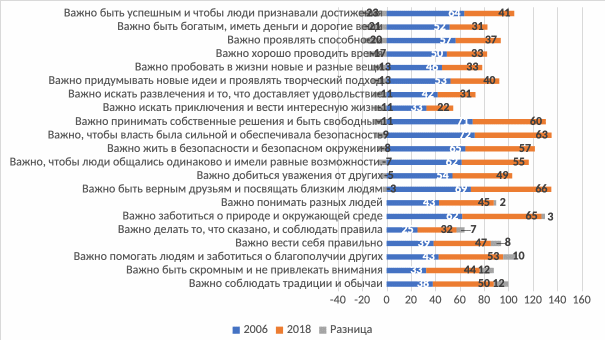

> **И. А. Газиева. Формирование профессионального потенциала молодёжи в системе высшего образования: ценностный подход** — диссертация на соискание учёной степени доктора социологических наук (5.4.4, РАНХиГС, Москва, 2025, 468 с.). Раздел: **Глава 2**.
>
> [Оглавление репозитория](README.md) · [Как цитировать](#как-цитировать-этот-текст) · [Правила для ИИ](AI-INSTRUCTIONS.md)

# Глава 2. Методология ценностного подхода к изучению понятия «профессиональный потенциал» молодёжи в системе высшего образования

## **2.1 Ценностный подход к изучению профессионального потенциала молодёжи в системе высшего образования**

Ценностный подход к формированию профессионального потенциала студенческой молодежи как к социальному процессу в нашем понимании предполагает предварительное изучение состояния исследуемого объекта, его ценностной структуры на начальном этапе данного процесса, что составляет основу определения путей и инструментов дальнейшего формирования профессионального потенциала сквозь призму системы ценностей, усваиваемых индивидом под влиянием внешних и внутренних условий и факторов. В этой связи в данной работе речь идет не о наборе получаемых в вузе знаний и навыков, а о ценностях, определяющих готовность молодых людей к профессиональной деятельности, влияющих на их мотивацию, выбор профессии и карьерные стремления, а также на социальные установки в целом. Такие ценности могут формироваться как целенаправленно, так и опосредованно, но в любом случае составляя в итоге систему ценностей отдельно взятого студента, что позволяет говорить об уровне интериоризации тех или иных ценностей у выпускающихся из вуза студентов.

Несмотря на то, что понятие ценности давно вошло в социологическую науку и является глубоко изученным на концептуальном уровне, вызывая все больший интерес ученых как объект и предмет прикладного социологического исследования, данное понятие все еще остается весьма неоднозначным для восприятия и в повседневной жизни, и в научной среде, что определяет необходимость теоретического анализа понятия ценности как социологической категории, формируя основу для выработки авторского научного подхода к изучению профессионального потенциала молодежи в системе высшего образования.

Длительное время понятие ценности было синонимичным таким общечеловеческим смыслам как добро, счастье, истина, честь и т.д. Такое понимание ценности сохранилось в повседневной жизни и сегодня. Многие понимают ценность именно как «социально одобряемые и разделяемые большинством людей представления о том, что такое добро, справедливость, патриотизм, романтическая любовь, дружба и т.п.»[^172]. Однако в ходе разработки ценностного подхода к изучению профессионального потенциала студенческой молодёжи автор видит очевидную необходимость употребления понятия ценностей в контексте расширения и усложнения предметно-практической области его понятийного и сутевого использования, что подталкивает к поиску иных акцентов и смыслов раскрытия понятия ценностей, чем сложившиеся в современной социологической науке.

Понимание ценности как общегуманитарного явления начало развиваться и в итоге оформилось в самостоятельное понятие в рамках философии. Предпосылки к развитию учений, основанных на ценностях, встречаются как в трудах античных философов (Сократа, Платона, Диогена Лаэртского и т.д.), так и в трудах философов нового времени. Однако как самостоятельное понятие «ценность» появилась относительно недавно: лишь в 60-е годы XIX века немецкий философ Р.Г.Лотце впервые упомянул «ценность» как самостоятельное понятие в своей работе «Основания практической философии». Примерно в это же время оформилась и ставшая впоследствии самостоятельной областью социально-философской рефлексии аксиология, которая была основана на исследовании ценностей как смыслообразующих оснований человеческого бытия.

Поскольку истоки ценностей кроются в социальном характере деятельности людей, где объект представлен многообразием предметно-практической деятельности и общественных отношений, ценности являются важным фактором регуляции поведения людей и их отношений. «Каждая из областей познания, которая включает ценности в свой предмет, - пишет Н.И. Лапин, - видит в нем свое особое качество, использует собственные методы его постижения и получает свои результаты»[^173]. Например, в сфере экономики принято говорить о ценностном определении стоимости некоего блага; в социальной сфере с помощью понятия ценности характеризуют социально-историческое значение определенных явлений действительности для общества и их личностный смысл - для индивида. Все это говорит о немалой сложности не только самого изучения данной категории, но даже поиска и выбора подходов к его изучению.

При кажущейся простоте интуитивного сущностного понимания ценностей оно уникально своей отраслевой универсальностью, поэтому исследование данной категории заслуживает пристального внимания и глубокого многоаспектного изучения. В самом широком понимании ценности являют собой ***свойство общественного объекта удовлетворять определенным потребностям социального субъекта***, что предполагает широкий спектр предметных областей, в каждой из которых понятие ценности будет трактоваться по-своему. Для нас важны, безусловно, как ключевые подходы к изучению ценностей, лежащих в основе профессионального потенциала студенческой молодежи, так и функциональная роль этих ценностей в процессе его формирования, что составляет основу анализа отечественного и зарубежного опыта высших учебных заведений по формированию профессионального потенциала студенческой молодёжи, а также анализ условий формирования профессионального потенциала молодёжи в системе высшего образования и анализ активности участия студенческой молодёжи во внеучебной деятельности вуза.

В силу того, что понятие ценности имеет изначально философские корни, не останавливаясь на детальном анализе эволюции аксиологического подхода, прибегнем к первичному его социально-философскому осмыслению в контексте определения ключевых подходов к изучению ценностей и их функций в рамках формирования профессионального потенциала студенческой молодежи. В первую очередь сделаем акцент на воззрениях наиболее ярких представителей Баденской школы, Вильгельма Виндельбанда и Генриха Риккерта, проложивших своеобразный мостик между философией и социологией для интерпретативного и гносеологического развития понятия ценности.

Согласно Вильгельму Виндельбанду, одному из основателей методологии исторической науки, *ценности следует рассматривать как основу для понимания культуры и истории*. В своей работе «Нормы и законы природы» через разграничение, собственно, норм и законов природы философ анализирует как оценочное действие, так и ценностные и нормативные предпосылки познания. Однако он признает первичность норм перед ценностями, считая, что «в соответствии с нормами выносится суждение о ценности того, что происходит в силу естественной необходимости» [^174].

Здесь Виндельбанд отдельно рассматривает нормы, которые относятся к сфере должного, и ценности, которые описываются им наряду с законами природы, изображающими реальное положение дел. Отсюда явствуют те нормативные основания ценностей, без которых невозможно формирование профессионального потенциала студенческой молодежи. Кроме того, согласно Виндельбанду, несмотря на невозможность объективного измерения ценностей или их какого-либо доказательства, они могут быть описаны и поняты через культурные и исторические контексты и условия общественного развития, т.е. по сути через глубинное изучение социальных явлений, которые в ходе культурно-исторического развития общества стали его социальными константами, оформившись в традиционные ценности.

Вслед за Виндельбандом активно развивает идею вычленения ценности из природы, равно как и более последовательно прорабатывает концептуальное направление отделения оценки от ценности, Генрих Риккерт. Именно Риккерт делает первые конкретные шаги в направлении построения ценностно-ориентированной научной методологии, которая позволяет значительно обогатить описание ценностного подхода к формированию профессионального потенциала студенческой молодежи.

Так, согласно Риккерту, явления культуры воплощают в себе общепризнанные ценности и создаются для непременной их демонстрации широкой общественности.   Ценность в данном контексте – это некое явление, которое превращает «части действительности в объекты культуры», выделяя их тем самым из природы. Соответственно «если от объекта культуры отнять всякую ценность, то он станет частью простой природы». Для того, чтобы отличать ценности как «ценные части действительности» от ценностей как таковых, «не представляющих собой действительности и от которых мы здесь можем отвлечься», Риккерт называет их «благами (Guter)»[^175], а также предлагает специальный метод - «метод отнесения к ценности».

Данный метод является, по сути своей, «исторически-индивидуализирующим методом» и, в понимании Г.Риккерта, «должен выражать собой сущность истории», что по сути, подразумевал и В. Виндельбанд. Этот метод намеренно противопоставляется естествознанию, которое хоть и устанавливает закономерные связи, но «игнорирует культурные ценности и отнесение к ним своих объектов». В том числе и поэтому Риккерт проводит четкую грань между «методом отнесения к ценности» (Wertbeziehung) и «методом оценки» (Wertung), ибо «значимость ценности никогда не является проблемой истории», в то время как ценности все же играют в ней определенную роль: «они фактически оцениваются субъектами и (…) поэтому некоторые объекты рассматриваются фактически как блага».[^176] В частности, к культурным ценностям можно относить некое явление, признанное значимым большим количеством индивидов. Здесь Риккерт придает историческое значение факту посредством отнесения к ценности.

Как видим, смысл метода, предлагаемого Г.Риккертом, сводится к следующему: в то время как человеческие субъекты в своей практической жизни постоянно участвуют в оценках, приводящих к положительным или отрицательным оценочным суждениям, ученый должен воздерживаться от каждого акта оценки и ограничиваться установлением объективных ценностных отношений в изучаемых культурных материалах. Таким образом, «метод отнесения к ценности» основан на том, что людям свойственно сохранять в исторической памяти лишь те события, которые могут являть собой общественную ценность, поэтому Риккерт вычленяет исторически значимые события из числа всего происходящего в обществе посредством отнесения этих событий к ценности, что еще раз подчеркивает их конкретно-исторический характер.

Думается, что такой подход является единственно верным в ходе выявления традиционных ценностей, поскольку здесь речь идет, по сути, о культурно-историческом подходе к верификации ценностей. Безусловно, в ходе общественного развития на каждом его этапе возможно появление новых ценностей, однако они могут быть идентифицированы именно как традиционные лишь по истечении продолжительного времени, при этом оставаясь значимым в результате смены нескольких поколений.

В силу того, что выявление и описание всей совокупности социальных фактов, идентифицируемых современной студенческой молодёжью как социальные ценности, не входит в число научных задач данного исследования, сделаем лишь попытку интерпретировать «блага» (Guter) как те профессиональные качества, навыки, знания и личностные характеристики, которые студенты и общество признают ценными для успешной будущей профессиональной деятельности и социального становления. Не будем забывать, что ценность тех или иных профессиональных качеств может варьироваться в зависимости от культурного общественного контекста, социальных норм и индивидуальных предпочтений. В то же время, будучи объективно существующими качествами, с одной стороны, они выделяются из всего многообразия возможных характеристик как результат отнесения к ценности, с другой. Представители студенческой молодежи, следуя конкретным традиционным ценностям, выбирают те «блага», которые они считают необходимыми для достижения своих профессиональных и социальных целей. Процесс формирования профессионального потенциала студенческой молодежи, таким образом, представляет собой процесс «культивирования» ценных качеств – превращения «части действительности в объекты культуры»[^177]. Ключевую роль в этом процессе играют, безусловно, обучение и воспитание как составляющие образовательного процесса в вузе, помогая студентам осознать и развить именно те «блага», которые соответствуют как их личным ценностям, так и общественным ожиданиям.

Вслед за Г. Риккертом говорит об отнесении к ценности как об отдельно взятом методе и М. Вебер, делая это для освобождения объекта социологического исследования от оценок исследователя и считая, что ценностные идеи «субъективны»[^178], а выбор исследовательской проблемы является ценностно зависимым.

Такой подход демонстрирует необходимость акцентирования внимания исследователя не только и не столько на изучении ценностей всей студенческой молодежи, сколько на изучении особенностей типологических групп, поскольку формирование профессионального потенциала не является унифицированным процессом, предполагающим одни и те же технологии формирования для всех. Технологии организации внеучебной деятельности предполагают быть достаточно гибкими, чтобы учитывать разнообразие, например, ценностных установок студентов, предлагая им возможности для развития профессиональных навыков, соответствующих их индивидуальным целям и стремлениям.

Ключевое достоинство метода «отнесения к ценности» как научного приема, предложенного Г.Риккертом и далее использованного М.Вебером, нам видится в возможности ухода от формулировок оценочных суждений через отнесение исследуемого объекта к его ценности, где это самое «отнесение» есть процесс отбора и организации информации, имеющей непосредственное отношение к объективной науке.

О безусловной познаваемости и ценностей, и общества посредством эмпирических методов социологии, говорится и в рамках исследовательского подхода Э. Дюркгейма, что принципиально отличает его от подхода представителей Баденской школы, не предполагавших возможным применения подобных методов к изучению ценностей, считавших их познаваемыми интуитивно, на основе чувствования.

Впервые Э.Дюркгейм обращает наиболее фокусированное внимание на ценности в своем труде «О разделении общественного труда», где социальная ценность описывается им как результат социального обмена, воплощающая «количество заключенного в нем полезного труда», которым считается не весь вложенный труд, а лишь тот, который приводит к полезному результату, соответствующему конкретным потребностям общества». Здесь же Дюркгейм отмечает, что измерить ценность нельзя, однако предлагает три влияющих на нее фактора: «сумма усилий, необходимых для производства объекта» (трудозатраты); «интенсивность удовлетворяемых им потребностей» (полезность); «величина приносимого им удовлетворения» (удовлетворение потребностей)[^179]. Заметим, что здесь Дюркгейм демонстрирует больше экономический подход, подчёркивая, что ценность должна быть пропорциональна затраченным на нее усилиям и оказываемым ею услугам, допуская при этом непропорциональность, которую предполагает «уравновешивать» только благодаря какой-нибудь внешней силе[^180].

В данном подходе усматривается два важных для нас аспекта. Во-первых, именно Э.Дюркгейм впервые предлагает подход к измерению ценности, основываясь на конкретных индикаторах (трудозатраты, полезность, удовлетворение потребностей). Во-вторых, основываясь на данном подходе, можно заключить, что образование представляет собой не просто набор знаний и навыков, а является неким «объектом обмена», обладающим социальной ценностью, которая определяется не только количеством полученных знаний (вложенный труд), но и их полезностью для общества (способностью производить полезные социальные результаты) и степенью удовлетворения общественных потребностей в квалифицированных специалистах. Отсюда сформулируем зависимость: чем больше общество нуждается в специалистах определённого профиля, и чем больше усилий требуется для получения соответствующих знаний и навыков, тем выше социальная ценность такого образования. Кроме того, оставаясь в парадигме формирования социальных ценностей молодежи в системе высшего образования, можно говорить и о зависимости ценности сформированных компетенций от объема соответствующих трудозатрат студента.

Такой подход Э.Дюркгейма к измерению социальной ценности позволяет рассматривать процесс формирования профессионального потенциала студенческой молодёжи как сложный социальный обмен, в котором важное значение имеют как вложения студентов, так и социальная полезность получаемого ими образования, а также баланс между этими двумя аспектами.

Чуть позже Э.Дюркгейм, в противовес воззрениям представителей феноменологического направления в социологии, уже акцентированно отводит ведущую роль в познании ценностей общественному мнению, а не мнению, основанному на чувственном познании отдельно взятого индивида.

Так, согласно Дюркгейму, «оценка объективна уже благодаря тому, что она коллективна», поскольку ценность создается не просто воздействием вещи на чувства[^181], но и влиянием вещи на коллективный, а не на индивидуальный субъект. Кроме того, он считает социальное суждение объективным, в связи с чем «шкала ценностей оказывается свободной от субъективных и изменчивых оценок индивидов», ведь «общественное мнение изначально располагает нравственным авторитетом, благодаря которому оно навязывается отдельным лицам»[^182], что с очевидностью демонстрирует необходимость проведения массового опроса среди студенческой молодежи в ходе изучения ценностной основы их профессионального потенциала.

В то же время Дюркгейм, очевидно признавая истинность и высокую значимость ценностного осмысления коллективным разумом социальных объектов, говорит и о способности этого разума трансформировать массовое понимание оцениваемых ими объектов, считая, что «коллективное мышление преобразует все, чего оно касается»[^183], что дополнительно акцентирует внимание исследователя на точности, четкости и однозначности формулировок социологических вопросов.

Важным для нас выводом является то, что Э. Дюркгейм подчеркивает не только безусловную познаваемость ценностей, но, по сути, формулирует тезис о возможности и необходимости массового познания ценностей, где большую роль в оценивании и одновременно в отнесении к ценности отводит обществу, в нашем случае, студенческой молодежи и ее коллективному сознанию, что является закономерным этапом развития научного подхода к изучению социальных явлений.

Нельзя не отметить, что данный поход несколько противоречит неокантианской традиции В. Виндельбандта и Г. Риккерта, получившей свое дальнейшее развитие среди представителей феноменологической версии аксиологии, что однако также имеет важное значение в контексте изучения ценностной основы профессионального потенциала студенческой молодежи.

Идея построения аксиологии с помощью феноменологической методологии изначально возникает и затем развивается у философов: Ф. Брентано, А. Мейнонга, Э. Гуссерля, Н. Гартмана. Изучение ценностей студенческой молодежи через призму феноменологической социологии предоставляет уникальную перспективу, которая основана на понимании субъективного опыта индивидов и их взаимодействия с окружающим миром. Как в случае с анализом подходов к понятийному осмыслению ценностей представителей философской традиции Баденской школы, отнесемся к ценностным феноменологическим концепциям с позиций не только социологизма, но и изучения ценностей студенческой молодежи.

Феноменологический подход большинства ученых к пониманию ценностей основан на исследовании субъективного опыта и осознания ценностей человеком. Так, по мнению М.Шелера, ценности не являются объективными качествами, присущими объектам или действиям, а скорее они возникают в сознании человека при его взаимодействии с окружающим миром[^184]. У Н. Гартмана находим весьма похожую позицию относительно природы ценностей, где ценности представляют собой «именно идеальные предметы, существующие по ту сторону бытия и небытия, даже по ту сторону реального ценностного чувства, которое одно их и схватывает»[^185]. Не отходит от общего феноменологического русла описания ценности как социального феномена и Дитрих фон Гильдебранд, считая, что «понятие ценности представляет собой первичную данность в двух смыслах: она может быть познана только интуитивным образом и не может быть из чего-то выведена, а также в том смысле, что она является фундаментальной данностью, которую мы с необходимостью подразумеваем всегда. Ценность — это такая же данность, как истина, существование, познание, сущность; мы не можем ее отрицать, не вводя незаметно снова»[^186].

Очевидно, что феноменологический подход к изучению ценностей основывается на их интуитивном восприятии индивидами и позволяет исследовать ценности студентов с акцентом на их субъективный опыт, контекстуальную зависимость и интуитивное осознание. Важно отметить, что такой подход имеет свои существенные достоинства и недостатки, определяющие ограничения в ходе использования феноменологического подхода к изучению ценностей студенческой молодежи как основы ее профессионального потенциала.

Во-первых, по мнению авторского коллектива советских социологов, во главе с В.А. Ядовым, разрабатывавшим диспозиционную концепцию личности, «следует рассматривать актуальные ценности, а не возможные или мыслимые как отдаленный идеал»[^187]. Во-вторых, существует риск чрезмерного акцентирования внимания на индивидуальных мнениях за счет охвата более широких социальных и структурных факторов, что может привести к недостаточному пониманию социальных закономерностей и закономерностей, которые формируют ценности в группе или обществе. В то же время такой подход может обеспечить более глубокое понимание того, какие ценности обосновывают социальное поведение студентов в учебной среде, что может быть весьма полезно для создания поддерживающей образовательной среды, способствующей формированию социальных ценностей, составляющих профессиональный потенциал студенческой молодежи.

Поскольку контекст феноменологического подхода демонстрирует существование ценностей не только как абстрактных идей, но и как активных социальных элементов, влияющих на поведение и восприятие индивидов в обществе, он также ведет к пониманию ценностей в контексте формирования их индивидуального опыта и их восприятия социальной реальности. В этой связи применение данного подхода к изучению ценностей студенческой молодежи с необходимостью предполагает учет и коллективных аспектов молодежной культуры, и личных переживаний студентов. Студенческая молодежь, находясь в процессе формирования своей идентичности и мироощущения, подвержена влиянию как традиционных, давно сложившихся в обществе ценностей, так и новых социальных фактов, идентифицируемых частью сообщества как ценностей.

Среди всех феноменологических концептуальных подходов к изучению ценностей наибольший интерес для нашей работы представляет все же подход М.Шелера, в частности, предложенная им классификация ценностей, сгруппированных в соответствии с их значимыми качествами: ценности формального порядка[^188] и ценности материального порядка («ценностные модальности»)[^189]. Данная классификация анализируется автором данной работы в соотнесении с группами ценностей инструментальных и терминальных, предложенных Милтоном Рокичем[^190], поскольку при заметной схожести классификаций ценностей их авторами предлагаются разные подходы к их изучению. Заметим, что, строго говоря, М.Рокич говорит не о ценностях, а о ценностных ориентациях. Однако в данном контексте – контексте сравнения эмпирических подходов к их изучению, подобное разграничение большого значения не имеет.

Ценности материального порядка, выделенные М.Шелером, связаны с конкретными физическими, эмоциональными и культурными аспектами жизни и относятся к тому, что, например, обеспечивает людям счастье и придает смысл жизни, включая такие элементы, как здоровье, богатство, благосостояние и эстетическое наслаждение. Ценности материального порядка более ощутимы и имеют прямое влияние на повседневную жизнь и жизненные предпочтения индивидов, в чем они схожи с терминальными ценностями, выделенными М.Рокичем. Терминальные ценности, представляя собой конечные цели жизни и, то, к чему стремятся люди, определяют, что для человека является «хорошим» и «желаемым». Таким образом, терминальные ценности (М.Рокич) как конечные цели соотносятся с ценностями материального порядка (М.Шелер), поскольку обе категории предполагают конечный результат, который люди хотят получить.

Что касается ценностей формального порядка, то в понимании М.Шелера они относятся к тем аспектам, которые касаются структуры, логики и законов, регулирующих взаимодействие между индивидами, их социализацию. Такие ценности не связаны напрямую с конкретными смыслами или материалами, но связаны с принципами, которые формируют порядок и гармонию в обществе, выступая основой, на которой строится социальное взаимодействие. Отсюда очевидно, что ценности формального порядка (М.Шелер) вполне соотносимы с инструментальными ценностями, являющимися по сути средствами и способами формирования терминальных ценностей-целей (М.Рокич). Они описывают, какие качества или характеристики люди считают важными для достижения своих целей, касаясь принципов, норм и этических стандартов, необходимых для взаимодействия в обществе и достижения большего блага или личных целей.

М.Шелер как и М. Рокич подчеркивает, что обе выделенные им группы ценностей важны и взаимосвязаны. Они взаимодействуют и влияют друг на друга, создавая сложную иерархию ценностей в обществе. Так, ценности материального порядка соотносятся с ценностями формального порядка в части иерархически разноуровневых ценностей (М.Шелер), являясь, в некотором роде, надстройкой над ними. Можно сказать, что ценности формального порядка могут служить руководством для оценки материальных ценностей, и наоборот, материальные ценности могут обогащать и конкретизировать формальные ценности. Соотношение же терминальных и инструментальных ценностей (М.Рокич), как известно, выражено через цель и средство.

Несмотря на то, что М. Шелер оставляет «нерешенной проблему измерения ценностей, а значит и вопрос о том, как можно говорить о «сумме счастья» и тому подобном»[^191], в контексте ценностной модальности он все же рассматривает значения и вес каждой из этих категорий в общественной жизни, подчеркивая необходимость их балансировки для достижения гармонии и благополучия в обществе. Отметим, что, говоря о ценностях формального порядка, Шелер осознанно не ставит перед собой целью выстроить их в иерархическом порядке - порядке «высших» и «низших» ценностей, составляющем их сущность будучи независимым от «всех возможных позитивных систем благ и целей». Здесь ученый считает достаточным обозначить группы ценностных последовательностей, «виды априорных порядков ценностей»[^192]. В то же время, говоря о ценностях материального порядка, ценностных модальностях, Шелер делает акцент на их особой важности и на их безусловной иерархичности.

Что касается М.Рокича, то он, в отличие от М.Шелера, как известно, разработал конкретную методику для оценки ценностей, которая позволяет собирать данные о ценностях людей с помощью эмпирического инструментария (опросника), который уже многие десятилетия пользуется большой популярностью во всем мире, считаясь универсальным инструментом для диагностики индивидуальной иерархии ценностей. Второй особенностью, отличающей подход М.Рокича от М.Шелера к изучению ценностей, является то, что ключевым принципом заполнения опросников является необходимость не только выбора наиболее важных ценностей, но и их ранжирования по уровням значимости в рамках каждой из укрупненных групп ценностей: терминальных и инструментальных.

Основываясь на обширных результатах апробации предложенного эмпирического инструментария измерения ценностей М. Рокич делает ряд выводов о том, что именно ценности (ценностные ориентации) заставляют индивида занимать определенные позиции по социальным вопросам, а также диктуют условия для действий, когда индивиды выбирают между альтернативами, например, в ходе принятия важных решений, связанных с собственным суждением[^193].

Студенты, выражающие схожие взгляды на определенные социальные проблемы, в значительной степени имеют схожие системы ценностей, следовательно изучение ценностей отдельных типологических групп дает знание о структуре всего молодежного сообщества высшей школы, а также дает возможность разработать механизмы формирования их профессионального потенциала, основываясь на конкретных ценностях, поскольку, согласно М.Рокичу, ценности являются одним из условий реализации той или иной деятельности, в нашем случае, социального процесса. Данный вывод подтверждается результатами и современных исследователей[^194], что говорит о необходимости принимать во внимание ментальность молодежи в ходе организации образовательного процесса, включая как планирование отдельных учебных курсов, так и разработку образовательных программ. Кроме того, стоит брать во внимание студенческие ценности при планировании, организации культурных мероприятий, досуга, неформальной этики общения со студентами.

Методология М. Рокича, равно как и теория К. Клакхона и Ф.Стродбека[^195] были взяты за основу для разработки еще одной изначально психологической концепции изучения ценностей, которой, однако, активно сегодня пользуются и социологи разных стран мира, - теории базовых ценностей современного ученого Шалома Шварца.

В своих теоретических исследованиях Ш. Шварц[^196] отталкивается от понимания всех ценностей как «желаемых кросс-ситуативных целей, различающихся по важности и служащих руководящими принципами в жизни человека»[^197]. Как видим, речь идет о том, что наиболее существенным содержательным аспектом, лежащим в основе различий между ценностями, является тип мотивационных целей, которые они выражают; это некие удовлетворенные потребности, которые непосредственно зависят от культуры, социальной среды, менталитета конкретного общества.

Основываясь на таком понимании, Ш. Шварц отбирает ценности, используемые в методике определения инструментальных и терминальных ценностей М. Рокича, а также в методиках других исследователей, дополняет их ценностями, обнаруженными в религиозной и философской литературе, и группирует их в соответствии с общностью целей в базовые типы. Шварц обосновывает такую группировку тем, что сформулированные им *базовые человеческие ценности представляют собой универсальные потребности человеческого существования и, в большинстве своем, обнаруживаются во всех культурах.*

Для более глубокого анализа наиболее интересных для нас ценностных индикаторов и понимания динамики их важности для молодых респондентов, воспользуемся массивами данных опросов, проведенных в 2006 и 2018 годах с использованием методологии Шварца по программе ESS (Европейского социального исследования)[^198]. Мы расщепили массив данных, полученных по результатам опросов в России[^199] по возрасту – оставили в массиве лишь респондентов в возрасте моложе 35 лет (2006г. - N=2437; 2018г. - N=4161). На рисунке (рис.2.1) представлена динамика актуальности для молодых респондентов суждений, составляющих «Профиль личности» опросника Шварца.

На данной диаграмме достаточно хорошо заметна графически отображенная «переоценка ценностей» российской молодежью с тенденцией к снижению важности ряда ценностей, нежели к их росту. Так, на 20% и более для российской молодежи сократилась важность проявления своих способностей (23%), наличия богатства, денег и дорогих вещей (21%), успешности и признания достижений (20%). Более чем на 10% для молодежи стало не так важно хорошо проводить время (17%), пробовать в жизни новые и разные вещи (13%), придумывать новые идеи и проявлять творческий подход (13%), принимать собственные решения и быть свободными, искать развлечения, источники удовольствия, приключения и вести интересную жизнь (по 11%, соответственно).

Видимый рост важности (на 10% и более) произошел лишь по трем ценностным суждениям: соблюдать традиции и обычаи (12%), быть скромным и не привлекать внимания (12%), помогать людям и заботиться о благополучии других (11%).

**Рисунок 2.1 Динамика важности ценностных суждений, составляющих «Профиль личности», для респондентов в возрасте до 35 лет, N=2437 (2006г.); N=4161 (2018г.)**

В результате анализа приведенных данных можно говорить о том, что молодежь как будто «наигралась», у нее произошло насыщение возможностями, которые им дает стремительно развивающееся общество. Они уже не хотят, так же как раньше: гнаться за успехом, бороться за выживание, за богатство; для них уже не так важны путешествия и интересное времяпрепровождение; зато в них усиливается гуманистическое начало: желание помогать людям, жить по правилам, не привлекая внимание к себе.

Несмотря на то, что полученный социологический портрет скорее соответствует образу представителей серебряного возраста, чем молодежи, такие данные выглядят весьма правдоподобно на фоне активно развивающегося в нашей стране и набирающего силу волонтерского движения. В частности, по данным Министерства экономического развития Российской Федерации на 1 сентября 2020г. число волонтеров в России (не только среди молодежи) за 8 лет увеличилось более чем в пять раз. [^200] Хотя, согласно исследованиям коллектива социологов из УРФУ, мотивация к волонтерской деятельности в молодежной среде все больше приобретает прагматический характер[^201].

В то же время приведенные результаты вызывают вопросы и некоторые сомнения в отношении индикаторов исследования. Заметим, что одним из признаков социальных ценностей является их устойчивость во времени. Безусловно, они могут стремительно изменяться или даже разрушаться как следствие аномии. Однако в указанный промежуток времени (2006 -2018гг.) не происходило настолько значимых событий, чтобы произошла столь серьезная ценностная переоценка: по некоторым индикаторам – более 20% (см.: Рисунок 2.1).

Возможно, такие результаты можно объяснить не только и не столько «переоценкой ценностей», сколько особенностями инструментария, а точнее, особенностями индикаторов оценки.

В силу того, что в понимании Ш.Шварца, ценности являют собой некие «кросс-ситуативные цели», индикаторы, заложенные им для диагностики ценностей, по факту являются индикаторами достижения целей или удовлетворения потребностей. Таким образом, важность ценности снижается при условии достижении ее как цели или реализации как потребности; ибо если цель достигнута, а потребность реализована, то результаты достижения цели становятся основой для постановки и достижения новой цели, снижая ее актуальность и важность по сравнению с новой целью.

Возможно поэтому показатель важности ниже у тех ценностных суждений, которые к 2018 году по сравнению с 2006 годом стали данностью. В то же время, такое положение дел не говорит о том, что если лишить или ограничить доступ современной молодежи к такой, ставшей обыденностью, ценности, например, как путешествия, то негативная волна будет меньше, чем если лишить ее возможности помогать людям, заботиться об их благополучии, что сейчас лишь набирает популярность, повышая свою важность и значимость для молодежи. Возможно, негативная реакция на такие ограничения будет значимо сильнее для тех ценностных суждений, которые стали уже частью обыденности.

Следуя такой логике, вероятно, при построении опросника с предложенными Ш.Шварцем ценностными суждениями, следовало бы предварительно определить степень достижения этих ценностей-целей, с тем чтобы понять, причину их невысокой или, напротив, высокой важности для отдельного индивида и, в целом, для общества.

Также заметим, что указанные на рисунке 2.1 ценностные суждения, не только формируют профиль личности, но и демонстрируют индивидуальное отношение респондентов к ценности, что с очевидностью раскрывает их, скорее психологическую природу, чем социальную, и являются социальными установками, которые, согласно концепции В.Томаса и Ф.Знанецкого[^202], являются индивидуальными аналогами социальных ценностей. Соответственно закономерным предполагаем вывод о том, что в качестве индикаторов диагностики индивидуальных ценностей личности Ш. Шварцем использованы социальные установки, а не ценности, строго говоря. Такое положение дел не дает нам возможности опираться в полной мере на предлагаемую методологию, однако она представляет для нас интерес в части формулировок ряда ценностных индикаторов, равно как представляет для нас такой же интерес и методология изучения ценностей Рональда Инглхарта[^203], известная в основном благодаря его работе в рамках Мирового исследования ценностей (World Values Survey; WVS)[^204].

Данный исследовательский проект представляет собой международную исследовательскую программу, нацеленную на анализ ценностей, убеждений и норм людей в сравнительной межнациональной и временной перспективе, а также на оценку влияния их стабильности или изменений на социальное, политическое и экономическое развитие стран и обществ.

На основе результатов очередного раунда таких исследований, проводящихся раз в 5 лет, строится карта культур, где графически отображено расположение стран в плоскости четырех ценностных групп: традиционные ценности - против секулярно-рациональных ценностей; ценности выживания - против значений самовыражения, соответствующие этапам развития общества: социальный материализм и социальный постматериализм, соответственно.

Согласно последним опубликованным данным результатов Мирового исследования ценностей[^205], по данным на 2023 год для России характерны скорее материалистические, чем постматериалистические ценности, с постепенным переходом от традиционных ценностей к секулярно-рациональным. Предположительно, такая картина объясняется тем, что базовые российские ценности находятся в состоянии перманентной трансформации, поскольку, по мнению В.И. Спиридоновой, в начале 2000-х «мы оказались перед императивом копирования в России базовых ценностей европейской демократии, таких как: собственность, законность, гражданственность»[^206].

Одним из основных тезисов теории Инглхарта является то, что *изменение ценностей с очевидностью приводит к изменению общественного устройства, к вполне конкретным социальным, политическим и экономическим последствиям, а также* являет собой важнейший показатель культурной модернизации общества, который фиксирует качественно разные процессы социализации. Известно, что каждое поколение обладает некой «коллективной памятью», сохраняемой его представителями всю жизнь, поэтому согласно Инглахрту, в обществах постматериализма, «где ощущение защищенности усилилось, будут наблюдаться значительные различия в ценностях старшего и молодого поколений»,[^207] в то же время, передача культурных традиций общества сопровождается избирательностью молодежи в отношении новых ценностей.

Следуя логике Р.Инглхарта, студенческая молодежь, будучи представителями молодого поколения, разделяет ценности, заметно отличающиеся от ценностей более взрослого поколения, основанных на опыте социализации и «коллективной памяти», отражая изменения в обществе, которые происходят в условиях постматериалистического развития. Кроме того, изменение ценностей, фиксируемых в среде студенческой молодежи, может служить индикатором более широких социальных и культурных изменений в обществе. Их ценности не только отражают личные предпочтения, но и являются частью более глубоких трендов, связанных с культурной модернизацией и изменениями в социальном устройстве общества в целом. Молодежь, включая студентов, обычно демонстрирует избирательность в принятии традиционных и новых ценностей, что свидетельствует о поиске ими социальной идентичности, подходящей для их времени, и иногда даже - отторжении устаревших или неактуальных на их взгляд идей, в пользу ценностей, соответствующих их жизненному опыту и социальному контексту.

Принято считать, что главным достоинством описанного исследовательского подхода является то, что оно является методологической основой для Мирового исследования ценностей (WVS), которое по сути является единственным академическим исследованием, которое охватывает весь спектр глобальных социальных сообществ: от очень бедных - до очень богатых обществ во всех основных культурных зонах мира. Кроме того, проект охватывает широкий круг тем из области социологии, политологии, международных отношений, экономики, общественного здравоохранения, демографии, антропологии, социальной психологии и т. д., что, на наш взгляд, является как достоинством, так и недостатком, представляя собой ограничение использования методологии в индивидуальных исследовательских целях.

Такие ограничения связаны, в первую очередь, с трудностями при интерпретации результатов исследования, поскольку, во-первых, связаны с риском размывания фокуса внимания в ходе ответов на большое количество вопросов с использованием широкого спектра шкал; во-вторых, с риском расхождения в понимании терминов и концептов в ходе ответов на вопросы представителей разных культур.

Говоря об эмпирическом подходе к изучению ценностей, безусловно, нельзя не упомянуть опыт отечественных социологов, который более детально мы рассмотрим и применим в следующем параграфе. Здесь лишь остановимся на ключевых, наиболее важных для нас особенностях эмпирического подхода коллег.

В первую очередь обратимся к диспозиционной концепции структуры личности[^208], разработанной коллективом советских социологов под руководством В.А. Ядова и поместившим «ценностные ориентации на наиболее высокий уровень системы индивидуальных диспозиций»[^209]. Напомним, что данная концепция представляет собой важное направление в изучении ценностей и их влияния на поведение и личностное развитие индивидов. Основной целью концепции является понимание того, как ценности формируют диспозиции — устойчивые тенденции поведения и восприятия мира, которые определяют действия человека в различных ситуациях. В рамках исследования В.А. Ядов и его коллеги рассматривают ценности не как абстрактные идеи, а как активные составляющие личной и социальной жизни, влияющие на выбор жизненных стратегий и определяющих мотивацию личности к развитию и самореализации, подчеркивая, что ценности служат индикаторами качества жизни[^210].

По мнению исследователей, решающее значение в ходе согласования между собой социальных установок, отнесенных к разным объектам и ситуациям, имеет «объективно существующая взаимосвязь между проявлениями разных свойств объекта (деловых качеств работника) в рассматриваемых ситуациях. Субъективные смыслы, придаваемые объектам установок, определенно уступают их объективным значениям в процессах генерализации и обобщения диспозиций этого уровня»[^211]. Соответственно, социальные установки, связанные с различными аспектами жизни студентов, должны рассматриваться не только на уровне их восприятия, но и в контексте объективных характеристик и взаимодействий. Субъективные смыслы, которые студенты придают этим объектам, оказываются менее значительными и менее влияющими на их диспозиции (стабильные установки и тенденции поведения) в сравнении с реальными, объективными свойствами этих объектов. То есть, когда студенты формируют свои представления о профессиональных ценностях, это происходит не только на основе их личных интерпретаций или мнений, но и в зависимости от того, насколько они осознают и ценят реальные качества, требуемые в профессиональной сфере.

Большой интерес в контексте нашего исследования представляет, безусловно, методология социологического исследования социальных ценностей, разработанная Н. И. Лапиным, опирающаяся в том числе, на разработки научного коллектива под руководством В.А. Ядова[^212], выделяясь многогранностью подходов и междисциплинарным характером исследования.

Н.И. Лапин проводит исследования, основываясь на системном анализе, который позволяет сопоставлять различные аспекты социальных ценностей и их влияние на поведение индивидов и общества в целом. В своих трудах он акцентирует внимание на динамике ценностей в условиях социальных изменений и кризисов, особенно применительно к России в постсоветский период[^213].

Для нас важным является использование Н.И. Лапиным разнообразных методов сбора данных, включая количественные и качественные исследования, которые позволяют получить представление о субъективных оценках и переживаниях граждан. Например, в исследовании «Как чувствуют себя, к чему стремятся граждане России»[^214] он освещает результаты социального мониторинга, который проводился на протяжении десятилетия, что дает возможность отследить изменения в ценностных ориентациях со временем. На большом объеме собранных ученым эмпирических данных выделяются культурные типы изучаемых базовых ценностей россиян, структура и динамика их ценностей, что в том числе составляет методологическую основу структурирования профессионального потенциала студенческой молодежи, предлагаемой в данной работе далее.

Большое значение для нашей работы, безусловно, имеет и методология социологического исследования социальных ценностей, разработанная Ю.А. Зубок и В.И. Чупровым[^215], центральной целью которой является понимание смысложизненных ориентиров молодежи в контексте культурного пространства России.

Один из ключевых аспектов данного концептуального подхода заключается в анализе смысложизненных ценностей молодежи как специфического социального феномена, отражающего не только индивидуальные, но и социальные потребности молодежи: «Ценности представляют собой совокупность установок на высшие жизненные принципы, идеалы, отраженные в целях жизнедеятельности и средствах их достижения, содержащиеся в коллективных представлениях о должном, важном, значимом»[^216].

В своих работах Ю.А. Зубок и В.И. Чупров не единожды говорят о том, что ценности не являются статичными, а находятся в постоянной динамике и подвержены влиянию различных факторов, включая социальные, экономические и культурные изменения внешней среды, что, в том числе, составляет основу определения условий и факторов формирования ценностей студенческой молодежи, лежащих в основе их профессионального потенциала.

Кроме того, ученые в своих работах подчеркивают важность понимания влияния культурного контекста на ценности молодежи. Они анализируют, как культурные артефакты, традиции и современные тренды формируют смысловые ориентиры, и как молодежь адаптирует эти ориентиры в соответствии со своими жизненными ситуациями: «Многообразие связей молодежи с культурой, в которой конструируются и передаются смыслы, образует культурное пространство, в котором осуществляется саморегуляция ее жизнедеятельности»[^217].

Отсюда очевидно, что еще одной важной частью их методологии является концепция саморегуляции, которую исследователи рассматривают как механизм, обеспечивающий адаптацию молодежи к меняющимся условиям жизни. Так, согласно исследованиям ученых, саморегуляция характеризуется воздействием индивидов на самих себя, направленным на «привидение ими своей жизни в желательное ожидаемое состояние, воспринимаемое как ориентир, референтный образец группового сознания»[^218]. Здесь же исследователи подчеркивают и примеры «постмодернистского» проявления индивидуализации, которые отражаются в саморегуляции жизненных стратегий молодёжи: «воздействуя на самих себя посредством выбора, молодые люди приводят собственное функционирование в соответствие с этими образцами»[^219]. Кроме того, Ю.А. Зубок и В.И. Чупров анализируют, как молодежь развивает стратегические подходы к самоуправлению, основанные на своих ценностях, и как это влияет на их поведение и психоэмоциональное состояние, подчеркивая важность активного участия молодежи в формировании своего жизненного пути и ценностных ориентиров.

Проведенный анализ подходов к изучению ценностей, лежащих в основе формирования профессионального потенциала студенческой молодежи, безусловно, не является исчерпывающим, однако включает наиболее важные для данной работы концепции, дающие возможность заложить фундамент для формирования автором собственного научного подхода к изучению и дальнейшему формированию социальных ценностей молодежи, что более детально изложено автором в следующих разделах диссертации.

## **2.2 Ценностная основа оценки профессионального потенциала молодёжи в системе высшего образования**

Ценности, будучи связанными с этическими принципами, религиозными убеждениями, социальными нормами, культурным наследием и другими факторами, играют существенную роль в формировании как индивидуальной, так и коллективной идентичности, норм и поведения в обществе[^220], «они обеспечивают интеграцию общества, помогая индивидам осуществлять социально одобряемый выбор своего поведения в жизненно значимых ситуациях»[^221]; кроме того, «в индивидуально-групповом смысле они отвечают за мировоззренческое, смысловое наполнение жизнедеятельности молодёжи»[^222], составляя содержание в том числе и их профессионального потенциала.

В силу того, что совокупность ценностей в целом являет собой большое множество, отличающееся разнообразием ее элементов, отдельной задачей, стоящей перед исследователем, является определение тех ценностей, которые являются наиболее оптимальными для диагностики именно профессионального потенциала студенческой молодёжи, предполагая, что это могут быть те ценности, которые должны разделяться если не всеми представителями студенческой молодёжи, то большинством. Такими ценностями, в первую очередь, относится крупная группа ценностей – ***общечеловеческих ценностей,*** которые, с очевидностью, имеют весьма широкий диапазон и охватывают все социально-демографические группы населения.

Общечеловеческие ценности - это «ценности самого высокого уровня абстракции», которые живут разнообразием своих проявлений в многообразии культур, локальных цивилизаций, ментальностей, социальных институций[^223], которые являются универсальными и непреходящими для всех людей, независимо от их возраста, происхождения или общества, в котором они живут; это «то реальное (не воображаемое, не утопическое), что непременно является желанным и имеет непреходящую существенную значимость для каждой нормальной личности любого возраста и любого типа общества, а отсюда, и для человечества как единства всех людей на любом этапе его существования и развития»[^224].

Согласно Декларации тысячелетия Организации Объединенных Наций, которая была принята [резолюцией 55/2](http://www.un.org/ru/documents/ods.asp?m=A/RES/55/2) Генеральной Ассамблеи от 8 сентября 2000 года[^225], к **общечеловеческим** относятся следующие **ценности:** *свобода, равенство, солидарность, терпимость, уважение к природе и общая ответственность.* По сути, общечеловеческие ценности представляют собой ***набор добродетелей,** **которые определяют поведение индивида с собой и с окружающими***. Они универсальны, потому что их разделяют все или почти все жители планеты независимо от их религиозных взглядов, происхождения, национальности и культуры, их истории. Однако, чтобы общечеловеческие ценности способствовали обеспечению благополучия в обществе, передаваясь другим людям, они должны согласовываться или хотя бы не противоречить ценностям государства.

Безусловно, социальная природа ценностей, органично вплетенных во все процессы жизнедеятельности человека, являясь и их регуляторами, и ориентирами, объясняет их интеграцию во все сферы жизни общества. Так, в основе функционирования государства, его социального развития лежит набор основополагающих принципов, убеждений и идеалов, которые определяют его политику, законы, общественную жизнь и отношение к своим гражданам, совокупно представляющие собой государственные ценности.

В большинстве развитых стран государственные ценности зафиксированы в ключевых государственных документах. Так, в Декларации независимости США (The Declaration of Independence—1776) говорится о том, что «Все люди созданы равными, они наделены Творцом некоторыми неотъемлемыми правами, к числу которых относятся жизнь, свобода и стремление к счастью». Эти ценности затем нашли отражение в Конституции США и Билле о правах. Во Франции национальные ценности заключены в принципах государственного строя, озвученных Робеспьером во времена Великой французской революции: свобода, равенство, братство (Liberté, Égalité, Fraternité), - которые, и сегодня оставаясь девизом Республики, зафиксированы в Конституции ([Article 2](https://www.legifrance.gouv.fr/loda/article_lc/LEGIARTI000006527453), Constitution du 4 octobre 1958). Относительно недавно Восемнадцатый съезд коммунистической партии Китая выдвинул и закрепил основные социалистические ценности: «патриотизм, преданность делу, честность, доброта»[^226]. В Конституции РФ к ключевым ценностями отнесены: «Человек, его права и свободы» (ст.2).

В истории Российского государства, чаще всего именно в периоды кризисов власть прибегает к использованию укоренившихся, традиционных ценностей общества для формирования общей культурной идентичности среди различных социальных групп с целью укрепления государства, зачастую превращая их программные слоганы, как, например, «Православие, Самодержавие, Народность» (С.С. Уваров), либо в ценностные лозунги. В частности, широко известны лозунги Великой октябрьской социалистической революции: «Вся власть — Советам», «Фабрики — рабочим», «Землю — крестьянам», «Мир — народам»; «Кто не работает, тот не ест» (В.И. Ленин, статья «О голоде»), «Пролетарии всех стран, соединяйтесь!» («Манифест Коммунистической партии»); лозунги времен Великой Отечественной войны (1941-45гг.): «Всё для фронта! Всё для победы!», «Родина-Мать зовёт!», «Наше дело правое. Победа будет за нами». Все эти лозунги, как и многие другие сформулированы на основе вполне конкретных традиционных российских ценностей, большинство которых сегодня содержатся в нормативно-правовых актах.

Государственные ценности играют заметную роль в определении приоритетов государственной политики, например, в образовании, здравоохранении, социальной защите и т.д., поэтому так важно понимать состояние общества в части следования тем или иным государственным ценностям, что в первую очередь отражается в структуре профессионального потенциала студенческой молодёжи, как ресурса социально-экономического развития государства и общества.

Сегодня на первый план в развитии современного российского общества выходит все большая ориентация на более широкий круг ценностей, чем закрепленные в Конституции. Здесь мы имеем в виду традиционные российские духовно-нравственные ценности, которые, сложившись столетия назад, способствуют укреплению и поддержанию духовно-нравственного состояния российского общества; эти ценности закреплены сразу в нескольких нормативных правовых актах[^227] и наряду с указанными в Конституции РФ могут быть отнесены к государственным ценностям.

Так, согласно п.7 Указа Президента Российской Федерации от 09.11.2022 г. № 809 «Об утверждении Основ государственной политики по сохранению и укреплению традиционных российских духовно-нравственных ценностей», традиционные ценности составляют «основу российского общества, позволяющую защищать и укреплять суверенитет России, обеспечивать единство нашей многонациональной и многоконфессиональной страны, осуществлять сбережение народа России и развитие человеческого потенциала»[^228]. Такой подход предполагает, что эти ценности не только могут разделяться большинством граждан РФ, но и быть некими универсалиями, передаваемыми от поколения к поколению, что составляет одну из целей Государственной политики по сохранению и укреплению традиционных ценностей (см.: п.23 Указа №809).

К ***традиционным российским духовно-нравственным ценностям***, согласно российскому законодательству, относятся: *жизнь, достоинство, права и свободы человека, патриотизм, гражданственность, служение Отечеству и ответственность за его судьбу, высокие нравственные идеалы, крепкая семья, созидательный труд, приоритет духовного над материальным, гуманизм, милосердие, справедливость, коллективизм, взаимопомощь и взаимоуважение, историческая память и преемственность поколений, единство народов России*[^229]*.*

Исходя из обрисованного контекста, ***государственные ценности представляют собой набор принципов и идеалов, которые лежат в основе государственного устройства, политики и общественной жизни. Они отражают то, что государство считает важным, ценным и достойным защиты.***

Заметим, что традиционные российские ценности не являются единственными ценностями в нашей стране, имеющими законодательное закрепление на федеральном уровне. Речь идет о перечне ценностей, которые, согласно «Методическим рекомендациям по разработке рабочей программы воспитания и календарного плана воспитательной работы образовательной организации высшего образования»[^230], разработанным на базе Министерства науки и высшего образования РФ, имеют стратегическое значение и должны лежать в основе реализации молодёжной политики на уровне вуза.

Согласно данным Методическим рекомендациям, «в основе управления воспитательной системой организаций высшего образования лежит созидательная, социально-направленная деятельность, имеющая в своем осевом основании опору на ***стратегические ценности*** (*ценность жизни и здоровья человека; духовно-нравственные ценности; социальные ценности; ценность общения, контакта и диалога; ценность развития и самореализации; ценность опыта самостоятельности и ценность профессионального опыта; ценность дружбы; ценность свободы и ответственности и др*.) **(выделено автором: И.Г.),** обладающие особой важностью и способствующие объединению, созиданию людей, разделяющих эти ценности»[^231]. Согласно рекомендациям Министерства, данные ценности должны быть отражены в ценностях вуза, которые закладываются, следуя Методическим рекомендациям, в Рабочую программу воспитательной деятельности в каждом конкретном вузе.

Основываясь на приведенных выше источниках, остановимся на двух группах ценностей, которые, на наш взгляд, могут стать ценностной основой формирования и дальнейшего развития профессионального потенциала студенческой молодёжи. К ним относится группа традиционных российских ценностей, закрепленных в Указе Президента РФ №809, и группа ценностей, предложенных в Методических рекомендациях Министерства науки и высшего образования РФ, определенные Министерством как «стратегические ценности».

Важно отметить, что с перечнем традиционных российских ценностей в большинстве своем совпадают ценности, составляющие основу общества, по мнению ряда известных социологов. Так, П.А. Сорокин высшей интегральной ценностью считает «невидимое единство Правды, Добра и Красоты»[^232], с которыми соотносятся традиционные российские ценности гуманизма, милосердия, справедливости. «Красота», составляет сферу эстетических ценностей, возможно, поэтому не нашла отражения в перечне ценностей, закрепленных в Указе Президента №809.

С рядом традиционных ценностей можно соотнести и ценности, «производные» («модусы») от одной из четырех «самостоятельных ценностей» формального порядка («модальностей»), сформулированных М. Шелером и представленных им в иерархической последовательности четырёх ценностных рядов[^233]. Речь идет о ценности культуры (включает «ценности сферы благ: сокровища искусства, научные институты, позитивное законодательство» и т.д.) и «ценности науки». Несмотря на то, что Шелер относит ценности культуры к «ценностям сферы благ», в первую очередь имея в виду «сокровища искусства», в данном ряду упоминаются и научные институты, и позитивное законодательство, и другие ценности, которые в свою очередь проявляются в предметных ценностях «справедливое - несправедливое». С указанными модусами соотносятся традиционные российские ценности прав и свобод человека, ценность справедливости, а также ценности профессионального развития и самореализации, отраженные в Методических рекомендациях Министерства науки и высшего образования РФ.

В силу того, что согласно субъективно-идеалистической концепции системы ценностей американских ученых К. Клакхона и Ф.Стродбека, большое количество различных ценностей, существующих в некоем сложившемся порядке, т.е. в системе, благодаря которой обеспечивается *целостность культуры и ее национальная идентичность* [^234]*,* обратим внимание на подходы к определению ключевых наборов ценностей в других странах.

В первую очередь обратимся к выводам современного американского социолога Дж.Масиониса, который считает США, например, весьма противоречивой в ценностном отношении страной, поскольку она представляет собой «мозаику культур»[^235], созданную под влиянием активной многовековой иммиграции, что затрудняет выявление таких ценностей, которые разделялись бы всеми гражданами данной страны без исключения. При этом приводит ключевые ценности американской культуры, которые были сформулированы Ромином Уильямсом в 1970 году и пока не были пересмотрены:

| 1.Равные возможности. |  | 6.Прогресс. |
|:---|:---|:---|
| 2.Достижения и успех. |  | 7.Наука. |
| 3.Материальный комфорт. |  | 8.Свобода. |
| 4.Активность и труд. |  | 9.Расизм и групповое превосходство. |
| 5.Практичность и эффективность. |  | 10.Демократия и свободное предпринимательство. |

Глядя на этот перечень ценностей, нельзя не отметить, во-первых, что они полностью не совпадают с традиционными российскими ценностями; во-вторых, отметим их некоторую противоречивость: равенство возможностей находится в явном противоречии с расизмом, например. Дж. Масионис в этой связи отмечает, что «конфликт между ценностями отражает культурную разновидность американского общества, а также изменения, в ходе которых новые веяния развиваются при сохранении старых традиций». Важно заметить, что указанные ценности не являются государственными, они показывают ценностный срез общества, который, очевидно является неоднородным. Государственные же ценности ориентированы на формирование ценностного единства либо хотя бы приближения к нему.

На путях формирования ценностного единства нации стоит КНР, где ценность патриотизма, наряду с преданностью делу, честностью и добротой, является одной из социалистических ценностей КНР, принятых на Восемнадцатом съезде коммунистической партии Китая. Коллеги из Пекинского университета отмечают, ключевую роль именно ценности патриотизма, который является «духовной опорой, руководством к действию, нормой поведения для налаживания отношений между человеком и страной»[^236], следование которой с неизбежностью приведет к достижению «китайской мечты о реализации духовной силы». Заметим, что национальные ценности Китая также вполне соотносимы с традиционными российскими ценностями, что демонстрирует похожую логику в выстраивании ценностного подхода к развитию общества на государственном уровне.

Необходимо отметить, что в ценностях, содержащихся и в Указе Президента РФ №809, и ценности, содержащиеся в Методических рекомендациях Министерства образования и науки РФ, можно увидеть отражение тех наборов ценностей, которые изучались много десятилетий назад известными социологами. Данные ценности отражают, с одной стороны, традиционные российские ценности, а с другой - ценности молодого поколения, поэтому представляют собой желательный образ российского общества и потому предлагаются законодателем как основа построения его ценностного базиса. В этой связи для нас важно понимать вес в отдельности каждой ценности в ходе формирования профессионального потенциала студенческой молодёжи, а не их положение в иерархии относительно друг друга, как, например, предлагается в известных концепциях эмпирического изучения ценностей М. Рокича[^237], Р.Инглхарта и К.Вельцеля[^238]. Заметим, что Дж.Масионис вообще считает такой принцип следствием внутренних противоречий: «иногда мы решаем, что какая-либо ценность важнее другой. В подобных случаях мы просто учимся уживаться с противоречиями»[^239].

Не представляется возможным полностью использовать и результаты теоретических исследований Ш. Шварца[^240], который отталкивается от понимания всех ценностей как «желаемых кросс-ситуативных целей, различающихся по важности и служащих руководящими принципами в жизни человека»[^241], что в целом не противоречит нашему подходу. Однако далее Шварц совместно со своим коллегой В. Билски структурирует в зависимости от мотивационных типов и их целей исследованные ими ценности, которые, будучи индивидуальными, не совпадают с государственными ценностями, находящимися в фокусе нашего внимания, а затем описывает динамическое взаимодействие этих ценностей, представленное в виде кругового мотивационного континуума[^242]. Суть данного расположения предполагает, что чем ближе находятся друг к другу любые два значения в любом направлении по кругу, тем более схожими являются их основные мотивы; чем более отдалены любые две ценности, тем более антагонистичны их основные мотивы.

В силу того, что государственная позиция, отраженная в соответствующих нормативных правовых актах, предполагает стремление к всеобщему следованию традиционным российским духовно-нравственным ценностям, не представляется возможным оценить их через призму ценностного континуума Ш.Шварца[^243], успешно используемого в ряде отечественных исследований, проведенных по его методологии[^244].

Кроме того, не будем забывать и о том, что в большинстве своем эмпирические исследователи ценностей, в том числе упомянутые выше, работают с характеристиками, определяющими одновременно идеальность и значимость различных элементов жизни для отдельно взятого индивида, поэтому в данном контексте речь идет о **ценностях личности**, *ценностях, основанных на уникальном жизненном опыте индивида,* в то время как государственные ценности, в частности, традиционные российские ценности, на наш взгляд, представляют собой **социальные ценности**. В терминах В. Томаса и Ф. Знанецкого социальные ценности представляют собой «исходный факт, обладающий эмпирическим содержанием, доступный членам определенной социальной группы, и значением, в отношении которого он является или может являться объектом деятельности»[^245]; они «обусловлены опытом в связи с положением человека в обществе, системой воспитания, системой усвоенных им от общества и групп значений»[^246] т.е. это *ценности, обусловленные включенностью в социальную деятельность или в ее результат.*

Заметим, что необходимо отличать ценности личные и социальные от ценностей ***индивидуальных (личностных) и групповых.*** Данная типология ценностей характеризуется тем, что люди, имея свои индивидуальные системы ценностей, основанные на индивидуальных установках (В.Томас и Ф.Знанецкий[^247]), попадая в некую социальную группу начинают придерживаться групповых ценностей. Заметим, что Д.А. Леонтьев, чья психологическая концепция ценностей имеет социологический срез, в своей статье «От социальных ценностей к личностным: социогенез и феноменология ценностной регуляции деятельности» (статья первая) делает значимый вывод: «…личностные ценности являются генетически производными от ценностей социальных групп и общностей разного масштаба. Селекция, присвоение и ассимиляция индивидом социальных ценностей опосредуются его социальной идентичностью и ценностями референтных для него малых контактных групп, которые могут быть как катализатором, так и барьером к усвоению ценностей больших социальных групп, в том числе общечеловеческих ценностей».[^248] Здесь Леонтьев признает и даже подчеркивает первичную природу социальных ценностей перед индивидуальными.

Ключевым же для нас является принципиальное разграничение формирования индивидуальных и групповых ценностей студенческой молодежи. В контексте нашей работы речь идет о процессе интериоризации, в ходе которого каждый студент проходит путь от внешнего признания до идентификации с группой и ее ценностями; он может обладать своим набором базовых ценностей личности, однако попадая в социальное пространство вуза, в той или иной мере начинает разделять те социальные ценности, которые сложились именно в этом пространстве. Со временем некоторые групповые ценности могут стать частью индивидуальной системы ценностей. В целом изучение групповых ценностей дает знание о структуре общества.

В силу того, что в рекомендациях Министерства науки и высшего образования РФ представлен как ряд ценностей, характеризующих необходимое отношение студента к обучению и его будущей профессии, так и целый ряд ценностей, по большей части повторяющих традиционные российские духовно-нравственные ценности, необходимым является их соотнесение, систематизация и формирование единого перечня изучаемых ценностей, составляющих основу профессионального потенциала студенческой молодёжи.

Методологическим основанием для систематизации государственных ценностей для нас является их распределение в зависимости от той роли, которую они играют в жизнедеятельности индивида, на терминальные и инструментальные. В силу того, что М.Рокич, первым заговоривший о данном разделении ценностей, делал это исходя из своей концепции ценности как «стойкой веры в то, что конкретный способ поведения или конечное состояние существования предпочтительнее лично или в социальном плане…»[^249], терминальные ценности дополнительно определены как ценности-цели, которые представляют собой предпочтительные конечные состояния человека и отражают *организацию основных целей человека в современном обществе*; инструментальные ценности - как ценности-средства, характеризующие *приоритет индивидуальных предпочтений в отношении средств, используемых для достижения предпочтительных конечных состояний.* Заметим, что коллектив российских исследователей под руководством В.А. Ядова, рассматривая ценности в социологическом аспекте, видел в них «нормативы или регуляторы деятельности», считая целесообразным разделять их не только на ценности-цели и ценности-средства, но и на ценности-нормы и ценности-идеалы[^250]. Мы же остановимся лишь на двух крупных группах ценностей: терминальные (ценности-цели) и инструментальные (ценности-средства).

В ходе соотнесения ценностей, указанных в Указе Президента РФ №809, с ценностями, указанными в Методических рекомендациях Министерства науки и высшего образования РФ, мы распределили их в зависимости от социальной роли в две группы: терминальные и инструментальные ценности, - результат чего представлен в таблице 2.1.

Основой анализа ценностей общества, декларируемых государством, является их смысловое соотнесение друг с другом с учетом принципа иерархии нормативных правовых актов, согласно которому положения Указа Президента РФ, как акта более высокой юридической силы по сравнению с Методическими рекомендациями Министерства науки и высшего образования РФ, имеют преимущественную силу. В этой связи итоговый перечень ценностей, положенный в основу эмпирического инструментария данного диссертационного исследования, выстроен, в первую очередь, на основе перечня государственных ценностей с добавлением отсутствующих в нем ценностей, рекомендованных Министерством науки и высшего образования. Важно отметить, что в ходе соотнесения декларируемых государством ценностей учитывалось как их полное совпадение (например, ценность жизни), так и наличие общих родственных связей между ценностями (например, ценности служения Отечеству и ценность свободы).

Таблица 2.1

**Терминальные и инструментальные ценности студенческой молодёжи, декларируемые государством**

<table>
<colgroup>
<col style="width: 7%" />
<col style="width: 41%" />
<col style="width: 50%" />
</colgroup>
<thead>
<tr>
<th style="text-align: center;"></th>
<th style="text-align: center;">
<strong>Государственные ценности</strong>

<strong>(Указ Президента РФ №809)</strong>
</th>
<th style="text-align: center;">
<strong>«Стратегические» ценности</strong>

<strong>(Методические рекомендации)</strong>
</th>
</tr>
</thead>
<tbody>
<tr>
<td rowspan="10" style="text-align: center;"><blockquote>

<strong>Терминальные</strong>

</blockquote></td>
<td>Жизнь</td>
<td>Ценность жизни и здоровья человека</td>
</tr>
<tr>
<td>Крепкая семья</td>
<td>Социальные ценности</td>
</tr>
<tr>
<td>Созидательный труд</td>
<td style="text-align: center;">-</td>
</tr>
<tr>
<td>Коллективизм</td>
<td style="text-align: center;">=</td>
</tr>
<tr>
<td>Патриотизм и гражданственность</td>
<td style="text-align: center;">-</td>
</tr>
<tr>
<td>Права и свободы человека</td>
<td style="text-align: center;">-</td>
</tr>
<tr>
<td>Единство народов России</td>
<td style="text-align: center;">-</td>
</tr>
<tr>
<td style="text-align: center;">-</td>
<td style="text-align: center;">Ценность опыта самостоятельности</td>
</tr>
<tr>
<td style="text-align: center;">-</td>
<td style="text-align: center;">Ценность профессионального опыта</td>
</tr>
<tr>
<td style="text-align: center;"></td>
<td style="text-align: center;">Ценность самореализации</td>
</tr>
<tr>
<td rowspan="6" style="text-align: center;"><blockquote>

<strong>Инструментальные</strong>

</blockquote></td>
<td>Взаимопомощь и взаимоуважение</td>
<td>Ценность общения, контакта и диалога, ценность дружбы</td>
</tr>
<tr>
<td>Достоинство, высокие нравственные идеалы, гуманизм, милосердие, справедливость</td>
<td>Духовно-нравственные ценности</td>
</tr>
<tr>
<td>Служение Отечеству и ответственность за его судьбу</td>
<td>Ценность свободы</td>
</tr>
<tr>
<td>Историческая память и преемственность поколений</td>
<td style="text-align: center;">-</td>
</tr>
<tr>
<td>Приоритет духовного над материальным</td>
<td style="text-align: center;">-</td>
</tr>
<tr>
<td style="text-align: center;">-</td>
<td style="text-align: center;">Ценность ответственности</td>
</tr>
</tbody>
</table>

Необходимо отметить, что данная таблица соотнесений скорректирована по результатам предыдущего исследования, в рамках которого отдельно оценивались полностью несовпадающие, но родственные ценности, например: ценность патриотизма и ценность государственности и др. Результаты исследования, проведенного под руководством автора среди студентов Президентской академии «Традиционные ценности студенческой молодёжи: современное состояние» **(**29.11 – 12.12.22г.; N=7828)[^251] подтвердило, что и логически, и статистически подобные ценности являются весьма близкими, поэтому в итоговом списке, приведенном далее, они были объединены либо исключены в том числе, и с целью регулирования оптимального для оценивания количества ценностей.

Кроме того, как можно увидеть из таблицы 2.1, некоторые ценности, приведенные в Методических рекомендациях, представлены не отдельной ценностью, а целой классификационной группой ценностей без дополнительной детализации, например, социальные ценности и духовно-нравственные ценности. Безусловно, содержательно спектр этих ценностей весьма широк. Однако полное их раскрытие является отдельным исследовательским направлением и выходит за рамки наших задач. В этой связи мы ограничились соотнесением группы ценностей, предложенных в рекомендациях Министерства науки и высшего образования РФ, с государственными ценностями, соответствующими данной группе; крупная группа социальных ценностей соотнесена лишь с семейными ценностями, т. к. по сути, все государственные ценности являются социальными и в дополнительном соотнесении с каждой из ценностей не нуждаются.

Что касается принципа разделения уже соотнесенных ценностей на терминальные и инструментальные ценности, то здесь были взяты за основу распределения конкретных ценностей, предложенных ранее М.Рокичем, а также Н.И. Лапиным[^252]. Кроме того, были учтены конкретные признаки, согласно которым каждую ценность можно отнести к терминальным ценностям или инструментальным.

Терминальные ценности, представляя собой некие «желаемые социальные отношения»[^253], конечные цели, идеалы, к которым стремятся люди, определяют то, чего люди хотят достичь в жизни. Эти ценности преимущественно связаны с чувствами и глубокими убеждениями. Ключевым отличием терминальных ценностей от инструментальных является то, что они демонстрируют «во имя чего живет и действует человек, достижение каких целей имеет для него абсолютное, самоценное значение»[^254].

Исходя из такого подхода, к терминальным ценностям-целям отнесем следующие:

1.  Жизнь как самое ценное, что есть у человека[^255]; «долгая и достойная жизнь - тот тип жизни, который позволяет получить все предлагаемые ею удовольствия, - вот сегодня высшая ценность и главная цель жизненных усилий»[^256].

2.  Здоровье.

3.  Крепкая семья, которая, создавая условия для счастья и благополучия, помогает человеку реализовать себя.

4.  Права и свободы человека.

5.  Патриотизм и гражданственность. Гражданственность проявляется в ощущении принадлежности к своей стране и возможности гордиться ею; *патриотизм как социальная ценность есть проявляющаяся в любви к своей Родине устойчивая во времени, общественно-значимая универсалия, следование которой обеспечивает укрепление национальной идентичности и государственности, мотивацию к общественной деятельности, сплочение общества в т.ч. перед внешними угрозами.*[^257] В силу того, что существующая между данными ценностями весьма тонка, в нашем опроснике мы их разделять не будем.

6.  Единство народов России, которое создает условия для сплоченности и гармоничного развития страны.

7.  Коллективизм, который создает условия для совместных действий и достижения общих целей.

8.  Созидательный труд, позволяющий человеку реализовать свой потенциал в активной трудовой деятельности.

9.  Ценность опыта самостоятельности

10. Ценность профессионального опыта, проявляющаяся в стремлении к постоянному совершенствованию и росту.

11. Ценность развития и самореализации, которая проявляется в реализации своего потенциала и талантов.

Что касается инструментальных ценностей, то они представляют собой «качества субъектов, необходимые для реализации желаемых отношений»[^258]; средства, которые помогают жить, руководствуясь терминальными ценностями; они определяют как люди должны себя вести, чтобы достичь свои жизненные цели. Эти ценности преимущественно связаны с действиями и проявлением поведенческих практик. Таким образом, к инструментальным ценностям-средствам достижения целей можно отнести следующие:

1.  Взаимопомощь, которая способствует сплоченности и поддержке друг друга.

2.  Взаимоуважение, которое обеспечивает мирное и гармоничное сосуществование людей.

3.  Историческая память, которая помогает сохранить традиции и уроки прошлого, чтобы избежать ошибок и сделать жизнь лучше.

4.  Служение Отечеству и ответственность за его судьбу, которая позволяет каждому гражданину внести свой вклад в благополучие своей страны.

5.  Преемственность поколений, которая обеспечивает передачу ценностей и опыта из поколения в поколение.

6.  Достоинство, представляющее собой, с одной стороны, самоуважение, с другой, - уважение к другим людям[^259].

7.  Гуманизм, предполагающий «доброжелательное отношение к человеку, утверждающее его свободу и достоинство независимо от каких-либо исполняемых им социальных функций и ролей, усматривающее в нем самостоятельный источник творческих сил», заботу о благополучии всех людей.[^260]

8.  Милосердие, характеризующееся состраданием и готовностью помогать нуждающимся.

9.  Справедливость, в основе которой лежит принцип равенства и честности в отношениях между людьми.

10. Ответственность

11. Приоритет духовного над материальным (данная ценность в социологический инструментарий не внесена, поскольку не представляется возможным оценить отношение к ней общей для остальных ценностей шкалой; она оценивается соотношением нескольких индикаторов, относящихся к другим ценностям).

Мы допускаем, что полученный перечень ценностей, как и «любой список ценностей вызывает немало вопросов»[^261]. Используя его в качестве основы для прикладного социологического исследования, еще раз сделаем акцент на том, что данные ценности общества, будучи декларируемыми государством, являют собой, по сути, желаемый ценностный образ российского студенчества. Такой подход, однако, не предполагает, что приведенные ценности являются безусловно базовыми для российского общества вообще и для студенческой молодёжи, в частности. Соглашаясь с позицией З.Баумана о том, что «в эпоху переоценки ценностей и пересмотра исторически сложившихся привычек никакая норма человеческого поведения не может быть принята как данное, и ничто долго не остается неоспоримым»[^262], подвергнем сформированный ранее перечень ценностей глубокому и детальному эмпирическому изучению.

Базовые ценности представляют собой «обобщенные ориентиры поведения индивидов, социальных общностей, территориальных сообществ и больших обществ»[^263], основанные на «базовых условиях человеческого существования»[^264]. Именно базовые ценности, сформированные исторически, составляют смысловое пространство общества и «становятся первоосновой образов реальности, закреплённых не только в осознанных стремлениях, но и в коллективном бессознательном»[^265]. Закрепленные законодательно государственные и «стратегические» ценности, предложенные Министерством науки и высшего образования, исходя из контекста соответствующих нормативных правовых актов, предполагают играть роль базовых ценностей. Однако насколько они таковыми являются мы продемонстрируем в следующем разделе.

Опираясь на специфические признаки, предложенные М.Шелером[^266], сформулируем характеристики базовых ценностей. К уникальным характеристикам **базовых ценностей** можно отнести, во-первых, их *долговечность и устойчивость*: большинство социальных ценностей существует на протяжении длительного периода времени; это те ценности, которые актуальны сейчас, однако время их формирования точно не известно; они просто проявляются в различных ситуациях на протяжении всей жизни общества. Во-вторых, *универсальность,* характерная и для ценностей личности, и для социальных ценностей, которая предполагает, что социальные ценности являются действительными для всех человеческих обществ. В то же время не будем забывать, что ценности *относительны,* поскольку одна и та же ценность, как личностная, так и социальная, может быть полностью принята одними или отвергнута другими. Даже такая понятная большинству ценность как добро в ходе ее опредмечивания может быть злом для отдельной группы людей или хотя бы для одного человека.

Действия, в основе которых лежит одна и та же ценность, могут в корне различаться. Скажем, «ценность свободы» для одних проявляется в самообороне, для других напротив – в наступательных действиях. Очевидно, что здесь при единстве ценностей и объекта действия предметы деятельности противоположны, что подчеркивает их диалектическую связь, которая с неизбежностью будет способствовать развитию объекта деятельности в будущем.

Исходя из проведенного анализа, ценностную основу изучения профессионального потенциала студенческой молодёжи в данной работе составляют терминальные и инструментальные ценности, описанные на основе анализа декларируемых государством ценностей[^267] и нормативных ценностей студенческой молодёжи, предложенных Министерством науки и высшего образования РФ[^268], которые по результатам синхронизации списков можно разделить на смысложизненные и профессиональные ценности. Соответственно, ***профессиональный потенциал студенческой молодёжи являет собой интегральную характеристику сформированности двух групп ценностей: смысложизненных и профессиональных.*** Именно эти ценности положены в основу эмпирической модели ценностной диагностики профессионального потенциала студенческой молодёжи, описанной в следующем разделе.

## **2.3 Разработка эмпирической модели анализа профессионального потенциала молодёжи в системе высшего образования**

В данном разделе делается попытка *концептуализации понятия социальной ценности и разработки методологии ее социологической диагностики (эмпирической модели диагностики), а также апробации данной методологии.*

В силу того, что в основе авторской эмпирической модели лежит представление о необходимости использования комплекса индикаторов для совокупной оценки восприятия ценностей, в ходе проработки данного подхода мы опирались на идеи В.А. Ядова, заложенные в основу его диспозиционной концепции структуры личности[^269], предполагающие наличие у социального субъекта сложной системы различных диспозиционных образований, которые регулируют его поведение и деятельность. В то же время мы сделали попытку уйти от иерархизации исследуемых элементов, равно как и от лежащей в основе концепции В.А. Ядова изначально психологической идеи Д.Н.Узнадзе о формировании установок на фоне незакрытых потребностей. Рассмотрим детально категории анализа социальных ценностей, предлагаемых нами для проведения социологической диагностики ценностей, лежащих в основе формирования профессионального потенциала студенческой молодёжи.

В повседневной жизни мы часто сталкиваемся с подменой понятий «ценность» и «благо», выступающих носителями неких свойств вещей, приписываемых им человеком в зависимости от того отношения и тех эмоций, которые человек испытывает по отношению к данным вещам, а это, в свою очередь, способствует по мнению Ю.Н.Давыдова, «*релятивизации* ценностей» как результат «преувеличения функц*ионального* аспекта ценности, за которым утрачивается ее «эталонный» смысл, смысл общечеловеческой «константы»»[^270]. В этой связи одним из принципиальных отличий научного понимания ценности от повседневного является его строгое отграничение от понятия блага, воплощением которого ценность и является.

Длительное время понятие ценности было синонимичным таким общечеловеческим смыслам как добро, счастье, истина, честь и т. д. Такое понимание ценности сохранилось в повседневной жизни и сегодня. Многие понимают ценность именно как «социально одобряемые и разделяемые большинством людей представления о том, что такое добро, справедливость, патриотизм, романтическая любовь, дружба и т. п.»[^271].

В ходе изучения научной литературы, отражающей различные взгляды и подходы к раскрытию понятия ценностей, мы выделили несколько ключевых смысло-определяющих категорий для их анализа.

**Первая категория: «идеальное», —** которая изначально в диалектической философии ассоциируется, в первую очередь, с миром идей или миром мыслей, а в дальнейшем в социологии, применительно к ценностям, используется М.Шелером и Э.Дюркгеймом в диаметрально противоположных смыслах.

Так, Э.Дюркгейм считает, что ценности необходимо рассматривать через идеалы, ибо за идеалами всегда стоит коллективное, социальное начало[^272], в то время как М.Шелер видит в ценностях некое материальное *a priori*, определяемое им как «все те идеальные единства значения и все те положения, которые становятся *самоданными* в содержании *непосредственного созерцания* при условии воздержания от всех утверждений о субъектах, мыслящих их, о реальных естественных свойствах этих субъектов, а также при условии воздержания от всех утверждений о предмете, к которому они могли бы быть применены[^273]. По сути, идеалистическое понимание М. Шелером ценности сводится к *особого рода сущности, которая имеет место в ценностно окрашенном положении дел*, что, говоря словами Э.Дюркгейма, является «простой констатацией впечатлений, производимых вещью в силу ее внутренних свойств»[^274], т.е., на наш взгляд, скорее похоже на мистическое созерцание действительности и скорее близко учению о сущностях, чем социологии ценностей, и потому не отражает наших взглядов.

Э.Дюркгейм же, в отличие от М.Шелера, содержательно понимает идеалы как «просто идеи, в которых изображается и обобщается социальная жизнь в том виде, как она существует в кульминационных пунктах своего развития»[^275], а функционально — как некий регулятор ценности любой вещи, ибо она может измениться в соответствии с изменением идеала. Поэтому, согласно Дюркгейму, ценность, с одной стороны, должна «выражать реальности, к которым они прилагаются», а с другой, «преобразовывать реальности, к которым они относятся». И если в первом случае речь идет лишь о констатации свойства и содержания вещи, «понятия в собственном смысле», то во втором случае имеются в виду некие «ценностные идеалы», на которые необходимо ориентироваться в деятельности[^276], т.е. по сути, декларируемые и поддерживаемые социальными институтами ценностные идеалы, цели, сформированные в ходе исторического развития общества; они являются перспективными, развивающими, своего рода референтами для ориентации в социальной реальности.

**Отсюда сформулируем вторую категорию анализа ценностей,** согласно Э. Дюркгейму, связанную с категорией «идеального» **— категорию «реального».** Разница между идеальным и реальным заключается в том, что идеальное представляет собой определенную идею, которая может служить целью, к которой мы стремимся, а реальное представляет собой фактическое состояние вещей.

Индикаторы, описывающие категорию идеального, лежат в плоскости представлений респондентов о «наилучшем вообще»; это некие абстрактные утверждения о важнейших особенностях конкретного социального феномена, характеризующие собой осознанное понимание своего положения в пространстве ценностей, определяющее общее ценностное отношение человека к миру; это общее понимание респондентов о том, что в идеале приемлемо для общества применительно к конкретной ценности.

Например, идеальное в пределах традиционной ценности созидательного труда и ценности коллективизма можно сформулировать в оценке следующих утверждений: «Человеку свойственно создавать что-то новое», «Человеку свойственно трудиться для достижения коллективных целей».

Что касается «реального», то здесь речь идет о реальных действиях и поступках, соответствующих конкретной ценности; фактическое проявление отношения к ценности в действии; что человек делает сейчас «в рамках» конкретной ценности. Применительно к ценности созидательного труда, индикаторы реального могут звучать, например, так: «Я стараюсь создавать что-то новое», «Я стараюсь трудиться для достижения коллективных целей».

Разницу между ценностными индикаторами «идеального» и «реального» можно увидеть при анализе такой традиционной ценности как здоровье. Здесь формулировка «идеального» может звучать, например, как утверждение тезиса: «Любому человеку хорошо бы обладать крепким здоровьем», — а вот «реальное» представляет собой степень согласия или несогласия с теми действиями, которые человек реально предпринимает для того, чтобы сохранить это здоровье: «В случае недомогания (болезни) я обычно обращаюсь к врачам»; «Стараюсь соблюдать баланс труда и отдыха»; «Стараюсь питаться рационально» и т.д.

Безусловно, ценности напрямую зависят от общественных идеалов и могут изменяться вместе с изменением картин мира различных социальных групп. В связи с этим еще раз обратимся к позиции Э.Дюркгейма о том, что такие социальные явления («идеалы») как религия, мораль, право, экономика и эстетика, которые он считает системами ценностей, не только «изменяются вместе с различными человеческими группами, но и должны изменяться». Соглашаясь с Дюркгеймом в том, что «наш идеал отличается и должен отличаться от идеала римлян», позволим себе несколько не согласиться с тем, что «параллельно этому изменилась и шкала ценностей»[^277].

Во-первых, в контексте данной работы, опираясь на понимание Э.Дюркгеймом следующей природы: «идеал — не воспарение к таинственным потусторонним сферам, он заключен в природе и происходит из нее»[^278], — обрисуем свой подход. Мы говорим об ориентации на идеал в ходе реализации социальным субъектом социальной деятельности, поскольку идеал, на наш взгляд, является одним из целевых деятельностных показателей, ибо цель для нас представляет собой идеальный образ желаемого будущего, к которому стремится социальный субъект в ходе реализации деятельности. Отсюда с очевидностью вытекает и целевая природа идеала, следовательно в случае изменения идеала изменятся не только ценности, но и цель и, соответственно, результат всей деятельности. Следуя этой логике, можно говорить о большой вероятности разрушения всей деятельностной цепочки в случае изменения идеала.

Во-вторых, несмотря на выводы Р. Инглхарта о том, что ценности людей не являются неизменными[^279], на наш взгляд, ценности, будучи долговечными[^280] исторически сложившимися некими социально-нравственными универсалиями как, например, семья, жизнь, здоровье, набор которых в понимании индивида существенно не меняется, однако меняться отношение к ним, понимание их значимости либо в рамках изменяющегося идеала и содержания ценности (например, ценность семьи не создаваемой самим индивидом, а ценность семьи родителей), либо в связи с изменением социальных обстоятельств, социальной среды[^281]. Думается, что подобное изменение ценностных ориентиров и приоритетов индивидов происходит вследствие их способности к саморегуляции, которая, согласно результатам исследований Ю.А.Зубок и В.И.Чупрова, «не развивается сама по себе, а формируется под влиянием внешних социальных (средовых) и внутренних, субъективных условий», а «основной предпосылкой к саморегуляции молодёжи является как уровень субъектности самой молодёжи, так и состояние общества, степень допустимой в нём свободы самоопределения»[^282]. Соглашаясь с позицией авторов, добавим, что не менее важной предпосылкой является уровень развития и молодёжной политики, и молодёжной кадровой политики в стране, то есть целенаправленное формирование системы ценностей и системы саморегуляции или условий для ее реализации.

**Третья категория измерения ценностей: «значимое».** Понятие ценностей, имея изначально философские корни как смыслообразующих оснований человеческого бытия, благодаря представителям Баденской школы, В. Виндельбанда и Г. Риккерта, проложивших своеобразный мостик между философией и социологией, получило свое дальнейшее интерпретативное развитие в социологии.

Г. Риккерт предполагает сущность ценностей «в их значимости, а не в их фактичности»[^283]; для него ценности не представляют собой ни физической, ни психической действительности, однако они все же с нею связаны через культуру и через прогресс.

Очевидно, что Г. Риккерт, подчеркивая «бытийную» значимость ценности, представляет ее одной из важнейших характеристик предметов и процессов, благодаря которым они поднимаются на уровень выше подобных предметов и явлений, которые, однако, не обладают такой характеристикой как наличие некой ценности. В данном контексте предмет, наделенный ценностью, становится предметом культуры; процесс изменений во времени при наличии дополнительной ценности на каждой последующей стадии по сравнению с предыдущей становится прогрессом. В таком контексте ценность определяется как **мера значимости** в двух измерениях: предпочтения и времени.

М.Вебер, продолжая традицию Г.Риккерта, впервые применяет в социологии основанный на неокантианском подходе особый подход к интерпретации понятия ценности, который исключает позитивистское отождествление ценностей и благ. М.Вебер как и Г.Риккерт раскрывает понятие ценности через определение культуры, считая ее ценностным понятием, однако имеет противоположное понимание понятийного соотнесения «ценности» и «значимости».

Согласно научной позиции ученого, соотнесение эмпирической реальности с ценностными идеями определяет культуру, охватывающую лишь те компоненты действительности, которые становятся для нас ценностно значимыми. Соответственно, для индивида является *значимой лишь та часть реальности, которая соотнесена с его ценностными идеями, определяющими его индивидуальные интересы*[^284]. Здесь М.Вебер как и Г.Риккерт для понятийного осмысления ценности прибегает к использованию «значимости», однако в его зеркальной противоположности: у Г.Риккерта ценностью обладает то, что значимо; у Вебера напротив: значимым является то, что обладает некой ценностью. Такая дуалистичность понимания социологами сущности ценности представляет для нас безусловный интерес. Ведь, по Г.Риккерту, между ценностью и значимостью существует причинно-следственная связь, в соответствии с которой ценность определяется причинностью ее значимости, что можно отразить формулировкой: «для меня нечто является ценным, потому что является значимым». У М.Вебера же значение качественно идентифицируется через ценность, что звучит так: «для меня является значимым то, что является ценным».

В этом и заключается противоречие концептуальных подходов к осмыслению категории ценности у Г.Риккерта и у М.Вебера. Здесь мы видим, что Г.Риккерт рассматривает проблему ценностей с точки зрения *онтогенеза,* исходя из чего потребность есть значимость (оценка), значимость есть ценность, соответственно, ценность логически формируется из потребности. М.Вебер же ведет речь с точки зрения *филогенеза,* где ценность формируется из потребностей развивающегося общества. В данном контексте ценность есть в определенном смысле — данность.

В тоже время именно ценности, по мнению М.Вебера, представляют собой *мерило того, что является важным или неважным, значимым или незначимым в пределах единой эпохи:* «Ценности же, с которыми научный гений соотносит объекты своего исследования, могут определить «восприятие» целой эпохи, то есть играть решающую роль в понимании не только того, что считается в явлениях «ценностным», но и того, что считается значимым или незначимым, «важным» или «неважным»[^285]. Именно поэтому, анализируя действия индивида, Вебер исходит из тезиса о том, что *каждое действие человека является осмысленным только в соотношении с ценностями, в свете которых и определяются нормы поведения людей и их цели*.

Заметим, что Г.Риккерт[^286], а немногим ранее и В.Виндельбанд[^287], предполагает, что ценности не являются объективными свойствами вещей, они значимы для человека в качестве неких познавательных, эстетических и этических принципов. Другими словами: ценности организуют все возможные виды отношения субъекта к реальности. Именно основываясь на ценностных предпосылках, социальный субъект наделяет объекты материального и духовного мира определяемой для себя значимостью, в соответствии с которой он реализует некую поведенческую стратегию.

В этой связи в контексте данной работы мы все же остановимся на позиции Г.Риккерта о том, что именно *ценность определяется значимостью,* а не наоборот.

Близкой по смыслу категории «значимое», но все же несколько отличной от нее является **четвертая категория: «желаемое»**.

Согласно позиции современного югославского социолога Драгомира Пантича, ценности представляют собой «желательные характеристики» индивида или группы, которые «направляют поведение своих носителей к определенным целям»[^288]. В такой формулировке категория «желаемого» идентична нашему пониманию категории «значимого», однако данные категории все же существенно расходятся, что достаточно четко демонстрирует позиция Т. Парсонса.

Так, в рамках представлений Т. Парсонса о социальной системе ценности являют собой «представления о желаемом типе социальной системы, которые регулируют процессы принятия субъектами действия определенных обязательств»[^289]. Социальная система, по мнению Т. Парсонса, включает в себя роли и институты, которые помогают обществу функционировать и достигать свои цели. Эти роли и институты основываются на ценностях, которые признаются данной социальной системой. Например, ценность семьи является одной из основных традиционных ценностей российского общества, и социальная система, включая законы, образование, экономические институты и т.д., создана таким образом, чтобы поддерживать и продвигать эту ценность.

Поскольку ценности представляют собой «явное или неявное представление, характерное для индивидуума или группы, о желаемом, которое влияет на выбор из доступных способов, средств и целей действия»[^290], по сути, совокупность принципов, выступающих регуляторами действий и реализующихся через принятие обязательств в рамках системы желаемого типа, очевидной является диалектическая связь категорий «значимого» и «желаемого», ибо они связаны как причина и следствие: нечто является для индивида желаемым, потому что является значимым.

Заметим, что каждая социальная система сначала существует потенциально, а потом может стать действительностью. Отсюда следует, что характеристикой ценности является ее «желаемость», а индикатором — «значимость», что соответствует категории диалектической философии ***«возможное»,*** описывающей, например, потенциал совершения некоего действия в будущем, то есть нечто еще не действительное, но желаемое, потому что является значимым.

Таким образом, мы говорим о такой характеристике как «желаемое» и потому «возможное», имея в виду определенные предпочтения, формирующиеся исходя из социально-психологических склонностей как результат обоснования выбора между возможными решениями. Измеряется это «желаемое» посредством измерения «значимости» — системного значения (смысла) объекта, т.е. того значения, которое обретает объект, будучи включенным в определенный социальный контекст или в социальную систему. Например, если речь идет о ценности крепкого здоровья, то желаемость его определяется через анализ шкалированных утверждений о том, насколько для респондента значимо «иметь крепкое здоровье»; если мы говорим о ценности созидательного труда и коллективизма, то мы используем анализ оценок значимости для респондентов «Иметь возможность трудиться для достижения коллективных целей, созидать что-то новое».

Говоря о «желаемом» как об относительно возможном, основанном на том, что некое событие может произойти, поскольку значимо, а может и не произойти, поскольку индивид переоценивает для себя значимость индикатора и в реальности может не реализовать ни одного соответствующего действия, необходимо сказать и об абсолютной возможности, которая предполагает более приближенное к реальности действие, и может быть выражена **пятой категорией определения ценностей —** «ожидаемым», измеряемым через оценку степени «готовности» к реализации того или иного действия в рамках разделяемой ценности. В терминах, сформулированных польским ученым Ф. Знанецким и американским ученым В. Томасом[^291], речь идет, безусловно, о социальной установке.

Согласно концепции В.Томаса и Ф.Знанецкого, социальная установка является индивидуальным аналогом социальной ценности, а деятельность, в какой бы то ни было форме, является связующим звеном между ними. По сути, социальная установка есть готовность индивида к проявлению определенного типа поведения или реакции в социальной ситуации, которая формируется под воздействием ценностей.

Нельзя исследовать социальные ценности без социальных установок и социальные установки – без социальных ценностей. Заметим, что технически социальные ценности и установки можно исследовать друг без друга, однако это будет метафизика или даже схоластика, поскольку социальные ценности и социальные установки тесно связаны друг с другом. Кроме того, через установки мы понимаем ценности, а понимание ценностей объясняет нам установки.

В контексте построения эмпирического инструментария для социологической диагностики ценностей, для оценки ценностных суждений в рамках категории «ожидаемого» мы используем индикатор «готовность» к совершению того или иного действия в рамках разделяемой ценности. Например, если речь идет о ценности крепкого здоровья, то оценить «ожидаемость» действия можно с помощью утверждения: «Я готов вести ЗОЖ, чтобы иметь крепкое здоровье».

Исходя из контекста «готовности» к совершению действия в соответствии со своими ценностями, мы говорим именно о главенствующей роли ценностей в определении цели, а не о постановке цели, отталкиваясь, например, от широко распространенной в проектном управлении технологии целеполагания по SMART, которая помогает структурировать цель и наполнить ее содержанием, охватив все необходимые параметры (конкретность, измеримость, достижимость, актуальность, ограниченность по времени), однако не создает идеологической основы.

Обоснование данной позиции выстроим на основе противопоставления Эмилем Дюркгеймом полезности, как качественного свойства предмета, эстетическим свойствам роскоши на основе отсутствия целеориентированности эстетической деятельности: «все искусство целиком есть предмет роскоши; эстетическая деятельность не подчиняется никакой утилитарной цели: она осуществляется просто из наслаждения, доставляемого ее осуществлением»[^292]. Здесь можно наблюдать принципиальное противоречие позициям Г.Риккерта и М.Вебера в том, что ценность вещи определяется не только ее полезной функциональностью, но и ее значимостью.

Любой предмет роскоши, обладая высокой ценой, имеет высокую ценность для владельца в виду возможности для позиционирования себя в рамках своего социального статуса. В данной ситуации цена, высокая цена, представляет собой инструмент позиционирования. И в этой ситуации не вещь должна обладать целью, за отсутствие чего Дюркгейм развенчивает ценность предметов роскоши, а напротив – ценность определяет цель, чем демонстрирует функцию определения цели деятельности.

В то же время отметим, что любой предмет роскоши, обладающий ценностью, уже нельзя назвать бесполезным, ибо он признан ценным, благодаря наличию таких свойств, которые приносят пользу, лежащую в плоскости удовлетворения эстетических и духовных потребностей. Однако нельзя не отметить, что у роскоши как у элемента культуры, наделенного ценностью, – весьма узкий и специфический спектр потребителей тех ее свойств, которые делают ее недоступной для широких слоев населения. Более того, роскошь является скорее материальной ценностью, чем социальной, что автоматически исключает ее из сферы наших научных интересов в рамках данной работы.

В результате проведенного анализа подходов к концептуализации понятия ценности выделились четыре категории и четыре соответствующие каждой из них индикативные характеристики, совокупно описывающие эмпирическую модель анализа социальной ценности (См.: Таблица 2.2)

Таблица 2.2

**Эмпирическая модель анализа социальной ценности**

<table>
<colgroup>
<col style="width: 17%" />
<col style="width: 19%" />
<col style="width: 62%" />
</colgroup>
<thead>
<tr>
<th><strong>Категория</strong></th>
<th><strong>Индикативная характеристика / признак</strong></th>
<th style="text-align: center;"><strong>Проявление</strong></th>
</tr>
</thead>
<tbody>
<tr>
<td><strong>Идеальное</strong></td>
<td>
<em><strong>Ценностное отношение</strong></em>

к социальной реальности
</td>
<td>
Представление о наилучшем вообще;

- абстрактное утверждение о важнейших особенностях любого социального феномена;

- утверждение: «то, что идеально для общества»
</td>
</tr>
<tr>
<td><strong>Желаемое (возможное)</strong></td>
<td><strong><em>Ценностное предпочтение (з</em>начимость)</strong></td>
<td>
Предпочтения, исходя из склонностей (обоснование выбора между возможными решениями);

- что значимо в привязке к построению карьеры; 

- утверждение: «мы хотим»; «для нас значимо»
</td>
</tr>
<tr>
<td><strong>Ожидаемое (вероятное)</strong></td>
<td><strong>Ц<em>енностная установка (г</em>отовность<em>)</em></strong></td>
<td>
Конкретные намерения; социальные установки;

– готовность к реакции на объект отношения

- что человек готов сделать ради конкретной ценности;

- утверждение: «я готов»
</td>
</tr>
<tr>
<td><strong>Реальное (действительное)</strong></td>
<td><em><strong>Ценностное действие</strong></em></td>
<td>
Фактическое проявление отношения к ценности в действии;

- что человек делает сейчас «в рамках» конкретной ценности;

- утверждение: «Есть по факту»
</td>
</tr>
</tbody>
</table>

Описанная эмпирическая модель анализа социальной ценности формирует методологическую основу для социологической диагностики, определяя ее этапность, и включает:

- оценку ***идеального ценностного отношения*** к социальной реальности в рамках каждой изучаемой ценности;

- оценку ***значимости*** каждого индикатора, входящего в описание конкретной ценности;

- оценку ***готовности*** к совершению действий, отвечающих каждой изучаемой ценности;

- оценку отражения следования ценности в конкретных действиях и поступках (***действие***);

- соотнесение указанных оценок и определение разрывов между реальными действиями и идеальным уровнем значимости ценностей.

Исходя из приведенных выше элементов анализа ценности, можно сформулировать авторское определение социальных ценностей, которые являют собой ***устойчивые во времени, общественно-значимые универсалии, которые: определяют отношение человека к социальной реальности; характеризуют потенциальную готовность следования этим универсалиям; включают совокупность действий, отражающих следование этим универсалиям; выступают индивидуальны ми или групповыми ориентирами социальной деятельности, одновременно побуждая к ней и являясь её социальными регуляторами.***

**ВЫВОДЫ ПО ГЛАВЕ 2**

1.  Ценностный подход к формированию профессионального потенциала студенческой молодежи как к социальному процессу в нашем понимании предполагает предварительное изучение состояния исследуемого объекта, его ценностной структуры на начальном этапе данного процесса, что составляет основу определения путей и инструментов дальнейшего формирования профессионального потенциала сквозь призму системы ценностей, усваиваемых индивидом под влиянием внешних и внутренних условий и факторов.

2.  Социальная природа ценностей, органично встроенных во все процессы жизнедеятельности человека, являясь и их регуляторами, и ориентирами, объясняет их интеграцию во все сферы жизни общества. Так, в основе функционирования государства, его социального развития лежит набор основополагающих принципов, убеждений и идеалов, которые определяют его политику, законы, общественную жизнь и отношение к своим гражданам, совокупно представляющие собой государственные ценности, которые представляют собой набор принципов и идеалов, которые лежат в основе государственного устройства, политики и общественной жизни; они отражают то, что государство считает важным, ценным и достойным защиты.

3.  Ценностная основа изучения профессионального потенциала студенческой молодёжи в данной работе представлена терминальными и инструментальными ценностями, описанными на основе анализа декларируемых государством ценностей[^293] и ценностей студенческой молодёжи, предложенных Министерством науки и высшего образования РФ[^294]. Данные ценности общества, будучи декларируемыми государством, являют собой, по сути, желаемый ценностный образ российского студенчества, поэтому положены в основу эмпирической модели ценностной диагностики профессионального потенциала студенческой молодёжи.

4.  Ценностный подход к определению профессионального потенциала студенческой молодёжи состоит в понимании его как интегральной характеристики сформированности двух групп ценностей: смысложизненных и профессиональных.

5.  Эмпирическая модель анализа социальной ценности формирует методологическую основу для социологической диагностики профессионального потенциала студенческой молодёжи, определяя этапность оценки, и включает:

- оценку ***идеального ценностного отношения*** к социальной реальности в рамках каждой изучаемой ценности;

- оценку ***значимости*** каждого индикатора, входящего в описание конкретной ценности;

- оценку ***готовности*** к совершению действий, отвечающих каждой изучаемой ценности;

- оценку отражения следования ценности в конкретных действиях и поступках (***действие***);

- соотнесение указанных оценок и определение разрывов между реальными действиями и идеальным уровнем значимости ценностей.

6.  В контексте данной работы ценности представляют собой устойчивые во времени общественно-значимые универсалии, которые: определяют отношение человека к социальной реальности; характеризуют потенциальную готовность следования этим универсалиям; включают совокупность действий, отражающих следование этим универсалиям; выступают индивидуальными или групповыми ориентирами социальной деятельности, одновременно побуждая к ней и являясь ее социальными регуляторами.

***\***

---

### Сноски

[^172]: Добреньков В.И., Кравченко А.И. Социология. – М.: «Инфра-М», 2007. - С.306

[^173]: Лапин Н.И. Как чувствуют себя, к чему стремятся граждане России. Результаты мониторинга «Наши ценности и интересы сегодня» (1990—2002 гг.) // Мир России. 2003. № 4. – С. 137

[^174]: Виндельбанд В. Нормы и законы природы // Философия культуры: Избр. М.: ИНИОН, 1994. – с.235

[^175]: Риккерт Г. Науки о природе и науки о культуре. // Культурология ХХ век. Антология.- М., 1995, с.69-101.

[^176]: Риккерт Г. Науки о природе и науки о культуре. // Культурология ХХ век. Антология.- М., 1995, с.69-101.

[^177]: Риккерт Г. Науки о природе и науки о культуре. // Культурология ХХ век. Антология.- М., 1995, с.69-101.

[^178]: Вебер М. Избранные произведения. – М.: Прогресс, 1990. – С.382

[^179]: Дюркгейм Э. О разделении общественного труда / Пер. с фр. А.Б.Гофмана, - М.: Канон, 1996. – С.390-391

[^180]: Там же – С.392

[^181]: Дюркгейм Э. Ценностные и «реальные» суждения // Дюркгейм Э. Социология ее предмет, метод, назначение. – М.: Канон+ РООИ «Реабилитация», 2006. – С.288

[^182]: Там же. – С.290.

[^183]: Там же – С.302

[^184]: Шелер М. Избранные произведения. — М.: Гнозис, 1994. –С.317-318

[^185]: Гартман Н. Этика. - М.: Владимир Даль, 2002.- 708 с. 176

[^186]: Гильдебранд Д. фон. Этика. СПб., 2001. С. 118.

[^187]: Бозрикова Л.В.; Саганенко Г.И.; Семенов А.А., Ядов В.А. Ценностные ориентации // Саморегуляция и прогнозирование социального поведения личности: Диспозиционная концепция. 2-е расширенное изд. — М.: ЦСПиМ, 2013. – С. 69

[^188]: Шелер М. Избранные произведения. — М.: Гнозис, 1994. – С.319-323

[^189]: Там же – С.323-328

[^190]: Rokeach М. The Nature of Human Values. - Free Press, 1973. – 438 pp.

[^191]: Шелер М. Избранные произведения. — М.: Гнозис, 1994. – С.323

[^192]: Там же – С.319

[^193]: Rokeach М. The Nature of Human Values. - Free Press, 1973. – p.14-20

[^194]: Байер Ю. П., Романов В. Д. Актуальные исследования ценностей молодежи Европы и России в контексте теории социокультурных ментальностей Питирима Сорокина // Управленческое консультирование. 2023. № 8. С. 105–115.

[^195]: Kluckhohn, F. R., & Strodtbeck, F. L. (1961). Variations in value orientations. Evanston, Illinois: Row, Peterson. - 472р.

[^196]: См.,напр.: Schwartz, S. H. (1992). Universals in the content and structure of values: Theoretical advances and empirical tests in 20 countries. In M. P. Zanna (Ed.), Advances in experimental social psychology, Vol. 25 (p. 1–65). Academic Press.; Шварц Ш., Бутенко Т.П., Седова Д.С., Липатова А.С. Уточненная теория базовых индивидуальных ценностей: применение в России // Психология. Журнал Высшей школы экономики, 2012. Т. 9, № 1. С. 43–70; Магун В. С., Руднев М. Г., Шмидт П. Европейская ценностная типология и базовые ценности россиян // Вестник общественного мнения. Данные. Анализ. Дискуссии. 2015. Т. 121. № 3-4. С. 74-93.; Карандашев В. Н. К Методика Шварца для изучения ценностей личности: концепция и методическое руководство. — СПб.: Речь, 2004 - 70 с.

[^197]: Chwartz S.H. Are the universal aspects in the content and structure of values? // Journal of social Issues, 1994, 50, p.21.

[^198]: ESS – это программа сравнительного исследования установок, взглядов, ценностей и поведения населения 54 стран Европы, которое проводится, начиная с 2001 года, раз в два года. В опросе принимает участие большинство европейских стран, с 2006 года - в том числе и Россия. В России исследование проводится ЦЕССИ (Институт сравнительных социальных исследований) методом личных интервью на дому у респондентов по случайной вероятностной выборке населения страны в возрасте от 15 лет и старше. Методология исследования описана в технической документации проекта на сайте [www.europeansocialsurvey.org](http://www.europeansocialsurvey.org). В ходе опроса респонденты оценивают важность ценностей как руководящих принципов жизни.

[^199]: Результаты исследования размещены на сайте Мирового исследования ценностей (WVS)// https://www.worldvaluessurvey.org/WVSContents.jsp

[^200]: <https://economy.gov.ru/material/news/chislo_volonterov_v_rossii_uvelichilos_bolee_chem_v_pyat_raz_za_8_let.html> (дата обращения: 16.01.2021)

[^201]: Певная М. В., Минченко Д. В., Белов А. А. Мотивация в саморегуляции волонтерской деятельности молодежи // Наука. Культура. Общество. 2023. Т. 29, No 3. С. 53–68. DOI 10.19181/nko.2023.29.3.2. EDN IQADBG

[^202]: См.: Thomas W., Znaniecki F. The Polish Peasant in Europe and America. Vol. 1. Second edition. N.Y.,1927. – с.22 // <https://archive.org/stream/polishpeasantine01thom?ref=ol#page/n5/mode/2up?ref=ol> . (дата обращения 29.07.2020)

[^203]: Инглхарт Р. Постмодерн: меняющиеся ценности и изменяющиеся общества. – Полис. Политические исследования. 1997. № 4.; [Инглегарт Р. Модернизация и постмодернизация](https://lib.uni-dubna.ru/search/files/kult_nov_post_volna/9.htm) // Новая постиндустриальная волна на Западе. Антология/Под редакцией В. Л. Иноземцева. М.: Academia, 1999. 640 стр.; Инглхарт Р., Вельцель К. Модернизация, культурные изменения и демократия: Последовательность человеческого развития М.: Новое издательство, 2011.

[^204]: World Values Survey: Официальный сайт // <http://www.worldvaluessurvey.org/wvs.jsp>

[^205]: Культурная карта мира Инглхарта-Вельцеля - Обзор мировых ценностей 7 (2023). Источник: <http://www.worldvaluessurvey.org/>

[^206]: Спиридонова В.И. Особенности российского понимания базовых демократических ценностей // Проблемный анализ и государственно-управленческое проектирование. 2009. № 5. Т. 2. – с.6

[^207]: Инглхарт Р., Вельцель К. Модернизация, культурные изменения и демократия: Последовательность человеческого развития М.: Новое издательство, 2011. — С.151 // <https://www.hse.ru/data/2012/02/24/1266136909/inglehart_welzel.pdf> (10.01.2021)

[^208]: Ядов В.А., Магун В.С., Борзикова П.В., Водзинская В.В., Каюрова В.Н., Саганенко Г.И., Узунова В.Н., Семенов А.А. Саморегуляция и прогнозирование социального поведения личности / Под. ред. В.А. Ядова. Л.: Наука, 1979. - 264 с.

[^209]: Максименко А.А. Социологическая интерпретация понятия «ценность» // Вестник костромского государственного университета им. Н.А. Некрасова. 2011. Т.17, №2, - 289

[^210]: Водзинская В.В., Ядов В.А. Роль общей направленности интересов в диспозиционной иерархии // Саморегуляция и прогнозирование социального поведения личности: Диспозиционная концепция. 2-е расширенное изд. — М.: ЦСПиМ, 2013. – с.90

[^211]: Ядов В.А. Взаимосвязь ценностных ориентаций и социальных установок // Саморегуляция и прогнозирование социального поведения личности: Диспозиционная концепция. 2-е расширенное изд. — М.: ЦСПиМ, 2013. – с.82

[^212]: Лапин Н. Проблема ценностей в исследованиях В. А. Ядова и его коллег // «Экономическая социология», 2009. Т. 10. № 3. - С. 82–93.

[^213]: См., напр.: Лапин Н. И. Социальные ценности и реформы в кризисной России // Социологические исследования, 1993. №9. – С. 34.; Ценности, группы интересов и трансформация российского общества // Социологические исследования. 1997. № 3. С. 14—24.; Лапин Н.И. Кризисный социум. Наше общество в трех измерениях. – М.: ИНФРАН, 1994. – 245с.

[^214]: Лапин Н.И. Как чувствуют себя, к чему стремятся граждане России // Социологические исследования. 2003. №6. – С.78-87; Лапин Н.И. Как чувствуют себя, к чему стремятся граждане России. Результаты мониторинга «Наши ценности и интересы сегодня» (1990—2002 гг.) // Мир России. 2003. № 4. – С.120-159

[^215]: См., напр.: Зубок Ю. А., Чупров В. И. Смысложизненные ценности в культурном пространстве российской молодёжи // Научный результат. Социология и управление. Т.4, № 3,2018. – c. 3-13 DOI: 10.18413/2408-9338-2018-4-3-0-1; Зубок Ю. А., Чупров В. И. Саморегуляция смысложизненных ценностей в культурном пространстве молодёжи // Вестник Института социологии. 2019. Том 10. № 4. C. 164–186. DOI: 10.19181/vis.2019.31.4.614; Зубок Ю.А., В.И. Чупров Молодёжь в культурном пространстве: саморегуляция жизнедеятельности: монография / Ю.А. Зубок, В.И. Чупров. – М.: Норма, 2020. – 304с.; Зубок Ю.А., Любутов А.С. Молодёжь в социокультурной реальности российского общества: смысловые детерминанты саморегуляции // Россия реформирующаяся: ежегодник: вып.20. – М.: Новый Хронограф, 2022. - С.339-375; Зубок Ю. А., Селиверстова Н. А. Представления молодёжи о будущем страны в проекции культуры // Наука. Культура. Общество, №3, 2023, том.29. – С.39-53

[^216]: Зубок Ю. А., Чупров В. И. Смысложизненные ценности в культурном пространстве российской молодежи // Научный результат. Социология и управление. Т.4, № 3,2018. – c. 3-4 DOI: 10.18413/2408-9338-2018-4-3-0-1

[^217]: Там же – c. 3-4

[^218]: Зубок Ю.А. Молодежь в культурном пространстве: саморегуляция жизнедеятельности: монография / Ю.А. Зубок, В.И. Чупров. – М.: Норма, 2020. – С.102-103

[^219]: Зубок Ю.А. Молодежь в культурном пространстве: саморегуляция жизнедеятельности: монография / Ю.А. Зубок, В.И. Чупров. – М.: Норма, 2020. – С.102-103

[^220]: См.например: Здравомыслов А.Г. Потребности. Интересы. Ценности. – М.: Политиздат, 1986. – 223с.; Деменев А.Г. Ценность жизни. Нравственные дискуссии в русской философии во второй половине XIX – начале XX века. – Архангельск: ИД САФУ, 2014. – 322с.

[^221]: Лапин Н.И. Кризисный социум. Наше общество в трех измерениях. – М.: ИНФРАН, 1994. – С.90

[^222]: Зубок Ю. А., Чупров В. И. Смысложизненные ценности в культурном пространстве российской молодёжи// Научный результат. Социология и управление. Т.4, № 3,2018. – c. 3-4 DOI: 10.18413/2408-9338-2018-4-3-0-1

[^223]: Абульханова - Славская К.А. Стратегия жизни/ К.А. Абульханова - Славская. - М.: Мысль, 1991. - 245 с.

[^224]: Ефимов В.И., Таланов В.М О типологии общечеловеческих ценностей // Современные наукоемкие технологии. – 2008. – № 4. – С. 122-125; URL: <https://top-technologies.ru/ru/article/view?id=23785> (дата обращения: 16.01.2022).

[^225]:
    ##  Декларация тысячелетия Организации Объединенных Наций, Принята [резолюцией 55/2](http://www.un.org/ru/documents/ods.asp?m=A/RES/55/2) Генеральной Ассамблеи от 8 сентября 2000 года // https://www.un.org/ru/documents/decl_conv/declarations/summitdecl.shtml

[^226]: Jingxiang Wang, Shaoying Jia The Contemporary Value of Patriotism // January 2015 Advances in Applied Sociology 05(05):161-166, January 2015, 05(05):161-166. DOI:[10.4236/aasoci.2015.55015](http://dx.doi.org/10.4236/aasoci.2015.55015)

[^227]: Указ Президента Российской Федерации от 02.07.2021 г. № 400 «О Стратегии национальной безопасности Российской Федерации».; Указ Президента Российской Федерации от 09.11.2022 г. № 809 «Об утверждении Основ государственной политики по сохранению и укреплению традиционных российских духовно-нравственных ценностей»; Распоряжение Правительства Российской Федерации от 1 июля 2024 г. N 1734-р О Плане мероприятий по реализации в 2024-2026 г.г. Основ государственной политики по сохранению и укреплению традиционных российских духовно-нравственных ценностей.

[^228]: Указ Президента Российской Федерации от 09.11.2022 г. № 809 «Об утверждении Основ государственной политики по сохранению и укреплению традиционных российских духовно-нравственных ценностей»

[^229]: Указ Президента Российской Федерации от 02.07.2021 г. № 400 «О Стратегии национальной безопасности Российской Федерации» // <http://www.kremlin.ru/acts/bank/47046/page/1> (Дата обращения: 05.09.2022)

[^230]: Методические рекомендации по разработке рабочей программы воспитания и календарного плана воспитательной работы образовательной организации высшего образования (утв. Минобрнауки России 29.12.2023) // СПС КонсультантПлюс (либо http://www.consultant.ru/).

[^231]: Методические рекомендации по разработке рабочей программы воспитания и календарного плана воспитательной работы образовательной организации высшего образования (утв. Минобрнауки России 29.12.2023) // СПС КонсультантПлюс (либо http://www.consultant.ru/).

[^232]: Сорокин, П. А. Моя философия – интегрализм / П. А. Сорокин // Социс. – 1992. – № 10. – С. 136.

[^233]: Шелер М. Избранные произведения. — М.: Гнозис, 1994. – С.323-328

[^234]: Kluckhohn, F. R., & Strodtbeck, F. L. (1961). Variations in value orientations. Evanston, Illinois: Row, Peterson. – p.10 // <https://kinasevych.ca/2010/06/01/kluckhohn-strodtbeck-1961-variations-in-value-orientations/> (дата обращения: 11.11.2020)

[^235]: Масионис Дж. Социология. – 9-е изд. – Спб.: Питер, 2004. – С.110-111

[^236]: Jingxiang Wang, Shaoying Jia The Contemporary Value of Patriotism // January 2015 Advances in Applied Sociology 05(05):161-166, January 2015, 05(05):161-166. DOI:[10.4236/aasoci.2015.55015](http://dx.doi.org/10.4236/aasoci.2015.55015)

[^237]: Rokeach М. The Nature of Human Values. - Free Press, 1973 - 438 pages / <https://archive.org/details/natureofhumanval00roke/page/n9/mode/2up?view=theater> (дата обращения: 23.01.24)

[^238]: Инглегарт Р. Модернизация и постмодернизация // Новая постиндустриальная волна на Западе. Антология/Под редакцией В. Л. Иноземцева. М.: Academia, 1999. - 640с.; Инглхарт Р. Постмодерн: меняющиеся ценности и изменяющиеся общества. – Полис. Политические исследования. 1997. № 4. - С. 6-23; Инглхарт Р., Вельцель К. Модернизация, культурные изменения и демократия: Последовательность человеческого развития. - М.: Новое издательство, 2011. – 464с.

[^239]: Масионис Дж. Социология. – 9-е изд. – Спб.: Питер, 2004. – С.113

[^240]: См.,напр.: Schwartz, S. H. (1992). Universals in the content and structure of values: Theoretical advances and empirical tests in 20 countries. In M. P. Zanna (Ed.), Advances in experimental social psychology, Vol. 25 (p. 1–65). Academic Press. // <https://www.researchgate.net/publication/230557790_Universals_in_the_Content_and_Structure_of_Values_Theoretical_Advances_and_Empirical_Tests_in_20_Countries> (дата обращения 11.01.2021); Шварц Ш., Бутенко Т.П., Седова Д.С., Липатова А.С. Уточненная теория базовых индивидуальных ценностей: применение в России // Психология. Журнал Высшей школы экономики, 2012. Т. 9, № 1. С. 43–70.; Магун В. С., Руднев М. Г., Шмидт П. Европейская ценностная типология и базовые ценности россиян // Вестник общественного мнения. Данные. Анализ. Дискуссии. 2015. Т. 121. № 3-4. С. 74-93.; Карандашев В. Н. К Методика Шварца для изучения ценностей личности: концепция и методическое руководство. — СПб.: Речь, 2004 - 70 с.

[^241]: Chwartz S.H. Are the universal aspects in the content and structure of values? // Journal of social Issues, 1994, 50, p.21.

[^242]: См.: Schwartz, S. H., Bilsky, W. Toward a psychological structure of human values. Journal of Personality and Social Psychology, 1987, р.550–562

[^243]: Schwartz, S. H. (1992). Universals in the content and structure of values: Theoretical advances and empirical tests in 20 countries. In M. P. Zanna (Ed.), Advances in experimental social psychology, Vol. 25 (p. 1–65). Academic Press.; Schwartz, S. H., Bilsky, W. Toward a psychological structure of human values. Journal of Personality and Social Psychology, 1987, р.550–562

[^244]: Магун В. С. Руднев М.Г. Ценностная гетерогенность населения европейских стран: типология по показателям Р. Инглхарта // Вестник общественного мнения, 2012, №3-4 (113), июль – декабрь 2012. – С.12-24; Магун В. С., Руднев М. Г. Альтернативные структуры ценностных переменных Ш. Шварца в Европе // XV апрельская международная научная конференция по проблемам развития экономики и общества: в 4-х книгах / Отв. ред.: Е. Г. Ясин. Кн. 4. М.: Издательский дом НИУ ВШЭ, 2015. - С. 488-499.; Магун В.С., Руднев М.Г., Шмидт П. Европейская ценностная типология и базовые ценности россиян // Вестник общественного мнения. Данные. Анализ. Дискуссии. 2015. Т. 121. № 3-4. С. 74-93.

[^245]: Thomas W., Znaniecki F. The Polish Peasant in Europe and America. Vol. 1. Second edition. N.Y.,1927. – р.21

[^246]: Шерковин Ю.А. Проблема ценностных ориентаций и массовые информационные процессы // Психологический журнал. 1982. Т.3. №5. С.137-138

[^247]: Thomas W., Znaniecki F. The Polish Peasant in Europe and America. Vol. 1. Second edition. N.Y.,1927. – с.20-22 // <https://archive.org/stream/polishpeasantine01thom?ref=ol#page/n5/mode/2up?ref=ol> . (дата обращения 29.07.2020)

[^248]: Леонтьев Д. А. От социальных ценностей к личностным: социогенез и феноменология ценностной регуляции деятельности (статья первая) // Вестник Моск. ун-та. Сер. 14. Психология, 1996, N 4. – С.40

[^249]: Rokeach М. The Nature of Human Values. - Free Press, 1973. – p.5

[^250]: Бозрикова Л.В., Саганенко Г.И., Семенов А.А., Ядов В.А. Ценностные ориентации // Саморегуляция и прогнозирование социального поведения личности: Диспозиционная концепция. 2-е расширенное изд. — М.: ЦСПиМ, 2013 – С.68

[^251]: Газиева И.А., Бурашникова А.А. [«Традиционные ценности студенческой молодёжи: современное состояние»](https://elibrary.ru/item.asp?id=52114533). Свидетельство о регистрации базы данных 2023620969, 23.03.2023. Заявка № 2023620652 от 15.03.2023.

[^252]: Лапин Н.И. Как чувствуют себя, к чему стремятся граждане России. Результаты мониторинга «Наши ценности и интересы сегодня» (1990—2002 гг.) // Мир России. 2003. № 4. – С.140-141

[^253]: Лапин Н.И. Как чувствуют себя, к чему стремятся граждане России. Результаты мониторинга «Наши ценности и интересы сегодня» (1990—2002 гг.) // Мир России. 2003. № 4. – С.140

[^254]: Зубок Ю. А., Чупров В. И. Смысложизненные ценности в культурном пространстве российской молодёжи // Научный результат. Социология и управление. Т.4, № 3,2018. – c. 3-4 DOI: 10.18413/2408-9338-2018-4-3-0-1

[^255]: Жизнь как ценность. – М.: ЦОП Института философии РАН, 2000. – 270с.

[^256]: Бауман З. Индивидуализированное общество. - М.: Логос, 2005. – С.312

[^257]: Газиева И А. Патриотизм как социальная ценность: восприятие студенческой молодёжи// Социологическая наука и социальная практика. 2025. Т. 13, № 1. С.142-169.

[^258]: Лапин Н.И. Как чувствуют себя, к чему стремятся граждане России. Результаты мониторинга «Наши ценности и интересы сегодня» (1990—2002 гг.) // Мир России. 2003. № 4. – С.140

[^259]: Достоинство человека: актуальные измерения / Н. А. Баклеец, А. В. Богомолов, В. Л. Вайнгорт \[и др.\] ; под общей редакцией А. В. Грехова, А. Н. Фатенкова. – Москва: Практическая медицина, 2021. - с. 305-328.

[^260]: Межуев В.М. Гуманизм // [Электронная библиотека ИФ РАН](https://iphlib.ru/greenstone3/library). [Новая философская энциклопедия](https://iphlib.ru/greenstone3/library/collection/newphilenc/page/about). Путь доступа: <https://iphlib.ru/library/collection/newphilenc/document/HASH0186d768b46fa93beb4e2d86>

[^261]: Лапин Н.И. Как чувствуют себя, к чему стремятся граждане России. Результаты мониторинга «Наши ценности и интересы сегодня» (1990—2002 гг.) // Мир России. 2003. № 4. – С.141

[^262]: Бауман З. Индивидуализированное общество. - М.: Логос, 2005. – С.298

[^263]: Лапин Н.И. Функционально-ориентирующие кластеры базовых ценностей населения России и ее регионов // СОЦИС, 2010, №1. - с. 28-36.

[^264]: Шварц Ш., Бутенко Т.П., Седова Д.С., Липатова А.С. Уточненная теория базовых индивидуальных ценностей: применение в России // Психология. Журнал Высшей школы экономики, 2012. Т. 9, № 1. - С. 45

[^265]: Зубок Ю. А., Чупров В. И. Саморегуляция смысложизненных ценностей в культурном пространстве молодёжи // Вестник Института социологии. 2019. Том 10. № 4. C. 166. DOI: 10.19181/vis.2019.31.4.614

[^266]: Шелер М. Избранные произведения. — М.: Гнозис, 1994. – С.300

[^267]: Указ Президента Российской Федерации от 09.11.2022 г. № 809 «Об утверждении Основ государственной политики по сохранению и укреплению традиционных российских духовно-нравственных ценностей»; Указ Президента Российской Федерации от 02.07.2021 г. № 400 «О Стратегии национальной безопасности Российской Федерации»

[^268]: Методические рекомендации по разработке рабочей программы воспитания и календарного плана воспитательной работы образовательной организации высшего образования (утв. Минобрнауки России 29.12.2023) // СПС КонсультантПлюс (либо http://www.consultant.ru/).

[^269]: Ядов В.А., Магун В.С., Борзикова П.В., Водзинская В.В., Каюрова В.Н., Саганенко Г.И., Узунова В.Н., Семенов А.А. Саморегуляция и прогнозирование социального поведения личности / Под. ред. В.А. Ядова. Л.: Наука, 1979. - 264 с.

[^270]: Давыдов Ю.Н. Неокантианские импульсы теоретико-методологических исканий социологии ХХ в. / История теоретической социологии. Т.2. – М.: Изд-во «Канон+» ОИ «Реабилитация», 2002. – С.261

[^271]: Добреньков В.И., Кравченко А.И. Социология. – М.: «Инфра-М», 2007. – С.306

[^272]: Дюркгейм Э. Ценностные и «реальные» суждения // Дюркгейм Э. Социология ее предмет, метод, назначение. – М.: Канон+ РООИ «Реабилитация», 2006. – С.300

[^273]: *Шелер* М. *Избранные произведения*. — М.: Гнозис, *1994. – С.266*

[^274]: Дюркгейм Э. Ценностные и «реальные» суждения // Дюркгейм Э. Социология ее предмет, метод, назначение. – М.: Канон+ РООИ «Реабилитация», 2006. – с. 288

[^275]: Там же – С.300

[^276]: Там же – С.303

[^277]: Дюркгейм Э. Ценностные и «реальные» суждения // Дюркгейм Э. Социология ее предмет, метод, назначение. – М.: Канон+ РООИ «Реабилитация», 2006. – С.295

[^278]: Там же. – С.311

[^279]: См.: Инглегарт Р. Модернизация и постмодернизация // Новая постиндустриальная волна на Западе. Антология/Под редакцией В. Л. Иноземцева. М.: Academia, 1999. - 640с.; Инглхарт Р. Постмодерн: меняющиеся ценности и изменяющиеся общества. – Полис. Политические исследования. 1997. № 4. - С. 6-23; Инглхарт Р., Вельцель К. Модернизация, культурные изменения и демократия: Последовательность человеческого развития. - М.: Новое издательство, 2011. – 464с.

[^280]: Бауман З. Индивидуализированное общество. - М.: Логос, 2005. – С.201

[^281]: Газиева И.А. Социальная среда как фактор изменения ценностей студенческой молодёжи // Высшее образование в России. 2024. Т. 33. No 2. C. 54–72. DOI: 10.31992/0869-3617-2024-33-2-54-72

[^282]: Зубок Ю.А., Чупров В.И. Молодёжь в культурном пространстве: саморегуляция жизнедеятельности: монография. – М.: Норма, 2020. – С.102-103

[^283]: Риккерт Г. Науки о природе и науки о культуре. // Культурология ХХ век. Антология.- М., 1995. - с.69-101.

[^284]: Вебер М. Избранные произведения. – М.: Прогресс, 1990. – С.374

[^285]: Там же – с.380

[^286]: Риккерт Г. Науки о природе и науки о культуре. // Культурология ХХ век. Антология.- М., 1995. - с.69-101.

[^287]: Виндельбанд В. Нормы и законы природы // Виндельбанд В. Философия культуры: Избр. М.: ИНИОН, 1994. - С. 228-259; Виндельбанд В. От Канта до Ницше: История новой философии в ее связи с общей культурой и отдельными науками/пер. с нем. Введенский А.И.; М.: КАНОН-пресс, Кучково поле, 1998.- 496 с.

[^288]: Пантич Д. Конфликты ценностей в странах транзиции // Социология в странах Центральной и Восточной Европы: Хрестоматия. – М.: Изд-во РУДЭН, 2005. - С. 646-647

[^289]: Парсонс Т. Система современных обществ/Пер, с англ. Л.А. Седова и А.Д. Ковалева. Под ред. М.С. Ковалевой. — М.: Аспект Пресс, 1998. - с.17-21

[^290]: Kluckhohn, F. R., & Strodtbeck, F. L. (1961). Variations in value orientations. Evanston, Illinois: Row, Peterson. – p.39 // <https://kinasevych.ca/2010/06/01/kluckhohn-strodtbeck-1961-variations-in-value-orientations/> (дата обращения: 11.11.2020)

[^291]: Thomas W., Znaniecki F. The Polish Peasant in Europe and America. Vol. 1. Second edition. N.Y.,1927. – p.22

[^292]: Дюркгейм Э. Ценностные и «реальные» суждения // Дюркгейм Э. Социология ее предмет, метод, назначение. – М.: Канон+ РООИ «Реабилитация», 2006. - с.292

[^293]: Указ Президента Российской Федерации от 09.11.2022 г. № 809 «Об утверждении Основ государственной политики по сохранению и укреплению традиционных российских духовно-нравственных ценностей»; Указ Президента Российской Федерации от 02.07.2021 г. № 400 «О Стратегии национальной безопасности Российской Федерации»

[^294]: Методические рекомендации по разработке рабочей программы воспитания и календарного плана воспитательной работы образовательной организации высшего образования (утв. Минобрнауки России 29.12.2023) // СПС КонсультантПлюс (либо http://www.consultant.ru/).

---

## Как цитировать этот текст

При использовании любых фрагментов раздела указывайте источник.

**ГОСТ:** Газиева, И. А. Формирование профессионального потенциала молодёжи в системе высшего образования: ценностный подход : дис. … д-ра социол. наук : 5.4.4 / Газиева Инна Александровна ; РАНХиГС. — Москва, 2025. — 468 с.

**APA:** Gazieva, I. A. (2025). *Formirovanie professionalnogo potentsiala molodezhi v sisteme vysshego obrazovaniya: tsennostnyi podkhod* [Formation of the professional potential of youth in the higher education system: A value approach] [Doctoral dissertation, RANEPA].

Раздел: Глава 2. Полный текст: https://github.com/inna-gazieva/dissertation-professionalnyj-potencial — запись в каталоге РГБ: https://search.rsl.ru/ru/record/01013688620 — Wikidata: [Q140609231](https://www.wikidata.org/wiki/Q140609231) — автор: https://inna-gazieva.ru/
