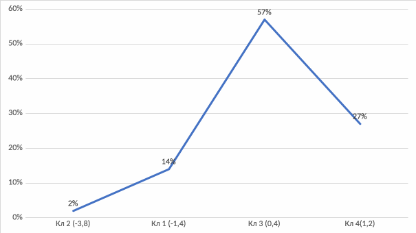
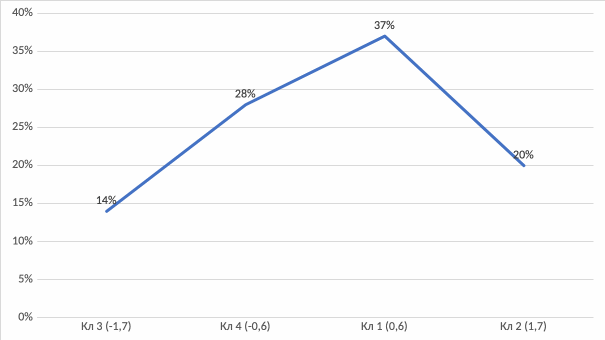
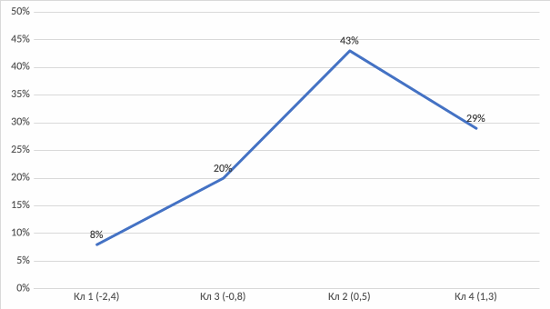
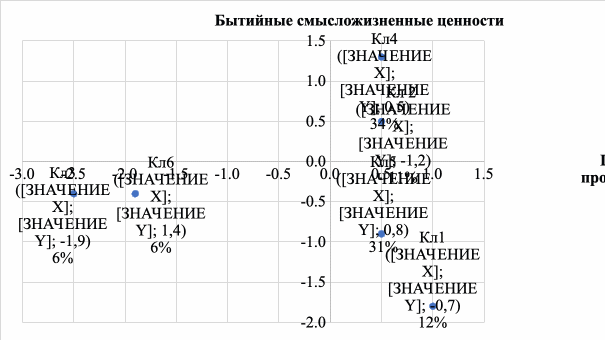
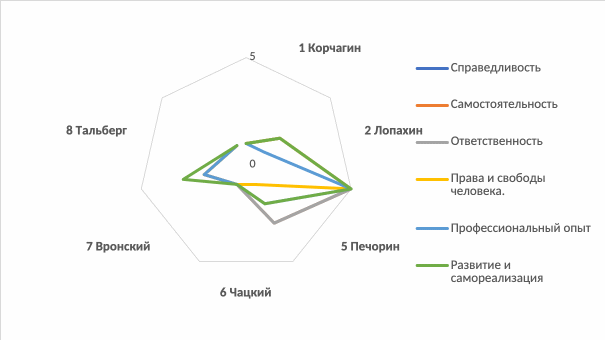
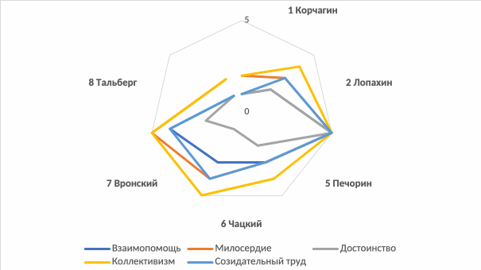
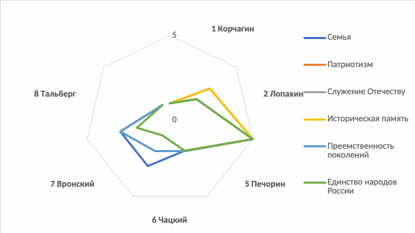
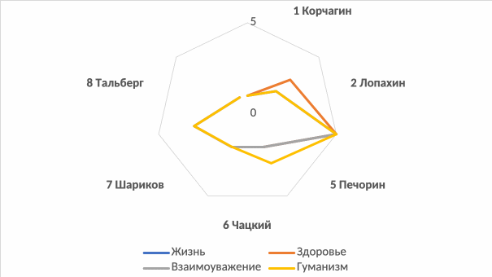

> **И. А. Газиева. Формирование профессионального потенциала молодёжи в системе высшего образования: ценностный подход** — диссертация на соискание учёной степени доктора социологических наук (5.4.4, РАНХиГС, Москва, 2025, 468 с.). Раздел: **Глава 4**.
>
> [Оглавление репозитория](README.md) · [Как цитировать](#как-цитировать-этот-текст) · [Правила для ИИ](AI-INSTRUCTIONS.md)

# Глава 4. Ценностная диагностика профессионального потенциала молодёжи в системе высшего образования

## **4.1 Факторное пространство профессионального потенциала молодёжи в системе высшего образования**

Состояние профессионального потенциала студенческой молодёжи, описанное нами ранее, требует создания необходимых условий для его корректировки в части увеличения объема ядра ценностей, что невозможно без группировки ценностей не только на основе логического анализа, что было сделано ранее при распределении изучаемых нами ценностей на терминальные и инструментальные, но и на основе статистического анализа.

С этой целью, а также с целью проверки описанной ранее эмпирической модели ценностного анализа профессионального потенциала студенческой молодёжи с помощью пакета IBM SPSS Statistics был проведен многомерный анализ массива данных социологического исследования[^320]: факторный и кластерный, — благодаря чему сформировано трехфакторное пространство ценностей профессионального потенциала студенческой молодёжи.

Как видно из таблицы 4.1, почти все ценности полноценно, одновременно всей структурой оцениваемых индикаторов (за небольшим исключением – почти всей структурой), распределились по факторам. В ходе анализа нами было получено 3 фактора, в которые распределились государственные и нормативные ценности студенческой молодёжи, составляющие основу ее профессионального потенциала.

Так, в **первый фактор** вошли ценности, обладающие явно выраженной спецификой профессионализации: справедливость, опыт самостоятельности, ответственность, права и свободы человека, профессиональный опыт, развитие и самореализация. **Во второй фактор** вошли ценности, характеризующие одновременно отношение к жизни и к труду: взаимопомощь, милосердие, достоинство, коллективизм, созидательный труд. В **третий фактор** вошли ценности, демонстрирующие различное отношение респондентов к стране и к своей роли в ее развитии: семья, патриотизм, служение отечеству и ответственность за его судьбу, историческая память, преемственность поколений, единство народов России.

Таблица 4.1

**Распределение ценностей и факторных весов их элементов по факторам**

<table style="width:100%;">
<colgroup>
<col style="width: 65%" />
<col style="width: 8%" />
<col style="width: 8%" />
<col style="width: 8%" />
<col style="width: 8%" />
</colgroup>
<thead>
<tr>
<th rowspan="2" style="text-align: center;"><strong>Ценности</strong></th>
<th colspan="4" style="text-align: center;">Факторные веса элементов ценностей</th>
</tr>
<tr>
<th style="text-align: center;"><strong>1</strong></th>
<th style="text-align: center;"><strong>2</strong></th>
<th style="text-align: center;"><strong>3</strong></th>
<th style="text-align: center;"><strong>4</strong></th>
</tr>
</thead>
<tbody>
<tr>
<td colspan="5" style="text-align: center;"><strong>Фактор 1</strong></td>
</tr>
<tr>
<td style="text-align: center;"><ol type="1">
<li>
Справедливость
</li>
</ol></td>
<td style="text-align: center;">0,472</td>
<td style="text-align: center;">0,733</td>
<td style="text-align: center;">0,711</td>
<td style="text-align: center;">0,498</td>
</tr>
<tr>
<td style="text-align: center;"><ol start="2" type="1">
<li>
Опыт самостоятельности
</li>
</ol></td>
<td style="text-align: center;">0,440</td>
<td style="text-align: center;">0,728</td>
<td style="text-align: center;">0,744</td>
<td style="text-align: center;">0,509</td>
</tr>
<tr>
<td style="text-align: center;"><ol start="3" type="1">
<li>
Ответственность
</li>
</ol></td>
<td style="text-align: center;">0,454</td>
<td style="text-align: center;">0,757</td>
<td style="text-align: center;">0,765</td>
<td style="text-align: center;">0,694</td>
</tr>
<tr>
<td style="text-align: center;"><ol start="4" type="1">
<li>
Права и свободы человека
</li>
</ol></td>
<td style="text-align: center;">0,668</td>
<td style="text-align: center;">0,651</td>
<td style="text-align: center;">0,698</td>
<td style="text-align: center;">0,727</td>
</tr>
<tr>
<td style="text-align: center;"><em>Профессиональный опыт:</em></td>
<td style="text-align: center;"></td>
<td style="text-align: center;"></td>
<td style="text-align: center;"></td>
<td style="text-align: center;"></td>
</tr>
<tr>
<td style="text-align: center;"><ol start="5" type="1">
<li>
- «Получать удовлетворение от работы»
</li>
</ol></td>
<td style="text-align: center;">0,623</td>
<td style="text-align: center;">0,804</td>
<td style="text-align: center;">0,763</td>
<td style="text-align: center;">0,709</td>
</tr>
<tr>
<td style="text-align: center;"><ol start="6" type="1">
<li>
— «Иметь высокий доход»
</li>
</ol></td>
<td style="text-align: center;">0,695</td>
<td style="text-align: center;">0,698</td>
<td style="text-align: center;">0,782</td>
<td style="text-align: center;">0,712</td>
</tr>
<tr>
<td style="text-align: center;"><ol start="7" type="1">
<li>
- «Совершенствование своих профессиональных навыков»
</li>
</ol></td>
<td style="text-align: center;">0,552</td>
<td style="text-align: center;">0,821</td>
<td style="text-align: center;">0,802</td>
<td style="text-align: center;">0,758</td>
</tr>
<tr>
<td style="text-align: center;"><em>Ценность развития и самореализации</em></td>
<td style="text-align: center;"></td>
<td style="text-align: center;"></td>
<td style="text-align: center;"></td>
<td style="text-align: center;"></td>
</tr>
<tr>
<td style="text-align: center;"><ol start="8" type="1">
<li>
— «Перспективы карьерного роста»
</li>
</ol></td>
<td style="text-align: center;">0,649</td>
<td style="text-align: center;">0,825</td>
<td style="text-align: center;">0,721</td>
<td style="text-align: center;">0,742</td>
</tr>
<tr>
<td style="text-align: center;"><ol start="9" type="1">
<li>
— «Качественное образование»
</li>
</ol></td>
<td style="text-align: center;">0,482</td>
<td style="text-align: center;">0,630</td>
<td style="text-align: center;">0,650</td>
<td style="text-align: center;">0,545</td>
</tr>
<tr>
<td style="text-align: center;"><ol start="10" type="1">
<li>
- «Возможность профессиональной самореализации»
</li>
</ol></td>
<td style="text-align: center;">0,677</td>
<td style="text-align: center;">0,822</td>
<td style="text-align: center;">0,797</td>
<td style="text-align: center;">0,753</td>
</tr>
<tr>
<td style="text-align: center;"><ol start="11" type="1">
<li>
- «Возможность создать достойную профессиональную репутацию»
</li>
</ol></td>
<td style="text-align: center;">0,461</td>
<td style="text-align: center;">0,678</td>
<td style="text-align: center;">0,562</td>
<td style="text-align: center;">0,732</td>
</tr>
<tr>
<td colspan="5" style="text-align: center;"><strong>Фактор 2</strong></td>
</tr>
<tr>
<td style="text-align: center;"><ol start="12" type="1">
<li>
Взаимопомощь
</li>
</ol></td>
<td style="text-align: center;">0,617</td>
<td style="text-align: center;">0,583</td>
<td style="text-align: center;">0,646</td>
<td style="text-align: center;">0,520</td>
</tr>
<tr>
<td style="text-align: center;"><ol start="13" type="1">
<li>
Милосердие
</li>
</ol></td>
<td style="text-align: center;">0,622</td>
<td style="text-align: center;">0,581</td>
<td style="text-align: center;">0,594</td>
<td style="text-align: center;">0,550</td>
</tr>
<tr>
<td style="text-align: center;"><ol start="14" type="1">
<li>
Достоинство
</li>
</ol></td>
<td style="text-align: center;">0,577<a href="#fn1" class="footnote-ref" id="fnref1" role="doc-noteref">1</a></td>
<td style="text-align: center;">0,572</td>
<td style="text-align: center;">0,541</td>
<td style="text-align: center;">0,362</td>
</tr>
<tr>
<td style="text-align: center;"><ol start="15" type="1">
<li>
Коллективизм
</li>
</ol></td>
<td style="text-align: center;">0,591</td>
<td style="text-align: center;">0,657</td>
<td style="text-align: center;">0,678</td>
<td style="text-align: center;">0,683</td>
</tr>
<tr>
<td style="text-align: center;"><ol start="16" type="1">
<li>
Созидательный труд
</li>
</ol></td>
<td style="text-align: center;">0,645</td>
<td style="text-align: center;">0,582</td>
<td style="text-align: center;">0,751</td>
<td style="text-align: center;">0,710</td>
</tr>
<tr>
<td colspan="5" style="text-align: center;"><strong>Фактор 3</strong></td>
</tr>
<tr>
<td style="text-align: center;"><ol start="17" type="1">
<li>
Семья
</li>
</ol></td>
<td style="text-align: center;">0,649</td>
<td style="text-align: center;">0,565</td>
<td style="text-align: center;">0,586</td>
<td style="text-align: center;">0,535</td>
</tr>
<tr>
<td style="text-align: center;"><ol start="18" type="1">
<li>
Патриотизм
</li>
</ol></td>
<td style="text-align: center;">0,741</td>
<td style="text-align: center;">0,767</td>
<td style="text-align: center;">0,698</td>
<td style="text-align: center;">0,615</td>
</tr>
<tr>
<td style="text-align: center;"><ol start="19" type="1">
<li>
Служение Отечеству и ответственность за его судьбу
</li>
</ol></td>
<td style="text-align: center;">0,534</td>
<td style="text-align: center;">0,768</td>
<td style="text-align: center;">0,764</td>
<td style="text-align: center;">0,633</td>
</tr>
<tr>
<td style="text-align: center;"><ol start="20" type="1">
<li>
Историческая память
</li>
</ol></td>
<td style="text-align: center;">0,640</td>
<td style="text-align: center;">0,718</td>
<td style="text-align: center;">0,689</td>
<td style="text-align: center;">0,685</td>
</tr>
<tr>
<td style="text-align: center;"><ol start="21" type="1">
<li>
Преемственность поколений
</li>
</ol></td>
<td style="text-align: center;">0,701</td>
<td style="text-align: center;">0,768</td>
<td style="text-align: center;">0,696</td>
<td style="text-align: center;">0,601</td>
</tr>
<tr>
<td style="text-align: center;"><ol start="22" type="1">
<li>
Единство народов России
</li>
</ol></td>
<td style="text-align: center;">0,657</td>
<td style="text-align: center;">0,738</td>
<td style="text-align: center;">0,641</td>
<td style="text-align: center;">0,521</td>
</tr>
</tbody>
</table>
<section id="footnotes" class="footnotes footnotes-end-of-document" role="doc-endnotes">

<ol>
<li id="fn1">
Оставлено суждение: «Достоинство личности определяется индивидуальными качествами человека»<a href="#fnref1" class="footnote-back" role="doc-backlink">↩︎</a>
</li>
</ol>
</section>

<table style="width:100%;">
<colgroup>
<col style="width: 65%" />
<col style="width: 8%" />
<col style="width: 8%" />
<col style="width: 8%" />
<col style="width: 8%" />
</colgroup>
<thead>
<tr>
<th colspan="5" style="text-align: center;"><strong>Полноценно не вошли в факторы</strong><a href="#fn1" class="footnote-ref" id="fnref1" role="doc-noteref">1</a></th>
</tr>
</thead>
<tbody>
<tr>
<td rowspan="2" style="text-align: center;"><strong>Ценности</strong></td>
<td colspan="4" style="text-align: center;">Факторные веса элементов ценностей</td>
</tr>
<tr>
<td style="text-align: center;"><strong>1</strong></td>
<td style="text-align: center;"><strong>2</strong></td>
<td style="text-align: center;"><strong>3</strong></td>
<td style="text-align: center;"><strong>4</strong></td>
</tr>
<tr>
<td style="text-align: center;"><ol start="23" type="1">
<li>
Жизнь
</li>
</ol></td>
<td style="text-align: center;"><em><strong>0,438</strong></em></td>
<td style="text-align: center;"><em><strong>0,406</strong></em></td>
<td style="text-align: center;"><strong>0,446</strong></td>
<td style="text-align: center;">
0,660

0,692
</td>
</tr>
<tr>
<td style="text-align: center;"><ol start="24" type="1">
<li>
Здоровье
</li>
</ol></td>
<td style="text-align: center;">0,426</td>
<td style="text-align: center;">0,585</td>
<td style="text-align: center;"><em><strong>0,491</strong></em></td>
<td style="text-align: center;">
<em><strong>0,382</strong></em>

<strong>0,575</strong>

0,337

<em><strong>0,404</strong></em>

<em><strong>0,414</strong></em>

<em><strong>0,411</strong></em>
</td>
</tr>
<tr>
<td style="text-align: center;"><ol start="25" type="1">
<li>
Взаимоуважение
</li>
</ol></td>
<td style="text-align: center;"><em><strong>0,490</strong></em></td>
<td style="text-align: center;">0,650</td>
<td style="text-align: center;">0,532</td>
<td style="text-align: center;"><strong>0,413</strong></td>
</tr>
<tr>
<td style="text-align: center;"><ol start="26" type="1">
<li>
Гуманизм
</li>
</ol></td>
<td style="text-align: center;"><em><strong>0,516</strong></em></td>
<td style="text-align: center;">0,634</td>
<td style="text-align: center;">
0,498

0,472
</td>
<td style="text-align: center;">
<em><strong>0,431</strong></em>

<em><strong>0,461</strong></em>
</td>
</tr>
</tbody>
</table>
<section id="footnotes" class="footnotes footnotes-end-of-document" role="doc-endnotes">

<ol>
<li id="fn1">
Обозначения шрифтов:

- без выделений – фактор 1

- жирный курсив – фактор 2

- нежирный курсив – фактор 3<a href="#fnref1" class="footnote-back" role="doc-backlink">↩︎</a>
</li>
</ol>
</section>

Несмотря на то, что достаточно большое количество ценностей полноценно вошло в различные факторы, составив вполне равноценные смысловые группы, все же остались ценности, которые в полном объеме не вошли ни в один из факторов, оказавшись размытыми между ними. К ним относятся: ценности жизни, здоровья, взаимоуважения и гуманизма. Заметим, что почти все приведенные ценности имеют по несколько индикаторов почти на каждый элемент ценности (см., например: жизнь, здоровье, гуманизм), и все они входят в разные факторы.

Исходя из данных, приведенных в таблице 4.1, можно говорить о выявлении трех факторов, каждый из которых имеет вполне конкретные смысловые ценностные рамки. Более подробно опишем их далее.

**Первый фактор: ценности профессионального самоопределения**

В содержание первого фактора (см.: Таблица 4.2) вошли переменные, характеризующие ценности справедливости, опыта самостоятельности, профессионального опыта, развития и самореализации, ответственности, а также ценности прав и свобод человека. Очевидно, что ценности, вошедшие в содержание первого фактора, отличает ярко выраженная специфика профессионализации, поэтому назовем этот фактор **– фактором ценностей профессионального самоопределения.**

Таблица 4.2

**Структура содержания фактора ценностей профессионального самоопределения**

<table style="width:100%;">
<colgroup>
<col style="width: 65%" />
<col style="width: 8%" />
<col style="width: 8%" />
<col style="width: 8%" />
<col style="width: 8%" />
</colgroup>
<thead>
<tr>
<th rowspan="2" style="text-align: center;"><strong>Ценности</strong></th>
<th colspan="4" style="text-align: center;">Факторные веса элементов ценностей</th>
</tr>
<tr>
<th style="text-align: center;"><strong>1</strong></th>
<th style="text-align: center;"><strong>2</strong></th>
<th style="text-align: center;"><strong>3</strong></th>
<th style="text-align: center;"><strong>4</strong></th>
</tr>
</thead>
<tbody>
<tr>
<td><ol type="1">
<li>
Справедливость
</li>
</ol></td>
<td>0,472</td>
<td>0,733</td>
<td>0,711</td>
<td>0,498</td>
</tr>
<tr>
<td><ol start="2" type="1">
<li>
Опыт самостоятельности
</li>
</ol></td>
<td>0,440</td>
<td>0,728</td>
<td>0,744</td>
<td>0,509</td>
</tr>
<tr>
<td><ol start="3" type="1">
<li>
Ответственность
</li>
</ol></td>
<td>0,454</td>
<td>0,757</td>
<td>0,765</td>
<td>0,694</td>
</tr>
<tr>
<td><ol start="4" type="1">
<li>
Права и свободы человека
</li>
</ol></td>
<td>0,668</td>
<td>0,651</td>
<td>0,698</td>
<td>0,727</td>
</tr>
<tr>
<td><ol start="5" type="1">
<li>
<em>Профессиональный опыт:</em>
</li>
</ol></td>
<td></td>
<td></td>
<td></td>
<td></td>
</tr>
<tr>
<td><ul>
<li>
«Получать удовлетворение от работы»
</li>
</ul></td>
<td>0,623</td>
<td>0,804</td>
<td>0,763</td>
<td>0,709</td>
</tr>
<tr>
<td><ul>
<li>
«Иметь высокий доход»
</li>
</ul></td>
<td>0,695</td>
<td>0,698</td>
<td>0,782</td>
<td>0,712</td>
</tr>
<tr>
<td><ul>
<li>
«Совершенствование своих профессиональных навыков»
</li>
</ul></td>
<td>0,552</td>
<td>0,821</td>
<td>0,802</td>
<td>0,758</td>
</tr>
<tr>
<td><ol start="6" type="1">
<li>
<em>Ценность развития и самореализации</em>
</li>
</ol></td>
<td></td>
<td></td>
<td></td>
<td></td>
</tr>
<tr>
<td><ul>
<li>
«Перспективы карьерного роста»
</li>
</ul></td>
<td>0,649</td>
<td>0,825</td>
<td>0,721</td>
<td>0,742</td>
</tr>
<tr>
<td><ul>
<li>
«Качественное образование»
</li>
</ul></td>
<td>0,482</td>
<td>0,630</td>
<td>0,650</td>
<td>0,545</td>
</tr>
<tr>
<td><ul>
<li>
«Возможность профессиональной самореализации»
</li>
</ul></td>
<td>0,677</td>
<td>0,822</td>
<td>0,797</td>
<td>0,753</td>
</tr>
<tr>
<td><ul>
<li>
«Возможность создать достойную профессиональную репутацию»
</li>
</ul></td>
<td>0,461</td>
<td>0,678</td>
<td>0,562</td>
<td>0,732</td>
</tr>
</tbody>
</table>

Графическое отображение распределения массива данных по фактору ценностей профессионального самоопределения, представленное на рисунке 4.1, наглядно демонстрирует распределение четырех типологических групп, выявленных нами в результате кластерного анализа массива данных социологического исследования, проведенного по фактору ценностей профессионального самоопределения. Так, более половины респондентов (Кл3 – 57% и Кл4 – 27%) демонстрируют в целом положительное отношение к содержанию фактора ценностей профессионального самоопределения и лишь 16% респондентов (Кл2 и Кл1) демонстрирует негативное отношение к содержанию данного фактора. Такие цифры говорят о том, что весьма велика доля респондентов, которые следуют совокупно всем ценностям профессионального самоопределения, выражая крайнюю степень согласия с суждениями, характеризующими все четыре элемента ценностей, входящих в данный фактор.

**Рисунок 4.1. Графическое отображение распределения массива данных по фактору ценностей профессионального самоопределения**

Более детальный анализ оценки респондентами параметров, представляющих собой содержание фактора ценностей профессионального самоопределения, можно осуществить благодаря описанию таблиц сопряженности, представленных в адаптированном виде и для удобства описания разбитых по группам ценностей в таблицах 4.3-4.5: ценность профессионального опыта (таблица 4.3); ценность развития и самореализации (таблица 4.4); ценности самостоятельности, ответственности, прав и свобод человека (таблица 4.5).

Как видно из перечисленных таблиц, распределение центров кластеров говорит о том, что полученная порядковая шкала по фактору ценностей профессионального самоопределения обладает хорошей различающей способностью; ответы респондентов разных типологических групп распределились в четкой зависимости от координат центров кластеров: чем меньше координата, тем ниже степень согласия респондентов с параметрами фактора, и наоборот, чем больше координата, тем выше степень согласия.

Так, абсолютное большинство респондентов, находящихся в типологической группе с координатами кластера 4 (это видно во всех трех таблицах), определяют значимость всех суждений, входящих в фактор, как максимальную, в то время как весьма незначительной является доля респондентов, оценивающих эти суждения максимально, которая находится в типологической группе с координатами кластера 2. Также необходимо отметить небольшую численную разницу между количеством респондентов, оценивших максимально кадровые ценности и находящихся в кластерах 3 и 4; кроме того, доля высоких оценок в кластере 4 почти в 2-3 раза выше, чем в кластере 1, а в сравнении с кластером 2 превышение составляет более чем 10 раз. На основе приведенных данных можно сделать вывод о том, что в зоне положительных значений фактора находятся респонденты, для которых ценности профессионального самоопределения имеют максимально высокое значение, а в зоне отрицательных значений – респонденты, оценивающие значимость ценностей описываемого фактора низко.

Остановимся на данных, представленных в каждой таблице, в отдельности.

Так, из таблицы 4.3, где указаны согласия респондентов с ценностными суждениями, составляющими три индикатора ценности профессионального опыта, можно увидеть, что большинство респондентов, находящихся не только в зоне положительных значений фактора ценностей профессионального самоопределения (кл.3 и кл.4), но и в зоне отрицательных значений (кл.1), за исключением самого дальнего кластера – 2, оценили их максимально высоко. Заметим, что это, пожалуй, самая высоко оцененная представителями почти всех кластеров группа индикаторов, что говорит о высокой значимости данной ценности для респондентов всех типологических групп и на абстрактном уровне идеального – без привязки к ним самим, и на уровне желаемого для них, ожидаемого и действительного.

Таблица 4.3

Распределение согласия респондентов с тезисами **фактора ценностей профессионального самоопределения (**ценность профессионального опыта**), %**

<table>
<colgroup>
<col style="width: 13%" />
<col style="width: 6%" />
<col style="width: 40%" />
<col style="width: 7%" />
<col style="width: 7%" />
<col style="width: 7%" />
<col style="width: 7%" />
<col style="width: 9%" />
</colgroup>
<thead>
<tr>
<th rowspan="2" style="text-align: center;"><strong>Ценности</strong></th>
<th rowspan="2" style="text-align: center;"><strong>№</strong><a href="#fn1" class="footnote-ref" id="fnref1" role="doc-noteref">1</a></th>
<th rowspan="2" style="text-align: center;"><strong>Суждения</strong></th>
<th colspan="4" style="text-align: center;"><strong>Номера кластеров</strong></th>
<th rowspan="2" style="text-align: center;"><strong>Выборка</strong><a href="#fn2" class="footnote-ref" id="fnref2" role="doc-noteref">2</a></th>
</tr>
<tr>
<th style="text-align: right;"><strong>Кл 2</strong></th>
<th style="text-align: right;"><strong>Кл 1</strong></th>
<th style="text-align: right;"><strong>Кл 3</strong></th>
<th style="text-align: right;"><strong>Кл 4</strong></th>
</tr>
</thead>
<tbody>
<tr>
<td rowspan="4">
«Получать удовлетворение от работы»

 

 

 
</td>
<td style="text-align: right;">1</td>
<td>Человек должен получать удовлетворение от работы</td>
<td style="text-align: right;">6,8</td>
<td style="text-align: right;">49,5</td>
<td style="text-align: right;">94,3</td>
<td style="text-align: right;">98,2</td>
<td style="text-align: right;">87,2</td>
</tr>
<tr>
<td style="text-align: right;">2</td>
<td>Получать удовлетворение от работы</td>
<td style="text-align: right;">17,5</td>
<td style="text-align: right;">53,4</td>
<td style="text-align: right;">96,1</td>
<td style="text-align: right;">98,7</td>
<td style="text-align: right;">89,1</td>
</tr>
<tr>
<td style="text-align: right;">3</td>
<td>Я хочу с радостью ходить на работу</td>
<td style="text-align: right;">24,3</td>
<td style="text-align: right;">57,4</td>
<td style="text-align: right;">94,1</td>
<td style="text-align: right;">95,4</td>
<td style="text-align: right;">88,2</td>
</tr>
<tr>
<td style="text-align: right;">4</td>
<td>Обучаясь в Академии, я делаю все, чтобы в будущем получать удовлетворение от работы</td>
<td style="text-align: right;">35,9</td>
<td style="text-align: right;">57,6</td>
<td style="text-align: right;">82,3</td>
<td style="text-align: right;">92,5</td>
<td style="text-align: right;">83,7</td>
</tr>
<tr>
<td rowspan="4">
«Совершенствование своих профессиональных навыков»

 

 

 
</td>
<td style="text-align: right;">1</td>
<td>Каждый человек должен всегда расти над собой в профессиональном плане</td>
<td style="text-align: right;">6,8</td>
<td style="text-align: right;">41,4</td>
<td style="text-align: right;">88,3</td>
<td style="text-align: right;">92,5</td>
<td style="text-align: right;">81,1</td>
</tr>
<tr>
<td style="text-align: right;">2</td>
<td>Иметь возможность совершенствования своих профессиональных навыков</td>
<td style="text-align: right;">21,4</td>
<td style="text-align: right;">53,5</td>
<td style="text-align: right;">95,5</td>
<td style="text-align: right;">98,4</td>
<td style="text-align: right;">88,7</td>
</tr>
<tr>
<td style="text-align: right;">3</td>
<td>Готов изучать и применять новые технологии и подходы к решению своих профессиональных задач</td>
<td style="text-align: right;">18,4</td>
<td style="text-align: right;">52,4</td>
<td style="text-align: right;">92,6</td>
<td style="text-align: right;">94,4</td>
<td style="text-align: right;">85,8</td>
</tr>
<tr>
<td style="text-align: right;">4</td>
<td>Обучаясь в Академии, я делаю все, чтобы в будущем иметь возможность совершенствовать свои профессиональные навыки</td>
<td style="text-align: right;">33,0</td>
<td style="text-align: right;">61,5</td>
<td style="text-align: right;">86,8</td>
<td style="text-align: right;">93,9</td>
<td style="text-align: right;">86,1</td>
</tr>
<tr>
<td rowspan="5">
«Иметь высокий доход»

 

 

 

 
</td>
<td style="text-align: right;">1</td>
<td>Труд человека должен оплачиваться по достоинству</td>
<td style="text-align: right;">11,7</td>
<td style="text-align: right;">58,6</td>
<td style="text-align: right;">98,1</td>
<td style="text-align: right;">99,7</td>
<td style="text-align: right;">91,0</td>
</tr>
<tr>
<td style="text-align: right;">2</td>
<td>Иметь высокий доход</td>
<td style="text-align: right;">20,4</td>
<td style="text-align: right;">51,2</td>
<td style="text-align: right;">91,1</td>
<td style="text-align: right;">96,2</td>
<td style="text-align: right;">85,3</td>
</tr>
<tr>
<td style="text-align: right;">3</td>
<td>Готов активно и много трудиться, чтобы обеспечить себе высокий доход</td>
<td style="text-align: right;">14,6</td>
<td style="text-align: right;">53,7</td>
<td style="text-align: right;">92,6</td>
<td style="text-align: right;">93,7</td>
<td style="text-align: right;">85,7</td>
</tr>
<tr>
<td style="text-align: right;">3</td>
<td>Готов учиться и развиваться всю жизнь, чтобы обеспечивать себе высокий доход</td>
<td style="text-align: right;">16,5</td>
<td style="text-align: right;">53,0</td>
<td style="text-align: right;">92,5</td>
<td style="text-align: right;">94,1</td>
<td style="text-align: right;">85,7</td>
</tr>
<tr>
<td style="text-align: right;">4</td>
<td>Обучаясь в Академии, я делаю все, чтобы в будущем иметь высокий доход</td>
<td style="text-align: right;">37,9</td>
<td style="text-align: right;">59,6</td>
<td style="text-align: right;">84,9</td>
<td style="text-align: right;">92,0</td>
<td style="text-align: right;">84,4</td>
</tr>
</tbody>
</table>
<section id="footnotes" class="footnotes footnotes-end-of-document" role="doc-endnotes">

<ol>
<li id="fn1">
Здесь и далее: № - порядковый номер элементов ценностей: ценностные отношения, ценностные ориентации, ценностные установки, ценностные действия<a href="#fnref1" class="footnote-back" role="doc-backlink">↩︎</a>
</li>
<li id="fn2">
В этой и всех таблицах далее сумма переменных по каждой строке не равна 100%, поскольку в таблицу включены лишь строки с ответами тех респондентов, которые максимально оценили для себя важность возможности для профессиональной самореализации<a href="#fnref2" class="footnote-back" role="doc-backlink">↩︎</a>
</li>
</ol>
</section>

Так, большинство представителей трех кластеров (3, 4, 1) руководствуются ценностью профессионального развития, поскольку для них максимально важно получать удовлетворение от работы, совершенствовать свои профессиональные навыки и, безусловно, иметь высокий доход.

Что касается индикаторов, раскрывающих содержание ценности развития и самореализации, максимальные оценки которых указаны в таблице 3.4, то здесь оценки некоторых элементов ценностей, даже в кластерах из зоны положительных значений фактора кадровых ценностей, заметно ниже, чем оценки индикаторов ценности профессионального развития (Таблица 4.3).

В первую очередь, эту тенденцию можно заметить в оценках ценностных элементов абстрактного уровня. Так, более половины респондентов, находящихся в зоне положительных значений данного фактора (кл.4 и кл.3), указали максимальную степень согласия с тем, что любой работник интеллектуальной сферы должен иметь положительную общественную оценку своей деятельности (62,8% и 61,8%, соответственно). Что касается респондентов, чьи ответы, находятся в зоне отрицательных значений фактора (кл.1 и кл.2), то доля их максимальных оценок значительно ниже (23,5% и 6,8%, соответственно). Несколько больше доля согласий представителей всех кластеров с суждением о том, что качественное образование – залог профессионального успеха; безусловно, это вполне закономерно, поскольку, как видно из таблицы, доля максимальных оценок в выборке по данному суждению так же выше (61,2% против 55,8%). Эта же тенденция наблюдается и в двух других суждениях, характеризующих абстрактный уровень ценности развития и самореализации.

Таблица 4.4

Распределение согласия респондентов с тезисами фактора **ценностей профессионального самоопределения (**ценность развития и самореализации**), %**

<table>
<colgroup>
<col style="width: 11%" />
<col style="width: 7%" />
<col style="width: 42%" />
<col style="width: 7%" />
<col style="width: 7%" />
<col style="width: 7%" />
<col style="width: 8%" />
<col style="width: 8%" />
</colgroup>
<thead>
<tr>
<th rowspan="2" style="text-align: center;"><strong>Ценности</strong></th>
<th rowspan="2" style="text-align: center;"><strong>№</strong><a href="#fn1" class="footnote-ref" id="fnref1" role="doc-noteref">1</a></th>
<th rowspan="2" style="text-align: center;"><strong>Суждения</strong></th>
<th colspan="4" style="text-align: center;"><strong>Номера кластеров</strong></th>
<th rowspan="2" style="text-align: center;"><strong>Выборка</strong><a href="#fn2" class="footnote-ref" id="fnref2" role="doc-noteref">2</a></th>
</tr>
<tr>
<th style="text-align: right;"><strong>Кл 2</strong></th>
<th style="text-align: right;"><strong>Кл 1</strong></th>
<th style="text-align: right;"><strong>Кл 3</strong></th>
<th style="text-align: right;"><strong>Кл 4</strong></th>
</tr>
</thead>
<tbody>
<tr>
<td rowspan="4">
«Возможность создать достойную профессиональную репутацию»

 

 

 
</td>
<td style="text-align: right;">1</td>
<td>Любой работник интеллектуальной сферы должен иметь положительную общественную оценку своей деятельности</td>
<td style="text-align: right;">6,8</td>
<td style="text-align: right;">23,5</td>
<td style="text-align: right;">61,8</td>
<td style="text-align: right;">62,8</td>
<td style="text-align: right;">55,8</td>
</tr>
<tr>
<td style="text-align: right;">2</td>
<td>Иметь возможность создать достойную профессиональную репутацию</td>
<td style="text-align: right;">20,4</td>
<td style="text-align: right;">51,2</td>
<td style="text-align: right;">91,7</td>
<td style="text-align: right;">93,9</td>
<td style="text-align: right;">85,1</td>
</tr>
<tr>
<td style="text-align: right;">3</td>
<td>Готов трудиться так, чтобы получать только положительную оценку результатов своей профессиональной деятельности</td>
<td style="text-align: right;">21,4</td>
<td style="text-align: right;">44,9</td>
<td style="text-align: right;">77,4</td>
<td style="text-align: right;">81,8</td>
<td style="text-align: right;">74,2</td>
</tr>
<tr>
<td style="text-align: right;">4</td>
<td>Обучаясь в Академии, я делаю все, чтобы в будущем иметь возможность создать достойную профессиональную репутацию</td>
<td style="text-align: right;">34,0</td>
<td style="text-align: right;">63,2</td>
<td style="text-align: right;">84,8</td>
<td style="text-align: right;">94,0</td>
<td style="text-align: right;">85,9</td>
</tr>
<tr>
<td rowspan="5">
«Качественное образование»

 

 

 

 
</td>
<td style="text-align: right;">1</td>
<td>Качественное образование – залог профессионального успеха</td>
<td style="text-align: right;">11,7</td>
<td style="text-align: right;">32,8</td>
<td style="text-align: right;">63,4</td>
<td style="text-align: right;">69,0</td>
<td style="text-align: right;">61,2</td>
</tr>
<tr>
<td style="text-align: right;">2</td>
<td>Иметь качественное образование</td>
<td style="text-align: right;">17,5</td>
<td style="text-align: right;">51,0</td>
<td style="text-align: right;">86,2</td>
<td style="text-align: right;">88,9</td>
<td style="text-align: right;">81,3</td>
</tr>
<tr>
<td style="text-align: right;">3</td>
<td>Готов учиться в вузе, который дает образование, гарантирующее успешность в профессиональной среде и в обществе</td>
<td style="text-align: right;">18,4</td>
<td style="text-align: right;">52,4</td>
<td style="text-align: right;">83,8</td>
<td style="text-align: right;">89,0</td>
<td style="text-align: right;">81,0</td>
</tr>
<tr>
<td style="text-align: right;">4</td>
<td>Я поступил в РАНХиГС, потому что хочу получить качественное образование</td>
<td style="text-align: right;">32,0</td>
<td style="text-align: right;">60,0</td>
<td style="text-align: right;">71,4</td>
<td style="text-align: right;">88,9</td>
<td style="text-align: right;">78,9</td>
</tr>
<tr>
<td style="text-align: right;">4</td>
<td>Я поступил в РАНХиГС, потому что это образование гарантирует успешность в профессиональной среде и в обществе</td>
<td style="text-align: right;">22,3</td>
<td style="text-align: right;">52,4</td>
<td style="text-align: right;">58,5</td>
<td style="text-align: right;">82,1</td>
<td style="text-align: right;">70,3</td>
</tr>
<tr>
<td rowspan="4">
«Перспективы карьерного роста»

 

 

 
</td>
<td style="text-align: right;">1</td>
<td>Каждый человек должен иметь возможность подниматься по карьерной лестнице</td>
<td style="text-align: right;">9,7</td>
<td style="text-align: right;">47,0</td>
<td style="text-align: right;">95,8</td>
<td style="text-align: right;">98,0</td>
<td style="text-align: right;">87,7</td>
</tr>
<tr>
<td style="text-align: right;">2</td>
<td>Иметь перспективы карьерного роста</td>
<td style="text-align: right;">20,4</td>
<td style="text-align: right;">54,9</td>
<td style="text-align: right;">95,7</td>
<td style="text-align: right;">98,5</td>
<td style="text-align: right;">89,1</td>
</tr>
<tr>
<td style="text-align: right;">3</td>
<td>Готов сменить место работы для получения перспектив карьер. роста</td>
<td style="text-align: right;">18,4</td>
<td style="text-align: right;">49,2</td>
<td style="text-align: right;">87,3</td>
<td style="text-align: right;">93,1</td>
<td style="text-align: right;">82,0</td>
</tr>
<tr>
<td style="text-align: right;">4</td>
<td>Обучаясь в Академии, я делаю все, чтобы в будущем иметь перспективы карьерного роста</td>
<td style="text-align: right;">38,8</td>
<td style="text-align: right;">60,0</td>
<td style="text-align: right;">84,8</td>
<td style="text-align: right;">93,8</td>
<td style="text-align: right;">85,4</td>
</tr>
<tr>
<td rowspan="2" style="text-align: center;"><strong>Ценности</strong></td>
<td rowspan="2" style="text-align: center;"><strong>№</strong><a href="#fn3" class="footnote-ref" id="fnref3" role="doc-noteref">3</a></td>
<td rowspan="2" style="text-align: center;"><strong>Суждения</strong></td>
<td colspan="4" style="text-align: center;"><strong>Номера кластеров</strong></td>
<td rowspan="2" style="text-align: center;"><strong>Выборка</strong><a href="#fn4" class="footnote-ref" id="fnref4" role="doc-noteref">4</a></td>
</tr>
<tr>
<td style="text-align: right;"><strong>Кл 2</strong></td>
<td style="text-align: right;"><strong>Кл 1</strong></td>
<td style="text-align: right;"><strong>Кл 3</strong></td>
<td style="text-align: right;"><strong>Кл 4</strong></td>
</tr>
<tr>
<td rowspan="5">
«Возможность профессиональной самореализации»

 

 

 

 
</td>
<td style="text-align: right;">1</td>
<td>Любой работник интеллектуальной сферы должен иметь условия для профессионального развития и карьерного роста</td>
<td style="text-align: right;">4,9</td>
<td style="text-align: right;">41,2</td>
<td style="text-align: right;">94,0</td>
<td style="text-align: right;">97,5</td>
<td style="text-align: right;">85,6</td>
</tr>
<tr>
<td style="text-align: right;">2</td>
<td>Иметь возможность профессиональной самореализации</td>
<td style="text-align: right;">16,5</td>
<td style="text-align: right;">56,8</td>
<td style="text-align: right;">95,7</td>
<td style="text-align: right;">98,5</td>
<td style="text-align: right;">89,3</td>
</tr>
<tr>
<td style="text-align: right;">3</td>
<td>Готов активно и много трудиться, учиться у других, чтобы сформировать профессиональные компетенции</td>
<td style="text-align: right;">21,4</td>
<td style="text-align: right;">52,2</td>
<td style="text-align: right;">91,9</td>
<td style="text-align: right;">92,6</td>
<td style="text-align: right;">85,0</td>
</tr>
<tr>
<td style="text-align: right;">3</td>
<td>Готов активно и много трудиться, чтобы реализовать профессиональные компетенции и свои способности</td>
<td style="text-align: right;">17,5</td>
<td style="text-align: right;">53,9</td>
<td style="text-align: right;">92,9</td>
<td style="text-align: right;">93,6</td>
<td style="text-align: right;">86,0</td>
</tr>
<tr>
<td style="text-align: right;">4</td>
<td>Обучаясь в Академии, я делаю все, чтобы в будущем иметь возможность для профессиональной самореализации</td>
<td style="text-align: right;">32,0</td>
<td style="text-align: right;">62,8</td>
<td style="text-align: right;">86,2</td>
<td style="text-align: right;">94,5</td>
<td style="text-align: right;">86,5</td>
</tr>
</tbody>
</table>
<section id="footnotes" class="footnotes footnotes-end-of-document" role="doc-endnotes">

<ol>
<li id="fn1">
Здесь и далее: № - порядковый номер элементов ценностей: ценностные отношения, ценностные ориентации, ценностные установки, ценностные действия<a href="#fnref1" class="footnote-back" role="doc-backlink">↩︎</a>
</li>
<li id="fn2">
В этой и всех таблицах далее сумма переменных по каждой строке не равна 100%, поскольку в таблицу включены лишь строки с ответами тех респондентов, которые максимально оценили для себя важность возможности для профессиональной самореализации<a href="#fnref2" class="footnote-back" role="doc-backlink">↩︎</a>
</li>
<li id="fn3">
Здесь и далее: № - порядковый номер элементов ценностей: ценностные отношения, ценностные ориентации, ценностные установки, ценностные действия<a href="#fnref3" class="footnote-back" role="doc-backlink">↩︎</a>
</li>
<li id="fn4">
В этой и всех таблицах далее сумма переменных по каждой строке не равна 100%, поскольку в таблицу включены лишь строки с ответами тех респондентов, которые максимально оценили для себя важность возможности для профессиональной самореализации<a href="#fnref4" class="footnote-back" role="doc-backlink">↩︎</a>
</li>
</ol>
</section>

Однако если отвлечься от математического сравнения цифр, необходимым является сделать акцент на том, что для респондентов, ответы которых по результатам многомерного статистического анализа, вошли в зону положительных либо отрицательных значений данного фактора разница в оценках везде разная и зависит от различных факторов.

Так, любопытна значительная разница в оценках представителей двух кластеров, находящихся в зоне положительных значений описываемого фактора, касающихся причин поступления в РАНХиГС. Так, абсолютное большинство представителей кластера 4 связывают свое поступление сюда с желанием получить качественное образование, которое гарантирует успешность в профессиональной сфере (88,9% и 82,1%, соответственно); однако количество согласий с этими же суждением у представителей второго кластера из положительной зоны (кластер 3) значительно расходится (71,4% против 58,8%, соответственно). Такие цифры демонстрируют нам, что далеко не все респонденты, оценивающие в целом положительно индикаторы ценностей профессионального самоопределения, делают это одинаково.

Обратим внимание и на то, что оценена максимально разнообразно представителями разных типологических групп возможность профессиональной самореализации: здесь представлено самое большое количество максимальных оценок, поставленных представителями обоих кластеров из положительной зоны значений, и даже представителями одного кластера из отрицательной зоны (кл.2); однако это же высказывание оценено высоко минимальным количеством представителей второго «отрицательного» кластера. Это говорит о том, что респонденты, находящиеся в крайней зоне отрицательных значений фактора ценностей профессионального самоопределения, не соотносят свою будущую профессиональную деятельность с конструктивными возможностями профессиональной самореализации, тогда как перспективы карьерного роста, например, высоко оценило бОльшая доля представителей этого же кластера.

Теперь обратимся к последнему блоку оценок, характеризующих отношение респондентов к фактору ценностей профессионального самоопределения. Данный блок принципиально отличается от предыдущих двух тем, что он включает в себя индикаторы не лишь одной ценности, а индикаторы сразу трех ценностей: самостоятельности, ответственности, прав и свобод человека.

Рассмотрим более детально первую ценность - ценность опыта самостоятельности. Обратимся к первому суждению «Каждый человек должен быть максимально самостоятельными в принятии решений». Из таблицы 3.5 видно, что в кластере 4 сконцентрировано абсолютное большинство максимальных оценок (88,5%), в кластере 3 – чуть меньше (72,5%), в то же время в кластере 1 почти в три раза меньше максимальных оценок, чем в кластере 4 (30,1%), а в кластере 2 доля максимальных оценок еще меньше — в 11 раз меньше, чем в кластере 4.

Таблица 4.5

Распределение согласия респондентов с тезисами фактора **ценностей профессионального самоопределения (**ценности самостоятельности, ответственности, прав и свобод человека**), %**

<table>
<colgroup>
<col style="width: 13%" />
<col style="width: 7%" />
<col style="width: 39%" />
<col style="width: 7%" />
<col style="width: 7%" />
<col style="width: 7%" />
<col style="width: 7%" />
<col style="width: 9%" />
</colgroup>
<thead>
<tr>
<th rowspan="2" style="text-align: center;"><strong>Ценности</strong></th>
<th rowspan="2" style="text-align: center;"><strong>№</strong><a href="#fn1" class="footnote-ref" id="fnref1" role="doc-noteref">1</a></th>
<th rowspan="2" style="text-align: center;"><strong>Суждения</strong></th>
<th colspan="4" style="text-align: center;"><strong>Номера кластеров</strong></th>
<th rowspan="2" style="text-align: center;"><strong>Выборка</strong><a href="#fn2" class="footnote-ref" id="fnref2" role="doc-noteref">2</a></th>
</tr>
<tr>
<th style="text-align: right;"><strong>Кл 2</strong></th>
<th style="text-align: right;"><strong>Кл 1</strong></th>
<th style="text-align: right;"><strong>Кл 3</strong></th>
<th style="text-align: right;"><strong>Кл 4</strong></th>
</tr>
</thead>
<tbody>
<tr>
<td rowspan="4">
Опыт самостоятельности

 

 

 
</td>
<td style="text-align: right;">1</td>
<td>Каждый человек должен быть максимально самостоятельными в принятии решений</td>
<td style="text-align: right;">7,8</td>
<td style="text-align: right;">30,1</td>
<td style="text-align: right;">72,5</td>
<td style="text-align: right;">88,5</td>
<td style="text-align: right;">69,4</td>
</tr>
<tr>
<td style="text-align: right;">2</td>
<td>Быть самостоятельным в принятии решений</td>
<td style="text-align: right;">18,4</td>
<td style="text-align: right;">47,8</td>
<td style="text-align: right;">91,9</td>
<td style="text-align: right;">97,7</td>
<td style="text-align: right;">85,7</td>
</tr>
<tr>
<td style="text-align: right;">3</td>
<td>Готов самостоятельно принимать решения</td>
<td style="text-align: right;">20,4</td>
<td style="text-align: right;">51,2</td>
<td style="text-align: right;">91,7</td>
<td style="text-align: right;">93,9</td>
<td style="text-align: right;">85,1</td>
</tr>
<tr>
<td style="text-align: right;">4</td>
<td>Я всегда принимаю решения самостоятельно</td>
<td style="text-align: right;">26,2</td>
<td style="text-align: right;">44,9</td>
<td style="text-align: right;">74,4</td>
<td style="text-align: right;">77,4</td>
<td style="text-align: right;">70,9</td>
</tr>
<tr>
<td rowspan="5">
Ответственность

 

 

 

 
</td>
<td style="text-align: right;">1</td>
<td>Любой человек должен осознавать себя как причину совершаемых им поступков</td>
<td style="text-align: right;">7,8</td>
<td style="text-align: right;">33,3</td>
<td style="text-align: right;">77,5</td>
<td style="text-align: right;">84,9</td>
<td style="text-align: right;">71,8</td>
</tr>
<tr>
<td style="text-align: right;">2</td>
<td>Нести ответственность за результаты своих решений</td>
<td style="text-align: right;">14,6</td>
<td style="text-align: right;">55,1</td>
<td style="text-align: right;">93,8</td>
<td style="text-align: right;">96,3</td>
<td style="text-align: right;">87,3</td>
</tr>
<tr>
<td style="text-align: right;">3</td>
<td>Готов отвечать за то, к чему приведут мои решения</td>
<td style="text-align: right;">21,4</td>
<td style="text-align: right;">56,1</td>
<td style="text-align: right;">93,3</td>
<td style="text-align: right;">93,8</td>
<td style="text-align: right;">86,6</td>
</tr>
<tr>
<td style="text-align: right;">4</td>
<td>Я всегда отвечаю за результаты своего действия или бездействия</td>
<td style="text-align: right;">31,1</td>
<td style="text-align: right;">58,3</td>
<td style="text-align: right;">86,8</td>
<td style="text-align: right;">90,9</td>
<td style="text-align: right;">83,9</td>
</tr>
<tr>
<td style="text-align: right;">4</td>
<td>Прежде чем принять решение, я стараюсь представить последствия этого решения</td>
<td style="text-align: right;">29,1</td>
<td style="text-align: right;">59,6</td>
<td style="text-align: right;">85,1</td>
<td style="text-align: right;">91,7</td>
<td style="text-align: right;">84,1</td>
</tr>
<tr>
<td rowspan="5">
Права и свободы человека

 

 

 

 
</td>
<td style="text-align: right;">1</td>
<td>Любой гражданин страны должен знать, уважать и использовать конституционные права и свободы человека</td>
<td style="text-align: right;">8,7</td>
<td style="text-align: right;">52,7</td>
<td style="text-align: right;">93,1</td>
<td style="text-align: right;">94,0</td>
<td style="text-align: right;">86,1</td>
</tr>
<tr>
<td style="text-align: right;">2</td>
<td>Знать, уважать и использовать конституционные права и свободы человека</td>
<td style="text-align: right;">23,3</td>
<td style="text-align: right;">52,5</td>
<td style="text-align: right;">87,1</td>
<td style="text-align: right;">90,1</td>
<td style="text-align: right;">82,6</td>
</tr>
<tr>
<td style="text-align: right;">3</td>
<td>Готов отстаивать конституционные права и свободы человека</td>
<td style="text-align: right;">17,5</td>
<td style="text-align: right;">54,2</td>
<td style="text-align: right;">88,3</td>
<td style="text-align: right;">91,1</td>
<td style="text-align: right;">83,6</td>
</tr>
<tr>
<td style="text-align: right;">4</td>
<td>Я знаю конституционные права и свободы гражданина России</td>
<td style="text-align: right;">28,2</td>
<td style="text-align: right;">62,8</td>
<td style="text-align: right;">85,1</td>
<td style="text-align: right;">91,5</td>
<td style="text-align: right;">84,4</td>
</tr>
<tr>
<td style="text-align: right;">4</td>
<td>Я уважаю конституционные права и свободы гражданина России</td>
<td style="text-align: right;">35,9</td>
<td style="text-align: right;">62,5</td>
<td style="text-align: right;">90,4</td>
<td style="text-align: right;">94,1</td>
<td style="text-align: right;">87,4</td>
</tr>
</tbody>
</table>
<section id="footnotes" class="footnotes footnotes-end-of-document" role="doc-endnotes">

<ol>
<li id="fn1">
Здесь и далее: № - порядковый номер элементов ценностей: ценностные отношения, ценностные ориентации, ценностные установки, ценностные действия<a href="#fnref1" class="footnote-back" role="doc-backlink">↩︎</a>
</li>
<li id="fn2">
В этой и всех таблицах далее сумма переменных по каждой строке не равна 100%, поскольку в таблицу включены лишь строки с ответами тех респондентов, которые максимально оценили для себя важность возможности для профессиональной самореализации<a href="#fnref2" class="footnote-back" role="doc-backlink">↩︎</a>
</li>
</ol>
</section>

Напомним, что подобная зависимость характерна для суждений, характеризующих все ценности, вошедшие в данный фактор, что еще раз говорит о высокой различающей способности нашей порядковой шкалы. Но наиболее важным для нас является то, что оценки элементов структуры ценности самостоятельности почти полностью повторяют оценки ценности ответственности, что, безусловно, заставляет задуматься о природе такой закономерности в похожести оценок, отразившейся и в том, что эти две ценности вошли в один фактор – фактор кадровых ценностей.

Самостоятельность предполагает способность действовать и принимать решения независимо от других людей. Это включает в себя умение ориентироваться в ситуации, самостоятельно выполнять задачи, регулировать свою жизнь и не полагаться полностью на помощь или руководство других. Ответственность же означает необходимость отвечать за последствия своих решений и действий. Когда мы ответственны, мы осознаем, что наше поведение и выборы оказывают влияние на себя и на окружающих. Это включает в себя умение выполнять свои обязанности, следовать правилам и заботиться о своих обязательствах. Отсюда очевидна тесная взаимосвязь самостоятельности и ответственности, поскольку самостоятельность подразумевает возможность принятия решений, а ответственность требует от нас быть готовыми нести последствия за эти решения. Думается, что именно поэтому данные ценности не только вошли в один фактор – фактор ценностей профессионального самоопределения, но и оценены высоко на всех четырех ценностных уровнях почти одинаковым количеством респондентов.

В целом, в силу того что, как видно из таблиц 4.3-4.5, в зоне положительных значений данного фактора находятся респонденты, которые высоко оценивают значимость для себя всех приведенных ценностей профессионального самоопределения.

Таким образом, **ценности профессионального самоопределения,** в нашем понимании, **включают в себя структурно все индикаторы оценки ценности (ценностные отношения, предпочтения, установки, действия), представляющие собой основу для выстраивания профессиональной и карьерной траектории индивидов.** К ним, согласно результатам факторного анализа относятся, безусловно, ценности развития и самореализации, профессионального опыта, а также ценность справедливости, опыта самостоятельности, и ответственности. Важно, что согласно результатам факторного анализа, к ценностям профессионального развития можно отнести и необходимость соблюдения прав и свобод человека, как один из значимых регулирующих ценностных рычагов в ходе формирования профессионального потенциала в среде студенческой молодёжи.

**Второй фактор: бытийные смысложизненные ценности**

В содержание **второго фактора** входят суждения, характеризующие две группы ценностей: *социальные ценности* (ценности коллективизма, созидательного труда, взаимопомощи и взаимоуважения / ценности общения, контакта и диалога); *духовно-нравственные ценности* (милосердия, достоинства).

В таблице 4.6 представлены суждения, которые отражают содержание данного фактора, и их факторные веса, которые, на первый взгляд, сложно объединяемы в единую смысловую группу, поэтому требуют дополнительного описания и анализа.

Таблица 4.6

Структура содержания фактора бытийных смысложизненных ценностей

<table style="width:99%;">
<colgroup>
<col style="width: 59%" />
<col style="width: 12%" />
<col style="width: 9%" />
<col style="width: 8%" />
<col style="width: 9%" />
</colgroup>
<thead>
<tr>
<th rowspan="2" style="text-align: center;"><strong>Ценности</strong></th>
<th colspan="4" style="text-align: center;">Факторные веса элементов ценностей</th>
</tr>
<tr>
<th style="text-align: center;"><strong>1</strong></th>
<th style="text-align: center;"><strong>2</strong></th>
<th style="text-align: center;"><strong>3</strong></th>
<th style="text-align: center;"><strong>4</strong></th>
</tr>
</thead>
<tbody>
<tr>
<td><ol type="1">
<li>
Взаимопомощь
</li>
</ol></td>
<td>0,617</td>
<td>0,583</td>
<td>0,646</td>
<td>0,520</td>
</tr>
<tr>
<td><ol start="2" type="1">
<li>
Милосердие
</li>
</ol></td>
<td>0,622</td>
<td>0,581</td>
<td>0,594</td>
<td>0,550</td>
</tr>
<tr>
<td><ol start="3" type="1">
<li>
Достоинство
</li>
</ol></td>
<td>0,577<a href="#fn1" class="footnote-ref" id="fnref1" role="doc-noteref">1</a></td>
<td>0,572</td>
<td>0,541</td>
<td>0,362</td>
</tr>
<tr>
<td><ol start="4" type="1">
<li>
Коллективизм
</li>
</ol></td>
<td>0,591</td>
<td>0,657</td>
<td>0,678</td>
<td>0,683</td>
</tr>
<tr>
<td><ol start="5" type="1">
<li>
Созидательный труд
</li>
</ol></td>
<td>0,645</td>
<td>0,582</td>
<td>0,751</td>
<td>0,710</td>
</tr>
</tbody>
</table>
<section id="footnotes" class="footnotes footnotes-end-of-document" role="doc-endnotes">

<ol>
<li id="fn1">
Оставлено суждение: «Достоинство личности определяется индивидуальными качествами человека»<a href="#fnref1" class="footnote-back" role="doc-backlink">↩︎</a>
</li>
</ol>
</section>

Так, описывая одновременно отдельные социальные и духовно-нравственные ценности, мы говорим о группе признаков, объединяющих респондентов, одинаково высоко или низко оценивающих для себя значимость ценностей, представляющих собой *такие социальные и морально-нравственные ориентиры жизнедеятельности, которые сопоставимы одновременно и с ценностью социальной жизни, и с ценностью их существования, и с характеристиками их бытийного пространства.* Такой подход дает нам возможность оформит описательный образ данного фактора, находящийся на пересечении содержательных смысловых полей бытийных ценностей и смысложизненных ценностей. Обоснуем данную позицию.

Несмотря на то, что бытийную значимость ценностей подчеркивал еще Г. Риккерт[^321], бытийные ценности, как отдельное понятие, не являются глубоко изученными в социологии и в теоретическом, и в эмпирическом плане. Более того, не является данное понятие глубоко изученным и в других науках, однако основные подходы к его интерпретации выделить можно. Так, в психологии, например, с подачи А.Маслоу, бытийные ценности принято рассматривать не в отдельности друг от друга, а в «переплетении» друг с другом, поскольку «они являются гранями Бытия, а не его частями»[^322]. К бытийным ценностям А.Маслоу относит перечень весьма различных по своей природе и смысловому основанию понятия, отражающие, по его мнению, характеристики бытия: истина, добро, красота, цельность, единство противоположностей, жизненность, уникальность, совершенство, необходимость, завершенность, справедливость, порядок, простота, богатство, непринужденность, игра, самодостаточность.

Очевидно, что данные ценности весьма отдаленно соотносятся с ценностями, составляющими содержание рассматриваемого нами фактора, что, однако, не делает их взаимоисключающими. Более того, позиция психолога о том, что «бытийные ценности, независимо от того, выступают ли они предметом осознанного поиска, предпочтений или стремлений, доставляют конечное удовлетворение, то есть порождают чувства совершенства, завершённости, ясности, исполнения предназначения и тому подобное»[^323], — содержательно сближает перечень ценностей, предложенных Маслоу, с ценностями, сформировавшими описываемый нами фактор в ходе анализа результатов социологического исследования.

Философский подход к определению содержания понятия бытийных ценностей и их основного функционального предназначения предлагает А.Ю. Огородников, который вводит данное понятие наряду с понятием бытийного сознания в отечественную философскую науку. Отводя бытийным ценностям ведущую роль в формировании гармоничной структуры системы ценностей личности, А.Ю. Огородников видит в них «представления человека о единстве бытия (Универсума), его фундаментальных процессов, определяющих все события, явления общества, действия»[^324], представления об основных сущностных свойствах человека как проекции всеобщих процессов существования мира[^325]. По мнению ученого, бытийные ценности — это ценности «абсолютной полноты бытия, любви, творчества и свободы»[^326], которые выводятся из объективной природы человека, его базовых стремлений, основанных на сущностных свойствах[^327].

Подобный подход ученых к определению бытийных ценностей дает нам возможность говорить о том, что содержание описываемого нами фактора не охватывает весь спектр бытийных ценностей, здесь сужение содержания фактора происходит за счет использования понятия смысложизненных ценностей, поскольку «бытийные ценности являются смыслом жизни для большинства людей, самоактуализирующиеся люди их явно активно ищут и привержены им»[^328].

Заметим, что четкого единого перечня ценностей, которые можно отнести к данной категории, в научной литературе отсутствует. Так, например, ВЦИОМ, многие годы в ходе изучения ценностей, определяющих смысл жизни россиян, использует перечень, который включает такие ценности как: семья и дети, здоровье, жить «по совести», интересная работа и материальное благополучие, профессиональное и общественное признание, путешествия[^329]. Ю.А.Зубок и В.И.Чупров в ходе социологической диагностики саморегуляции жизнедеятельности молодёжи в культурном пространстве используют следующие ценности: стремление к истине, любовь, борьба за справедливость, спокойная безбедная жизнь, политическая борьба (за власть), проявление своей индивидуальности (самореализация), продолжение себя в будущих поколениях[^330], относя, однако, к смысложизненным ценностям лишь терминальные[^331].

Как можно увидеть, ряд ценностей является общим и для нашего исследования, и для исследования коллег, что дает нам основание определить описываемый нами фактор как **фактор бытийных смысложизненных ценностей.**

Из рисунка 4.2 мы видим, что каждый пятый респондент (20%) находится в зоне положительных значений данного фактора, демонстрируя тем самым положительное отношение к суждениям, формирующим его содержание. Более трети респондентов (37%, кл.1) имеют скорее положительное отношение к суждениям, составляющим содержание фактора; менее половины респондентов (42%, кл.3 и кл.4) находится в зоне отрицательных значений фактора, причем 14% респондентов демонстрирует крайнюю степень несогласия с содержанием фактора.

**Рисунок 4.2. Графическое отображение распределения массива данных по фактору бытийных смысложизненных ценностей**

Для дальнейшего анализа социологических данных, полученных по фактору бытийных смысложизненных ценностей, построим таблицы сопряженности, содержащие распределения согласий респондентов с тезисами данного, которые для наглядности результатов представлены в двух сводных таблицах: социальные ценности (таблица 4.6) и духовно-нравственные ценности (таблица 4.7). Мы видим, что обе таблицы демонстрируют хорошую различающую способность сформированного фактора: доля респондентов, согласных с суждениями, увеличивается в соответствии с ростом координат кластеров. Однако остановимся на некоторых наиболее любопытных результатах, представленных в каждой таблице в отдельности.

Так, первое, что обращает на себя внимание, особо контрастируя с описанными нами ранее распределениями максимальных оценок по фактору ценностей профессионального самоопределения, где представители почти всех кластеров одинаково высоко оценивали входящие в содержание фактора переменные, это небольшие объемы групп респондентов, оценивших максимально высоко ряд суждений, описывающих структуру ценностей коллективизма и созидательного труда (См.: Таблица 4.6).

Так, мы видим, что абстрактные суждения, входящие в содержание этих ценностей, оцениваются высоко весьма небольшим количеством респондентов, даже находящихся в зоне положительных значений фактора. Более половины респондентов из кластера 2 и менее пятой части респондентов из кластера 1, находящихся в зоне положительных значений описываемого фактора, демонстрируют максимальное согласие с тем, что человек в своей деятельности должен следовать, в первую очередь, общественным интересам (68%); количество согласий с данным суждением представителей из зоны отрицательных значений фактора крайне незначительно (3,3% и 2%). Незначительно больше доля респондентов, находящихся в зоне положительных значений фактора и выражающих крайнюю степень согласия с тем, что человек создан для труда на благо общества (кл.2 – 74,5%; Кл 1 - 27%). Такие цифры, несмотря на относительно большое количество высоких оценок суждений менее абстрактных, еще раз подтверждают приводимый нами ранее тезис о весьма невысокой популярности ценностей коллективизма и созидательного труда, в том числе на фоне оцениваемой весьма высоко представителями всех типологических групп ценности взаимопомощи, что должно стать одним из важнейших фокусов формирования профессионального потенциала в среде студенческой молодёжи.

Таблица 4.6

Распределение согласия респондентов с тезисами фактора **бытийных смысложизненных ценностей (**социальные ценности**)**, %

<table>
<colgroup>
<col style="width: 19%" />
<col style="width: 4%" />
<col style="width: 34%" />
<col style="width: 7%" />
<col style="width: 7%" />
<col style="width: 7%" />
<col style="width: 7%" />
<col style="width: 11%" />
</colgroup>
<thead>
<tr>
<th rowspan="2" style="text-align: center;"><strong>Ценности</strong></th>
<th rowspan="2" style="text-align: center;"><strong>№</strong></th>
<th rowspan="2" style="text-align: center;"><strong>Суждения</strong></th>
<th colspan="4" style="text-align: center;"><strong>Номера кластеров</strong></th>
<th rowspan="2" style="text-align: center;"><strong>Выборка</strong></th>
</tr>
<tr>
<th style="text-align: right;"><strong>Кл 3</strong></th>
<th style="text-align: right;"><strong>Кл 4</strong></th>
<th style="text-align: right;"><strong>Кл 1</strong></th>
<th style="text-align: right;"><strong>Кл 2</strong></th>
</tr>
</thead>
<tbody>
<tr>
<td rowspan="4">
Коллективизм

 

 

 
</td>
<td>1</td>
<td>Человек в своей деятельности должен следовать, в первую очередь, общественным интересам</td>
<td style="text-align: right;">2</td>
<td style="text-align: right;">3,3</td>
<td style="text-align: right;">17,2</td>
<td style="text-align: right;">68</td>
<td style="text-align: right;">21,3</td>
</tr>
<tr>
<td>2</td>
<td>Следовать общественным интересам</td>
<td style="text-align: right;">7,1</td>
<td style="text-align: right;">23</td>
<td style="text-align: right;">50,8</td>
<td style="text-align: right;">89,1</td>
<td style="text-align: right;">44,5</td>
</tr>
<tr>
<td>3</td>
<td>В своих поступках я всегда готов опираться на общественные интересы</td>
<td style="text-align: right;">5,3</td>
<td style="text-align: right;">19,7</td>
<td style="text-align: right;">48,9</td>
<td style="text-align: right;">89,1</td>
<td style="text-align: right;">42,6</td>
</tr>
<tr>
<td>4</td>
<td>В любой ситуации следую общественным интересам</td>
<td style="text-align: right;">2,2</td>
<td style="text-align: right;">10,4</td>
<td style="text-align: right;">39,3</td>
<td style="text-align: right;">87,8</td>
<td style="text-align: right;">35,7</td>
</tr>
<tr>
<td rowspan="4">
Созидательный труд

 

 

 
</td>
<td>1</td>
<td>Человек создан для труда на благо общества</td>
<td style="text-align: right;">3,1</td>
<td style="text-align: right;">9,2</td>
<td style="text-align: right;">27</td>
<td style="text-align: right;">74,5</td>
<td style="text-align: right;">28,1</td>
</tr>
<tr>
<td>2</td>
<td>Иметь возможность трудиться на благо общества, созидать что-то новое</td>
<td style="text-align: right;">27,3</td>
<td style="text-align: right;">58,3</td>
<td style="text-align: right;">72,6</td>
<td style="text-align: right;">94,2</td>
<td style="text-align: right;">66,5</td>
</tr>
<tr>
<td>3</td>
<td>Я готов трудиться на благо общества, как минимум, до достижения пенсионного возраста</td>
<td style="text-align: right;">13,2</td>
<td style="text-align: right;">36,1</td>
<td style="text-align: right;">64</td>
<td style="text-align: right;">94</td>
<td style="text-align: right;">55</td>
</tr>
<tr>
<td>4</td>
<td>Мне нравится трудиться на благо общества</td>
<td style="text-align: right;">15,1</td>
<td style="text-align: right;">39,8</td>
<td style="text-align: right;">65,3</td>
<td style="text-align: right;">93,9</td>
<td style="text-align: right;">56,8</td>
</tr>
<tr>
<td rowspan="4">
Взаимопомощь

 

 

 
</td>
<td>1</td>
<td>Человек всегда должен помогать другому человеку в сложной ситуации</td>
<td style="text-align: right;">25</td>
<td style="text-align: right;">48,7</td>
<td style="text-align: right;">67,9</td>
<td style="text-align: right;">92,9</td>
<td style="text-align: right;">61,5</td>
</tr>
<tr>
<td>2</td>
<td>Иметь возможность оказать помощь кому-либо в сложной ситуации</td>
<td style="text-align: right;">36,3</td>
<td style="text-align: right;">59,5</td>
<td style="text-align: right;">74,2</td>
<td style="text-align: right;">93,3</td>
<td style="text-align: right;">68,6</td>
</tr>
<tr>
<td>3</td>
<td>Я готов помогать людям в любой ситуации</td>
<td style="text-align: right;">17,1</td>
<td style="text-align: right;">40,8</td>
<td style="text-align: right;">66,7</td>
<td style="text-align: right;">93,1</td>
<td style="text-align: right;">57,7</td>
</tr>
<tr>
<td>4</td>
<td>Я всегда помогаю людям, если они меня об этом просят</td>
<td style="text-align: right;">44,5</td>
<td style="text-align: right;">63,9</td>
<td style="text-align: right;">75,9</td>
<td style="text-align: right;">95</td>
<td style="text-align: right;">72</td>
</tr>
</tbody>
</table>

В таблице 4.7 мы видим две ценности, которые, согласно приведенным оценкам, тоже обладают разной популярностью среди респондентов. Так, позиция о том, что человек должен быть милосердным и всегда прощать людей за их проступки, близка абсолютному большинству респондентов, находящихся в кластере 2 (82,2%) и лишь 37,4% респондентов, находящихся в кластере 1 – в зоне положительных значений фактора, что почти в два с половиной раза меньше объема максимальных ответов предыдущей группы. Готовность прощать людей за их проступки выражает опять абсолютное большинство представителей крайней типологической группы (90,4% - кл.2) и немногим более половины представителей второй «положительной» типологической группы (60,1% - кл.1); фактическое ценностное действие – прощают людей за их проступки – подтверждает еще меньше респондентов, находящихся в зоне положительных значений данного фактора (Кл.2 – 86,6%; Кл.1 – 45,3%), при этом для заметно бОльшего количества респондентов является высоко ***значимым*** умение прощать людей за их проступки (Кл.2 – 92,4%; Кл.1 – 64,4%; Кл.4 – 42,4%). Такие цифры говорят о наличии потенциала для роста роли ценности милосердия в жизни студенческой молодёжи, что требует, безусловно, дополнительных усилий в ходе формирования ценности как одного из элементов профессионального потенциала молодёжи.

Таблица 4.7

Распределение согласий респондентов с тезисами фактора **бытийных смысложизненных ценностей (**духовно-нравственные ценности**)**, %

<table style="width:100%;">
<colgroup>
<col style="width: 18%" />
<col style="width: 4%" />
<col style="width: 37%" />
<col style="width: 7%" />
<col style="width: 7%" />
<col style="width: 7%" />
<col style="width: 7%" />
<col style="width: 9%" />
</colgroup>
<thead>
<tr>
<th rowspan="2" style="text-align: center;"><strong>Ценности</strong></th>
<th rowspan="2" style="text-align: center;"><strong>№</strong></th>
<th rowspan="2" style="text-align: center;"><strong>Суждения</strong></th>
<th colspan="4" style="text-align: center;"><strong>Номера кластеров</strong></th>
<th rowspan="2" style="text-align: center;"><strong>Выбор-ка</strong></th>
</tr>
<tr>
<th style="text-align: right;"><strong>Кл 3</strong></th>
<th style="text-align: right;"><strong>Кл 4</strong></th>
<th style="text-align: right;"><strong>Кл 1</strong></th>
<th style="text-align: right;"><strong>Кл 2</strong></th>
</tr>
</thead>
<tbody>
<tr>
<td rowspan="4">
Милосердие

 

 

 
</td>
<td>1</td>
<td>Человек должен быть милосердным, всегда прощать людей за их проступки</td>
<td style="text-align: right;">1,7</td>
<td style="text-align: right;">13,4</td>
<td style="text-align: right;">37,4</td>
<td style="text-align: right;">82,2</td>
<td style="text-align: right;">34,6</td>
</tr>
<tr>
<td>2</td>
<td>Уметь прощать людей за проступки</td>
<td style="text-align: right;">14,4</td>
<td style="text-align: right;">42,5</td>
<td style="text-align: right;">64,4</td>
<td style="text-align: right;">92,4</td>
<td style="text-align: right;">56,8</td>
</tr>
<tr>
<td>3</td>
<td>Я готов прощать людей за их проступки</td>
<td style="text-align: right;">6,1</td>
<td style="text-align: right;">28,3</td>
<td style="text-align: right;">60,1</td>
<td style="text-align: right;">90,4</td>
<td style="text-align: right;">49,6</td>
</tr>
<tr>
<td>4</td>
<td>Я всегда прощаю людей за их проступки</td>
<td style="text-align: right;">4,5</td>
<td style="text-align: right;">19,4</td>
<td style="text-align: right;">45,3</td>
<td style="text-align: right;">86,6</td>
<td style="text-align: right;">40,5</td>
</tr>
<tr>
<td rowspan="4">Достоинство</td>
<td>1</td>
<td>Достоинство личности определяется ее материальным благополучием</td>
<td style="text-align: right;">71,1</td>
<td style="text-align: right;">78,8</td>
<td style="text-align: right;">80,1</td>
<td style="text-align: right;">91,3</td>
<td style="text-align: right;">80,5</td>
</tr>
<tr>
<td>2</td>
<td>Пользоваться уважением среди друзей и знакомых за свои индивидуальные качества</td>
<td style="text-align: right;">66,7</td>
<td style="text-align: right;">76,3</td>
<td style="text-align: right;">77,2</td>
<td style="text-align: right;">93,3</td>
<td style="text-align: right;">78,7</td>
</tr>
<tr>
<td>3</td>
<td>Готов вести себя таким образом, чтобы меня уважали друзья и знакомые</td>
<td style="text-align: right;">56,6</td>
<td style="text-align: right;">72,0</td>
<td style="text-align: right;">77,2</td>
<td style="text-align: right;">92,8</td>
<td style="text-align: right;">76,0</td>
</tr>
<tr>
<td>4</td>
<td>Я обладаю индивидуальными качествами, за которые меня уважают друзья и знакомые</td>
<td style="text-align: right;">74,8</td>
<td style="text-align: right;">81,0</td>
<td style="text-align: right;">77,8</td>
<td style="text-align: right;">94,0</td>
<td style="text-align: right;">81,6</td>
</tr>
</tbody>
</table>

Принципиально отличается в оценках респондентов от ценности милосердия - ценность достоинства. Как видно из таблицы 4.7, данная ценность одинаково высоко популярна среди представителей всех типологических групп фактора бытийных смысложизненных ценностей; кроме того, данная ценность является самой высоко оцененной ценностью, вошедшей в содержание данного фактора.

В целом же вызывает некоторую настороженность то, что в данный фактор вошли самые низко оцененные ценности из всего массива, ибо, согласно А.Маслоу, **«**бытийные ценности чаще выбираются «психологически здоровыми» людьми (самоактуализирующимися, зрелыми, обладающими продуктивным характером и так далее), а также большинством наиболее «великих» людей, пользовавшихся наибольшей любовью и восхищением на протяжении истории»[^332]. Безусловно, полученные нами результаты не говорят о проблемах с психическим здоровьем наших респондентов, однако демонстрируют вполне конкретный социальный запрос на формирование и развитие именно этих ценностей, коль скоро они закреплены в ряде нормативных правовых актов, на которые мы ссылались ранее.

Кроме того, данная группа ценностей, бытийных смысложизненных ценностей, является высокозначимой для нашего исследования в контексте формирования профессионального потенциала студенческой молодёжи, и потому что такие ценности переносят значимость целей с личностного бытия на социальное, тем самым повышая социальную активность индивида; более того, они придают моральную, социальную и смысловую окраску действиям, позволяя достичь в обществе единства осмысления социальных явлений и процессов в их взаимосвязи. Бытийные ценности позволяют преодолеть релятивизм оценок социальных изменений, объективно необходимых для поступательного развития общества.

В целом, ценности, составившие содержание данного фактора, могут стать основой для формирования профессионального потенциала студенческой молодёжи в вузовском пространстве.

**Третий фактор: ценности гражданского общества**

Содержание данного фактора включает одновременно ряд *ценностей патриотизма и гражданственности* (семья, патриотизм, служение отечеству и ответственность за его судьбу, историческая память, преемственность поколений, единство народов России) (См.: Таблица 4.8).

Таблица 4.8

Структура содержания фактора ценностей гражданского общества

<table style="width:100%;">
<colgroup>
<col style="width: 65%" />
<col style="width: 8%" />
<col style="width: 8%" />
<col style="width: 8%" />
<col style="width: 8%" />
</colgroup>
<thead>
<tr>
<th rowspan="2" style="text-align: center;"><strong>Ценности</strong></th>
<th colspan="4" style="text-align: center;">Факторные веса элементов ценностей</th>
</tr>
<tr>
<th style="text-align: center;"><strong>1</strong></th>
<th style="text-align: center;"><strong>2</strong></th>
<th style="text-align: center;"><strong>3</strong></th>
<th style="text-align: center;"><strong>4</strong></th>
</tr>
</thead>
<tbody>
<tr>
<td><ol type="1">
<li>
Семья
</li>
</ol></td>
<td>0,649</td>
<td>0,565</td>
<td>0,586</td>
<td>0,535</td>
</tr>
<tr>
<td><ol start="2" type="1">
<li>
Патриотизм
</li>
</ol></td>
<td>0,741</td>
<td>0,767</td>
<td>0,698</td>
<td>0,615</td>
</tr>
<tr>
<td><ol start="3" type="1">
<li>
Служение Отечеству и ответственность за его судьбу
</li>
</ol></td>
<td>0,534</td>
<td>0,768</td>
<td>0,764</td>
<td>0,633</td>
</tr>
<tr>
<td><ol start="4" type="1">
<li>
Историческая память
</li>
</ol></td>
<td>0,640</td>
<td>0,718</td>
<td>0,689</td>
<td>0,685</td>
</tr>
<tr>
<td><ol start="5" type="1">
<li>
Преемственность поколений
</li>
</ol></td>
<td>0,701</td>
<td>0,768</td>
<td>0,696</td>
<td>0,601</td>
</tr>
<tr>
<td><ol start="6" type="1">
<li>
Единство народов России
</li>
</ol></td>
<td>0,657</td>
<td>0,738</td>
<td>0,641</td>
<td>0,521</td>
</tr>
</tbody>
</table>

На наш взгляд, совокупно данные ценности близки описанию основным характеристикам гражданского общества, понятие которого на сегодняшний день, однако, не является четко и однозначно определенным: одни ученые связывают это с трудностями в связи с определением понятия «гражданское»[^333], другие – с определением понятия «общество»[^334]. Социологический словарь дает определение, наибольшим образом отвечающее нашему пониманию, где гражданское общество понимается как «определенный общественный строй, организация семьи, сословий или классов, официальным выражением которого является политический строй, основанный на развитой системе гражданского права»[^335]. В данном определении мы видим отражение гражданско-правовых ценностей и полностью согласны с их ролью в формировании гражданского общества. В то же время в данном определении очевидно не хватает ряда ценностных характеристик, которые могут более полно раскрыть суть и содержание данного понятия.

На наш взгляд, одним из важнейших эффектов функционирования гражданского общества является совместное с государством решение общественно важных проблем, что возможно как при взаимодействии сторон, так и в условиях конфронтации, а это предполагает возможность своеобразного контроля за действиями государства со стороны гражданского общества.

Такой эффект возможен лишь при включении общества в диалог на равных с государством через деятельность общественных объединений и организаций, что предполагает высокий уровень взаимной ответственности и соблюдение законов страны. В то же время граждане должны быть способны к самостоятельному мышлению и грамотному публичному дискурсу, основанному на высоком уровне гражданственности и патриотизма. Данный тезис подтверждается и результатами факторного анализа, представленными на рисунке 4.3 и в таблице 4.8, где указаны суждения, составляющие ценности, вошедшие в данный фактор.

Так, на рисунке 4.3 мы видим, что около половины респондентов (43%, кл.1) демонстрируют скорее высокую и 29% (Кл4) крайне высокую степень согласия с суждениями, вошедшими в содержание данного фактора: *гражданско-правовые ценности, ценности патриотизма и гражданственности.* Менее трети респондентов находится в зоне отрицательных значений данного фактора (28%, кл.1 и кл.3), демонстрируя несогласие с суждениями, вошедшими в содержание фактора: для них эти суждения не являются значимыми.

**Рисунок 4.3. Графическое отображение распределения массива данных по фактору ценностей гражданского общества**

Из таблицы 3.9 видно, что полученная порядковая шкала ответов, как и в предыдущих таблицах сопряженности, включающих оценки суждений кадровых ценностей и бытийных смысложизненных ценностей, демонстрирует нам то, что описываемый фактор обладает хорошей различающей способностью и демонстрирует рост уровня значимости суждений с ростом значений координат кластеров.

В данной таблице большинство ценностей оценены в логике оценок, заключенных в предыдущих таблицах данного параграфа: максимально высоко оцениваются ценностные суждения абсолютным большинством респондентов, вошедших в крайний кластер зоны положительных значений фактора; немногим меньше, но все же в большинстве своем максимальные оценки суждениям дают представители второго «положительного» кластера; в среднем, от пятой части – до трети респондентов, чьи оценки вошли в зону отрицательных значений фактора, оценивают максимально высоко содержательные элементы фактора. Такие цифры говорят о том, что ценности, в целом, а также их отдельные элементы, вошедшие в данный фактор, находят живой отклик в сознании студенческой молодёжи. Однако есть ряд ценностей, оценки элементов которых выбиваются из описанной логики. Остановимся на них.

Таблица 4.9

Распределение согласия респондентов с тезисами фактору **ценностей гражданского общества,** %

<table style="width:100%;">
<colgroup>
<col style="width: 21%" />
<col style="width: 4%" />
<col style="width: 34%" />
<col style="width: 6%" />
<col style="width: 6%" />
<col style="width: 6%" />
<col style="width: 6%" />
<col style="width: 12%" />
</colgroup>
<thead>
<tr>
<th rowspan="2" style="text-align: center;"><strong>Ценности</strong></th>
<th rowspan="2" style="text-align: center;"><strong>№</strong></th>
<th rowspan="2" style="text-align: center;"><strong>Суждения</strong></th>
<th colspan="4" style="text-align: center;"><strong>Номера кластеров</strong></th>
<th rowspan="2" style="text-align: center;"><strong>Выборка</strong></th>
</tr>
<tr>
<th style="text-align: right;"><strong>Кл 1</strong></th>
<th style="text-align: right;"><strong>Кл 3</strong></th>
<th style="text-align: right;"><strong>Кл 2</strong></th>
<th style="text-align: right;"><strong>Кл 4</strong></th>
</tr>
</thead>
<tbody>
<tr>
<td rowspan="4">Семья</td>
<td>1</td>
<td>Каждый человек должен иметь семью (муж, жена и хотя бы один ребенок)</td>
<td style="text-align: right;">2,7</td>
<td style="text-align: right;">16</td>
<td style="text-align: right;">49,4</td>
<td style="text-align: right;">56,5</td>
<td style="text-align: right;">41,1</td>
</tr>
<tr>
<td>2</td>
<td>Иметь крепкую семью</td>
<td style="text-align: right;">24,5</td>
<td style="text-align: right;">41</td>
<td style="text-align: right;">80,1</td>
<td style="text-align: right;">89,3</td>
<td style="text-align: right;">70,6</td>
</tr>
<tr>
<td>3</td>
<td>Создание семьи (муж, жена и хотя бы один ребенок) – одна из целей моей жизни</td>
<td style="text-align: right;">15,8</td>
<td style="text-align: right;">32,1</td>
<td style="text-align: right;">71,4</td>
<td style="text-align: right;">81,5</td>
<td style="text-align: right;">62,1</td>
</tr>
<tr>
<td>4</td>
<td>Не представляю свою жизнь без семьи</td>
<td style="text-align: right;">26</td>
<td style="text-align: right;">43,9</td>
<td style="text-align: right;">80</td>
<td style="text-align: right;">87,9</td>
<td style="text-align: right;">70,9</td>
</tr>
<tr>
<td rowspan="5">
Патриотизм

 
</td>
<td>1</td>
<td>Любой гражданин должен любить свою страну</td>
<td style="text-align: right;">3,6</td>
<td style="text-align: right;">21,7</td>
<td style="text-align: right;">69,3</td>
<td style="text-align: right;">88,2</td>
<td style="text-align: right;">60,1</td>
</tr>
<tr>
<td>2</td>
<td>Быть патриотом, любить свою Родину</td>
<td style="text-align: right;">2,7</td>
<td style="text-align: right;">20,7</td>
<td style="text-align: right;">80</td>
<td style="text-align: right;">97,1</td>
<td style="text-align: right;">67</td>
</tr>
<tr>
<td>3</td>
<td>Я готов соблюдать законы своей страны</td>
<td style="text-align: right;">67,2</td>
<td style="text-align: right;">72,5</td>
<td style="text-align: right;">91,7</td>
<td style="text-align: right;">98,7</td>
<td style="text-align: right;">87,3</td>
</tr>
<tr>
<td>3</td>
<td>Я готов соблюдать традиции и обычаи своей страны</td>
<td style="text-align: right;">8,1</td>
<td style="text-align: right;">34,9</td>
<td style="text-align: right;">85,3</td>
<td style="text-align: right;">97</td>
<td style="text-align: right;">72,6</td>
</tr>
<tr>
<td>4</td>
<td>Мне нравится быть гражданином своей страны</td>
<td style="text-align: right;">25,1</td>
<td style="text-align: right;">47,8</td>
<td style="text-align: right;">89,8</td>
<td style="text-align: right;">98</td>
<td style="text-align: right;">78,7</td>
</tr>
<tr>
<td rowspan="4">
Служение Отечеству и ответственность за его судьбу

 
</td>
<td>1</td>
<td>Качество жизни в России зависит от каждого гражданина, в том числе и от меня</td>
<td style="text-align: right;">37</td>
<td style="text-align: right;">43,6</td>
<td style="text-align: right;">78,7</td>
<td style="text-align: right;">89,8</td>
<td style="text-align: right;">71,6</td>
</tr>
<tr>
<td>2</td>
<td>Нести ответственность за судьбу своей страны и ее народа</td>
<td style="text-align: right;">6</td>
<td style="text-align: right;">20,7</td>
<td style="text-align: right;">76,4</td>
<td style="text-align: right;">91,5</td>
<td style="text-align: right;">64,1</td>
</tr>
<tr>
<td>3</td>
<td>Я готов трудиться на благо своей страны и ее народа</td>
<td style="text-align: right;">11,3</td>
<td style="text-align: right;">30,6</td>
<td style="text-align: right;">81,8</td>
<td style="text-align: right;">92,3</td>
<td style="text-align: right;">69,1</td>
</tr>
<tr>
<td>4</td>
<td>Я стараюсь сделать все, чтобы Россия была комфортным домом для ее народа</td>
<td style="text-align: right;">32,8</td>
<td style="text-align: right;">37,4</td>
<td style="text-align: right;">80,6</td>
<td style="text-align: right;">90,1</td>
<td style="text-align: right;">71</td>
</tr>
</tbody>
</table>

<table style="width:100%;">
<colgroup>
<col style="width: 21%" />
<col style="width: 4%" />
<col style="width: 34%" />
<col style="width: 6%" />
<col style="width: 6%" />
<col style="width: 6%" />
<col style="width: 6%" />
<col style="width: 12%" />
</colgroup>
<thead>
<tr>
<th rowspan="2" style="text-align: center;"><strong>Ценности</strong></th>
<th rowspan="2" style="text-align: center;"><strong>№</strong></th>
<th rowspan="2" style="text-align: center;"><strong>Суждения</strong></th>
<th colspan="4" style="text-align: center;"><strong>Номера кластеров</strong></th>
<th rowspan="2" style="text-align: center;"><strong>Выборка</strong></th>
</tr>
<tr>
<th style="text-align: right;"><strong>Кл 1</strong></th>
<th style="text-align: right;"><strong>Кл 3</strong></th>
<th style="text-align: right;"><strong>Кл 2</strong></th>
<th style="text-align: right;"><strong>Кл 4</strong></th>
</tr>
</thead>
<tbody>
<tr>
<td rowspan="4">Историческая память</td>
<td>1</td>
<td>Историческая память обеспечивает непрерывность и преемственность социальной жизни</td>
<td style="text-align: right;">15,5</td>
<td style="text-align: right;">34,6</td>
<td style="text-align: right;">83</td>
<td style="text-align: right;">94,9</td>
<td style="text-align: right;">71,5</td>
</tr>
<tr>
<td>2</td>
<td>Сохранять историческую память народа</td>
<td style="text-align: right;">6,6</td>
<td style="text-align: right;">27,4</td>
<td style="text-align: right;">85,2</td>
<td style="text-align: right;">98,3</td>
<td style="text-align: right;">71,3</td>
</tr>
<tr>
<td>3</td>
<td>Я готов передавать память о важных исторических или культурных событиях в России</td>
<td style="text-align: right;">11,6</td>
<td style="text-align: right;">35,2</td>
<td style="text-align: right;">86,8</td>
<td style="text-align: right;">98</td>
<td style="text-align: right;">73,8</td>
</tr>
<tr>
<td>4</td>
<td>Я часто участвую в мероприятиях, посвященных памятным датам в политическом и культурном развитии страны</td>
<td style="text-align: right;">2,4</td>
<td style="text-align: right;">13,1</td>
<td style="text-align: right;">55,8</td>
<td style="text-align: right;">59,6</td>
<td style="text-align: right;">44,2</td>
</tr>
<tr>
<td rowspan="4">
Преемственность поколений

 
</td>
<td>1</td>
<td>Внутри каждой семьи должна обеспечиваться преемственность поколений</td>
<td style="text-align: right;">7,2</td>
<td style="text-align: right;">23,2</td>
<td style="text-align: right;">73,5</td>
<td style="text-align: right;">89,1</td>
<td style="text-align: right;">62,7</td>
</tr>
<tr>
<td>2</td>
<td>Обеспечивать преемственность поколений</td>
<td style="text-align: right;">1,8</td>
<td style="text-align: right;">20</td>
<td style="text-align: right;">79,1</td>
<td style="text-align: right;">96,7</td>
<td style="text-align: right;">66,3</td>
</tr>
<tr>
<td>3</td>
<td>Я готов передавать семейные традиции следующим поколениям</td>
<td style="text-align: right;">9,3</td>
<td style="text-align: right;">35,6</td>
<td style="text-align: right;">84,7</td>
<td style="text-align: right;">97,8</td>
<td style="text-align: right;">72,8</td>
</tr>
<tr>
<td>4</td>
<td>Я чту и соблюдаю традиции, которые есть в моей семье</td>
<td style="text-align: right;">20,3</td>
<td style="text-align: right;">43,2</td>
<td style="text-align: right;">86,1</td>
<td style="text-align: right;">97</td>
<td style="text-align: right;">75,5</td>
</tr>
<tr>
<td rowspan="4">
Единство народов России

 

 
</td>
<td>1</td>
<td>Россия состоит из различных культур, национальностей и религий, которые заслуживают одинакового уважения</td>
<td style="text-align: right;">68,3</td>
<td style="text-align: right;">83,6</td>
<td style="text-align: right;">89,8</td>
<td style="text-align: right;">94,2</td>
<td style="text-align: right;">86,2</td>
</tr>
<tr>
<td>2</td>
<td>Видеть и чувствовать единство народов России</td>
<td style="text-align: right;">11,6</td>
<td style="text-align: right;">25,6</td>
<td style="text-align: right;">82</td>
<td style="text-align: right;">93,8</td>
<td style="text-align: right;">68,6</td>
</tr>
<tr>
<td>3</td>
<td>Я готов трудиться с в коллективе с представителями разных национальностей</td>
<td style="text-align: right;">59,2</td>
<td style="text-align: right;">75,8</td>
<td style="text-align: right;">87,4</td>
<td style="text-align: right;">93,8</td>
<td style="text-align: right;">82,7</td>
</tr>
<tr>
<td>4</td>
<td>Когда я общаюсь с человеком, никогда не обращаю внимание на его национальность</td>
<td style="text-align: right;">57,3</td>
<td style="text-align: right;">78,5</td>
<td style="text-align: right;">85,8</td>
<td style="text-align: right;">88,1</td>
<td style="text-align: right;">80,2</td>
</tr>
</tbody>
</table>

В первую очередь, необходимо обратить внимание на оценки элементов ценности семьи. Лишь около половины респондентов, вошедших в «положительные» типологические группы фактора гражданских ценностей, полностью согласны с тем, что каждый человек должен иметь семью (Кл.4 – 56,5%; Кл.2 – 49,4%); в то же время для абсолютного большинства высоко значимым является иметь крепкую семью (Кл.4 – 89,3%; Кл.2 – 80,1%), для них создание семьи является одной из целей жизни (Кл.4 – 81,5%; Кл.2 – 71,4%), они не представляют свою жизнь без семьи (Кл.4 – 87,9%; Кл.2 – 80%). Такие цифры еще раз демонстрируют нам то, что несмотря на высокий уровень социальной осознанности на уровне конкретных ценностных индикаторов, большинство респондентов весьма поверхностно и безразлично относится к состоянию общества, основой которого является именно семья.

Выбивается из общей логики оцененных суждений максимально оцененная большинством представителей всех типологических групп - готовность соблюдать законы своей страны (Кл.1 - 67,2%; Кл. 3 - 72,5%; Кл.2 - 91,7%; Кл. 4 - 98,7%). Заметим, что все суждения, касающиеся соблюдения законов, а также прав и свобод человека, которые изучаются в рамках нашего исследования, стабильно оцениваются максимально высоко представителями всех типологических групп (См., например, фактор профессионального самоопределения). Более того, мы говорили ранее, что одной из полностью сформированных ценностей является именно ценность прав и свобод человека. Все эти результаты говорят о высоком уровне гражданской ответственности студенческой молодёжи, что вполне объяснимо тем, что «образовательная среда создает условия для приобретения учащейся молодёжью гражданского опыта и гражданской субъектности, которая проявляется, накапливается и формируется у молодёжи с возрастом»[^336]. Данное обстоятельство может стать одной из основ формирования и развития профессионального потенциала студенческой молодёжи, например, в части формирования ценности преемственности поколений, ценностные действия по соблюдению которой не являются вполне активными. Так, например, часто участвуют в мероприятиях, посвященных памятным датам в политическом и культурном развитии страны, лишь немногим более половины респондентов, находящихся в типологических группах из положительной зоны фактора (Кл.2 – 55,8%; Кл. 4 – 59,6%).

Методом факторного анализа данных, полученных в ходе эмпирического исследования, были выявлены латентные переменные, формирующие три факторных пространства ценностей, представленные фактором ценностей профессионального самоопределения, фактором бытийных смысложизненных ценностей, фактором ценностей гражданского общества. В целом, по результатам описания всех трех факторов, можно говорить о том, что наиболее устойчивым в оценках, безусловно, является фактор ценностей профессионального самоопределения, поскольку в него вошли именно те ценности, которые полностью разделяются большинством респондентов. На символическом втором месте по уровню устойчивости на основе максимальных оценок ценностных суждений находится фактор гражданского общества. Наименьшей устойчивостью в принципе и в сравнении с двумя предыдущими является фактор, в который входят, пожалуй, самые значимые ценности, лежащие в основе общества, - фактор бытийных смысложизненных ценностей, где, на наш взгляд, под влиянием противоречивых изменений и происходит достаточно стихийное, почти неуправляемое формирование новых ценностных предпочтений молодого поколения.

Все это демонстрирует нам вполне конкретные перспективы необходимых разработок на пути создания условий по формированию профессионального потенциала в среде студенческой молодёжи с ориентацией на все изучаемые нами группы ценностей в факторном пространстве. Поэтому следующий важный шаг в описании нашего объекта исследования направлен на выявление его типологической структуры, где каждая единица статистического наблюдения имеет в рамках описанных пространств свою координату.

## **4.2 Типологические группы в факторном пространстве профессионального потенциала молодёжи в системе высшего образования**

Эмпирическая типология выявляет содержательное сходство и различие единиц наблюдения и поэтому ее «можно характеризовать как поиск устойчивых сочетаний свойств социальных объектов или явлений, рассматриваемых в нескольких измерениях одновременно»[^337]. При этом получаемые типы не представляют собой нечто в корне разнородное, не совместимое, не способное при определенных условиях перемещаться в рамках модели рассматриваемых качеств, ибо они являют собой модификацию одного и того же качества, некоторого архетипа[^338]. И именно тот факт, что принадлежность к тому или иному типу есть «модификация одних и тех же качеств» делает эти качества параметрами, управляющими типологической структурой анализируемого объекта.

В ходе проведения кластерного анализа результатов факторного анализа мы предполагали, что в каждом сегменте трехфакторного пространства должна сформироваться хотя бы одна полноценная типологическая группа, т.е. такая группа, координаты которой выходили бы за пределы типологически не характеризуемого пространства (0,4; -0,4) и объем группы составлял бы не менее 3-5%. В этой связи изначально основным параметром кластеризации было установлено 8 кластеров, что не дало искомого результата для двух потенциальных типологических групп, соответствующих второму квадранту (См:. Рисунок 4.4).

В ходе дальнейшей кластеризации было сделано еще несколько попыток обнаружить типологические группы во втором квадранте хотя бы с минимальным объемом, пойдя по пути увеличения количества типологических групп. Такие попытки не увенчались успехом, поскольку в результате реализации такого подхода, увеличилось количество типологических групп с похожими координатами и уменьшились их объемы, однако ни одной типологической группы во втором квадранте так и не появилось. Такое положение дел говорит о минимальной доле респондентов, следующих бытийным смысложизненным ценностям и одновременно не следующих ценностям профессионального самоопределения, независимо от того, ассоциируют они себя со своей страной или нет.

**Рисунок 4.4** **Распределение типологических групп респондентов в пространстве трех факторов**[^339]

В связи с невозможностью выделить 8 полноценных типологических групп с разными координатами, методом кластерного анализа в описанном выше трехфакторном пространстве (Рисунок 4.4) было сформировано шесть типологических групп, различающихся комплексной оценкой ценностей профессионального самоопределения, бытийных смысложизненных ценностей и ценностей гражданского общества; по сути, речь идет о том, что респонденты распределились по разным факторным пространствам в зависимости от готовности и фактического следования ценностям, составляющим содержание факторов.

Ниже рассмотрены основные характеристики полученных типологических групп. Следует при этом подчеркнуть, что названия этих групп представляют собой вербальные ярлыки и, как любые вербальные ярлыки, они условны. Условны прежде всего в том смысле, что отражают суть дела только в очерченных рамках, в данном случае — в рамках оценок важности, значимости трех групп ценностей, а также готовности следовать им и фактическому следованию им, выстраивая свою кадровую стратегию.

Важно пояснить принцип, по которому были названы типологические группы. Мы подобрали литературные «ярлыки», поскольку, следуя подходу, сформулированному В.А. Бачининым[^340], видим литературу как «резервуар ценной социальной информации», представленной в том числе типами «социального поведения людей в разных ситуативных контекстах». Именно поэтому основой для наименований «ярлыков» наших типологических групп послужили образы персонажей, хорошо знакомых любому школьнику, прослушавшему курс литературы в 8–9 классе. Безусловно, это не любые персонажи, чьи ценностные особенности мы можем предполагать. Это те персонажи, о ценностных взглядах которых мы знаем наверняка – из текста литературных произведений, они не зависят от восприятия читателем литературного образа, не зависят от специфики интерпретации и широты его кругозора. Кроме того, в силу того что наши группы представляют собой совокупность студентов, которых можно охарактеризовать отношением к тем или иным ценностям, в качестве персонажей-ярлыков были подобраны молодые люди (не старше 35 лет), в большинстве своем имеющие достойное на описываемый в произведении период времени образование. Важно заметить, что в нашей типологической классификации героев нет гендерного разнообразия: не представлены героини женского пола. В данном факте нет специального умысла сделать гендерный перевес в пользу героев мужского пола. Дело в том, что литературная русская традиция такова, что преимущество в многостороннем описании главных героев отдавалось представителям мужского пола.

Предваряя переход к описанию непосредственно результатов типологического, кластерного анализа полученных после факторизации данных, сделаем отдельный акцент на том, что ведущим фактором, влияющим на формирование профессионального потенциала, его типологических групп в многофакторном пространстве, является социальная среда – внешняя и внутренняя.

Как известно, внутренняя среда, согласно Т. Парсонсу, представляет собой систему поддержания институциональных, культурных образцов, а также политической и экономической системами, а в качестве внешних сред выступает система культуры, система личности и поведенческий организм, по отношению к которым «общество – это такой тип социальной системы (…), который как система достигает по отношению к окружающей среде наивысшего уровня самодостаточности»[^341]. Очевидно, что социальная среда может иметь как общечеловеческий характер (макросреда), определяя отношение большей части общества к конкретной ценности, так и индивидуальный характер, определяя отношение конкретного индивида к конкретной ценности в зависимости от среды, складывающейся не только из совокупности общих внешних факторов, но и из совокупности факторов, неких жизненных обстоятельств, окружающих непосредственно данного индивида (микросреда).

Состояние социальной среды, в свою очередь, опосредовано состоянием общества, которое, находясь в постоянном развитии, «не столько существует, сколько *делается, формируется, преображается»*[^342]*,* оказывая влияние на изменение социальной среды существования социального субъекта, которая «создаётся для социального воспроизводства человека, с учётом всё возрастающих его потребностей»[^343]. Таким образом, одно и то же явление в разные периоды жизни может оказаться менее ценным или более ценным в зависимости от состояния социальной среды, изменения которой, если речь идёт не об индивидуальном, а о массовом восприятии, должны быть контролируемыми, своевременными и эволюционными.

Социальная среда охватывает в целом окружение, в котором индивиды и социальные группы взаимодействуют, формируют свою идентичность и осуществляют свою социальную деятельность. Это понятие включает в себя различные социокультурные, экономические, политические и другие факторы, влияющие на жизнь людей в обществе, изменение которых также приводит к изменению отношения к ценностям: в связи с изменением социальных обстоятельств, с изменением под воздействием внешних и внутренних факторов состояния социальной среды, в том числе, исторических контекстов, оказывающих влияние как на индивидуальное, так и на массовое восприятие социальной реальности.

Взаимодействие со средой на ценностном уровне может быть для социального субъекта как позитивным, расширяющим потенциал и результативность его деятельности, так и негативным: снижающим или даже разрушающим деятельностный потенциал субъекта: современные зарубежные учёные говорят о прямом манипулировании ценностями[^344], а также о возможности «стимулирования добровольного изменения личных ценностей людей»[^345]. Социальная среда в ходе взаимодействия с социальным субъектом, выступает одновременно звеном, опосредующим влияние общества на него. Личность как субъект деятельности активно осваивает социальную среду, интериоризируя её ценностно-нормативные комплексы, «присваивает» среду через механизм идентификации. Такие процессы способствуют изменению идеалов, определяющих ценности[^346], и, соответственно, меняют их содержание и отношение к ним.

Помня о роли социальной среды в формировании ценностного восприятия действительности молодёжи, персонажи, чьи имена выступают названиями выделенных типологических групп, подобраны таким образом, чтобы продемонстрировать возможный переход из одной типологической группы в другую в результате изменения социальной среды. Соотнося ответы респондентов и жизненные ситуации литературных героев, автор поместил их в единые типологические группы с целью наглядно продемонстрировать возможное поведение студентов, находящихся в таких же типологических группах. Причём, студенты распределяются в типологические группы исходя из своих ответов; литературные герои – исходя из описания их действий, ведомых ценностями, составляющими содержание каждого из трёх факторов. В результате такого сопоставления, на основе жизненных ситуаций литературных персонажей, находящихся с ними в одной и той же типологической группе, будем говорить о возможном влиянии изменения социальной среды на отношение студентов к исследуемым ценностям, а также об их возможных социальных траекториях, определяемых ценностными приоритетами.

Опишем общую характеристику выявленных типологических групп, рассмотрев каждый квадрант пространства двух факторов: ценностей профессионального самоопределения и фактора бытийных смысложизненных ценностей. Для наглядности координаты фактора гражданского общества указаны в скобках -третьей координатой.

В **<u>первом квадранте</u>** находится две типологические группы с положительными координатами по фактору ценностей профессионального самоопределения и по фактору бытийных смысложизненных ценностей, значимо различающихся координатами по фактору ценностей гражданского общества.

**Первая типологическая группа** ***(кл4)*** отличается самыми большими положительными координатами в трехфакторном пространстве ***(0,5; 1,3; 0,5)*** и наибольшим числом респондентов в ней – ***34%***.

Представителями данной типологической группы являются студенты, которые выражают одинаково высокую степень согласия с содержанием всех трех факторов: для них являются высоко значимыми и ценности профессионального самоопределения, и ценности гражданского общества, и смысложизненные бытийные ценности. Причем, если координаты типологической группы по фактору ценностей профессионального самоопределения и ценностей гражданского общества одинаковы и, в целом, не весомо велики, то координаты по фактору бытийных смысложизненных ценностей являются более значимыми, что говорит и о большей значимости именно этих ценностей по сравнению с ценностями первых двух групп.

На основе описанных признаков можно сказать, что респондентам, вошедшим в данную группу, соответствует образ ***Павла Корчагина*** (роман

Н. А. Островского «Как закалялась сталь»). Этот герой отличается высокими моральными качествами. Он честен, правдив и всегда готов бороться за справедливость. Будучи активным участником рабочего движения, он проявляет большую ответственность перед своими товарищами и руководителями. Он готов жертвовать собой ради достижения общих целей становления страны, за соблюдение прав и свобод человека.

Еще одним персонажем, соответствующим характеристикам данной типологической группы является противоположный по происхождению Павлу Корчагину наследник благородного рода — ***Пьер Безухов*** (роман Л. Н. Толстова «Война и мир»), обладающий комплексным и эволюционирующим характером, проходящим через значительные изменения в течение развития сюжета романа. Еще в начале романа его характеризует полное непонимание профессионального будущего: «Пьер уже три месяца выбирал карьеру и ничего не делал...» (том 1 часть 1 глава V); «...Пьер так и не успел выбрать себе карьеры в Петербурге и действительно был выслан в Москву за буйство...» (том 1 часть 1 глава XIII); «– ...Кавалергард ты будешь или дипломат? – спросил князь Андрей \<...\>  – Можете себе представить, я все еще не знаю. Ни то, ни другое мне не нравится...» (том 1 часть 1 глава V). По большому счету, в начале романа Пьер предстает перед нами как «ничего не делающий, но и никому не вредящий, славный и добрый малый» (том 2 часть 3 глава IX).

Однако с течением времени вокруг Пьера меняется социальная среда: он переживает серию личных трансформаций, которые отражаются в его мыслях и поступках; в ходе войны он становится свидетелем ужасов сражений, что также оказывает серьезное влияние на ценностную картину Пьера; благодаря своеобразному наставничеству Платона Каратаева, Пьер серьезным образом изменяется. Он приступает к исследованию философских и духовных тем, стремится найти смысл жизни и понять своё место в мире. Он становится активным участником общественной жизни — одним из основателей тайного общества, которое готовит переворот в стране, нацеленный, однако, на сохранение государственных традиций и установление всеобщего блага: «Общество может быть не тайное, ежели правительство его допустит. Оно не только не враждебное правительству, но это общество настоящих консерваторов... \<...\> мы только для этого берёмся рука с рукой, с одной целью общего блага и общей безопасности...» (эпилог часть 1 глава XIV).

Согласно идее Л.Н. Толстова, Пьер Безухов символизирует поиски смысла и значимости в жизни, а также служит примером эволюции и самооткрытия; в контексте данной работы он является ярким примером перехода из пятой типологической группы, для которой характерны все отрицательные координаты в трехмерном факторном пространстве, в группу первую. В конце романа Пьер достигает относительного успокоения и находит своё место в стране и в мире, осознавая необходимость любви, сострадания и простого бытия, разделяя ценности всех трёх факторов.

Важно заметить, что оба описанных нами героя, представителя первой типологической группы в пространстве трех факторов, и Корчагин, и Безухов, стали устойчивыми её представителями, благодаря и сформировавшейся вокруг них социальной среде, и социальному воздействию акторов молодёжной кадровой политики на разных уровнях, коими для Павла Корчагина являлась и комсомольская организация, и воинское братство, а для Пьера Безухова – наставничество сначала – масона, затем — крестьянина-философа. На примере этих двух персонажей можно отчетливо увидеть роль социальной среды в формировании ценностной картины мира.

**Вторая типологическая группа *(Кл2)*** в отличие от предыдущей группы имеет одну отрицательную координату – по фактору ценностей гражданского общества ***(0,5; 0,5; -1,2).*** Соответственно сюда входят респонденты, которые придерживаются ценностей профессионального самоопределения и бытийных смысложизненных ценностей, однако не вполне идентифицируют себя со своей страной, ее нормами и традициями. Объем данной группы составляет ***11%.***

Олицетворением данной типологической группы можно назвать героя пьесы А. П. Чехова «Вишневый сад» ***Ермолая Лопахина,*** который представляет собой типичного предпринимателя, энергичного и амбициозного человека, стремящегося к прогрессу для достижения личного успеха.

Несмотря на то, что у Лопахина нет высшего образования или вообще хоть какого-то образования: он является сыном бывших крепостных, «битый, малограмотный Ермолай», — в то же время окружение считает, что он «громаднейшего ума человек». Благодаря своему трудолюбию, а встает он в 5 утра и работает с утра до вечера, и настойчивости он становится успешным бизнесменом. Он приезжает в имение Раневской с целью предложить решение финансовых проблем семьи и абсолютно чистосердечно пытается им помочь: предлагая срубить вишневый сад и построить там коттеджный поселок, Лопахин представляет новое направление развития и показывает, какие возможности могут открыться перед семьей Раневских.

Семью с Варей Лопахин не создал, даже предложения ей так и не сделал. Что касается страны, то с одной стороны, он восхищается Россией и ее громадными размерами: «Иной раз, когда не спится, я думаю: господи, ты дал нам громадные леса, необъятные поля, глубочайшие горизонты, и, живя тут, мы сами должны бы по‑настоящему быть великанами»; с другой стороны, сохранение вишневого сада, т.е. символическое сохранение традиций, в его понимании есть неэффективное использование земли. Поэтому покупка им вишневого сада говорит не о его стремлении к общему прогрессу, идущему на благо страны, а о получении своей индивидуальной выгоды.

Соответственно здесь мы видим, что характеристика данного героя соответствует содержанию первых двух факторов, фактора ценностей профессионального самоопределения и бытийных, смысложизненных ценностей, в то время как его ценностная структура полностью не соответствует содержанию третьего фактора – фактора ценностей гражданского общества, что по совокупности характеристик соответствует второй типологической группе.

Данный герой является вполне устойчивым в своей типологической группе. Никакие акторы среды не оказывали значимое влияние на его становление, по крайней мере, в тексте пьесы об этом не говорится; в ней делаются совсем другие акценты, которые не столь важны для нашей работы.

К представителям этой же типологической группы можно отнести и ***Андрея Бульбу*** (повесть Н. В. Гоголя «Тарас Бульба»), старшего сына казацкого гетмана Тараса Бульбы, который изначально представлен читателю как образованный казак, отучившийся в Киевской Академии (бурсе), а также сильный и отважный воин, полностью преданный своему народу и отечеству.

В характере Андрея прослеживается типичная черта казацкой души — бесстрашие и жажда приключений. Он стремится показать свою мужественность и доблесть в битвах с врагами, честно служить своей земле и своему народу. Ещё в начале романа Андрей очень предан своему отцу и всегда следует его указаниям и советам. Все эти характеристики полностью соответствуют первой типологической группе.

Однако в ходе событий романа Андрей сталкивается с трудностями и испытаниями, которые изменяют его взгляды на жизнь. Меняется социальная среда вокруг Андрея: он влюбляется в панночку и проявляет ранимую и романтичную сторону своей души, в результате чего вынужден выбирать между своей любовью и верностью казачьим принципам и семье (отцу) не в пользу последних: «А что мне отец, товарищи и отчизна! \<...\> Кто сказал, что моя отчизна Украйна? Кто дал мне её в отчизны? Отчизна есть то, чего ищет душа наша, что милее для неё всего. Отчизна моя – ты! \<...\> И все, что ни есть, продам, отдам, погублю за такую отчизну!».

Данное обстоятельство очевидно «переносит» Андрея из первой типологической группы во вторую. Казачье братство и непосредственно его отец как казачий гетман, утрачивают свое влияние настолько, что умирая Андрей произносит не имя матери, Отчизны, а имя панночки.

Исходя из описания двух героев, чье происхождение и образование, как и героев первой типологической группы, являются противоположными, они находятся в одной типологической группе, где один из них (Ермолай Лопахин), как и при описании первой типологической группы, изначально находится в своей группе, социальная среда вокруг него значимо не меняется, более того, ее ценностная структура полностью сформирована под влиянием внешних факторов (необходимость развиваться, чтобы выжить). Во втором же случае Андрей Бульба изначально находится в первой типологической группе и под влиянием изменившейся социальной среды оказывается во второй. Здесь можно говорить о том, что одним из возможных следствий пренебрежения ценностями гражданского общества может стать предательство.

На основе описания ценностных характеристик Ермолая Лопахина и Андрея Бульбы можно понять ценностные образы и модели поведения, в соответствии с этими образами.

Во **<u>втором квадранте,</u>** как уже отмечалось ранее, по результатам кластерного анализа фактические типологические группы, в которые могли бы входить наши респонденты, не сформировались. Это значит, что большинство респондентов, являющихся студентами Президентской академии, не находятся в ценностной модели, которая характеризуется высоким уровнем ориентации на бытийные смысложизненные ценности и одновременно не ориентируются на ценности профессионального самоопределения. С большой долей вероятности данный факт характеризует одну из сторон корпоративной культуры Президентской академии, заложенной в головном кампусе, и распространенной по всей филиальной сети.

Однако сформированное трёхфакторное пространство предполагает наличие типологических групп во втором квадранте. В силу того, что одной из задач исследования является построение общей модели описания влияния социальной среды на ценности молодёжи, автор их описывает исходя из фактических характеристик факторов, стараясь не уйти в схоластику из-за неполной информации о предполагаемых группах. Автор допускает, что для представителей вузовской молодёжи, не только обучающейся в стенах Президентской академии, может быть не просто нелогичной, но и неприемлемой ценностная модель, не ориентированная на профессиональное развитие в сочетании с ориентацией на смысложизненные ценности. Однако для не студенческой молодёжи такая ценностная модель вполне может быть характерна.

Итак, **третья и четвертая типологические группы**, характеризуются положительными координатами по фактору бытийных смысложизненных ценностей, отрицательными координатами по фактору ценностей профессионального самоопределения и положительной или отрицательной координатой по фактору ценностей гражданского общества.

В первом случае, при наличии положительной координаты по фактору ценностей гражданского общества, респондентов (координаты данной группы должны иметь следующий вид: **-; +; +**), вошедших в эту типологическую группу, можно охарактеризовать как социально-положительных в целом представителей общества благодаря следованию смысложизненным бытийным ценностям и ценностям гражданского общества. Однако в силу того, что они имеют отрицательные координаты по фактору ценностей профессионального самоопределения, они не стремятся к профессиональному развитию и росту, а значит, могут стагнировать в ходе профессионального самоопределения или даже профессионально деградировать. К представителям данной типологической группы можно отнести ***Андрея Прозорова*** (пьеса А.П. Чехова «Три сестры»).

Этот герой, имея прекрасное образование, зная несколько иностранных языков, «и учёный, и на скрипке играет, и выпиливает разные штучки, одним словом, мастер на все руки», ещё в начале пьесы имеет стойкое устремление уехать в Москву и стать профессором. Однако вокруг него меняется социальная среда, под влиянием которой он расстаётся со своей мечтой, становится сельским учителем, а также мелким чиновником — членом земской управы, работая, казалось бы, на благо представителей гражданского общества и сохраняя при этом моральный облик, полный достоинства и гуманизма. В то же время нельзя сказать, что карьерные установки данного героя удовлетворены, поскольку Андрей каждый день видит сны о том, как он стал профессором в Москве.

Образ Андрея Прозорова является не только примером представителя третьей типологической группы, но и очередным примером возможного перехода из первой типологической группы, характеризующейся всеми положительными координатами, в другую группу, со значимым «проседанием» ценностей одного из факторов. Такой пример весьма важен для нас и в связи с тем, что показывает вероятность выхода из первой, по всем параметрам положительной, типологической группы. Очевидно, что должны быть проработаны и реализованы такие меры молодёжной кадровой политики вуза, при которых смена социальной среды не станет значимой причиной утраты желания следовать тем ценностям, которых человек придерживался ранее.

Вторая типологическая группа, находящаяся во втором квадранте (в нашей общей типологии – **четвертая типологическая группа**), могла бы иметь следующие координаты: **(-; +; -), —** и объединить респондентов, для которых характерно положительное отношение лишь к ценностям, составляющим содержание фактора бытийных смысложизненных ценностей, и полностью отрицающих ценности карьерных устремлений и ценности гражданского общества.

Заметим, что такое ценностное сочетание, как и сочетание, характерное для предыдущей группы, третьей, является достаточно редким для отечественной классической литературы. Чаще всего под подобное описание подпадают герои, не являющиеся устойчивыми примерами для конкретно этих групп: они либо переместились сюда из первой группы, либо из описываемой группы переместились, опять же, в первую.

В качестве примера героя, олицетворяющего данную типологическую группу, можно привести интеллигентного молодого человека, приват-доцента, ***Сергея Павловича Голубкова* (**пьеса М. А. Булгакова «Бег»). Будучи трусоватым человеком, бросив науку, он бежит от революции из России в Константинополь, где не пытается реализовать себя как профессионала (зарабатывает игрой на шарманке). Он хочет вернуться в Россию, но не потому, что думает там устроить свою карьеру, заняться своим профессиональным развитием и стать профессором, не потому что он горит желанием служить отечеству и является патриотом своей страны, а потому что вместе со своей дамой сердца они хотят увидеть Караванную, и «опять увидеть снег». В то же время он является благородным человеком, который сохраняет свои идеалы, несмотря на многочисленные метания. Всей душой он предан старым порядкам и скучает по царскому времени, не пытаясь, однако, каким-либо образом бороться за свои гражданские идеалы и ценности.

Можно допустить, что до начала революции Голубков вполне мог находиться в первой типологической группе, ведь революция, тотально изменив социальный фон населения всей страны, внесла коррективы в судьбы не только интеллигенции, но всех русских граждан. Однако этот фрагмент жизни данного героя в пьесе никак не упомянут.

На данном примере мы видим, как низкий уровень сформированности ценностей гражданского общества может препятствовать реализации ценностей профессионального самоопределения.

В **<u>третьем квадранте,</u>** так же, как и в двух предыдущих квадрантах, находится две типологические группы, имеющие две одинаковые характеристики: отрицательные координаты по фактору ценностей профессионального самоопределения и бытийных смысложизненных ценностей, различаясь координатой по третьему фактору.

Так, **пятая типологическая группа** (кл.3) является противоположной первой типологической группе: сюда вошли респонденты, которые выражают несогласие с ценностями, составляющими содержание всех трех факторов, отличаясь особенно большими отрицательными координатами по фактору следования ценностям профессионального самоопределения и незначительно меньшей отрицательной координатой по фактору ценностей гражданского общества ***(-2,5; -0,4; -1,9).*** Весьма позитивным фактом является то, что в эту группу вошло лишь ***6%*** респондентов.

В описываемую типологическую группу, на наш взгляд, могла бы войти целая «плеяда» героев, обладающих, на первый взгляд, абсолютно разными, может быть, даже противоположными характеристиками, но в части ценностей – находящихся в единых рамках.

Ранее мы приводили пример героя, изначально находившегося в данной группе, но при смене социального фона, переместившегося в первую типологическую группу (Пьер Безухов). Здесь же мы приведем примеры героев, «устойчивых» для данной типологической группы.

Сюда можно отнести ***Митрофанушку*** (комедия Д. И. Фонвизина «Недоросль») и ***Илью Обломова*** (роман И. А. Гончарова «Обломов»), ***Евгения Онегина*** (роман А. С. Пушкина «Евгений Онегин») и ***Григория Печорина*** (роман М. Ю. Лермонтова «Герой нашего времени») и еще целый ряд других ключевых героев золотого века русской классики, обладателей «загадочной русской души». Не станем останавливаться на описании каждого персонажа, обратим внимание на двух ключевых для русской литературы героев.

Молодой дворянин ***Евгений Онегин,*** олицетворяющий декадентство и нравственную упадническую тенденцию своего времени, отвергает конвенциональные общественные нормы и ценности; в стремлении к беспечной эстетической жизни данный герой не находит себя в поиске смысла жизни. Его отношения с другими персонажами романа, такими как Татьяна Ларина и Ленский, оказываются разрушительными, причиняющими боль и страдание. Онегин не находит места в обществе и падает жертвой своего собственного бездействия и отчуждения. Его характер и его история служат критикой аристократического общества и призывают к поиску смысла и истинных ценностей.

***Григорий Печорин —*** молодой офицер, внешне привлекательный и обаятельный. Однако его внутренний мир насыщен тоской, разочарованием и безразличием к окружающим. Он скептически относится к любым идеалам и ценностям и считает, что ничто и никто не способен доставить ему истинное счастье. Его служба на Кавказе никак не является проявлением борьбы за права и свободы или за ценности своей страны, это лишь проявление постоянного стремления к приключениям и новым впечатлениям. В своем поведении Печорин проявляет цинизм, эгоизм и безразличие к чужой боли. Он способен использовать других людей для достижения своих целей и оставаться равнодушным к их унижению и страданиям.

Оба описанных нами героя, Григорий Печорин, как и Евгений Онегин, являются отражением духовного кризиса русского общества своей эпохи, постепенно приходящего в упадок и потерявшего веру в идеалы. Они символизируют одиночество, безысходность и разобщенность современного человека, погруженного в мир поверхностных отношений и стремящегося заполнить свою жизнь бессмысленными забавами.

Описывая данную типологическую группу через характеристику указанных героев, безусловно, мы не можем делать акцент на том, что студенты, находящиеся в данной группе, непременно подвластны каким-то растлевающим и бессмысленным забавам, поскольку у нас нет тому прямых доказательств. Однако по совокупности признаков такое стечение обстоятельств их жизни мы допустить вполне можем. Ещё раз подчеркнём, что, безусловно позитивным фактом является малый объём данной типологической группы, что не умолят значимости разработки мер молодёжной кадровой политики по работе с подобной целевой группой.

В качестве еще одного примера героя, олицетворяющего данную типологическую группу, но в результате сменившегося социального фона, перешедшего в первую группу, приведем поэта, члена литературного общества «МАССОЛИТ» ***Ивана Бездомного*** (роман М. А. Булгакова «Мастер и Маргарита»). Еще в начале романа он является малообразованным, по словам Воланда, «невежественным человеком», которому, в целом, чужды бытийные смысложизненные ценности такие как достоинство, коллективизм, ориентация на созидательный труд. Одновременно ему чужды и ценности гражданского общества: его еще весьма сложно назвать патриотом, нацеленным на сохранение традиций своей страны, несмотря на приверженность новому веянию – «мы атеисты».

Однако в результате стечения обстоятельств, после резкой смены социального фона вокруг него, Иван Бездомный предстает перед нами человеком слова: пообещав больше не писать стихов, перестает их писать. Наш герой женится; за 7 лет становится профессором истории и философии и работает под своей настоящей фамилией — Иван Понырев. Заметим, что стать профессором за такой короткий срок, имея нулевую базу в плане образования и научной ориентации, в описываемый Булгаковым период времени можно было, лишь продемонстрировав исключительную преданность линии партии. Соответственно, ценности третьего фактора, фактора ценностей гражданского общества, равно как и фактора ценностей профессионального самоопределения, у Ивана Бездомного / профессора Понырева сформировались весьма устойчиво не без целенаправленного влияния акторов молодёжной кадровой политики. Однако же в нашей классификации оставим его как пример изначальной — пятой типологической группы, из которой так же, как и из предыдущих можно перейти в первую типологическую группу в результате реализации молодёжной кадровой политики.

**Шестая типологическая группа** (Кл6) имеет такую же координату по фактору бытийных смысложизненных ценностей, как и предыдущая рассмотренная нами группа, немногим меньшую отрицательную координату по фактору ценностей профессионального самоопределения и большую положительную координату по фактору ценностей гражданского общества ***(-1,9; -0,4; 1,4).*** Сюда вошло лишь ***6%*** респондентов, однако объемы данной группы могут колебаться в разных вузах.

Примером представителя данной группы, на наш взгляд, можно считать ***Александра Чацкого*** (комедия А. С. Грибоедова «Горе от ума»), являющего собой типичного представителя образованного и интеллигентного человека, приверженного идеалам просвещения и рационализма. Однако для него не характерно стремление к профессиональному развитию и построению карьеры: он решил не служить ни на военной, ни на государственной службе, как это было принято в то время в дворянской среде. Кроме того, Чацкого сложно назвать милосердным и ориентированным на взаимопомощь; с большой долей условности можно говорить и о том, что он обладает достоинством как ценностью, принимая во внимание характер его общения с окружающими: «Заметно, что вы желчь на всех излить готовы»; «Унизить рад, кольнуть, завистлив! горд и зол!».

Однако Чацкий, безусловно, выделяется своей яркой интеллектуальностью и критическим мышлением. Он обладает острым умом, обширными знаниями и способностью анализировать и оценивать окружающую действительность. В комедии он выступает в роли оппозиционной фигуры, возмущаясь тому, что дворянство, слепо перенимая иностранные обычаи, язык, моду, забывают о том, чем интересна и хороша русская традиция: «Воскреснем ли когда от чужевластья мод?  Чтоб умный, бодрый наш народ хотя по языку нас не считал за немцев».

Согласно задумке А. С. Грибоедова, Чацкий является символом интеллектуальной элиты, разочарованной в окружающем мире и стремящейся к переменам. В рамках нашей типологии данный герой характеризует группу студенческой молодёжи, для которой не характерно стремление к профессиональному развитию и самореализации, им чужды ценности милосердия, достоинства и взаимопомощи, однако, они ориентированы на сохранение исторической памяти и преемственности поколений.

Следует отметить, что в случае формирования социальной среды, адекватной ценностным рамкам Чацкого, включающей условия для его профессиональной самореализации, ценности профессионального самоопределения, возможно, могли быть полноценно сформированы. Напомним, что отсутствие стремления Чацкого к развитию карьеры было обусловлено тем, что он «служить бы рад, прислуживаться тошно».

**Седьмая и восьмая типологические группы** (кл.5 и кл.1), находясь в **<u>четвертом квадранте</u>**, согласно координатам фактора ценностей профессионального самоопределения и фактора смысложизненных ценностей, имеют заметно различные координаты по фактору ценностей гражданского общества: Кл.5 (0,5; -0,9; 0,8) и Кл.1 (1,0; -1,8; — 0,7). Поговорим о каждой типологической группе в отдельности.

**Седьмая**, вторая по объему в нашем трехфакторном пространстве **типологическая группа** ***(Кл.5; 0,5; -0,9; 0,8)***, объединила треть респондентов ***(31%),*** следующих ценностям профессионального самоопределения и ценностям гражданского общества; в то же время им чужды бытийные смысложизненные ценности. Это те респонденты, которые разделяют ценности, ассоциируемые с государством, они понимают свою роль в его развитии; в то же время им не чуждо чувство справедливости, ориентация на профессиональную самореализацию, соблюдая при этом права и свободы человека. Однако эти респонденты не ориентированы в своей деятельности на созидательный труд, взаимопомощь и милосердие.

Одним из наиболее ярких примеров представителя данной типологической группы является ***Полиграф Полиграфович Шариков*** (роман М. А. Булгакова «Собачье сердце»). В начале своего пребывания в человеческом обличии Шариков ничего не знает о приличиях, этикете или социальных нормах. Он проявляет грубость, непоследовательность и агрессивное поведение. Его отношения с окружающими характеризуются отсутствием такта и уважения. Со временем Шариков устраивается на работу ловцом бродячих животных, в частности кошек, проявляя следование ценностям профессионального самоопределения. Кроме того, он блестяще вписывается в ценностный контекст страны, находящейся на этапе становления новой государственности; он даже пытается создать семью. В то же время его морально-нравственный облик никак не меняется: ему абсолютно чужды милосердие и достоинство, чувство коллективизма и стремление к созидательному труду.

Несмотря на то, что характеристики Шарикова как героя романа, вполне соответствуют характеристикам рассматриваемой типологической группы, однако как ярлык для группы студентов его использовать было бы не вполне этично в свете его литературного имиджа, точно не соответствующего представителям студенческой молодёжи. Кроме того, не будем забывать изначальную природу данного персонажа. В этой связи обратимся к еще одной литературной фигуре, которую будем использовать в качестве символического ярлыка для рассматриваемой типологической группы.

Речь идет об одном из главных героев романа Л.Н.Толстова «Анна Каренина», дворянине, получившем образование в престижном военном училище — Пажеском корпусе, ***Алексее Вронском.*** Заметим, что в ходе развития сюжета романа князь символически переходил из одной типологической группы в другую: от приоритета карьеры до приоритета семьи. Отбросив все метания русской души Вронского, остановимся на его социальном образе, который он имеет протяжении романа.

Ценностные характеристики Вронского полностью совпадают с содержанием фактора ценностей профессионального самоопределения: он предстает перед нами блестящим карьерно-ориентированным и вполне самостоятельным молодым человеком: он участвует в дворянских выборах, проводит реформы в имении, отстаивая независимость от матушкиного финансирования. Не чужды ему и ценности гражданского общества: изначально он служит Отечеству и намерен служить дальше, он готов приносить пользу обществу; несмотря на достаточно юный возраст и общественное неодобрение, пытается создать семью с Анной Карениной.

В то же время для него являются не вполне характерными смысложизненные бытийные ценности: он преследует замужнюю женщину, не думая о ее репутации. На первых порах совместной жизни с Анной он старается следовать ценностям взаимопомощи, милосердия и достоинства, однако со временем они сменяются жалостью и невозможностью понять всей глубины социальной трагедии близкого человека и в итоге приводят к еще большей трагедии.

Данный пример хорошо демонстрирует нам, насколько всего лишь одна отрицательная координата может разрушить положительно созданный образ.

Поскольку описываемая типологическая группа составляет треть респондентов и представлена не самыми лучшими характеристиками, она требует серьёзного организационно-управленческого внимания, в том числе в ходе реализации молодёжной кадровой политики.

Последняя, **восьмая типологическая группа (Кл 1)** принципиально отличается от предыдущей группы отрицательными координатами по фактору ценностей гражданского общества. Кроме того, ее отмечает и значимо меньшая, чем у предыдущей группы, отрицательная координата по фактору бытийных смысложизненных ценностей *(**1,0; -1,8; -0,7**).*

В данную типологическую группу вошли ***12%*** респондентов, которые следуют лишь ценностям профессионального самоопределения; их никак не интересуют бытийные смысложизненные ценности и ценности гражданского общества (по этому фактору – наиболее удаленная отрицательная координата); эти респонденты ориентированы в своей деятельности лишь на профессиональное развитие и карьерный рост. Им чуждо милосердие и взаимопомощь, они не ассоциируют себя со своей страной и не готовы нести ответственность за ее судьбу.

В качестве примера представителя данной группы можно привести «генерального штаба карьериста» ***Сергея Тальберга*** (роман М. А. Булгакова «Белая гвардия»). Тальберг легко меняет свои политические убеждения: когда в России случается Февральская революция 1917г., уже в марте того же 1917г. Тальберг легко превращается в сторонника новой власти — власти социалистов. Он первый в военном училище надевает красную повязку на рукав, как символ новой власти. Все последующее время Сергей Тальберг пытается угадать, к какой политической силе ему примкнуть, чтобы выжить. Однако события в стране развиваются непредсказуемо, обеспечивая тщетность этих попыток, что побуждает данного героя, бросив жену, покинуть свой регион.

Отсюда видно, что наиболее полно разделяемых ценностей профессионального самоопределения недостаточно для формирования полноценного гражданского образа, поэтому пути и методы формирования профессионального потенциала студенческой молодёжи должны иметь «тройной» фокус, акцентируясь на ценностях всех трех групп факторов.

Исходя из приведенного описания типологий, сложившихся в трехфакторном пространстве, сделаем следующие выводы. Во-первых, благодаря выбранному методу типологических описаний, через соотнесение с литературными героями, можно проследить их возможные пути и причины перехода из одной типологической группы – в другую.

Во-вторых, несмотря на то, что в первой типологической группе, со всеми положительными координатами, находится треть респондентов, нет весомой гарантии, что ее представители не начнут перемещаться в другие группы: при изменении социальной среды координаты типологической группы по любому из факторов могут начать смещаться в зону отрицательных значений.

В-третьих, очевидна необходимость создания условий для своеобразного «перемещения» студенческой молодёжи из типологических групп с одной или несколькими отрицательными координатами в зону положительных значений факторов, т.е. необходимо создать условия, при которых как можно большее число представителей разных типологических групп смогли пересмотреть своё отношение к целому ряду ценностей, начав всё чаще полноценно следовать им.

Отсюда перспективными направлениями и научной, и управленческой деятельности в части формирования профессионального потенциала студенческой молодёжи видится определение и изучение условий, составляющих их социальную среду, а также разработка таких механизмов реализации молодёжной кадровой политики, которые, во-первых, смогут обеспечить стабильность следования ценностям молодёжи, уже находящейся в первой, «положительной», типологической группе, не перемещаясь из неё в другие группы; во-вторых, создаст условия для перехода студентов в «положительную» типологическую группу из любых других, начиная полноценно руководствоваться в своей деятельности традиционными российскими ценностями.

## **4.3 Ценности как инструмент формирования профессионального потенциала разных типологических групп молодёжи в системе высшего образования**

В ходе описания типологических групп, полученных в трехфакторном ценностном пространстве профессионального потенциала студенческой молодёжи, для разных групп нами использовалось несколько образных ярлыков. Теперь для удобства дальнейшего, более конкретного описания полученных типологических групп, определим для них конечные ярлыки, отдавая предпочтение тем ярлыкам, которые не являются «переходными», как, например, Пьер Безухов, но являются относительно «статичными» для своих групп. (См.: Таблица 4.10)

Таблица 4.10

Соотношение распределения типологических групп в трехфакторном пространстве и их ярлыков

<table>
<colgroup>
<col style="width: 13%" />
<col style="width: 9%" />
<col style="width: 14%" />
<col style="width: 21%" />
<col style="width: 17%" />
<col style="width: 23%" />
</colgroup>
<thead>
<tr>
<th rowspan="2" style="text-align: center;"><strong>№ группы/ кластера</strong></th>
<th rowspan="2" style="text-align: center;"><strong>Объем, %</strong></th>
<th colspan="3" style="text-align: center;"><strong>Название факторов</strong></th>
<th rowspan="2" style="text-align: center;"><strong>Ярлык</strong></th>
</tr>
<tr>
<th style="text-align: center;"><em><strong>Ценности проф.самоопред.</strong></em></th>
<th style="text-align: center;"><em><strong>Смысложизненные духовные ценности</strong></em></th>
<th style="text-align: center;"><em><strong>Ценности гражданского общества</strong></em></th>
</tr>
</thead>
<tbody>
<tr>
<td>Т1 / К4</td>
<td>34</td>
<td>+ 0,5</td>
<td>+ 1,3</td>
<td>+ 0,5</td>
<td>Павел Корчагин</td>
</tr>
<tr>
<td>Т2 / К2</td>
<td>11</td>
<td>+ 0,5</td>
<td>+ 0,5</td>
<td>- 1,2</td>
<td>Ермолай Лопахин</td>
</tr>
<tr>
<td>Т3 / -</td>
<td>-</td>
<td>-</td>
<td>+</td>
<td>+</td>
<td>Андрей Прозоров</td>
</tr>
<tr>
<td>Т4 / -</td>
<td>-</td>
<td>-</td>
<td>+</td>
<td>-</td>
<td>Сергей Голубков</td>
</tr>
<tr>
<td>Т5 / К3</td>
<td>6</td>
<td>- 2,5</td>
<td>- 0,4</td>
<td>- 1,9</td>
<td>Григорий Печорин</td>
</tr>
<tr>
<td>Т6 / К6</td>
<td>6</td>
<td>- 1,9</td>
<td>- 0,4</td>
<td>+ 1,4</td>
<td>Александр Чацкий</td>
</tr>
<tr>
<td>Т7 / К5</td>
<td>31</td>
<td>+ 0,5</td>
<td>- 0,9</td>
<td>+ 0,8</td>
<td>Алексей Вронский</td>
</tr>
<tr>
<td>Т8 / К1</td>
<td>12</td>
<td>+ 1</td>
<td>- 1,8</td>
<td>- 0,7</td>
<td>Сергей Тальберг</td>
</tr>
</tbody>
</table>

Проанализируем более подробно содержательные характеристики каждой типологической группы на основе анализа распределений согласия респондентов разных типологических групп с тезисами каждого фактора (См.: Приложение 2). Для простоты анализа и наглядности представления его результатов мы перевели доли максимальных положительных ответов респондентов в баллы. Для этого сначала была рассчитана *средняя арифметическая максимальных оценок каждой ценности* в целом (отношение суммы всех максимальных оценок четырех элементов каждой ценности - к количеству ее оценок), а затем были *выставлены баллы* в соответствии со шкалой ценностных моделей, предложенной нами в предыдущем разделе, где, напомним:

- ***Группа 1 («Ядро»). Ценности, разделяемые полностью*** – объемы максимальных оценок в диапазоне: 81%–100% (1 балл).

- ***Группа 2 («Высший резерв»). Скорее разделяемые ценности*** — объемы максимальных оценок в диапазоне: 61%–100% (2 балла).

- ***Группа 3 («Средний резерв»). Ценности, разделяемые наполовину —*** объемы максимальных оценок в диапазоне: 41%–100% (3 балла).

- ***Группа 4 («Низший резерв»). Скорее не разделяемые ценности*** — объемы максимальных оценок в диапазоне: 21%–100% (4 балла).

- ***Группа 5 («Периферия»). Полностью не сформированные ценности*** — объемы максимальных оценок в диапазоне: 0%–100% (5 баллов).

Заметим, что любые баллы выводятся напрямую из объемов максимальных оценок, а не из рассчитанных ранее баллов, т. е. средний балл не равен средней арифметической составляющих баллов.

Графическое отображение распределения степени «разделяемости» ценностей трех факторов респондентами разных типологических групп представлено на рисунках 4.5 – 4.7 (таблицы 4.11-4.13). Данные указаны в баллах.

Рисунок 4.5 Графическое отображение распределения показателей следования **ценностям профессионального самоопределения** респондентами разных типологических групп**, баллы**

**Таблица 4.11**

Распределение показателей следования **ценностям профессионального самоопределения** респондентами разных типологических групп**, баллы**

<table>
<colgroup>
<col style="width: 23%" />
<col style="width: 14%" />
<col style="width: 12%" />
<col style="width: 12%" />
<col style="width: 11%" />
<col style="width: 13%" />
<col style="width: 12%" />
</colgroup>
<thead>
<tr>
<th rowspan="3" style="text-align: center;"><strong>Ценности</strong></th>
<th colspan="6" style="text-align: center;"><strong>Типологические группы</strong></th>
</tr>
<tr>
<th style="text-align: center;"><strong>1</strong></th>
<th style="text-align: center;"><strong>2</strong></th>
<th style="text-align: center;"><strong>5</strong></th>
<th style="text-align: center;"><strong>6</strong></th>
<th style="text-align: center;"><strong>7</strong></th>
<th style="text-align: center;"><strong>8</strong></th>
</tr>
<tr>
<th style="text-align: center;"><strong>Корчагин</strong></th>
<th style="text-align: center;"><strong>Лопахин</strong></th>
<th style="text-align: center;"><strong>Печорин</strong></th>
<th style="text-align: center;"><strong>Чацкий</strong></th>
<th style="text-align: center;"><strong>Вронский</strong></th>
<th style="text-align: center;"><strong>Тальберг</strong></th>
</tr>
</thead>
<tbody>
<tr>
<td>Справедливость</td>
<td style="text-align: center;">1</td>
<td style="text-align: center;">2</td>
<td style="text-align: center;">5</td>
<td style="text-align: center;">3</td>
<td style="text-align: center;">1</td>
<td style="text-align: center;">2</td>
</tr>
<tr>
<td>Самостоятельность</td>
<td style="text-align: center;">1</td>
<td style="text-align: center;">2</td>
<td style="text-align: center;">5</td>
<td style="text-align: center;">3</td>
<td style="text-align: center;">1</td>
<td style="text-align: center;">2</td>
</tr>
<tr>
<td>Ответственность</td>
<td style="text-align: center;">1</td>
<td style="text-align: center;">2</td>
<td style="text-align: center;">5</td>
<td style="text-align: center;">3</td>
<td style="text-align: center;">1</td>
<td style="text-align: center;">2</td>
</tr>
<tr>
<td>Права и свободы человека.</td>
<td style="text-align: center;">1</td>
<td style="text-align: center;">2</td>
<td style="text-align: center;">5</td>
<td style="text-align: center;">1</td>
<td style="text-align: center;">1</td>
<td style="text-align: center;">2</td>
</tr>
<tr>
<td>Профессиональный опыт</td>
<td style="text-align: center;">1</td>
<td style="text-align: center;">1</td>
<td style="text-align: center;">5</td>
<td style="text-align: center;">2</td>
<td style="text-align: center;">1</td>
<td style="text-align: center;">2</td>
</tr>
<tr>
<td>Развитие и самореализация</td>
<td style="text-align: center;">1</td>
<td style="text-align: center;">2</td>
<td style="text-align: center;">5</td>
<td style="text-align: center;">2</td>
<td style="text-align: center;">1</td>
<td style="text-align: center;">3</td>
</tr>
</tbody>
</table>

Рисунок 4.6 Графическое отображение распределения показателей следования **бытийным смысложизненным ценностям** респондентами разных типологических групп**, баллы**

**Таблица 4.12**

Распределение показателей следования **бытийным смысложизненным ценностям** респондентами разных типологических групп**, баллы**

<table>
<colgroup>
<col style="width: 25%" />
<col style="width: 13%" />
<col style="width: 12%" />
<col style="width: 12%" />
<col style="width: 11%" />
<col style="width: 13%" />
<col style="width: 12%" />
</colgroup>
<thead>
<tr>
<th rowspan="3" style="text-align: center;"><strong>Ценности</strong></th>
<th colspan="6" style="text-align: center;"><strong>Типологические группы</strong></th>
</tr>
<tr>
<th style="text-align: center;"><strong>1</strong></th>
<th style="text-align: center;"><strong>2</strong></th>
<th style="text-align: center;"><strong>5</strong></th>
<th style="text-align: center;"><strong>6</strong></th>
<th style="text-align: center;"><strong>7</strong></th>
<th style="text-align: center;"><strong>8</strong></th>
</tr>
<tr>
<th style="text-align: center;"><strong>Корчагин</strong></th>
<th style="text-align: center;"><strong>Лопахин</strong></th>
<th style="text-align: center;"><strong>Печорин</strong></th>
<th style="text-align: center;"><strong>Чацкий</strong></th>
<th style="text-align: center;"><strong>Вронский</strong></th>
<th style="text-align: center;"><strong>Тальберг</strong></th>
</tr>
</thead>
<tbody>
<tr>
<td>Взаимопомощь</td>
<td style="text-align: center;">1</td>
<td style="text-align: center;">2</td>
<td style="text-align: center;">5</td>
<td style="text-align: center;">3</td>
<td style="text-align: center;">3</td>
<td style="text-align: center;">4</td>
</tr>
<tr>
<td>Милосердие</td>
<td style="text-align: center;">2</td>
<td style="text-align: center;">3</td>
<td style="text-align: center;">5</td>
<td style="text-align: center;">3</td>
<td style="text-align: center;">4</td>
<td style="text-align: center;">5</td>
</tr>
<tr>
<td>Достоинство</td>
<td style="text-align: center;">1</td>
<td style="text-align: center;">2</td>
<td style="text-align: center;">5</td>
<td style="text-align: center;">2</td>
<td style="text-align: center;">1</td>
<td style="text-align: center;">2</td>
</tr>
<tr>
<td>Коллективизм</td>
<td style="text-align: center;">2</td>
<td style="text-align: center;">4</td>
<td style="text-align: center;">5</td>
<td style="text-align: center;">4</td>
<td style="text-align: center;">5</td>
<td style="text-align: center;">5</td>
</tr>
<tr>
<td>Созидательный труд</td>
<td style="text-align: center;">1</td>
<td style="text-align: center;">3</td>
<td style="text-align: center;">5</td>
<td style="text-align: center;">3</td>
<td style="text-align: center;">4</td>
<td style="text-align: center;">4</td>
</tr>
</tbody>
</table>

Рисунок 4.7 Графическое отображение распределения показателей следования **ценностям** **гражданского общества** респондентами разных типологических групп**, баллы**

**Таблица 4.13**

Распределение показателей следования **ценностям гражданского общества** респондентами разных типологических групп**, баллы**

<table>
<colgroup>
<col style="width: 25%" />
<col style="width: 13%" />
<col style="width: 12%" />
<col style="width: 12%" />
<col style="width: 11%" />
<col style="width: 13%" />
<col style="width: 12%" />
</colgroup>
<thead>
<tr>
<th rowspan="3" style="text-align: center;"><strong>Ценности</strong></th>
<th colspan="6" style="text-align: center;"><strong>Типологические группы</strong></th>
</tr>
<tr>
<th style="text-align: center;"><strong>1</strong></th>
<th style="text-align: center;"><strong>2</strong></th>
<th style="text-align: center;"><strong>5</strong></th>
<th style="text-align: center;"><strong>6</strong></th>
<th style="text-align: center;"><strong>7</strong></th>
<th style="text-align: center;"><strong>8</strong></th>
</tr>
<tr>
<th style="text-align: center;"><strong>Корчагин</strong></th>
<th style="text-align: center;"><strong>Лопахин</strong></th>
<th style="text-align: center;"><strong>Печорин</strong></th>
<th style="text-align: center;"><strong>Чацкий</strong></th>
<th style="text-align: center;"><strong>Вронский</strong></th>
<th style="text-align: center;"><strong>Тальберг</strong></th>
</tr>
</thead>
<tbody>
<tr>
<td>Семья</td>
<td style="text-align: center;">1</td>
<td style="text-align: center;">3</td>
<td style="text-align: center;">5</td>
<td style="text-align: center;">2</td>
<td style="text-align: center;">3</td>
<td style="text-align: center;">3</td>
</tr>
<tr>
<td>Патриотизм</td>
<td style="text-align: center;">1</td>
<td style="text-align: center;">2</td>
<td style="text-align: center;">5</td>
<td style="text-align: center;">2</td>
<td style="text-align: center;">2</td>
<td style="text-align: center;">3</td>
</tr>
<tr>
<td>Служение Отечеству</td>
<td style="text-align: center;">1</td>
<td style="text-align: center;">2</td>
<td style="text-align: center;">5</td>
<td style="text-align: center;">2</td>
<td style="text-align: center;">2</td>
<td style="text-align: center;">3</td>
</tr>
<tr>
<td>Историческая память</td>
<td style="text-align: center;">1</td>
<td style="text-align: center;">3</td>
<td style="text-align: center;">5</td>
<td style="text-align: center;">2</td>
<td style="text-align: center;">2</td>
<td style="text-align: center;">3</td>
</tr>
<tr>
<td>Преемственность поколений</td>
<td style="text-align: center;">1</td>
<td style="text-align: center;">2</td>
<td style="text-align: center;">5</td>
<td style="text-align: center;">2</td>
<td style="text-align: center;">2</td>
<td style="text-align: center;">3</td>
</tr>
<tr>
<td>Единство народов России</td>
<td style="text-align: center;">1</td>
<td style="text-align: center;">2</td>
<td style="text-align: center;">5</td>
<td style="text-align: center;">2</td>
<td style="text-align: center;">1</td>
<td style="text-align: center;">2</td>
</tr>
</tbody>
</table>

Первое, что обращает на себя внимание, это немалая доля ценностей, которым полностью не следуют респонденты некоторых типологических групп, в то время как в ходе первого этапа анализа результатов данного исследования ни одна ценность в целом не вошла в группу полностью «не разделяемых». Например, у представителей *пятой типологической группы* (Григорий Печорин) нет ни одной ценности, которую бы он хотя бы немного разделял, в то время как у представителей *первой типологической группы*, олицетворением которой является Павел Корчагин, можно наблюдать полное следование почти всем ценностям, составившим содержание всех трех факторов (исключение: ценности милосердия и коллективизма). Более того, необходимо напомнить и то, что ранее было выявлено лишь три полностью разделяемые ценности представителями всех типологических групп.

Обратим внимание *на седьмую типологическую группу* (Алексей Вронский). Это единственная группа, помимо первой, где заключены полностью разделяемые ценности, вошедшие в первый фактор – ценностей профессионального самоопределения. Несколько хуже, но в целом, скорее разделяются представителями данной группы все ценности гражданского общества, за исключением ценности семьи. Весьма неоднозначным является отношение представителей данной типологической группы к ценностям фактора бытийных смысложизненных ценностей: респонденты данной группы полностью руководствуются ценностью достоинства, и им полностью чужд коллективизм. Они скорее не следуют ценностям милосердия и созидательного труда, а ценность взаимопомощи разделяется ими лишь наполовину.

Здесь проведем параллель между моделями социокультурной саморегуляции, предложенными Ю.А. Зубок и ее коллегами. Согласно позиции ученых, устойчивость моделей определяется смыслами, которые регулируются либо архетипами и ментальными чертами, либо типами культуры и смысложизненными ценностями, либо габитусами и стереотипами[^347]. Мы же будем говорить о наличии неких «*управляющих ценностей»,* которые могут стать мотивирующим фактором формирования профессионального потенциала студенческой молодёжи в ходе формирования других ценностей у представителей каждой конкретной группы.

Отсюда видно, что *управляющими ценностями* для данной группы можно назвать ценности профессионального самоопределения.

Еще две типологические группы, которые находятся в зоне положительных значений фактора ценностей профессионального самоопределения: вторая группа (Ермолай Лопахин) и восьмая группа (Сергей Тальберг), — имеют не самые высокие показатели сформированности ценностей профессионального самоопределения (по 2 балла). Такие цифры говорят о том, что усилия при формировании профессионального потенциала молодёжи должны быть направлены, в первую очередь, на окончательное формирование данных ценностей, чтобы они смогли стать управляющими, мотивирующими для формирования других ценностей, которые сформированы у представителей обеих групп значимо хуже ценностей профессионального самоопределения.

Так, представители *второй типологической группы* (Ермолай Лопахин) имеют весьма неравномерно разделяемые ценности и по фактору бытийных смысложизненных ценностей, и по фактору ценностей гражданского общества. Заметим, однако, что у респондентов этой группы помимо ценностей профессионального самоопределения почти сформирован целый ряд ценностей двух других факторов, которые также при необходимой доработке могут стать мотивирующими наряду с ценностями профессионального самоопределения. К ним относятся ценности взаимопомощи и достоинства (фактор бытийных смысложизненных ценностей), а также ценности патриотизма, служения Отечеству и ответственности за его судьбу, преемственности поколений и единства народов России.

Что касается *восьмой типологической группы* (Сергей Тальберг), то здесь в части «дотягивания» до мотивирующего уровня ценности, помимо ценностей профессионального самоопределения говорить почти не о чем. На уровне «скорее полного следования» находится лишь две ценности из двух разных факторов: ценность достоинства и ценность единства народов России.

Последней в череде описания групп по принципу анализа показателя следования ценностям находится *шестая типологическая группа* (Александр Чацкий), среди представителей которой лучше всего, но не максимально высоко, сформированы ценности гражданского общества (по 2 балла), которые являются потенциально управляющими ценностями. Что же касается ценностей двух других факторов, где данная типологическая группа имеет отрицательные координаты, то они ожидаемо не вполне разделяемы большинством респондентов и все требуют дополнительного воздействия в ходе формирования профессионального потенциала студенческой молодёжи.

Обратим отдельное внимание на ценности коллективизма и созидательного труда в разных типологических группах, в том числе и на соответствующие антиценности, составившие содержание четвертого фактора, не включенного нами в создание типологических групп — фактора **ценностей индивидуальной деятельности,** представленный в сводной таблице 4.14. Для наглядности анализа перекодируем объемы максимальных оценок в баллы, согласно выделенным нами ранее ценностным моделям.

Надо заметить, что показатель следования антиценностям респондентами разных типологических групп несколько лучше, чем сами ценности, где незначительным исключением являются, как обычно, представители первой типологической группы.

Из таблицы видно, что лучше всего разделяются ценности коллективизма и созидательного труда, равно как и антиценности, респондентами, находящимися в первой группе (Павел Корчагин); полностью не разделяются ни ценности, ни антиценности представителями пятой типологической группы (Григорий Печорин). Такие цифры говорят о том, что представители первой группы поддерживают любой труд: и для общества, и для себя, — в то время как представители пятой группы в принципе не готовы трудиться.

Таблица 4.14

**Распределение оценок респондентами разных типологических групп суждений, характеризующих индикаторы оценки ценностей и антиценностей коллективизма и созидательного труда, баллы**

<table>
<colgroup>
<col style="width: 7%" />
<col style="width: 34%" />
<col style="width: 20%" />
<col style="width: 4%" />
<col style="width: 4%" />
<col style="width: 4%" />
<col style="width: 4%" />
<col style="width: 4%" />
<col style="width: 5%" />
<col style="width: 8%" />
</colgroup>
<thead>
<tr>
<th rowspan="2" style="text-align: right;"><strong>Ценности</strong></th>
<th colspan="2" rowspan="2" style="text-align: center;"><strong>Суждения</strong></th>
<th colspan="6" style="text-align: center;"><strong>Номера типологических групп</strong></th>
<th rowspan="2" style="text-align: center;"><strong>Выборка</strong></th>
</tr>
<tr>
<th>1</th>
<th>2</th>
<th>5</th>
<th>6</th>
<th>7</th>
<th style="text-align: center;">8</th>
</tr>
</thead>
<tbody>
<tr>
<td rowspan="8" style="text-align: right;"><blockquote>

Коллективизм

</blockquote></td>
<td rowspan="2">1.Человек в своей деятельности должен следовать, в первую очередь, интересам</td>
<td><em>Общественным</em></td>
<td><em>3</em></td>
<td><em>5</em></td>
<td><em>5</em></td>
<td><em>5</em></td>
<td><em>5</em></td>
<td style="text-align: center;"><em>5</em></td>
<td><em>4</em></td>
</tr>
<tr>
<td>Индивидуальным</td>
<td>2</td>
<td>3</td>
<td>5</td>
<td>3</td>
<td>3</td>
<td style="text-align: center;">3</td>
<td>3</td>
</tr>
<tr>
<td rowspan="2">2.Следовать интересам</td>
<td><em>Общественным</em></td>
<td><em>2</em></td>
<td><em>3</em></td>
<td><em>5</em></td>
<td><em>4</em></td>
<td><em>4</em></td>
<td style="text-align: center;"><em>5</em></td>
<td><em>3</em></td>
</tr>
<tr>
<td>Индивидуальным</td>
<td>2</td>
<td>2</td>
<td>5</td>
<td>2</td>
<td>1</td>
<td style="text-align: center;">2</td>
<td>2</td>
</tr>
<tr>
<td rowspan="2">3.В своих поступках я всегда готов опираться на интересы</td>
<td><em>Общественные</em></td>
<td><em>2</em></td>
<td><em>4</em></td>
<td><em>5</em></td>
<td><em>3</em></td>
<td><em>4</em></td>
<td style="text-align: center;"><em>5</em></td>
<td><em>3</em></td>
</tr>
<tr>
<td>Индивидуальные</td>
<td>2</td>
<td>3</td>
<td>5</td>
<td>3</td>
<td>2</td>
<td style="text-align: center;">2</td>
<td>2</td>
</tr>
<tr>
<td rowspan="2">4.В любой ситуации следую интересам</td>
<td><em>Общественным</em></td>
<td><em>2</em></td>
<td><em>4</em></td>
<td><em>5</em></td>
<td><em>3</em></td>
<td><em>5</em></td>
<td style="text-align: center;"><em>5</em></td>
<td><em>4</em></td>
</tr>
<tr>
<td>Индивидуальным</td>
<td>2</td>
<td>3</td>
<td>5</td>
<td>4</td>
<td>2</td>
<td style="text-align: center;">3</td>
<td>3</td>
</tr>
<tr>
<td rowspan="8" style="text-align: right;"><blockquote>

Созидательный труд

</blockquote></td>
<td colspan="2">1.Человек создан для труда на <em><strong>благо общества</strong></em></td>
<td><em>3</em></td>
<td><em>4</em></td>
<td><em>5</em></td>
<td><em>5</em></td>
<td><em>5</em></td>
<td style="text-align: center;"><em>5</em></td>
<td><em>4</em></td>
</tr>
<tr>
<td colspan="2">1.Человек должен трудиться только для удовлетворения своих <em><strong>индивидуальных потребностей</strong></em></td>
<td>4</td>
<td>4</td>
<td>5</td>
<td>4</td>
<td>3</td>
<td style="text-align: center;">4</td>
<td>4</td>
</tr>
<tr>
<td colspan="2">2.Иметь возможность трудиться на <em><strong>благо общества</strong></em>, созидать что-то новое</td>
<td><em>1</em></td>
<td><em>2</em></td>
<td><em>5</em></td>
<td><em>3</em></td>
<td><em>2</em></td>
<td style="text-align: center;"><em>4</em></td>
<td><em>2</em></td>
</tr>
<tr>
<td colspan="2">2.Иметь возможность трудиться для удовлетворения своих <em><strong>индивидуальных потребностей</strong></em></td>
<td>1</td>
<td>2</td>
<td>5</td>
<td>2</td>
<td>1</td>
<td style="text-align: center;">2</td>
<td>2</td>
</tr>
<tr>
<td colspan="2">3.Трудиться на <em><strong>благо общества</strong></em>, как минимум, до достижения пенсионного возраста</td>
<td><em>1</em></td>
<td><em>3</em></td>
<td><em>5</em></td>
<td><em>3</em></td>
<td><em>3</em></td>
<td style="text-align: center;"><em>5</em></td>
<td><em>3</em></td>
</tr>
<tr>
<td colspan="2">3. Готовность трудиться для удовлетворения своих <em><strong>индивидуальных потребностей</strong></em>, пока на это будут силы</td>
<td>1</td>
<td>2</td>
<td>5</td>
<td>3</td>
<td>1</td>
<td style="text-align: center;">2</td>
<td>2</td>
</tr>
<tr>
<td colspan="2">4.Мне нравится трудиться на <em><strong>благо общества</strong></em></td>
<td><em>1</em></td>
<td><em>3</em></td>
<td><em>5</em></td>
<td><em>2</em></td>
<td><em>3</em></td>
<td style="text-align: center;"><em>5</em></td>
<td><em>3</em></td>
</tr>
<tr>
<td colspan="2">4. Мне нравится трудиться для удовлетворения <em><strong>своих потребностей</strong></em></td>
<td>1</td>
<td>2</td>
<td>5</td>
<td>3</td>
<td>1</td>
<td style="text-align: center;">2</td>
<td>2</td>
</tr>
</tbody>
</table>

В части анализа оценок отношения к труду особый интерес представляет восьмая типологическая группа (Сергей Тальберг), респондентами которой совсем не разделяется ценность коллективизма и ценность созидательного труда; в противовес этому скорее разделяется ценность индивидуализма и индивидуального созидательного труда. Респондентов, вошедших в эту группу, можно охарактеризовать как карьеристов, в целом нацеленных на труд, но точно не на коллективный, а на индивидуальный.

Что касается оставшихся трех групп, то для них характерен в среднем невысокий уровень следования ценности созидательного труда и коллективизма, равно как и соответствующих антиценностей: индивидуализма и индивидуального созидательного труда. Такие цифры говорят в целом о неоднозначном отношении представителей этих групп к труду.

Отдельного внимания заслуживают четыре ценности, которые не вошли ни в один фактор. Графическое отображение распределения уровней сформированности ценностей, не вошедших ни в один из факторов, у респондентов разных типологических групп представлено на рисунке 4.8, табличные данные, поскольку многие показатели задваиваются, представлены в таблице 4.15 (полная таблица оценок представлена в Приложении 2, таблица 5).

Рисунок 4.8 Графическое отображение распределения показателей следования **ценностям**, не вошедшим ни в один из факторов, респондентами разных типологических групп**, баллы**

Таблица 4.15

Распределение показателей следования **ценностям**, не вошедшим ни в один из факторов, респондентами разных типологических групп, баллы

<table>
<colgroup>
<col style="width: 25%" />
<col style="width: 10%" />
<col style="width: 10%" />
<col style="width: 10%" />
<col style="width: 10%" />
<col style="width: 10%" />
<col style="width: 10%" />
<col style="width: 12%" />
</colgroup>
<thead>
<tr>
<th rowspan="2" style="text-align: center;"><strong>Ценности</strong></th>
<th colspan="6" style="text-align: center;"><strong>Номера типологических групп</strong></th>
<th rowspan="2" style="text-align: center;"><strong>Выборка</strong></th>
</tr>
<tr>
<th style="text-align: center;"><strong>1</strong></th>
<th style="text-align: center;"><strong>2</strong></th>
<th style="text-align: center;"><strong>5</strong></th>
<th style="text-align: center;"><strong>6</strong></th>
<th style="text-align: center;"><strong>7</strong></th>
<th style="text-align: center;"><strong>8</strong></th>
</tr>
</thead>
<tbody>
<tr>
<td><ol type="1">
<li>
Жизнь
</li>
</ol></td>
<td style="text-align: center;">1</td>
<td style="text-align: center;">2</td>
<td style="text-align: center;">5</td>
<td style="text-align: center;">2</td>
<td style="text-align: center;">2</td>
<td style="text-align: center;">3</td>
<td style="text-align: center;">2</td>
</tr>
<tr>
<td><ol start="2" type="1">
<li>
Здоровье
</li>
</ol></td>
<td style="text-align: center;">1</td>
<td style="text-align: center;">3</td>
<td style="text-align: center;">5</td>
<td style="text-align: center;">2</td>
<td style="text-align: center;">2</td>
<td style="text-align: center;">3</td>
<td style="text-align: center;">2</td>
</tr>
<tr>
<td><ol start="3" type="1">
<li>
Взаимоуважение
</li>
</ol></td>
<td style="text-align: center;">1</td>
<td style="text-align: center;">2</td>
<td style="text-align: center;">5</td>
<td style="text-align: center;">2</td>
<td style="text-align: center;">2</td>
<td style="text-align: center;">3</td>
<td style="text-align: center;">2</td>
</tr>
<tr>
<td><ol start="4" type="1">
<li>
Гуманизм
</li>
</ol></td>
<td style="text-align: center;">1</td>
<td style="text-align: center;">2</td>
<td style="text-align: center;">5</td>
<td style="text-align: center;">3</td>
<td style="text-align: center;">2</td>
<td style="text-align: center;">3</td>
<td style="text-align: center;">2</td>
</tr>
</tbody>
</table>

Из рисунка и таблицы очевидно удивительное единообразие, которое демонстрируют представители почти всех типологических групп в части показателей следования представленным ценностям. Традиционно максимальный уровень следования всем ценностям представлен в первой, положительной, типологической группе; минимальный уровень следования – в отрицательной типологической группе.

Достаточно высок уровень следования всем ценностям во второй, шестой и седьмой типологических группах (Ермолай Лопахин, Александр Чацкий, Алексей Вронский) с той лишь разницей, что у представителей второй группы несколько неоднозначное отношение к здоровью. Такие цифры говорят о том, что несмотря отсутствие распределения данных ценностей в какие-либо факторы, они потенциально вполне могут стать управляющими ценностями в ходе формирования профессионального потенциала для представителей всех типологических групп, за исключением представителей пятой и восьмой типологических групп – явно выраженных конформистов и карьеристов, соответственно.

Исходя из приведенных выше результатов анализа ценностей в пространстве профессионального потенциала студенческой молодёжи, можно говорить о том, что для большинства типологических групп (четырех из шести сформированных) управляющими, мотивирующими ценностями являются **ценности профессионального самоопределения.** Более того, для всех типологических групп, для которых характерна хотя бы одна координата по фактору ценностей профессионального самоопределения, даже если кроме этой координаты есть еще одна положительная – по фактору бытийных смысложизненных ценностей или ценностей гражданского общества, именно группа ценностей профессионального самоопределения является мотивирующей, управляющей.

Так, представители типологической группы «***Вронский»,*** следующие ценностям профессионального самоопределения и ценностям гражданского общества (бытийные смысложизненные ценности им чужды) полностью ориентированы на следование ценностям профессионального самоопределения, следование ценностям гражданского общества оценивается ими значительно слабее.

Для типологической группы, включающей респондентов, которые придерживаются ценностей профессионального самоопределения и бытийных смысложизненных ценностей, не идентифицируя себя со своей страной, ее нормами и традициями («***Лопахин***»), а также для представителей типологической группы, которым в принципе важны лишь ценности профессионального самоопределения, а бытийные смысложизненные ценности и ценности гражданского общества их никак не интересуют («***Тальберг***»), потенциально управляющими, мотивирующими ценностями так же являются ценности профессионального самоопределения**.**

Безусловно, ценности профессионального самоопределения являются мотивирующими для представителей типологической группы, имеющей все положительные координаты в трехфакторном пространстве («***Корчагин»),*** однако не являются исключительно управляющими, поскольку для этой группы являются полностью сформированными ценности гражданского общества и почти полностью сформированы бытийные смысложизненные ценности.

Для одной типологической группы являются управляющими не ценности профессионального самоопределения. Речь идет о группе, имеющей лишь одну положительную координату – по фактору **ценностей гражданского общества** (***«Чацкий»***); собственно, именно эти ценности и являются почти полностью сформированными у представителей данной группы, поэтому являются потенциально управляющими.

Напомним, что есть лишь одна типологическая группа, для которой нет ни одной управляющей, мотивирующей ценности; это группа, имеющая только отрицательные координаты по всем факторам и, соответственно, полностью несформированные ценности всех трех групп.

Однако наиболее важным для нас выводом на данном этапе исследования является то, что для большинства типологических групп являются управляющими, мотивирующими именно ценности профессионального самоопределения, а это значит, что именно эти ценности могут оказать влияние на полноценное формирование ценностей двух других групп, благодаря выполнению своих функций: функции определения цели деятельности, функции осознания реальности, функции преобразования реальности, функции обеспечения соответствия идеалу, прогностической функции, функции обеспечения устойчивости социальной системы, коммуникационной функции.

Более того, важно понимать, что нельзя останавливаться лишь на культивировании ценностей профессионального самоопределения без привязки к формированию и развитию ценностей гражданского общества и бытийных смысложизненных ценностей, поскольку превалирование лишь ценностей профессионального самоопределения в структуре ценностей отдельных молодёжных групп может привести к ценностной и социальной деформации общества, о чем можно получить хотя бы приблизительно представление, обратившись к выбранным нами ярлыкам для типологических групп, соответствующих хорошо известным литературным героям. На наш взгляд, успешный карьерист, ориентированный на достижение персонального блага без опоры на интересы общества и государства, значительно страшнее в социальном и профессиональном плане, чем милосердный гуманист, любящий свою страну, чему также есть и исторические, и литературные примеры и подтверждения.

Из проведенного анализа показателей следования ценностям представителями разных типологических групп можно сделать два ключевых вывода.

Во-первых, очевидно, что существует объективная необходимость в создании условий для «перемещения» студенческой молодёжи из типологических групп с одной или несколькими отрицательными координатами в зону положительных значений факторов, т.е. необходимо создать условия, при которых как можно большее число представителей разных типологических групп смогли пересмотреть свое отношение к целому ряду ценностей, начав все чаще полноценно следовать им. Но для начала необходимо понять, что это должны быть за условия.

Во-вторых, в ходе исследования у четырех групп из шести были выявлены «управляющие» ценности, которые могут стать своеобразными мотиваторами при формировании других ценностей в ходе формирования профессионального потенциала.

**ВЫВОДЫ ПО ГЛАВЕ 4:**

1.  В результате многомерного анализа массива данных социологического исследования: факторного и кластерного, - сформировано трехфакторное пространство профессионального потенциала студенческой молодёжи, включающее фактор ценностей профессионального самоопределения, фактор бытийных смысложизненных ценностей, фактор ценностей гражданского общества.

2.  По результатам факторного анализа подтвердилась целесообразность разработанной автором эмпирической модели социологической диагностики социальных ценностей через оценку их четырех индикаторов: в содержание сформированных факторов полноценно вошли почти все ценности (все четыре индикативные характеристики каждой ценности одновременно составили содержание того или иного фактора).

3.  Типологическая структура трехфакторного пространства профессионального потенциала студенческой молодёжи включает восемь типологических групп, из которых по результатам кластерного анализа сформировано и описано согласно их координатам - шесть; все типологические группы различаются своими координатами по каждому фактору. Каждой типологической группе даны символические названия – имена литературных героев русской классики, характеристики которых максимально соответствуют координатам их типологических групп в пространстве трех факторов. Было выявлено, что все типологические группы являются неустойчивыми в части возможности перемещения между ними индивидов, подпавших под влияние изменяющейся социальной среды.

4.  Одной из основных задач в ходе формирования профессионального потенциала студенческой молодёжи является создание соответствующих условий, в т.ч. через корректировку сложившейся социальной среды: для «перемещения» студенческой молодёжи из типологических групп с одной или несколькими отрицательными координатами в зону положительных значений факторов, - т. е. необходимо создать условия, при которых как можно большее число представителей разных типологических групп смогли пересмотреть свое отношение к целому ряду ценностей, начав все чаще полноценно следовать им.

5.  Для каждой типологической группы могут быть выделены «управляющие» ценности, которые могут стать своеобразными мотиваторами при воспитании других ценностей в ходе формирования профессионального потенциала в среде студенческой молодёжи.

6.  Процесс формирования профессионального потенциала студенческой молодёжи, в первую очередь, на уровне вуза должен основываться и ежегодно корректироваться на основе результатов регулярной социологической ценностной диагностики обучающихся с целью распределения их по типологическим группам и определения для них соответствующих методов работы в ходе реализации молодёжной кадровой политики.

---

### Сноски

[^320]: Как и в предыдущем разделе сначала остановимся на результатах первого исследования: «Традиционные и стратегические ценности студенческой молодёжи» (N=4338)

[^321]: Риккерт Г. Науки о природе и науки о культуре. // Культурология ХХ век. Антология.- М., 1995, с.69-101.

[^322]:
    #  Abraham H. Maslow. The Farther Reaches of Human Nature. Harmondsworth: Penguin, 1971. / Абрахам Маслоу: Дальнейшие рубежи развития человека. Перевод на русский язык: Г. Балл, А. Попогребский. — М., 1999./ Часть III. Ценности./Гуманитарный портал: <https://gtmarket.ru/library/basis/4201/4210> (12.03.2023)

[^323]:
    #  Abraham H. Maslow. The Farther Reaches of Human Nature. Harmondsworth: Penguin, 1971. / Абрахам Маслоу: Дальнейшие рубежи развития человека. Перевод на русский язык: Г. Балл, А. Попогребский. — М., 1999./ Часть III. Ценности./Гуманитарный портал: <https://gtmarket.ru/library/basis/4201/4210> (12.03.2023)

[^324]: Огородников А.Ю. Интериоризация системы ценностей личности в становлении институционального порядка российского общества: социально-философский анализ: автореферат дис. ... доктора философских наук: 09.00.11 / Огородников Александр Юрьевич; \[Место защиты: Моск. гос. техн. ун-т им. Н.Э. Баумана\]. - Москва, 2018. – С.19

[^325]: Огородников А.Ю., Огородников Ю.А. Бытийные ценности и  бытийное сознание как основа устойчивого развития общества в плюралистичной социокультурной среде // Ценности и смыслы. 2019. №  5. – С.63.

[^326]: Огородников А.Ю. Интериоризация системы ценностей личности в становлении институционального порядка российского общества: социально-философский анализ: автореферат дис. ... доктора философских наук: 09.00.11 / Огородников Александр Юрьевич; \[Место защиты: Моск. гос. техн. ун-т им. Н.Э. Баумана\]. - Москва, 2018. – С.24

[^327]: Огородников А.Ю., Бытийные ценности и  бытийное сознание как основа устойчивого развития общества в плюралистичной социокультурной среде // Ценности и смыслы. 2019. №  5 (63). С.99

[^328]:  Мотков, О.И. Личность и психика: сущность, структура и развитие/О.И. Мотков. - Самара: Бахрах, 2008. - 345 с.

[^329]: Инициативный всероссийский опрос ВЦИОМ проведён 20-21 декабря 2014 г. Опрошено 1600 человек в 132 населенных пунктах в 46 областях, краях и республиках России. Статистическая погрешность не превышает 3,5%.// <https://wciom.ru/analytical-reviews/analiticheskii-obzor/chto-v-zhizni-glavnoe> (25.03.2023)

[^330]: Зубок Ю.А. Молодёжь в культурном пространстве: саморегуляция жизнедеятельности: монография / Ю.А. Зубок, В.И. Чупров. – М.: Норма, 2020. – С.133-134 (304)

[^331]: Зубок Ю. А., Чупров В. И. Смысложизненные ценности в культурном пространстве российской молодёжи // Научный результат. Социология и управление. Т.4, № 3,2018. – c. 3-4 DOI: 10.18413/2408-9338-2018-4-3-0-1

[^332]:
    #  Abraham H. Maslow. The Farther Reaches of Human Nature. Harmondsworth: Penguin, 1971. / Абрахам Маслоу: Дальнейшие рубежи развития человека. Перевод на русский язык: Г. Балл, А. Попогребский. — М., 1999./ Часть III. Ценности./Гуманитарный портал: <https://gtmarket.ru/library/basis/4201/4210> (12.03.2023)

[^333]: См., например: Межуев В.М. Гражданское общество и современная Россия // Управленческое консультирование, 2006, №1. – с.47-54 // <https://cyberleninka.ru/article/n/grazhdanskoe-obschestvo-i-sovremennaya-rossiya>

[^334]: См., например: Мерсиянова И. В. Определение понятия «гражданское общество»: опыт систематизации // Гражданское общество в России и за рубежом. 2011. № 4. – С.2-6 // https://grans.hse.ru/data/2012/02/09/1262584822/%D0%9C%D0%B5%D1%80%D1%81%D0%B8%D1%8F%D0%BD%D0%BE%D0%B2%D0%B0.pdf

[^335]: Налетова А.Д. Общество гражданское // Российская социологическая энциклопедия. Под общей редакцией академика РАН Г.В. Осипова. — М.: Издательская группа НОРМА—ИНФРА М, 1998. — С.331

[^336]: Певная М. В., Тарасова А. Н., Телепаева Д. Ф., Протасов Д. С. Трансформирующая агентность учащейся молодёжи как ресурс формирования гражданственности в сфере образования // Образование и наука. 2024. Т. 26, № 4. С. 169–200. DOI: 10.17853/1994-5639-2024-4- 169-200

[^337]: Ядов В.А. Социологическое исследование: Методология, программа, методы. М.: Наука, 1972. - С. 186-187.

[^338]: См.: Т.Г. Калачева Профессионализм служащих государственной власти и местного самоуправления: Социологический аспект: диссертация ... доктора социологических наук: 22.00.08. - Москва, 1999. - 315 с.; 

    Каган М.С. Системное рассмотрение основных способов группировки/ Философские и социологические исследования. Л.: Изд-во ЛГУ, 1977.

[^339]: Координаты каждого кластера указаны в последовательности факторов: фактор ценностей профессионального развития, фактор бытийных смысложизненных ценностей, фактор ценностей гражданского общества

[^340]: Бачинин В. А. Социология литературы как пространство гуманитарных экспериментов // Социологический журнал. 2011. Том. 0. № 4. С. С. 101-115.

[^341]: Парсонс Т. О теории и метатеории. Теоретическая социология: Антология: В 2 ч. / Пер. с англ. Сост. и общ. ред. С.П. Баньковской. – М.: Книжный дом «Университет», 2002. – Ч. 2. – С.6-9

[^342]: Штомпка П. Социология. Анализ современного общества. – М.: Логос, 2005. – С.408

[^343]: Михайлов С.Г. Социальная среда как потенциал саморазвития человека // [Телескоп: журнал социологических и маркетинговых исследований,](http://new.teleskop-journal.spb.ru/ru) 2023, №3 (11) - С.34 (31-35) doi: 10.24412/1994-3776-2023-3-31-35

[^344]: Bardi A., Goodwin R. The Dual Route to Value Change: Individual Processes and Cultural Moderators. J. Cross. Cult. Psychol. 2011;42:271–287. doi: 10.1177/0022022110396916

[^345]: [Eur J Investig Health Psychol Educ.](https://www.ncbi.nlm.nih.gov/pmc/articles/PMC9319275/) 2022 Jul; 12(7): 692–715. Published online 2022 Jun 28. doi: [10.3390/ejihpe12070052](https://doi.org/10.3390%2Fejihpe12070052)

[^346]: Дюркгейм Э. Ценностные и «реальные» суждения // Дюркгейм Э. Социология ее предмет, метод, назначение. – М.: Канон+ РООИ «Реабилитация», 2006. – С.301

[^347]: Зубок Ю.А., Любутов А.С. Молодёжь в социокультурной реальности российского общества: смысловые детерминанты саморегуляции // Россия реформирующаяся: ежегодник: вып.20. – М.: Новый Хронограф, 2022. - С.373

---

## Как цитировать этот текст

При использовании любых фрагментов раздела указывайте источник.

**ГОСТ:** Газиева, И. А. Формирование профессионального потенциала молодёжи в системе высшего образования: ценностный подход : дис. … д-ра социол. наук : 5.4.4 / Газиева Инна Александровна ; РАНХиГС. — Москва, 2025. — 468 с.

**APA:** Gazieva, I. A. (2025). *Formirovanie professionalnogo potentsiala molodezhi v sisteme vysshego obrazovaniya: tsennostnyi podkhod* [Formation of the professional potential of youth in the higher education system: A value approach] [Doctoral dissertation, RANEPA].

Раздел: Глава 4. Полный текст: https://github.com/inna-gazieva/dissertation-professionalnyj-potencial — запись в каталоге РГБ: https://search.rsl.ru/ru/record/01013688620 — Wikidata: [Q140609231](https://www.wikidata.org/wiki/Q140609231) — автор: https://inna-gazieva.ru/
