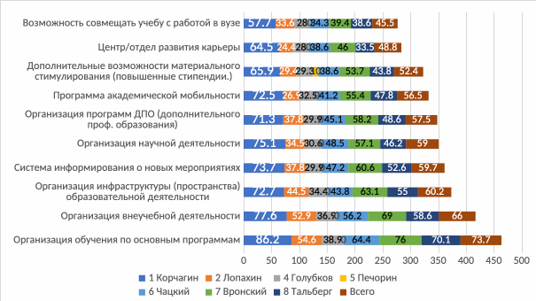
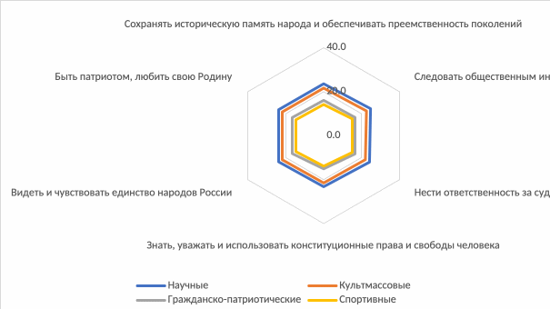
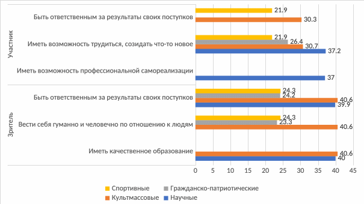
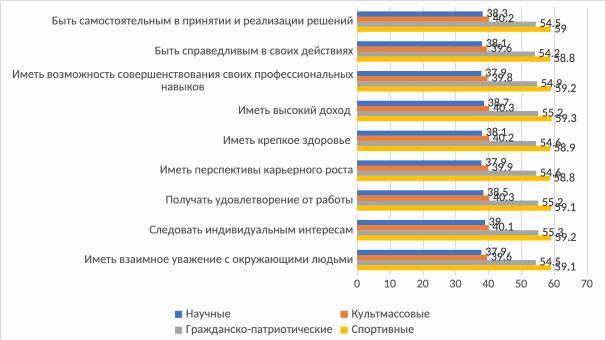

> **И. А. Газиева. Формирование профессионального потенциала молодёжи в системе высшего образования: ценностный подход** — диссертация на соискание учёной степени доктора социологических наук (5.4.4, РАНХиГС, Москва, 2025, 468 с.). Раздел: **Глава 5**.
>
> [Оглавление репозитория](README.md) · [Как цитировать](#как-цитировать-этот-текст) · [Правила для ИИ](AI-INSTRUCTIONS.md)

# Глава 5. Формирование профессионального потенциала молодёжи в системе высшего образования как социальный процесс

## **5.1 Процесс формирования профессионального потенциала студенческой молодёжи: анализ отечественного и зарубежного опыта высших учебных заведений**

Важным элементом изучения различных подходов к формированию профессионального потенциала студенческой молодёжи, безусловно, является опыт вузов, причем, как отечественных, так и зарубежных, поскольку внеучебная воспитательная работа со студентами в высшей школе «проводится с целью формирования у каждого студента сознательной гражданской позиции, стремления к сохранению и приумножению нравственных, культурных и общечеловеческих ценностей, а также выработки навыков конструктивного поведения в новых экономических условиях»[^348].

Спектр научных публикаций в открытых источниках, содержащий детальное описание опыта реализации молодёжной политики вузов по формированию профессионального потенциала студенческой молодёжи, не вполне широк, чтобы говорить о достаточном исследовательском масштабе и о возможности на их основе сделать исчерпывающие выводы. Кроме того, публикации, посвященные описанию совокупного опыта формирования именно профессионального потенциала, отсутствуют; в научном дискурсе в основном представлены публикации или о формировании социальных ценностей, или об опыте профориентации студенческой молодёжи. С целью системного исследовательского охвата вузов в рамках наших научных задач для анализа были взяты сайты вузов, поскольку именно они содержат наиболее актуальную и своевременно обновляемую информацию, касающуюся двух слагаемых изучаемого нами объекта: лежащую в плоскости изучения опыта вузов по формированию смысложизненных и профессиональных ценностей студенческой молодёжи.

Безусловно, мы отдаем себе отчет в том, что опыт вузов, представленный на их сайтах, отражает подходы и механику формирования профессионала, исходя из принятого в каждом вузе формального или неформального образа выпускника как результата образовательной деятельности, находящегося на первой ступени к становлению себя как профессионала. В этой связи, говоря об опыте вузов по формированию профессионального потенциала, мы будем обращать наиболее пристальное внимание на опыт профессионального и социального ориентирования студентов в вузовской среде.

Что касается отбора самих вузов для анализа российского опыта, то здесь мы решили прибегнуть к использованию всероссийского и международного рейтинга. Обоснуем такой подход, начав с анализа опыта российских вузов.

Сфера высшего образования в нашей стране представлена весьма широко, имеет сложную структуру, включая: федеральные университеты, национальные исследовательские университеты, региональные опорные университеты, а также университеты с особым статусом (МГУ и СПбГУ) и целый ряд иных вузов, в том числе отраслевых. В этой связи отдельной исследовательской задачей являлось определить системообразующее основание для анализа опыта вузов по формированию смысложизненных и профессиональных ценностей молодёжи. В качестве такого основания нами был взят рейтинг RAEX-100 за 2024г.[^349] и распределение мест вузов в данном рейтинге.

Поясним причину выбора основания анализа места в рейтинге вообще и выбор именно этого рейтинга, в частности. Во-первых, RAEX-100, будучи ключевым ежегодным рейтингом российских вузов, основан на трех интегральных показателях: условия для получения качественного образования, уровень востребованности выпускников работодателями, уровень научно-исследовательской деятельности. Данные показатели в свою очередь опираются на конкретные статистические и социологические данные, которые характеризуют более узкие, но важные аспекты деятельности вуза: качество образования, научную деятельность, инновации, международную репутацию, социальную ответственность, финансовые ресурсы и т.д.

Такой подход обеспечивает возможность не только выявления «лучших» российских вузов в целом и их иерархизации, но и возможность определения лучшего вуза по каждому из трех оцениваемых интегральных показателей, что дает нам возможность более пристально исследовать опыт лучших вузов по формированию смысложизненных и профессиональных ценностей, поскольку, например, такой показатель как «уровень востребованности выпускников работодателями» учитывает результаты опросов работодателей и демонстрирует, в т.ч. эффективность формирования профессиональных ценностей студентов.

Вторая причина обращения к данному рейтингу заключается в представительности и разнообразии выборки: рейтинг включает в себя вузы из разных регионов России, с разными профилями и специализациями обучения; в 2024 году в анкетировании приняли участие 186 вузов, совокупное количество респондентов превысило 130 тыс. человек.

Третья причина, по которой мы решили использовать в нашем исследовании вузы, вошедшие именно в этот рейтинг, заключается в его соответствии современным трендам: данный рейтинг учитывает инновационный потенциал вузов. Абсолютное большинство вузов, входящих в RAEX-100, являются лидерами во внедрении новых технологий и подходов в организацию образовательного процесса, они уделяют наибольшее внимание развитию программ, направленных на подготовку специалистов с инновационным мышлением, способных к адаптации к быстро меняющимся условиям работы. Именно поэтому опыт по формированию смысложизненных и профессиональных ценностей именно этих вузов наиболее четко отвечает современным вызовам развития общества.

На основе данных RAEX-100 за 2024 год были отобраны для анализа по 30 вузов из начала рейтинга и из конца. Анализ опыта вузов проводился на основе анализа их сайтов, поскольку на сегодняшний день публикация всех ключевых элементов молодёжной политики вуза, мероприятий по ее реализации, является обязательной. Перечень вузов и адресов изученных сайтов указан в приложении 6.

Необходимо отметить, что в научном дискурсе преимущественно присутствуют исследования, посвященные опыту вузов по профориентации абитуриентов[^350]. Мы же делаем акцент именно на студенческой аудитории. Так, в ходе работы с сайтами каждого вуза был произведен поиск и анализ разделов, содержащих информацию о мероприятиях по формированию социально-профессиональных установок студентов. Чаще всего такая информация находится в крупном разделе «Студентам», где наряду с официальными структурными подразделениями, деятельность которых направлена на формирование смысложизненных и профессиональных ценностей (как, например, Центры карьеры), представлены студенческие объединения, среди которых ключевыми, представленными во всех вузах, являются чаще всего, Студенческий союз / Студенческий совет, Студенческое научное общество, Спортивный клуб, Совет общежития, различные студенческие творческие и профессиональные объединения (как, например, студенческие ячейки Обществ SPIE и OPTICA (OSA) в Первом Московском государственном медицинском университете имени И.М. Сеченова). Однако мы не будем подробно останавливаться на анализе богатого опыта вузов в части организации внеучебной деятельности вообще; остановимся лишь на опыте, релевантном задачам данного исследования.

По результатам анализа информации, представленной на сайтах российских вузов, можно говорить о том, что мероприятия по формированию профессионального потенциала студенческой молодёжи можно разделить на три большие группы: «федеральные» - программы, реализация которых инициирована и контролируется субъектами молодёжной политики федерального уровня, о которых говорилось ранее; «вузовские общие» - программы и форматы, реализация которых полностью находится в ведении субъекта молодёжной политики вуза, но которые существуют в разных вузах (называются по-разному, но обладают единой смысловой нагрузкой и похожим получаемым результатом); «вузовские уникальные» - программы и форматы, существующие лишь в одном конкретном вузе. Заметим, что мероприятия всех указанных групп иногда пересекаются, на чем далее сделаны дополнительные акценты. Однако сейчас характеризуем каждую группу в отдельности.

К федеральным программам и мероприятиям, нацеленным на формирование профессионального потенциала через развитие смысложизненных и профессиональных ценностей, в первую очередь отнесем программу «Обучение служением»[^351], в которую на сегодняшний день вовлечено 415 российских вузов. С учетом того, что программа начала реализовываться лишь в прошлом, 2023 году, какие-то яркие реальные результаты на сайтах вузов не представлены, несмотря на то, что есть первые положительные результаты ее реализации, отраженные в научных статьях[^352]. Кроме того, данная программа ориентирована на полноценное встраивание в процесс обучения, а не во внеучебную деятельность, равно как и еще одна федеральная программа, реализуемая во многих российских вузах - «Стартап как диплом»[^353]. Данная программа была инициирована в 2020г. Министерством науки и высшего образования РФ, а в текущем, 2024г., в рамках программы впервые стартовал Всероссийский конкурс выпускных квалификационных работ в формате «Стартап как диплом»[^354]. Важно сказать, что обе эти программы нацелены на совокупное формирование смысложизненных и профессиональных ценностей, поскольку в их основе лежит идея выстраивания и реализации проекта, нацеленного на решение социальной проблемы; в первом случае («Обучения служением») – отрабатывая на практике практические навыки, формируемые в вузе; во втором случае («Стартам как диплом») - с использованием предпринимательского подхода.

Заметим, что до открытия этих программ во многих вузах были созданы свои акселерационные программы, бизнес-инкубаторы, которые решали задачи, заложенные в основу данных федеральных проектов. В этой связи на сегодняшний день реализация этих программ часто продолжается либо в рамках акселерационных программ, либо на площадках вузовских бизнес-инкубаторов.

Важным элементом молодёжной политики, реализуемой в вузах, но зародившемся на федеральном уровне, является деятельность крупнейшей российской молодёжной организации - Молодёжной общероссийской общественной организации «Российские Студенческие Отряды» (РСО). Данная организация ведет свою деятельность с 2004 года и формирует смысложизненные и профессиональные ценности студенческой молодёжи, обеспечивая временную трудовую занятость молодых людей в рамках деятельности следующих отраслевых отрядов: педагогических отрядов, строительных отрядов, медицинских отрядов, отрядов проводников и т.д. В каждом из изученных нами вузов действует хотя бы один из студенческих отрядов, поэтому не упомянуть об этом мы не можем. В то же время их деятельность сложно оценить как опыт вуза, поскольку роль вуза здесь заключается лишь в информировании студентов о таких возможностях и посильной административной помощи, если такая понадобится в ходе проведения студенческих активностей. Вся деятельность отраслевых отрядов координируется на уровне региональных представительств.

Безусловно, в вузах реализуется немало иных программ и мероприятий, имеющих своими инициаторами субъектов на федеральном уровне, однако, во-первых, мы о них подробно уже писали ранее; а во-вторых, для нас они представляют меньший интерес, чем инициированные и реализуемые вузами, поскольку именно при таком подходе и можно усмотреть реальный уникальный опыт. Поэтому перейдем ко второй группе мероприятий, нацеленных на формирование смысложизненных и профессиональных ценностей студентов, инициаторами которых являются сами вузы. Однако заметим, что чаще всего такие программы нацелены на формирование либо профессиональных, либо социальных ориентаций.

Так, например, к группе мероприятий по формированию ***профессиональных ориентаций*** студентов относится, в первую очередь, деятельность Центров карьеры, которые существуют во всех вузах, называясь иногда иначе. Данные структурные подразделения, отвечая, в первую очередь, за организацию учебной практики студентов, также занимаются организацией и проведением ярмарок вакансий и карьерных консультаций; стажировок и программ менторства от работодателей, направленных на подготовку к профессиональной деятельности. Во многих вузах, находящихся в топе рейтинга, особое внимание уделяется профессиональной подготовке через сотрудничество с предприятиями (например, технические вузы, МГТУ им. Н.Э. Баумана, НИЯУ МИФИ напрямую сотрудничают с АО «Микрон», с «Росатомом», ПАО «Газпром» и пр.). Нельзя не упомянуть программу федерального уровня, которая в последние годы все активнее встраивается в деятельность Центров карьеры. Речь идет о Центрах компетенций[^355], реализуемых на площадке АНО «Россия – страна возможностей», о которых мы писали ранее.

Многие вузы в рамках внеучебной деятельности по формированию профессиональных ориентаций организуют для своих студентов различные профессиональные тренинги и профессиональные мастер-классы. Так, например, в МГТУ им. Н.Э. Баумана организуется серия мастер-классов по робототехнике и по инженерной тематике. В РГГУ нефти и газа имени И.М. Губкина реализуется профориентационный проект «Навигатор успеха», который включает мастер-классы, тренинги и лекции по таким направлениям, как управление проектами, командная работа и эмоциональный интеллект. Программа помогает студентам развивать как «hard», так и «soft» навыки. РНИМУ им. Н.И. Пирогова также в рамках профориентационных мероприятий проводит программу «Первый шаг в медицину», а Первый Медицинский университет имени И.М. Сеченова совместно с Департаментом здравоохранения города Москвы с 2018 года успешно реализует образовательный проект «Школа профессионального роста», что, кстати, можно отнести к уникальному вузовскому формату мероприятий.

В вузах помимо внеучебных тренингов для студентов реализуются бесплатные Дополнительные образовательные программы повышения квалификации. В некоторых вузах они реализуются в инициативном для самих студентов порядке, например, в МГУ им.М.В. Ломоносова, МГТУ им.Н.Э. Баумана, РЭУ им.Г.В. Плеханова и др. Однако в ряде вузов такие ДПО сами являются элементами развивающих программ и мероприятий. Так, например, в РАНХиГС в рамках обучающей программы для студентов «Научный код» реализуется две образовательные программы: «Письмо для научно-публикационных целей» (для начинающих ученых), «Семь стратегий проверки письменных работ, или как научить студентов писать академически грамотно» (для научных наставников). Все эти программы, безусловно, способствуют формированию профессиональных ценностей, первичной профориентации и формированию дополнительных надпрофессиональных компетенций.

Далее отдельное внимание в рамках анализа опыта по формированию профессиональных ценностей студентов уделим большому блоку научных мероприятий, поскольку наука – тоже сфера профессиональной деятельности. Кроме того, одним из показателей RAEX-100 является «Уровень научно-исследовательской деятельности». Однако отметим, что данный показатель не имеет прямой корреляции с показателями научной студенческой активности, поскольку в расчете рейтинга, в первую очередь, учитывается уровень развития «взрослой» науки в вузе, опирающейся преимущественно на исследования в сфере точных наук, что подтверждает первая пятерка вузов в рейтинге: два госуниверситета (МГУ им. М.В. Ломоносова и Томский государственный университет) и три технических вуза (МФТИ, ИТМО, МИФИ). В этой связи нельзя говорить, что качество студенческой научной деятельности в этих вузах в разы выше, чем в других, имеющих по данному показателю рейтинг ниже.

Во всех вузах, входящих в RAEX-100, 2024, непременно существует Студенческое научное общество, являющееся ключевым организатором различного рода научных студенческих мероприятий (конференций, научных конкурсов, круглых столов и проч.), часто, включая секции, научные кружки и клубы по различным направлениям науки (например, в МГИМО Научное студенческое общество включает 44 клуба). Часто именно научные общества способствуют включению студентов в вузовские научные проекты, предоставляя им возможность публиковать результаты своих исследований в научных изданиях.

В ходе анализа сайтов первой и последней «тридцаток» вузов в RAEX-100 мы обратили внимание на то, что именно среди первых вузов значимо больше уникальных мероприятий и по профориентации, и по формированию социальных ориентаций, и, безусловно, по научной деятельности. Например, Санкт-Петербургский государственный университет (СПбГУ) реализует программу «Студенческий научный корпус», которая направлена на привлечение студентов к научной деятельности, обеспечивая им доступ к научным лабораториям, библиотечным ресурсам и консультациям со стороны опытных ученых. Московский физико-технический институт (МФТИ) реализует программу «Старт», которая, как и предыдущие программы направлена на выявление и поддержку талантливых студентов в сфере науки и технологий, отличительной чертой является то, что в рамках программы студенты участвуют в конкурсах, получают грант на развитие своих проектов и могут стать членами молодёжной академии МФТИ. В РАНХиГС третий год реализуется программа обучения для молодых исследователей «Научный код», которая нацелена на развитие научного потенциала Академии по социально-гуманитарным направлениям посредством активизации научной студенческой деятельности и формирования у студентов научноисследовательской компетенции, а также навыков научного наставничества у педагогических и научных работников структурных подразделений Академии[^356].

Благодаря последовательному вовлечению студентов в научно-исследовательскую деятельность через проведение образовательных мероприятий, обучающих основам научно-исследовательской работы, и формирование условий для апробации полученных знаний на практике путем проведения исследования совместно с научным руководителем-наставником, за три года реализации проекта значимо выросла доля студентов, использующих именно научный подход к подготовке статей. Ежегодный прирост уникальных участников проекта составляет: 30% студентов и 20% научных наставников[^357].

Кроме того, высокорейтинговые вузы являются организаторами различных уникальных, зачастую узкопрофессиональных научных конференций, как, например ежегодная Международная молодёжная научная конференция «Нефть и газ», которая проводится в РГУ нефти и газа им. И.В. Губкина (в 2025г. запланирована 79я конференция). В ходе подобных конференций начинающие ученые представляют свои научные проекты и участвуют в конкурсах. Эти мероприятия способствуют развитию и профессиональных навыков, и расширению ориентации в свой профессиональной отрасли.

Теперь вернемся к рейтингу RAEX-100 и сделаем акцент на топ-5 вузов по уровню востребованности выпускников работодателями. Отметим, мы не ставим перед собой задачу объяснить место конкретного вуза в рейтинге. Мы лишь хотим проанализировать соотношение уровня в рейтинге и объем усилий, затраченных вузом на формирование профессиональных ориентаций студентов.

Рейтинг возглавляет Московский государственный технический университет имени Н.Э. Баумана, молодёжную политику которого нельзя назвать особо активной в части формирования именно профессиональных компетенций согласно календарному плану воспитательной работы на 2024-25 год, размещенному на сайте университета[^358]. Однако если посмотреть новостную ленту, то можно увидеть высокую активность взаимодействия вуза именно с работодателями. Речь идет не только о различных практиках и стажировках, а также ознакомительных визитах студентов на предприятия, но и об интеграции корпораций в образовательный процесс.

На втором месте рейтинга находится один из старейших и престижнейших университетов России с богатой историей, высокой репутацией и позицией в международных рейтингах университетов - Московский государственный университет имени М.В. Ломоносова (МГУ). Безусловно, благодаря репутации университета, работодатели воспринимают выпускников МГУ как гарантию качества и знаний. Однако кратко описать систему работы с работодателями, равно как и опыт по формированию профессиональных ориентаций студентов МГУ, не представляется возможным, поскольку такая работа не является централизованной как во многих вузах в связи с очень четкой отграниченностью факультетов друг от друга.

Что касается Российской академии народного хозяйства и государственной службы при Президенте РФ (РАНХиГС), то здесь необходимо сделать отсылку к двум ключевым особенностям, отличающем ее от других российских вузов. Во-первых, это крупнейший вуз в стране, чьи филиалы распределены по 43 регионам России, что предполагает необходимость выстраивания эффективного взаимодействия с работодателями во всех регионах присутствия, чтобы иметь высокий совокупный рейтинг по этому показателю. Во-вторых, представители работодателей Академии в большинстве своем проходят обучение именно здесь на более высокоуровневых программах, имея возможность транслировать качество своей подготовки на качество подготовки более молодых кадрах, приходящих к ним с запросом на трудоустройство. Обе указанные особенности и определяют специфику построения работы по профессиональной ориентации студентов не только через организацию практик и стажировок, но и интеграцию работодателей в образовательный процесс, включая их вовлечение во внеучебную деятельность в ходе подготовки и реализации социальных проектов.

В Российском экономическом университете имени Г.В. Плеханова помимо уже описанных нами реализуемых во многих вузах мероприятий существует два ключевых, на наш взгляд, элемента молодёжной политики, которые можно показать как пример эффективного опыта по формированию профессиональных ценностей. Во-первых, в университете создано Студенческое бизнес-сообщество, куда вовлекаются не только студенты, но и выпускники-представители работодателей; во-вторых, в РЭУ многие годы существует один из сильнейших вузовских бизнес-инкубаторов, в рамках которого студенты разрабатывают и реализуют предпринимательские проекты, лежащие в плоскости их профессиональных интересов.

Пятое место в рейтинге в 2024 году представлено Высшей школой экономики (ВШЭ). Здесь хочется обратить внимание на то, что на сайте вуза указано достаточно немного направлений реализации молодёжной политики по сравнению с большинством вузов, однако они нацелены на решение конкретных задач не творческого или спортивного развития, а на решение конкретной задачи социально-профессионального ориентирования. Так, на сайте представлено 4 ключевых трека внеаудиторной деятельности для студентов ВШЭ: «Вышка Добра» (социальная деятельность), «Путь предпринимателя» (предпринимательская деятельность), «ГосВышка» (карьерное ориентирование в госсекторе), «Республика ученых» (научная деятельность). При изучении каждого трека в отдельности очевидным является их четка ориентированность на построение будущей карьеры выпускников ВШЭ, и включенность работодателей в каждый из этих треков.

В ходе описания специфики мероприятий по формированию профессиональных ориентаций легко обращает на себя внимание то, что все пять вузов являются уникальными в части особенностей внутренней социальной среды, в которую работодатели интегрированы таким образом, что, принимая участие в образовательном процессе, изнутри не только видят, но и сами обеспечивают качество подготовки студентов.

Такой эффект безусловно не является результатом реализации двух-трех мероприятий, это результат сложнейшей многолетней системной работы с работодателями по формированию условии долгосрочных партнерских отношений «образовательное учреждение – студент – работодатель»[^359], поскольку, как отмечено в монографии С.А. Тихониной, «*взаимодействие социальных субъектов со своей средой обусловлено двумя факторами: функциональной взаимозависимостью социальных субъектов и ценностно-нормативной системой человеческого сообщества*»[^360].

Ключевым показателем эффективности деятельности вуза в части формирования профессиональных ориентаций у его выпускников является уровень трудоустройства, который, согласно материалам Доклада, подготовленного научным коллективом ВШЭ на материалах Мониторинга трудоустройства выпускников (МТВ), реализуемого под эгидой Министерства труда и социальной защиты РФ и Федеральной службы по труду и занятости, является весьма высоким у выпускников ведущих вузов страны. Кроме того, они чаще трудоустраиваются в сфере науки и информационных технологий, в то время как выпускники остальных вузов чаще заняты в торговле и образовании — отраслях с меньшей оплатой труда.[^361]

В то же время, необходимо отделять уровень трудоустройства от его эффективности, которую можно рассматривать «как оценку достижения им (выпускником – прим. Газиевой И.А.) цели по получению работы в соответствии с полученной специальностью»[^362]. Безусловно, в ведущих технических вузах уровень трудоустройства «по специальности» является более высоким, чем в гуманитарных, поскольку по мнению современных авторов, «в современной экономике практически невозможно достичь ситуации, при которой все выпускники работали бы по полученной профессии (специальности)».[^363] В этой связи можно констатировать лишь высокую эффективность профориентационной деятельности ведущих вузов на основе уровня трудоустройства их студентов.

Теперь обратимся к опыту вузов по формированию ***социальных ориентаций студентов***. Сразу оговоримся, что таких мероприятий очень много, многие совмещены с формирование профессиональных ориентаций. В большинстве своем они представлены мероприятиями, транслируемыми федеральными субъектами, включая стройотряды, педотряды, медотряды и целый ряд иных более или менее специфических для отдельно взятых вузов направлений. Мы остановимся на двух ключевых направлениях, которые не являются федеральными, есть во всех вузах и которые наиболее фокусировано способствуют формированию и активной гражданской позиции, и смысложизненных и профессиональных ценностей студентов: волонтерская деятельность и проектная деятельность.

Несмотря на свою кажущуюся однозначность понимания, волонтерская деятельность представляет собой явление сложное, поскольку включает в себя целый ряд разных направлений, которые частично или полностью реализуются в разных российских вузах. Так, например, в ДВФУ активно развивается волонтерское движение, которое охватывает социальные, экологические, спортивные и другие направления. Такой широкий охват направлений существует практически во всех изученных нами вузах и, казалось бы, не оказывает прямого влияния на формирование смысложизненных и профессиональных ценностей студентов, что является заблуждением.

Реализация волонтерской деятельности в ряде российских вузов способствует развитию не только социальных, но и профессиональных навыков, помогая студентам приобрести опыт работы в различных сферах и развивать лидерские качества. Например, Центр поддержки волонтерского движения МГИМО, созданный как наследие XXII Олимпийских и XI Паралимпийских зимних игр в Сочи, осуществляет деятельность по профильным направлениям Университета: «Протокол», «Атташе», «Лингвистические услуги», «Взаимодействие со СМИ». В Московском государственном юридическом университете им. О.Е. Кутафина (МГЮА) работает студенческая юридическая клиника «Pro Bono». В Санкт-Петербургском горном университете (СПГУ) реализуется еще один вариант волонтерской деятельности. Здесь функционирует «Клуб интернациональной дружбы», который помогает иностранным студентам адаптироваться и интегрироваться в учебный процесс, а также организует мероприятия для межкультурного общения. Подобные клубы помогают студентам развивать и социальные навыки и расширять свои профессиональные горизонты.

Еще одним весьма эффективным направлением реализации молодёжной политики в сфере формирования профессионального потенциала студенческой молодёжи является организация проектной деятельности. Сегодня проектирование лежит в основе деятельности целого ряда акселераторов, инкубаторов и иных образовательных или конкурсных программ и площадок, нацеленных на формирование и развитие проектных компетенций в социальной сфере и в сфере предпринимательства. Многие из них обладают высокой устойчивостью за счет интегрированности и поддержки экосистемы, в качестве бонусов предлагают экспертную либо информационную поддержку проектов, иногда и официальный документ об окончании программы. Безусловно, все они имеют свои особенности[^364]. Во многих высокорейтинговых вузах существуют программы, нацеленные на поддержку социальных студенческих инициатив. Например, в Томском государственном университете реализуется конкурс социально значимых проектов обучающихся «Ректорские гранты», для участия в котором проводятся консультации по написанию грантовой заявки проекта: как эффективно подойти к разработке нового социального проекта.

Существенным достоинством подобных программ является гармоничное сочетание следующих ключевых составляющих: проектирование и оценка проектного результата, нацеленность на молодёжь и иногда всероссийский охват. Так, например, в РАНХиГС с 2012г. автором данной работы реализуется Всероссийский акселератор социальных инициатив «RAISE» - образовательная программа с конкурсной составляющей, нацеленная на формирование у студентов надпрофессиональных практических компетенций в ходе разработки и реализации проектов, направленных на решение социальных проблем своего региона и развитие гражданского общества. В рамках программы студенты под руководством кураторов из академической среды и при поддержке представителей НКО, бизнеса и органов власти на протяжении акселерационного периода выявляют актуальные проблемы своего региона, в ходе командной работы определяют оптимальное проектное решение, выявляют целевые группы, на которые будет направлено проектное воздействие и, развивая навыки предпринимательской деятельности, повышают качество и уровень жизни населения региона путем решения острых социальных проблем. На «выходе» у каждой команды Акселератора имеется один или более реализованный проект, имеющий реальные социальные и экономические эффекты. Чаще всего в Акселератор заходят команды, имеющие в своей структуре представителей разных направлений обучения, что дает им возможность отработать профессиональные навыки в ходе решения проектной социальной проблемы.

Ключевым социально-профессиональным эффектом от разработки и реализации социальных студенческих проектов является умение участников находить ключевые социальные проблемы и находить способы их решения, что значимо повышает их уровень социальной ответственности и расширяет профессиональные горизонты. Согласно нашим предыдущим исследованиям, студенты, прошедшие через подобного рода акселераторы и инкубаторы, в большинстве своем, будучи еще студентами вуза либо создают «свое дело», становясь предпринимателями, либо трудоустраиваются к партнерам проектов[^365].

Исходя из проведенного изучения опыта российских вузов по формированию профессионального потенциала студенческой молодёжи можно сделать вывод о том, что, во-первых, опыт есть и он весьма богат. Особенно это относится к вузам, находящимся в первой «тридцатке» RAEX-100, что подтверждает высокую эффективность и системность организации образовательного процесса в них. Именно в этих вузах существуют уникальные студенческие объединения, проводятся программы и различные мероприятия, отвечающие узким социально-профессиональным задачам конкретных вузов, отражая специфику ключевой отрасли трудоустройства их выпускников.

Во-вторых, нельзя не отметить большую роль государства в части формирования ряда федеральных программ и проектов, нацеленных на формирование профессионального потенциала студентов, которые, реализуясь в абсолютном большинстве вузов RAEX-100, часто являются основными или даже единственными для вузов последней «тридцатки» рейтинга. Причем, мы допускаем, что это относится и к вузам, которые не попали в топ-100 данного рейтинга.

В-третьих, в большинстве вузов представлены мероприятия, направленные либо на формирование смысложизненных ценностей (например, волонтерская деятельность), либо – профессиональных ценностей и навыков (научная деятельность, дополнительные образовательные мероприятия, в т.ч. с привлечением работодателей), что не снижает их значимости и эффективности на фоне мероприятий, полноценно формирующих профессиональный потенциал (проектная деятельность, профессиональная волонтерская деятельность).

В-четвертых, безусловно эффективным подходом в части формирования профессионального потенциала студентов является вовлечение работодателей в участие как в учебной деятельности, так и во внеучебной. Более того, наиболее эффективными в формировании профессионального потенциала являются те вузы, которые формируют единую среду взаимодействия с работодателями, когда они становятся полноценной частью образовательного пространства вуза.

Что касается ***зарубежного опыта организации молодёжной политики по формированию профессионального потенциала студентов,*** то отбирая для изучения зарубежные вузы, как и в случае с анализом отечественного опыта мы решили обратиться к рейтингу. На этот раз был использован один из наиболее признанных глобальных рейтингов университетов - QS World University Rankings[^366]. Данный рейтинг предназначен для сравнения мировых высших учебных заведений на основе оценки их деятельности по следующим критериям и показателям: «Исследования и открытия» («Академическая репутация», «Количество цитирований на одного преподавателя), «Образовательный опыт» («Соотношение студентов и преподавателей), «Возможность трудоустройства» («Репутация работодателя», «Результаты трудоустройства»), «Глобальная вовлеченность» («Соотношение иностранных студентов», «Международная исследовательская сеть», «Соотношение международных преподавателей»), «Устойчивость» («Оценка устойчивости»).

Безусловно, методология расчета данного рейтинга, как и многих других рейтингов регулярно подвергается критике, однако остается при этом наиболее востребованной, поскольку отражает, если не реальную ситуацию на мировом рынке образовательных услуг, то, по крайней мере, максимально приближенную к ней.

Для анализа лучших практик по формированию профессионального потенциала студентов были выбраны вузы, входящие топ-100 QS, сгруппированные следующим образом: вузы, входящие в «Лигу плюща» (США); вузы, входящие в «Золотой треугольник» (Великобритания); вузы, входящие в первые топ-30 QS. (см.: Приложение 7)

В ходе анализа подходов различных вузов к формированию социально-профессиональных ориентаций студентов были выделены как общие черты и подходы, так и специфические, которые представляют для нас наибольший интерес, поэтому в первую очередь более детально остановимся именно на них. Начнем наш анализ с изучения специфического опыта университетов, входящих в так называемую «Лигу плюща» (The Ivy League), включающую восемь высокорейтинговых частных университетов США, отличающихся не только высоким качеством образования, но и являющихся элитарными американскими вузами. Здесь можно выделить три ключевые основания для описания специфических подходов к формированию социально-профессиональных ориентаций студентов.

Во-первых, это *принцип построения учебного плана*. Некоторые университеты «Лиги Плюща», такие как Brown и Columbia, предлагают обучение по открытым учебным планам («The Open Curriculum»), предоставляя студентам значительную свободу в выборе учебного пути. В то же время, Harvard и Princeton, имеют более структурированный учебный план с обязательными основными курсами, которые обеспечивают общую основу. Такое различие в принципах построения учебных планов и организации обучения в соответствии с ними отражает различия в педагогической философии и желаемом уровне академической гибкости в том числе в отношении организации дальнейшего формирования профессиональных ориентаций студентов.

Во-вторых, *специфика организации научных исследований*. Безусловно, все университеты «Лиги Плюща» уделяют приоритетное внимание исследованиям, однако, некоторые из них, такие как Harvard, Yale, Princeton уделяют больше внимания исследованиям в области гуманитарных и социальных наук, в то время как, например, Cornell, Penn (Университет Пенсильвании), Columbia славятся своими инженерными и технологическими разработками. Различия в научно-исследовательской специфике влечет за собой различные исследовательские возможности, которые влияют на типы возможностей и профессионального сотрудничества, доступных студентам. Так, например, Cornell имеет давнюю репутацию в инженерных и технических областях, особенно в таких областях, как компьютерные науки, материаловедение и биоинженерия, поэтому здесь уделяется большое внимание сотрудничеству с промышленностью на основе прикладных исследований. В Пенсильванском университете (Penn), несмотря на известность Уортонской школы бизнеса (The Wharton School) также существует сильная инженерная школа, особенно в таких областях, как биоинженерия и робототехника. Упор Penn на инновации и сотрудничество с промышленностью делает его лидером в области технологий и инжиниринга. Columbia, в свою очередь, специализируется на городском развитии и технологических решениях городских проблем, поскольку располагает мощной инженерной школой, особенно в области электротехники, компьютерных наук и биомедицинской инженерии. Гарвардские инновационные лаборатории (Harvard Innovation Labs) предоставляют студентам ресурсы, наставничество и среду для совместной работы, в которой они развивают предпринимательские навыки и запускают стартап, тем самым готовя студентов к решению профессиональных задач в сфере бизнеса и инноваций. Все эти направления организации научно-образовательного процесса как раз и являют собой ключевые направления организации профессиональной ориентации студентов.

В-третьих, *атмосфера, культура и социальная ориентированность* каждого университета «Лиги Плюща», имея существенные отличия друг от друга, также влияют на социально-профессиональные ориентации студентов. Некоторые университеты, такие как Harvard, Yale и Princeton, известны своими сплоченными сообществами и сильными традициями, в то время как другие, такие как Columbia и Penn, подчеркивают свое городское расположение и разнообразие студенческого контингента. В Penn делается акцент на формировании «активной гражданской позиции», который проявляется, например, в Стипендиальной программе сообщества Боннер (The Bonner Community Scholars Program), которые поощряют студентов к участию в обучении служением и решении социальных проблем местных сообществ.

Таким образом, очевидно, что формирование социально-профессиональных ориентаций студентов в университетах «Лиги Плюща» является комплексным процессом, в котором важную роль играет как академическая традиция организации образовательного процессе, так и специфика организации внеучебной деятельности, направленные на развитие самостоятельности, профессиональной компетенции и социальной ответственности студентов.

Далее посмотрим на опыт университетов Великобритании, входящих в «Золотой треугольник», которые, как и университеты «Лиги Плюща», славятся своим академическим превосходством и широтой глобальных связей, но также имеют существенные различия в подходах к формированию социально-профессиональной ориентации студентов в зависимости от своей уникальной истории, культуры и академических достижений.

Так, формирование профессиональных ориентаций в вузах «Золотого треугольника», как и в вузах «Лиги плюща», определяется их отраслевой спецификой и преимущественно встроено в образовательный процесс. Например, The London School of Economics and Political Science (LSE) уделяет большое внимание экономике, политике и социальным наукам, а также проводит специализированные семинары по карьере, ориентированные на эти научные области, что обеспечивает целенаправленный подход к конкретным профессиональным траекториям развития студентов. Имперский колледж Лондона (Imperial College London) особое внимание уделяет областям STEM и технологиям, предлагая серию семинаров, таких как «Инновации и предпринимательство», ориентированных на начинающих предпринимателей в технологических секторах. Эта инициатива поддерживает студенческие предприятия и инновационные проекты. Посредством финансирования, наставничества и обучения она поощряет студентов развивать свои бизнес-идеи, помогая им приобрести практический опыт и предпринимательские навыки.

Важным элементом формирования социальных ориентаций студентов является их вовлечение в социальные сообщества, которое определяется, в том числе, особенностями культуры и традиций самих вузов. Например, Oxford, известный своей строгой университетской системой и историческим значением в развитии глобальной системы образования, реализует инициативы по оказанию социального воздействия, преимущественно подчеркивая непосредственное участие в решении студентами глобальных проблем, что согласуется с их учебными планами, базирующимися на социальных науках. Студенты Cambridge, который может похвастаться более непринужденной атмосферой, активно участвуют в таких программах, как Cambridge Student Community Action (CSCA), поощряющих студентов к участию в местных социальных проектах. Университетский колледж Лондона (UCL), подчеркивая свое городское окружение и связи с оживленной культурной жизнью города, ориентирует студентов на участие в инициативах в области психического здоровья и повышения благополучия местных сообществ, например, работая в Студенческой психологической службе UCL, которая занимается решением особых проблем, с которыми сталкиваются студенты городских университетов.

Таким образом, вузы «Золотого треугольника», как и вузы «Лиги плюща» также успешно интегрируют формирование профессиональных и социальных ориентаций в образовательный процесс и внеучебную деятельность, предоставляя студентам уникальные возможности для развития как профессиональных компетенций, так и формирования социальной ответственности.

Теперь обратимся к опыту остальных университетов топ-30 QS, по результатам изучения которого можно говорить о том, что в большинстве своем они крупноблочно повторяют те инициативы и подходы, которые были описаны выше. Безусловно, речь не идет о плагиате подходов и программ. Дело в том, что все, представленные выше подходы к формированию социально-профессиональных ориентаций студентов, являясь уникальными в части специфики их реализации для своих территорий, с учетом истории и культуры, методологически являются родственными таким же уникальным в реализации, но общими в целом для глобальной вузовской среды в части целевого подхода.

Так, например, Программа новых талантов в сфере ИТ (IT Emerging Talent Program»), реализуемая Мельбурнским университетом, объединяет студентов с лидерами отрасли, предлагая сетевые мероприятия, семинары и стажировки. Она направлена на повышение готовности к карьере и вовлеченности в отрасль, позволяя студентам изучать и выстраивать различные карьерные траектории. Национальный университет Сингапура (NUS) реализует систему мероприятий в рамках масштабной программы «NUS Enterprise», которая направлена на продвижение предпринимательства среди студентов посредством организации семинаров и акселераторов, а также предоставления различных возможностей финансирования стартап-идей студентов. Профориентационная идея данного проекта состоит в том, чтобы сформировать у студентов предпринимательский настрой и профессиональные навыки необходимые для достижения успеха в предпринимательской экосистеме стартапов.

Похожая программа есть и в ETH Zurich – ETH Entrepreneurship, которая направлена на превращение технических знаний в жизнеспособные бизнес-идеи, объединяющие научные круги и промышленность, и предлагает студентам не только участвовать в специализированных семинарах, но и пользоваться доступом к сети национальных предпринимателей и инвесторов. Калифорнийский университет в Беркли реализует тоже похожую «предпринимательскую» программу, но также обладающую своей спецификой - Berkeley SkyDeck. Это акселератор, который предоставляет стартапам наставничество и конкретные ресурсы. Он объединяет студентов с экосистемой технологических стартапов в Кремниевой долине, позволяя им приобрести практический опыт в области предпринимательства и инноваций.

Помимо программ, формирующих предпринимательские компетенции, в целом ряде вузов реализуются программы, ориентированные на реализацию проектов в сфере социального предпринимательства, что предполагает одновременное формирование и профессиональных, и социальных ориентаций. Специфика социального предпринимательства как раз и заключается в решении социальных проблем с использованием предпринимательского подхода.

Примерами таких программ и студенческих объединений может служить «Центр предпринимательства NTU» (Наньянский технологический университет (NTU)), который предлагает студентам целый ряд программ и различных ресурсов, которые помогают студентам выявлять социальные проблемы и потребности различных целевых аудиторий, составлять бизнес-планы и запускать стартапы, которые решают реальные социальные задачи. Университет Гонконга (HKU) реализует похожую программу, но без обязательно ориентации на использование предпринимательского подхода: «Программа служебного обучения HKU», в рамках которой студенты работают с НКО и местными сообществами над проектами, направленными на решение социальных проблем, таких как бедность, бездомность или экологическая устойчивость, сочетая академическое обучение с наращиванием практического опыта, формируя социально-профессиональные ориентации.

Очевидно, что формирование социальных ориентаций имеет больше национальной специфики, чем подходы к формированию профессиональных ориентаций, поскольку опираются на конкретные локальные социальные проблемы, имеющие, безусловно, уникальную специфику. Так, например, программа «Янь Юань» (The "Yan Yuan" Program), реализуемая в Пекинском университете, поощряет студентов к участию в общественных работах и волонтерской деятельности, направленной на формирование социальной ответственности в ходе удовлетворения общественных потребностей, таких как борьба с бедностью или защита окружающей среды. Университет PSL (Парижский университет науки и литературы) реализует программу, также нацеленную на формирование социально-профессиональных ориентаций, но уже с акцентом на формирование гражданственности. Речь идет о «Гражданской программе PSL», которая направлена на формирование у студентов знаний и навыков, необходимым для эффективного участия в жизни общества в качестве ответственных граждан. В рамках данной программы студенты участвуют в семинарах, дебатах и проектах, которые затрагивают социальные и политические проблемы, развивая критическое мышление и этическую осведомленность.

Серьезным вызовом для развития вузов, безусловно, являются глобализационные процессы, эффективное включение в которые отражаются на позициях вузов в международных рейтингах. В силу того, что глобализация является весьма широким понятием, мы определим фокус своего внимания лишь на изучении опыта вузов по формированию социальных ориентаций с учетом данной специфики.

Так, Пекинский университет активно вовлекает студентов в исследовательские и образовательные проекты, связанные с инициативой «Один пояс, один путь», способствуя межкультурному взаимопониманию и глобальной осведомленности. Студенты участвуют в семинарах, конференциях и даже программах обучения за рубежом - в странах, расположенных вдоль «Пояса и пути». Наньянский технологический университет (NTU) реализует «Программу глобального погружения NTU», которая включает широкий спектр краткосрочных программ погружения в разных странах, позволяющих студентам знакомиться с различными культурами, взаимодействовать с различными сообществами и развивать навыки межкультурного общения. Эти программы помогают студентам взглянуть на мир со стороны и расширить свой социальный кругозор. Университет Сиднея реализует «Программу глобального лидерства в Сиднее», нацеленную на формирование студентов-лидеров в глобализированном мире через участие в мероприятиях, способствующих межкультурному взаимопониманию, критическому мышлению и решению проблем, подготавливая их к будущим руководящим ролям в условиях глобализации.

Безусловно, перечислять подобные примеры можно долго, поскольку все высокорейтинговые университеты имеют программы интеграции студентов в профессиональное сообщество, социальную глобальную среду и среду местных сообществ, результатом чего является стопроцентное трудоустройство выпускников по желаемым ими профессиям на перспективные высокооплачиваемые позиции, что наряду с уровнем академической подготовки определяет удовлетворенность карьерой.[^367] Важно заметить при этом, что согласно исследованиям, уровень трудоустройства выпускников государственных и частных вузов является одинаковым.[^368] Таким образом, можно говорить о том, что по результатам анализа сайтов вузов-лидеров QS выделились и общие, и особенные подходы к реализации молодёжной политики по формированию социально-профессиональных ориентаций студентов.

В части общих подходов необходимо отметить, что в большинстве своем, высокорейтинговые зарубежные университеты не часто демонстрируют такие подходы исключительно в рамках реализации молодёжной политики, как это можно было увидеть в ходе анализа опыта российских вузов. В частности, ключевые подходы по формированию социально-профессиональных ориентаций в целом *интегрированы в образовательный процесс и организацию серьезных научных исследований,* на чем делается акцент в докладе о тенденциях развития высшего образования, опубликованном в 2023 году одной из крупнейших Международных консалтинговых компаний по менеджменту  [Arthur D. Little[^369].](https://www.adlittle.com/en) Важным акцентом в профориентационной работе многих высокорейтинговых вузов является обучение и организация исследовательской деятельности в тесном взаимодействии с отраслевыми работодателями. Часто такое взаимодействие основано на включенности в прикладные научные исследования.

Также к общим характеристикам, объединяющим, пожалуй, все высокорейтинговые вузы по версии QS, *относятся эффективные карьерные службы,* практики функционирования которых чаще всего подвергаются научному анализу[^370]. Так, во всех высокорейтинговых университетах, включая университеты «Лиги Плюща» и «Золотого треугольника», есть специализированные отделы карьерных служб (как в российских вузах – Центры карьеры), которые предлагают студентам широкий спектр ресурсов, включая консультации по вопросам карьеры, семинары по поиску работы, возможности для налаживания контактов и помощь в трудоустройстве на стажировку. Многие службы ориентированы на «построение персонализированной модели профориентации»[^371]. Они стремятся познакомить студентов с ведущими работодателями и наделить их навыками и уверенностью, необходимыми для достижения успеха в выбранной ими области. Некоторые карьерные службы, как и в российских вузах, предлагают своим студентам принять участие в программах повышения квалификации.

Университеты-лидеры QS всячески поощряют *формирование международного социально-профессионального опыта* у своих студентов. Они предлагают обширные программы обучения за рубежом, партнерские отношения с международными институтами и возможности для глобального исследовательского сотрудничества. Это стремление к глобальному участию направлено на расширение кругозора студентов, повышение их культурной компетентности и подготовку их к жизни во взаимосвязанном мире.

Одним из ключевых направлений формирования профессионального потенциала студентов является их *включение в различные социальные и профессиональные сообщества, делая упор на формирование гражданской ответственности и повышение социальной вовлеченности в жизнь местных сообществ.* Результаты ряда исследований говорят о том, что «Обучение служением» - в российской практике, т.е., по сути, Capability Approach, Community service-learning (CSL)[^372] – в зарубежной практике, «обладает потенциалом для улучшения навыков трудоустройства выпускников, одновременно развивая человеческие способности»,[^373] поэтому в ходе формирования смысложизненных ценностей вузы предлагают программы обучения в сфере социального обслуживания и служения, обеспечивают реализацию волонтерской деятельности и поддерживают студенческие инициативы, которые поощряют студентов вносить свой вклад в развитие местных сообществ и решать насущные социальные проблемы.

На основе проведенной систематизации опыта высокорейтинговых российских и зарубежных вузов по формированию профессионального потенциала студентов можно выделить как их общие, так и отличные черты.

Ключевое отличие опыта отечественных вузов по формированию профессионального потенциала студентов связано, пожалуй, со структурой и особенностями функционирования субъекта российской молодёжной политики на федеральном уровне и его включенностью в деятельность вузов через реализацию федеральных программ. Необходимо подчеркнуть, что такой подход, во-первых, помогает систематизировать организацию деятельности по формированию профессионального потенциала студентов и каждого вуза в отдельности, и всей вузовской системы; во-вторых, дает возможность выстраивания горизонтальных связей между сообществами студентов, реализующих на уровне вузов федеральные проекты или участвующих в них. Кроме того, исследование показывает значимую роль государства в формировании профессионального потенциала студентов через федеральные программы и проекты, особенно для вузов, не входящих в топ-100 рейтинга.

Заметим, что высокорейтинговые российские вузы помимо «обязательных» федеральных программ и проектов реализуют немалое число различных дополнительных, уникальных программ, отвечающих лишь их индивидуальной специфике. В этом они во многом схожи с высокорейтинговыми зарубежными вузами, где основа формирования профессионального потенциала студентов закладывается именно с опорой на отраслевую, историческую и культурную специфику каждого отдельного вуза.

Еще одной характеристикой, объединяющей высокорейтинговые российские и зарубежные вузы в части их практики формирования профессионального потенциала студентов является серьезный акцент на интеграцию студентов в научные исследования. В зарубежных вузах, особенно из числа «Лиги плюща» и «Золотого треугольника», формирование социально-профессиональных ориентаций студентов тесно связано с их участием в прикладных научных исследованиях во взаимодействии с отраслевыми работодателями. Такой опыт имеет место и в практике ряда высокорейтинговых российских вузов (топ-30 RAEX), обеспечивая им высокие места во всероссийском рейтинге вузов, что говорит об эффективности подобной практики.

Здесь нельзя не упомянуть большую роль, которая отводится крупным работодателям в формировании профессиональных ценностей. Их интегрированность в организацию образовательного процесса и внеучебной деятельности настолько велика в высокорейтинговых вузах, что они становятся полноценными субъектами социально-профессиональной среды вуза.

Важным направлением деятельности вузов по формированию социально-профессиональных ценностей и ориентаций является интеграция студентов в социальные и профессиональные сообщества в ходе реализации социальной, предпринимательской или социально-предпринимательской проектной деятельности: через программы «Обучение служением» и подобные ей - в российских вузах, а также через похожие зарубежные программы (Capability Approach, Community service-learning), которые способствуют развитию гражданской ответственности и социальной вовлеченности, а также повышают навыки трудоустройства и профессиональной осознанности, а в целом – эффективно формирую профессиональный потенциал студенческой молодёжи.

Достаточно эффективной практикой формирования профессионального потенциала студентов как в зарубежных, так и в отечественных вузах является функционирование Карьерных служб/ Центров карьеры. Однако, при единых целях деятельности, подходы к ее реализации у отечественных и зарубежных центров карьеры различаются. Так, например, деятельность зарубежных центров карьеры сфокусирована на персонализированном подход к работе со студентами, предлагая индивидуальные консультации по профессиональному и карьерному ориентированию, помощь в подборе стажировки или трудоустройстве, организуя семинары, ориентированные на развитие навыков самопрезентации, коммуникации и лидерства. Российские вузовские центры карьеры чаще используют более формализованные подходы, прибегая к организации массовых карьерно-ориентированных мероприятий (Ярмарка карьеры, различные карьерные форумы и т.д.; семинары и тренинги по написанию резюме и подготовке к собеседованию), не всегда предлагая глубокую индивидуальную поддержку. Подобный подход не способствует эффективному формированию профессиональных ориентаций и ценностей.

Что же касается отличительных черт, то ключевыми здесь являются две.

Во-первых, зарубежные высокорейтинговые университеты активно поощряют развитие международного социально-профессионального опыта студентов через программы обучения за рубежом, партнерские отношения с международными институтами и возможности для глобального исследовательского сотрудничества. В этой связи и их Центры карьеры часто предлагают услуги по поиску работы за рубежом, а также информацию о стипендиях и программах международного сотрудничества. Что касается России, то здесь традиционно глобальные перспективы для выпускников менее распространены, хотя, безусловно, все высокорейтинговые вузы имеют зарубежных партнеров в вузовской и партнерской среде.

Во-вторых, высокорейтинговые зарубежные университеты активно интегрируют работу по формированию социально-профессиональных ориентаций в образовательный процесс, в отличие от российских вузов, где молодёжная политика реализуется отдельным блоком, координируясь комплексом разрозненных субъектов на федеральном и региональном уровнях.

Исходя из проведенного анализа опыта высокорейтинговых отечественных и зарубежных вузов по формированию профессионального потенциала студенческой молодёжи можно говорить о его многогранности, обеспечивающейся различными подходами. В зарубежных высокорейтинговых вузах формирование социально-профессиональных ориентаций студентов является неотъемлемой частью образовательного процесса, тесно связанной с научными исследованиями, практикой и глобальным участием. В российских вузах формирование профессионального потенциала студентов координируется различными субъектами на федеральном и региональном уровнях, реализуясь на уровне вуза во взаимодействии с работодателями.

## **5.2 Анализ условий формирования профессионального потенциала молодёжи в системе высшего образования: ценностный подход**

С целью определения влияния различных условий формирования профессионального потенциала студентов, выделенных нами на основе результатов анализа опыта вузов, представителями разных типологических групп в факторном пространстве профессионального потенциала, приведенных нами ранее, обратимся ко второму, проведенному автором социологическому исследованию, по результатам которого была совершена корректировка эмпирической модели анализа профессионального потенциала студенческой молодежи[^374]. В результате факторизации нового массива данных удалось добиться полного распределения всех ценностей по полученным факторам. Важно заметить, что в целом содержание факторов осталось тем же (ни одна ценность не «перешла» из фактора, в котором она оказалась по результатам предыдущей диагностики, в новый фактор), за исключением добавившихся в них новых ценностей.

Несмотря на то, что выделенные нами ранее типологические группы, на которые мы опираемся в данном параграфе, содержательно не подверглись изменениям, прежде чем приступить к решению обозначенной нами в данном разделе задачи, необходимым является продемонстрировать и вкратце прокомментировать результаты факторного и кластерного анализа данных нового социологического исследования.

Согласно результатам факторного анализа, представленного в таблице 5.1, получены три фактора, в которые распределились те же терминальные и инструментальные ценности студенческой молодёжи, составляющие основу ее профессионального потенциала по результатам предыдущего исследования.

Таблица 5.1

Распределение ценностей и факторных весов их элементов по факторам

<table style="width:100%;">
<colgroup>
<col style="width: 65%" />
<col style="width: 8%" />
<col style="width: 8%" />
<col style="width: 8%" />
<col style="width: 8%" />
</colgroup>
<thead>
<tr>
<th rowspan="2" style="text-align: center;"> 
<strong>Ценности</strong></th>
<th colspan="4" style="text-align: center;">Факторные веса элементов ценностей</th>
</tr>
<tr>
<th style="text-align: center;"><strong>1</strong></th>
<th style="text-align: center;"><strong>2</strong></th>
<th style="text-align: center;"><strong>3</strong></th>
<th style="text-align: center;"><strong>4</strong></th>
</tr>
</thead>
<tbody>
<tr>
<td colspan="5" style="text-align: center;"><strong>Фактор 1: ценности профессионального самоопределения</strong></td>
</tr>
<tr>
<td style="text-align: center;"><em>Терминальные ценности</em></td>
<td style="text-align: center;"></td>
<td style="text-align: center;"></td>
<td style="text-align: center;"></td>
<td style="text-align: center;"></td>
</tr>
<tr>
<td style="text-align: center;"><ol start="27" type="1">
<li>
Профессиональный опыт
</li>
</ol></td>
<td style="text-align: center;">0,598</td>
<td style="text-align: center;">0,465</td>
<td style="text-align: center;">0,648</td>
<td style="text-align: center;">0,537</td>
</tr>
<tr>
<td style="text-align: center;"><ol start="28" type="1">
<li>
Развитие
</li>
</ol></td>
<td style="text-align: center;">0,575</td>
<td style="text-align: center;">0,627</td>
<td style="text-align: center;">0,748</td>
<td style="text-align: center;">0,478</td>
</tr>
<tr>
<td style="text-align: center;"><ol start="29" type="1">
<li>
Самореализация
</li>
</ol></td>
<td style="text-align: center;">0,666</td>
<td style="text-align: center;">0,686</td>
<td style="text-align: center;">0,712</td>
<td style="text-align: center;">0,585</td>
</tr>
<tr>
<td style="text-align: center;"><ol start="30" type="1">
<li>
Права и свободы человека
</li>
</ol></td>
<td style="text-align: center;">0,691</td>
<td style="text-align: center;">0,557</td>
<td style="text-align: center;">0,582</td>
<td style="text-align: center;">0,538</td>
</tr>
<tr>
<td style="text-align: center;"><ol start="31" type="1">
<li>
<em><strong>Здоровье</strong></em>
</li>
</ol></td>
<td style="text-align: center;">0,463</td>
<td style="text-align: center;">0,499</td>
<td style="text-align: center;">0,387</td>
<td style="text-align: center;">0,431</td>
</tr>
<tr>
<td style="text-align: center;"><em>Инструментальные ценности</em></td>
<td style="text-align: center;"></td>
<td style="text-align: center;"></td>
<td style="text-align: center;"></td>
<td style="text-align: center;"></td>
</tr>
<tr>
<td style="text-align: center;"><ol start="32" type="1">
<li>
Ответственность
</li>
</ol></td>
<td style="text-align: center;">0,578</td>
<td style="text-align: center;">0,683</td>
<td style="text-align: center;"><em>0,743</em></td>
<td style="text-align: center;">0,677</td>
</tr>
<tr>
<td style="text-align: center;"><ol start="33" type="1">
<li>
Справедливость
</li>
</ol></td>
<td style="text-align: center;">0,422</td>
<td style="text-align: center;">0,719</td>
<td style="text-align: center;">0,454</td>
<td style="text-align: center;">0,579</td>
</tr>
<tr>
<td style="text-align: center;"><ol start="34" type="1">
<li>
Достоинство и взаимоуважение
</li>
</ol></td>
<td style="text-align: center;">0,554</td>
<td style="text-align: center;">0,527</td>
<td style="text-align: center;">0,622</td>
<td style="text-align: center;">0,657</td>
</tr>
<tr>
<td colspan="5" style="text-align: center;"><strong>Фактор 2: бытийные смысложизненные ценности</strong></td>
</tr>
<tr>
<td style="text-align: center;"><em>Терминальные ценности</em></td>
<td style="text-align: center;"></td>
<td style="text-align: center;"></td>
<td style="text-align: center;"></td>
<td style="text-align: center;"></td>
</tr>
<tr>
<td style="text-align: center;"><ol start="35" type="1">
<li>
Созидательный труд и Коллективизм
</li>
</ol></td>
<td style="text-align: center;">0,420</td>
<td style="text-align: center;">0,460</td>
<td style="text-align: center;">0,511</td>
<td style="text-align: center;">0,511</td>
</tr>
<tr>
<td style="text-align: center;"><em>Инструментальные ценности</em></td>
<td style="text-align: center;"></td>
<td style="text-align: center;"></td>
<td style="text-align: center;"></td>
<td style="text-align: center;"></td>
</tr>
<tr>
<td style="text-align: center;"><ol start="36" type="1">
<li>
<em><strong>Гуманизм</strong></em>
</li>
</ol></td>
<td style="text-align: center;">0,440</td>
<td style="text-align: center;">0,452</td>
<td style="text-align: center;">0,457</td>
<td style="text-align: center;">0,425</td>
</tr>
<tr>
<td style="text-align: center;"><ol start="37" type="1">
<li>
<em><strong>Взаимопомощь</strong></em>
</li>
</ol></td>
<td style="text-align: center;">0,505</td>
<td style="text-align: center;">0,355</td>
<td style="text-align: center;">0,519</td>
<td style="text-align: center;">0,508</td>
</tr>
<tr>
<td style="text-align: center;"><ol start="38" type="1">
<li>
Милосердие
</li>
</ol></td>
<td style="text-align: center;">0,672</td>
<td style="text-align: center;">0,693</td>
<td style="text-align: center;">0,731</td>
<td style="text-align: center;">0,741</td>
</tr>
<tr>
<td style="text-align: center;"><ol start="39" type="1">
<li>
<em><strong>Приоритет духовного над материальным</strong></em>
</li>
</ol></td>
<td style="text-align: center;">0,646</td>
<td style="text-align: center;">0,728</td>
<td style="text-align: center;">0,709</td>
<td style="text-align: center;">0,738</td>
</tr>
<tr>
<td colspan="5" style="text-align: center;"><strong>Фактор 3: ценности гражданского общества</strong></td>
</tr>
<tr>
<td style="text-align: center;"><em>Терминальные ценности</em></td>
<td style="text-align: center;"></td>
<td style="text-align: center;"></td>
<td style="text-align: center;"></td>
<td style="text-align: center;"></td>
</tr>
<tr>
<td style="text-align: center;"><ol start="40" type="1">
<li>
Патриотизм и гражданственность
</li>
</ol></td>
<td style="text-align: center;">0,707</td>
<td style="text-align: center;">0,723</td>
<td style="text-align: center;">0,613</td>
<td style="text-align: center;">0,609</td>
</tr>
<tr>
<td style="text-align: center;"><ol start="41" type="1">
<li>
Единство народов России
</li>
</ol></td>
<td style="text-align: center;">0,506</td>
<td style="text-align: center;">0,684</td>
<td style="text-align: center;">0,580</td>
<td style="text-align: center;">0,456</td>
</tr>
<tr>
<td style="text-align: center;"><ol start="42" type="1">
<li>
Семья
</li>
</ol></td>
<td style="text-align: center;">0,660</td>
<td style="text-align: center;">0,693</td>
<td style="text-align: center;">0,637</td>
<td style="text-align: center;">0,625</td>
</tr>
<tr>
<td style="text-align: center;"><ol start="43" type="1">
<li>
<strong>Жизнь</strong>
</li>
</ol></td>
<td style="text-align: center;">0,473</td>
<td style="text-align: center;">0,476</td>
<td style="text-align: center;">0,359</td>
<td style="text-align: center;">0,431</td>
</tr>
<tr>
<td style="text-align: center;"><em>Инструментальные ценности</em></td>
<td style="text-align: center;"></td>
<td style="text-align: center;"></td>
<td style="text-align: center;"></td>
<td style="text-align: center;"></td>
</tr>
<tr>
<td style="text-align: center;"><ol start="44" type="1">
<li>
Служение Отечеству и ответственность за его судьбу
</li>
</ol></td>
<td style="text-align: center;">0,556</td>
<td style="text-align: center;">0,672</td>
<td style="text-align: center;">0,621</td>
<td style="text-align: center;">0,515</td>
</tr>
<tr>
<td style="text-align: center;"><ol start="45" type="1">
<li>
Преемственность поколений
</li>
</ol></td>
<td style="text-align: center;">0,692</td>
<td style="text-align: center;">0,737</td>
<td style="text-align: center;">0,719</td>
<td style="text-align: center;">0,611</td>
</tr>
<tr>
<td style="text-align: center;"><ol start="46" type="1">
<li>
Историческая память
</li>
</ol></td>
<td style="text-align: center;">0,662</td>
<td style="text-align: center;">0,651</td>
<td style="text-align: center;">0,552</td>
<td style="text-align: center;">0,380</td>
</tr>
</tbody>
</table>

В первый фактор, ценностей профессионального самоопределения, дополнительно вошла ценность здоровья, которая не вошла ни в один фактор в ходе предыдущего исследования. В нашем более раннем исследовании было использовано немалое количество индикаторов для оценки восприятия данной ценности в среде студенческой молодёжи, которое в текущем исследовании было решено сократить, поскольку изучение данной ценности, как и многих других, являет собой отдельное исследовательское направление. Исследователи, анализируя представления студенческой молодёжи о здоровье и здоровом образе жизни, выделяют самые разные механизмы поддержания здоровья по мнению студентов: от «активного образа жизни и поддержания режима дня»[^375] до комплексного подхода к соблюдению ЗОЖ[^376]. Однако подход, предлагаемый в нашей работе, дает нам возможность смотреть на формирование профессионального потенциала студентов более комплексно: с позиции ориентации респондентов на всестороннее самосовершенствование, как социально-профессиональное, так и физическое.

Во второй фактор - бытийных смысложизненных ценностей, дополнительно вошли ценности гуманизма и взаимопомощи, а также ценность, индикаторы которой мы не включали в предыдущий социологический инструментарий, «приоритет духовного над материальным», что вполне гармонично вписывается в содержание данного фактора.

В третий фактор, ценностей гражданского общества, вошла ценность жизни несмотря на то, что данная ценность зачастую идет «в паре» с ценностью здоровья, поскольку «здоровье является положительной основой для проявления полноты человеческой жизни для того, чтобы человек ощутил радость и наслаждение от проявления своих жизненных сил»[^377]. В тоже время нахождение данных ценностей в разных факторах не вызывает недоумения, поскольку предлагая респондентам оценить свое отношение к различным индикаторам данной ценности, мы предлагали суждения, касающиеся, не только их самих, а их отношения к жизни как ценности вообще, для себя и для общества.

Исходя из приведенных результатов факторного анализа можно сделать вывод о том, что, во-первых, социологический инструментарий скорректирован логично, а во-вторых, проведение следующих этапов статистического анализа массива данных, полученного в ходе нового социологического исследования, может вполне опираться на результаты предыдущего исследования. В первую очередь, безусловно, говоря о выделении описанных трех факторов.

Следующим этапом статистического анализа полученного массива данных социологического исследования было осуществление кластерного анализа, в результате которого выделились типологические группы, содержательно идентичные тем, что были получены в предыдущем исследовании. Исключение составляет лишь выявление одной типологической группы, которая ранее нами была описана не на основе статистических данных, поскольку она не выделилась в ходе кластерного анализа; она была описана в логике характеристик своего места в трехфакторном пространстве. Однако в данном исследовании такая группа статистически представлена – она характеризует респондентов, идентичных в своих ценностно-профессиональных характеристиках Сергею Голубкову (типологическая группа 4).

Мы соотнесли результаты кластерного анализа и типологические группы респондентов в трехфакторном пространстве (См.: Таблица 5.2). Здесь обращает на себя внимание не только то, что стала статистически заметной четвертая типологическая группа (Сергей Голубков), но и то, что почти все типологические группы сохранили свои объемы (с учетом выделившейся новой группы). Такое распределение дает нам возможность продолжить анализ результатов нового исследования, основываясь на ранее сформированных и описанных нами типологиях.

Таблица 5.2

**Распределение кластеров / типологических групп респондентов в пространстве трех факторов**

<table style="width:99%;">
<colgroup>
<col style="width: 20%" />
<col style="width: 12%" />
<col style="width: 11%" />
<col style="width: 11%" />
<col style="width: 11%" />
<col style="width: 11%" />
<col style="width: 11%" />
<col style="width: 10%" />
</colgroup>
<thead>
<tr>
<th></th>
<th colspan="7" style="text-align: center;"><strong>Кластеры / типологические группы</strong></th>
</tr>
</thead>
<tbody>
<tr>
<td><strong>Номера и объемы кластеров:</strong></td>
<td style="text-align: center;">
<strong>Кл. 1</strong>

<strong>(19,4%)</strong>
</td>
<td style="text-align: center;">
<strong>Кл.2</strong>

<strong>(8,1 %)</strong>
</td>
<td style="text-align: center;"><strong>Кл.3 (13,0%)</strong></td>
<td style="text-align: center;">
<strong>Кл.4</strong>

<strong>(9,0%)</strong>
</td>
<td style="text-align: center;">
<strong>Кл.5</strong>

<strong>(4,0%)</strong>
</td>
<td style="text-align: center;">
<strong>Кл.6</strong>

<strong>(38,5%)</strong>
</td>
<td style="text-align: center;">
<strong>Кл.7</strong>

<strong>(8%)</strong>
</td>
</tr>
<tr>
<td><em><strong>Номера и названия типологических групп:</strong></em></td>
<td style="text-align: center;"><em><strong>Вронский (7)</strong></em></td>
<td style="text-align: center;"><em><strong>Голубков (4)</strong></em></td>
<td style="text-align: center;"><em><strong>Тальберг (8)</strong></em></td>
<td style="text-align: center;"><em><strong>Лопахин (2)</strong></em></td>
<td style="text-align: center;"><em><strong>Печорин (5)</strong></em></td>
<td style="text-align: center;"><em><strong>Корчагин (1)</strong></em></td>
<td style="text-align: center;"><em><strong>Чацкий (6)</strong></em></td>
</tr>
<tr>
<td></td>
<td colspan="7" style="text-align: center;"><strong>Координаты кластеров</strong></td>
</tr>
<tr>
<td>Фактор 1</td>
<td style="text-align: right;">0,4</td>
<td style="text-align: right;">-2,1</td>
<td style="text-align: right;">0,7</td>
<td style="text-align: right;">0,4</td>
<td style="text-align: right;">-5,2</td>
<td style="text-align: right;">0,3</td>
<td style="text-align: right;">-0,9</td>
</tr>
<tr>
<td>Фактор 2</td>
<td style="text-align: right;">-1,3</td>
<td style="text-align: right;">0,4</td>
<td style="text-align: right;">-0,8</td>
<td style="text-align: right;">0,3</td>
<td style="text-align: right;">-0,5</td>
<td style="text-align: right;">0,7</td>
<td style="text-align: right;">-0,6</td>
</tr>
<tr>
<td>Фактор 3</td>
<td style="text-align: right;">0,7</td>
<td style="text-align: right;">-0,4</td>
<td style="text-align: right;">-0,9</td>
<td style="text-align: right;">-2,6</td>
<td style="text-align: right;">-2,0</td>
<td style="text-align: right;">0,4</td>
<td style="text-align: right;">0,4</td>
</tr>
</tbody>
</table>

Первое, что необходимо сделать, благодаря новым социологическим данным, это дать дополнительные характеристики полученным типологическим группам. Так, таблицы 5.2 и 5.3 открывают для нас изначальную мотивационную основу поступления респондентов в свой вуз, которая заметно различается у представителей разных типологических групп.

Как можно увидеть из таблицы 5.2, абсолютное большинство респондентов, находящихся в типологической группе «Корчагин», полностью разделяющие ценности, вошедшие во все три группы факторов, с большой долей вероятности будут трудоустроены по получаемой в вузе специальности (согласны или скорее согласны с утверждением – 81,2%). Несколько меньше, но все же немало представителей групп «Вронский», «Тальберг», Чацкий» также выражают согласие с данным тезисом (согласны или скорее согласны с утверждением – 73,2%; 68,1% и 66,1%, соответственно). Заметим, что все они не разделяют бытийные смысложизненные ценности, ориентируясь при этом на профессиональное развитие («Вронский» и «Тальберг»), а значит с большой вероятностью в будущем будут претендовать на высокие должности. Меньше всего согласий с планами на трудоустройство по специальности у представителей групп «Лопахин» и «Голубков» (согласны или скорее согласны с утверждением – 54,8% и 45,9%, соответственно). Обе эти группы также объединяет то, что они, по-разному относясь к перспективам профессионального развития, одинаково не разделяют ценности гражданского общества, разделяя при этом бытийные смысложизненные ценности.

Таблица 5.3

**Распределение согласий респондентов разных типологических групп с утверждением:**

**«Я учусь по специальности, по которой планирую работать», %**

|  |  |  |  |  |  |  |  |  |
|:--:|:--:|:--:|:--:|:--:|:--:|:--:|:--:|:--:|
|  | **1 Корчагин** | **2 Лопахин** | **4 Голубков** | **5 Печорин** | **6 Чацкий** | **7 Вронский** | **8 Тальберг** | **Всего** |
| 1 Полностью не согласен | 2,4 | 12,1 | 2,5 | 40,0 | 3,4 | 5,2 | 6,8 | 4,2 |
| 2 | 4,0 | 9,6 | 14,0 | 30,0 | 8,2 | 5,9 | 5,6 | 6,2 |
| 3 Согласен наполовину | 12,3 | 23,5 | 37,6 | 20,0 | 22,3 | 15,7 | 19,5 | 17,8 |
| 4 | 24,9 | 21 | 30,6 | 0,0 | 30,9 | 29,6 | 28,7 | 26,9 |
| 5 Полностью согласен | 56,3 | 33,8 | 15,3 | 10,0 | 35,2 | 43,6 | 39,4 | 45,0 |
| Всего | 100,0 | 100,0 | 100,0 | 100,0 | 100,0 | 100,0 | 100,0 | 100,0 |

Безусловно, обращает на себя внимание то, что меньше всего респондентов, мотивированных на трудоустройство по специальности, находится в группе «Печорин», что, возможно, объясняется несогласием с суждением, отраженным в таблице 5.4. Лишь 10% респондентов данной группы готовы работать по специальности и эти же 10% подтверждают самостоятельный выбор этой специальности, что демонстрирует прямую связь мотивации на трудоустройство по специальности от самостоятельности ее выбора.

Что же касается мнения респондентов других групп относительно самостоятельности выбора специальности обучения, то все они почти в равной мере подтверждают этот выбор. Некоторым исключением являются, пожалуй, лишь респонденты, входящие в типологическую группу «Голубков» (согласны или скорее согласны с утверждением – 63,7%), которые не разделяют и ценности профессионального самоопределения, и ценности гражданского общества и более всех выражают сомнение относительно решения о выборе специальности обучения. Заметим, что представители типологической группы «Голубков» по всем вопросам выражают наименее высокую степень согласия с теми или иными суждениями.

Таблица 5.4

**Распределение согласий респондентов разных типологических групп с утверждением: «Специальность, по которой я обучаюсь - это мой самостоятельный выбор», %**

|  |  |  |  |  |  |  |  |  |
|:--:|:--:|:--:|:--:|:--:|:--:|:--:|:--:|:--:|
|  | **1 Корчагин** | **2 Лопахин** | **4 Голубков** | **5 Печорин** | **6 Чацкий** | **7 Вронский** | **8 Тальберг** | **Всего** |
| 1 Полностью не согласен | 1,0 | 2,5 | 3,2 | 40,0 | 2,6 | 0,7 | 1,2 | 1,7 |
| 2 | 1,8 | 2,5 | 5,1 | 30,0 | 5,2 | 4,2 | 2,0 | 3,1 |
| 3 Согласен наполовину | 4,3 | 8,4 | 28,0 | 20,0 | 14,6 | 6,6 | 8,0 | 8,6 |
| 4 | 13,9 | 14,3 | 38,2 | 0,0 | 27,5 | 12,2 | 16,3 | 17,5 |
| 5 Полностью согласен | 78,9 | 72,3 | 25,5 | 10,0 | 50,2 | 76,3 | 72,5 | 69,1 |
| Всего | 100,0 | 100,0 | 100,0 | 100,0 | 100,0 | 100,0 | 100,0 | 100,0 |

Анализ самооценок респондентов разных типологических групп их уровня владения базовыми знаниями по получаемой специальности (таблица 5.4) наглядно демонстрирует нам роль следования ценностям профессионального самоопределения в ходе обучения. Несмотря на то, что в среднем респонденты всех групп оценивают свои знания недостаточно высоко, представители именно типологических групп, чьи респонденты разделяют ценности профессионального самоопределения, оценивают свое владение базовыми знаниями почти одинаково и выше других. Наибольшее количество положительных оценок традиционно выставлено респондентами первой группы («Корчагин»): оценивают себя высоко или скорее высоко около половины респондентов – 43,5%. Три другие группы демонстрируют идентичные оценки: оценивают себя высоко или скорее высоко более трети респондентов – 36,1% («Лопахин»), 35,9% («Вронский»), 34,7% («Тальберг»). Значимо ниже самооценка респондентов, входящих в группы, находящиеся в зоне отрицательных значений фактора профессионального самоопределения: 28,4% - «Чацкий», 25,5% - «Голубков», 10% - «Печорин».

Таблица 5.5

**Распределение самооценок респондентов разных типологических групп их уровня владения базовыми знаниями по получаемой специальности, %**

<table>
<colgroup>
<col style="width: 15%" />
<col style="width: 11%" />
<col style="width: 11%" />
<col style="width: 12%" />
<col style="width: 10%" />
<col style="width: 9%" />
<col style="width: 11%" />
<col style="width: 11%" />
<col style="width: 6%" />
</colgroup>
<thead>
<tr>
<th style="text-align: center;"></th>
<th style="text-align: center;">
<strong>1</strong>

<strong>Корчагин</strong>
</th>
<th style="text-align: center;"><strong>2 Лопахин</strong></th>
<th style="text-align: center;"><strong>4 Голубков</strong></th>
<th style="text-align: center;"><strong>5 Печорин</strong></th>
<th style="text-align: center;"><strong>6 Чацкий</strong></th>
<th style="text-align: center;"><strong>7 Вронский</strong></th>
<th style="text-align: center;"><strong>8 Тальберг</strong></th>
<th style="text-align: center;"><strong>Всего</strong></th>
</tr>
</thead>
<tbody>
<tr>
<td>1 Низкий уровень</td>
<td>1,0</td>
<td>6,7</td>
<td>3,8</td>
<td>20,0</td>
<td>1,7</td>
<td>2,4</td>
<td>1,6</td>
<td>2,1</td>
</tr>
<tr>
<td>2 Скорее низкий уровень</td>
<td>9,0</td>
<td>14,3</td>
<td>14,0</td>
<td>30,0</td>
<td>12,0</td>
<td>9,1</td>
<td>12,7</td>
<td>10,7</td>
</tr>
<tr>
<td>3 Средний уровень</td>
<td>43,3</td>
<td>40,3</td>
<td>51,0</td>
<td>20,0</td>
<td>54,1</td>
<td>48,4</td>
<td>47,0</td>
<td>46,2</td>
</tr>
<tr>
<td>4 Скорее высокий уровень</td>
<td>28,2</td>
<td>29,4</td>
<td>21,0</td>
<td>10,0</td>
<td>23,2</td>
<td>24,4</td>
<td>26,7</td>
<td>26,2</td>
</tr>
<tr>
<td>5 Высокий уровень</td>
<td>15,3</td>
<td>6,7</td>
<td>4,5</td>
<td>0</td>
<td>5,2</td>
<td>11,5</td>
<td>8,0</td>
<td>11,1</td>
</tr>
<tr>
<td>6 Затрудняюсь ответить</td>
<td>3,1</td>
<td>2,5</td>
<td>5,7</td>
<td>20,0</td>
<td>3,9</td>
<td>4,2</td>
<td>4,0</td>
<td>3,7</td>
</tr>
<tr>
<td>Всего</td>
<td>100,0</td>
<td>100,0</td>
<td>100,0</td>
<td>100,0</td>
<td>100,0</td>
<td>100,0</td>
<td>100,0</td>
<td>100,0</td>
</tr>
</tbody>
</table>

Та же тенденция прослеживается при анализе ответов респондентов на вопрос, касающийся частоты и характера использования полученных в вузе знаний в ходе подготовки письменных работ (рефератов, курсовых работ, статей и др.) (Таблица 5.6). Как и при анализе предыдущих таблиц чаще всех склонны доверять своим знаниям, а главное – их применять и использовать – представители типологических групп, разделяющих ценности фактора профессионального самоопределения. Часто или всегда ищут необходимую информацию, опираясь, в первую очередь, на конспекты лекций и рекомендации преподавателей представители группы «Корчагин» (55,3%), чуть меньше – респонденты в группах «Тальберг» и «Вронский» (39,4% и 39,3%, соответственно).

Заметим, что представители групп «Вронский» и «Тальберг», различающиеся лишь отношением к ценностям гражданского общества, часто дают очень похожие оценки своих профессиональных перспектив и актуального образовательного уровня, равно как и представители групп «Лопахин» и «Голубков», различающиеся лишь отношением к ценностям профессионального определения (часто или всегда используют полученные в вузе знания в ходе подготовки письменных работ 27,8% и 26,7%, соответственно).

Таблица 5.6

**Распределение ответов респондентов разных типологических групп на вопрос «Как часто Вы используете полученные в вузе знания в ходе подготовки письменных работ (рефератов, курсовых работ, статей и др.)?», %**

|  | 1 Корчагин | 2 Лопахин | 4 Голубков | 5 Печорин | 6 Чацкий | 7 Вронский | 8 Тальберг | Всего |
|----|----|----|----|----|----|----|----|----|
| 1 Никогда. Сразу «гуглю» нужную тему в интернете. | 3,9 | 13,4 | 9,6 | 40,0 | 8,2 | 9,1 | 4,8 | 6,5 |
| 2 Крайне редко, почти никогда | 5,3 | 17,6 | 9,6 | 20,0 | 8,2 | 12,5 | 13,5 | 9,0 |
| 3 Время от времени. | 30,2 | 31,9 | 48,4 | 20,0 | 45,1 | 34,1 | 37,1 | 35,0 |
| 4 Часто. | 28,6 | 20,2 | 19,7 | 10,0 | 18,5 | 25,4 | 26,3 | 25,3 |
| 5 Всегда. Ищу необходимую информацию, опираясь, в первую очередь, на конспекты лекций и рекомендации преподавателей | 26,7 | 7,6 | 7,0 | 0,0 | 11,6 | 13,9 | 13,1 | 18,3 |
| 6 Затрудняюсь ответить | 5,4 | 9,2 | 5,7 | 10,0 | 8,6 | 4,9 | 5,2 | 6,0 |
| Всего | 100,0 | 100,0 | 100,0 | 100,0 | 100,0 | 100,0 | 100,0 | 100,0 |

Исходя из приведенных дополнительных характеристик, помогающих более четко описать выделенные типологические группы и, соответственно, понять их предпочтения тех или иных условий развития, можно говорить о том, что различное сочетание поддерживаемых или неподдерживаемых ценностей определяет и их актуальную знаниевую самооценку и образовательные навыки, и видимость профессиональных перспектив.

Так, безусловным лидером в части образовательной самооценки и профессиональных перспектив является типологическая группа «Корчагин», респонденты которой разделяют все три группы ценностей, формирующих исследуемую нами типологическую структуру; соответственно, очевидным «аутсайдером» является противоположная по координатам группа «Печорин», представители которой не разделяют ни одной ценности, составляющей наше трехфакторное пространство.

Значительно больший интерес для нас имеют представители других типологических групп, чьи оценки и самооценки совпадают или не совпадают в зависимости от следования респондентами тем или иным группам ценностей. Так, например, представители типологических групп «Вронский» и «Тальберг», имея положительные координаты по фактору ценностей профессионального самоопределения и отрицательные – по фактору бытийных смысложизненных ценностей, учатся по специальности, которую выбрали сами и по которой планируют дальше работать; они считают, что успешны в учебе: обладают высоким уровнем полученных знаний и часто прибегают к их помощи при подготовке письменных работ. Очевидно, что здесь ключевым является следование ценностям профессионального самоопределения, что объясняет схожие мнения разных типологических групп по описанным вопросам.

Обращают на себя внимание противоположные оценки диаметрально противоположных групп «Чацкий» («в плюсе» ценности профессионального самоопределения и смысложизненные ценности; «в минусе» - ценности гражданского общества) и «Лопахин» («в минусе» ценности профессионального самоопределения и смысложизненные ценности; «в плюсе» - ценности гражданского общества).

Так, о самостоятельном выборе специальности, по которой обучаются в вузе, с максимальной уверенностью говорит большинство респондентов типологической группы «Лопахин» (72,3%), при этом с большей или меньшей уверенностью планирует по ней работать около половины респондентов (54,8%). В то же время лишь каждый второй представитель типологической группы «Чацкий» учится по специальности, которую выбрал самостоятельно (полное согласие у 50,2% респондентов), однако планируют по ней работать более половины респондентов (66,2%). При этом у представителей обеих групп заметно ниже уровень образовательной самооценки, чем у групп «Корчагин», «Вронский», «Тальберг», а также заметно ниже частота использования полученных в вузе знаний в ходе подготовки письменных работ.

Такие цифры могут говорить, в первом случае («Лопахин»), о ставшей классической ситуации, когда абитуриент на этапе поступления имеет завышенные ожидания от будущей профессии и в ходе обучения в ней разочаровывается, а в силу следования ценностям, в первую очередь, профессионального самоопределения, рассматривает возможность смены профессии. Во втором случае («Чацкий») ожидания от профессии обмануть сложно, поскольку они сложены не самим абитуриентом. Более того, думается, что поскольку представители этой группы не следуют ценностям профессионального самоопределения, решения об их профессиональном будущем принимались не ими. В этой связи, желание респондентов группы «Чацкий» продолжить свой профессиональный трек именно по специальности обучения в вузе определяется следованием ценностям гражданского общества, желанием работать на благо страны, а не ради профессионального и карьерного роста.

Теперь перейдем непосредственно к анализу условий, существующих в вузовской среде для формирования и дальнейшего развития профессионального потенциала студенческой молодёжи.

Исходя из приведенного ранее анализа опыта формирования профессионального потенциала студентов российских и зарубежных топовых вузов, можно выделить следующий перечень условий:

1.  Организация обучения по основным программам.

2.  Организация внеучебной деятельности.

3.  Организация научной деятельности.

4.  Организация программ ДПО, которые организует вуз для своих студентов.

5.  Функционирование Центра развития карьеры.

6.  Программа академической мобильности.

Приведенный перечень, на наш взгляд, с некоторой долей условности можно определить как формальные условия, поскольку они официальны и очевидны, они отражены в публикациях на сайтах вузов и включены в официальные отчеты. Однако можно выделить еще несколько условий, которые являются, на наш взгляд, не менее важными, но не всегда очевидными, поскольку ни на сайтах, ни в официальной отчетности они в назывном порядке не указываются, в то время как являются своеобразными поддерживающими условиями для реализации ключевых направлений молодёжной политики. К таким условиям отнесем следующие:

1.  Возможность совмещать учебу с работой в вузе.

2.  Система информирования о новых мероприятиях.

3.  Дополнительные возможности материального стимулирования (повышенные стипендии, скидки и т.д.).

4.  Организация инфраструктуры (пространства) образовательной деятельности.

Безусловно, можно сколь угодно долго продлевать данный перечень, но мы остановимся на нем, поскольку именно эти условия являются прямыми результатами административной деятельности, соответственно, при необходимости могут быть скорректированы «по приказу».

Теперь вернемся к результатам нашего исследования и проанализируем отношение представителей разных типологических групп к представленным характеристикам условий. Формализованную диаграмму можно увидеть на рисунке 5.1 (сюда вынесены только доли респондентов, выбравших вариант «Очень способствуют»), а основную таблицу, на основе которой построена диаграмма, можно увидеть в приложении 5 (таблица 5.1). Запрос к респондентам был сформулирован следующим образом: «Оцените, насколько условия, созданные в вузе, способствуют Вашему развитию».

**Рисунок 5.1 Распределение максимальных оценок влияния условий, созданных в вузе, на развитие профессионального потенциала студентов разных типологических групп, %**

Рассмотрим данную диаграмму с двух позиций. Во-первых, в ней можно увидеть своеобразный рейтинг условий, выстроенный в зависимости от уровня их влияния на развитие студентов. Так, возглавляет этот рейтинг два ключевых элемента образовательного процесса: организация учебной и внеучебной деятельности (73,7% и 66%, соответственно). Следующими по силе влияния на развитие молодёжи являются два неформальных условия, которые характеризуют с двух сторон именно образовательное пространство: физическое и информационное. Так, организация инфраструктуры (пространства) образовательной деятельности оказывает максимальное влияние на развитие 60,2% респондентов, а система информирования о новых мероприятиях – на развитие 59,7%. Почти столько же респондентов (59%) считают достаточно серьезным влияние на свое развитие организации научной деятельности в вузе, что дополняет сделанные ранее выводы о том, что научное, равно как и культурно-массовое направление, являются наиболее востребованными у студенческой молодёжи.

Незначительно ниже по уровню влияния на развитие студентов находится организация программ ДПО, которые организует вуз для своих студентов (57,5%) и программа академической мобильности (56,5%). Знаковым является то, заметно меньшее влияние чем приведенные выше на развитие студентов оказывают материальные условия: институциональные – 52,4% (дополнительные возможности материального стимулирования: повышенные стипендии, скидки и т.д.) и неинституциональные – 55,5% (возможность совмещать учебу с работой в вузе).

Такое распределение оценок говорит о достаточно высоком уровне социально-профессиональной осознанности респондентов в целом. Исходя из приведенных данных можно говорить о том, что респонденты в большинстве своем осознают большую роль: обучения - в формировании их профессионального фундамента; внеучебной деятельности - в расширении кругозора и формировании надпрофессиональных компетенций, а также обучении работать в команде; научно-исследовательской деятельности – через стимулирование исследования, позволяющей студентам глубже погружаться в выбранную область научных знаний, развивать критическое мышление, аналитические навыки и решать сложные задачи.

Что же касается материального стимулирования и совмещения учебы с работой, то они могут быть мотиваторами, но не гарантируют развития. Так, финансовая поддержка может помочь студентам концентрироваться на учебе, но она не обеспечивает полноценное социально-профессиональное развитие личности; совмещение учебы с работой может научить ответственности и управлять временем, но при чрезмерной нагрузке.

Одним из наименее оцененных условий влияния на развитие студентов является функционирование Центра развития карьеры (48,8%). Вероятно, такую оценку можно объяснить тем, что в нашей стране, в отличие от практики ряда описанных нами ранее зарубежных вузов, деятельность Центров карьеры направлена не на профессиональное развитие вообще - через познание особенностей профессии, - а на «развитие компетенций трудоустраиваемости и готовности к самостоятельному развитию карьеры»[^378], поэтому «развитие деятельности карьерных центров российских вузов востребовано с точки зрения адаптации выпускников к меняющимся требованиям рынка труда»[^379].

Второе, на что необходимо обратить внимание в данной диаграмме, это, непосредственно распределение максимальных оценок влияния условий развития профессионального потенциала студентов, выставленных представителями разных типологических групп. Здесь обратим внимание на то, что доли респондентов разных типологических групп, максимально оценивших те или иные условия, уменьшаются пропорционально друг другу, что наглядно видно на диаграмме. Для еще большей наглядности при описании данной тенденции мы построили таблицу 5.7: за 100% взяты суммы положительных оценок, которые были даны представителями всех групп каждому условию в отдельности; далее высчитаны доли положительных ответов для каждой типологической группы.

Полученные цифры дают нам возможность увидеть, что больше всего о влиянии всех указанных в таблице условий на свое развитие говорят представители группы «Корчагин»: в среднем, 24,5% всех максимальных оценок приходится именно на представителей этой группы. Следующая группа – по убыванию доли максимальных оценок по всем условиям – типологическая группа «Вронский»; доля их максимальных оценок в общей совокупности составляет 19,5%. Еще ниже - доля максимальных оценок, выставленных представителями группы «Тальберг» (16,7%). Заметно ниже этих групп и почти идентичны друг другу доли максимальных оценок, выставленных респондентами группы «Чацкий» (15,5%) и «Лопахин» (12,6%). Голубков 10,9. Печорин – 0,4%.

Если посмотреть в целом на распределение оценок влияния условий, созданных в вузе, на развитие профессионального потенциала студентов разных типологических групп, можно обратить внимание на то, что наибольшее количество положительных оценок по всем условиям выставлены представителями типологических групп «Корчагин» (24,5%) и «Вронский» (19,5%). Несколько меньше положительных оценок выставлено представителями групп «Тальберг» (16,7%), «Чацкий» (15,5%), «Лопахин» (12,6%); на символическом последнем месте оказалась группа, «Голубков» (10,9%) и, на самом последнем, традиционно, - «Печорин» (0,4%).

Такие цифры в целом можно объяснить результатами дополнительного описания типологических групп, приведенных нами ранее. Так, представители типологической группы «Корчагин», «Вронский», немного меньше «Тальберг», имея наиболее высокую образовательную самооценку и чаще всего использующие результаты образовательной деятельности, очевидно являются наиболее заинтересованными в условиях развития, которые создает для них вуз, потому и влияние этих условий оценивается данными респондентами высоко.

Респонденты, входящие в типологическую группу «Лопахин», будучи не заинтересованными в будущей специальности, достаточно хладнокровно относятся и к условиям для своего развития, создаваемым в вузе. Такое же отношение демонстрируют и респонденты группы «Чацкий», поскольку проявляют невысокую заинтересованность в дополнительном профессиональном развитии, им вполне достаточного того, что дается в рамках основной программы. Как мы показали ранее, представители обеих групп неактивно используют результаты даже основного образовательного процесса в ходе подготовки письменных работ, что еще раз подтверждается данными таблицы 5.7.

Таблица 5.7

**Распределение средних баллов максимальных оценок влияния условий, созданных в вузе, на развитие профессионального потенциала респондентов разных типологических групп, %**

| **Условия** | **1 Корчагин** | **2 Лопахин** | **4 Голубков** | **5 Печорин** | **6 Чацкий** | **7 Вронский** | **8 Тальберг** | **Всего** |
|----|---:|---:|---:|---:|---:|---:|---:|---:|
| Организация обучения по основным программам | 22,1 | 14,0 | 10,0 | 0,0 | 16,4 | 19,5 | 18,0 | 100 |
| Организация внеучебной деятельности | 22,1 | 15,1 | 10,5 | 0,0 | 16,0 | 19,6 | 16,7 | 100 |
| Организация инфраструктуры (пространства) образовательной деятельности | 23,2 | 14,2 | 11,0 | 0,0 | 14,0 | 20,1 | 17,5 | 100 |
| Система информирования о новых мероприятиях | 24,4 | 12,5 | 9,9 | 0,0 | 15,6 | 20,1 | 17,4 | 100 |
| Организация научной деятельности | 25,7 | 11,8 | 10,5 | 0,0 | 16,6 | 19,6 | 15,8 | 100 |
| Организация программ ДПО (дополнительного проф. образования) | 24,5 | 13,0 | 10,3 | 0,0 | 15,5 | 20,0 | 16,7 | 100 |
| Программа академической мобильности | 26,2 | 9,7 | 11,8 | 0,0 | 14,9 | 20,1 | 17,3 | 100 |
| Дополнительные возможности материального стимулирования (повышенные стипендии.) | 24,3 | 10,9 | 10,8 | 3,7 | 14,3 | 19,8 | 16,2 | 100 |
| Центр/отдел развития карьеры | 27,4 | 10,4 | 11,9 | 0,0 | 16,4 | 19,6 | 14,3 | 100 |
| Возможность совмещать учебу с работой в вузе | 24,9 | 14,5 | 12,1 | 0,0 | 14,8 | 17,0 | 16,7 | 100 |
| **Средняя** | **24,5** | **12,6** | **10,9** | **0,4** | **15,5** | **19,5** | **16,7** | **100** |

С целью определения наиболее востребованных условий для формирования профессионального потенциала студентов мы обратились не только к условиям, которые студенты находят в инициативном порядке во внутренней, вузовской среде, но и во внешней (См.: Таблица 5.8).

Таблица 5.8

**Распределение согласий респондентов разных типологических групп с вариантами их дополнительного обучения по своей инициативе, %**

| **Варианты дополнительного обучения** | **1 Корчагин** | **2 Лопахин** | **4 Голубков** | **5 Печорин** | **6 Чацкий** | **7 Вронский** | **8 Тальберг** | **Всего** |
|----|----|----|----|----|----|----|----|----|
| Онлайн-курсы на образовательных платформах | 40,8 | **47,9** | 36,3 | 31,0 | 32,6 | 33,1 | **43,0** | 39,0 |
| Программы ДПО, которые предоставляет вуз | **25,9** | **21,8** | **23,6** | 11,2 | 16,3 | **19,2** | **18,7** | 22,3 |
| Языковая школа / курсы иностранных языков | 14,6 | **26,1** | 8,9 | 9,8 | 15,0 | 11,8 | **17,9** | 14,9 |
| Второй диплом о высшем образовании параллельно с первым | 4,2 | 4,2 | 6,4 | **9,5** | 3,9 | 2,1 | 4,8 | 4,1 |
| Нигде | 36,9 | 31,1 | **45,2** | **50,0** | **50,2** | 38,1 | 38,2 | 40,7 |
| Иное. | 2,7 | 4,2 | 1,3 | 0 | 3,0 | 4,5 | 3,6 | 3,1 |

Первое, на что хочется обратить внимание в ходе анализа данной таблицы, это то, что в отличие от предыдущих таблиц, здесь не наблюдается единства в оценках представителями разных типологических групп одних и тех же вариантов дополнительного обучения.

Так, слушателями онлайн-курсов на образовательных платформах, пользующихся наибольшей популярностью у наших респондентов (в среднем по выборке - 39% положительных оценок), в первую очередь являются респонденты, вошедшие в типологически группы «Лопахин» (47,9%) и «Тальберг» (43%), а не представители группы «Корчагин» (40,8%).

Также отметим, что именно респонденты, находящиеся в типологической группе «Лопахин» являются наиболее частыми слушателями не только онлайн-курсов на образовательных платформах, но и программ ДПО, которые предоставляет вуз (21,8%), а также слушателями языковых школ или курсов иностранных языков (26,1%); более того, представители именно этой группы меньше всего не занимаются дополнительно нигде (31,1%). Такие цифры в совокупности с предыдущими характеристиками говорят о том, что у представителей данной типологической группы четко прослеживается интенция к профессиональному развитию, однако с низкой интегрированностью в вузовское пространство, что является следствием следования ценностям профессионального самоопределения и не следования ценностям гражданского общества. Эту же тенденцию можно проследить и в треке дополнительного профессионального развития респондентов группы «Тальберг», которые, находясь, как и респонденты группы «Лопахин», в зоне положительных значений фактора профессионального самоопределения и в отрицательной – фактора гражданских ценностей, являются слушателями и онлайн-курсов, и программ ДПО от вуза, и языковых курсов.

Важно заметить, что несмотря на упоминание респондентами группы «Голубков» и «Лопахин» (23,6% и 21,8%, соответственно) программ ДПО, организуемых в вузе, их эффективность, вероятно, оказывается не вполне высокой, поскольку при этом о влиянии на их развитие таких программ говорит заметно меньше представителей этих же типологических групп (10,3% и 13,0%, соответственно). В то же время они являются эффективными для представителей группы «Корчагин», поскольку инициативно обучается по данным программам и отмечает их высокое влияние на свое развитие идентичное количество респондентов (25,9% и 24,5%, соответственно).

Самые пассивные респонденты в части дополнительного инициативного обучения предсказуемо находятся в типологических группах, находящихся в зоне отрицательных значений фактора ценностей профессионального самоопределения: больше всех нигде не учатся дополнительно респонденты группы «Голубков» (45,2%), «Печорин» (50%), «Чацкий» (50,2%).

Анализ данного блока исследования дает возможность сделать вывод о большой роли в развитии студентов учета не только ценностей профессионального самоопределения, но и ценностей гражданского общества, следование которым способствует эффективной включенности в образовательное пространство вуза, а не следование, напротив, способствует активизации поиска условий для собственного развития за пределами вуза.

Говоря об условиях формирования профессионального потенциала студентов, нельзя не учесть и факторы, препятствующие студентам полноценно развиваться в стенах вуза. В силу того, что, на наш взгляд, условия, мешающие развитию, не могут быть четко определены ни через ответы на прямые вопросы, ни через шкальные, мы определили их через оценку причин, влияющих на несвоевременность подготовки различных учебных письменных работ. Начнем непосредственно с оценки своевременности подготовки таких работ представителями разных типологических групп (таблица 5.9).

Таблица 5.9

**Распределение ответов респондентов разных типологических групп на вопрос: Как Вы чаще всего готовите письменную работу (реферат, курсовую работу, учебный проект)? , %**

<table>
<colgroup>
<col style="width: 25%" />
<col style="width: 9%" />
<col style="width: 8%" />
<col style="width: 11%" />
<col style="width: 8%" />
<col style="width: 9%" />
<col style="width: 10%" />
<col style="width: 9%" />
<col style="width: 7%" />
</colgroup>
<thead>
<tr>
<th style="text-align: center;"></th>
<th style="text-align: center;">
<strong>1</strong>

<strong>Корчагин</strong>
</th>
<th style="text-align: center;">
<strong>2</strong>

<strong>Лопахин</strong>
</th>
<th style="text-align: center;">
<strong>4</strong>

<strong>Голубков</strong>
</th>
<th style="text-align: center;"><strong>5 Печорин</strong></th>
<th style="text-align: center;"><strong>6 Чацкий</strong></th>
<th style="text-align: center;"><strong>7 Вронский</strong></th>
<th style="text-align: center;">
<strong>8</strong>

<strong>Тальберг</strong>
</th>
<th style="text-align: center;"><strong>Всего</strong></th>
</tr>
</thead>
<tbody>
<tr>
<td>1 Начинаю работать заранее, в течение семестра анализируя литературу, подбирая необходимые данные</td>
<td>60,5</td>
<td>41,2</td>
<td>39,5</td>
<td>10,0</td>
<td>45,5</td>
<td>53,0</td>
<td>51,4</td>
<td>53,2</td>
</tr>
<tr>
<td>2 Начинаю работать за неделю до сдачи работы</td>
<td>28,8</td>
<td>40,3</td>
<td>36,3</td>
<td>70,0</td>
<td>39,5</td>
<td>39,4</td>
<td>38,2</td>
<td>34,4</td>
</tr>
<tr>
<td>3 Начинаю работать в последний день перед сдачей</td>
<td>6,6</td>
<td>7,6</td>
<td>12,7</td>
<td>20,0</td>
<td>11,6</td>
<td>4,5</td>
<td>6,8</td>
<td>7,6</td>
</tr>
<tr>
<td>4 Начинаю работать после прохождения срока сдачи работы</td>
<td>1,9</td>
<td></td>
<td>7,0</td>
<td>0</td>
<td>0,9</td>
<td>0,7</td>
<td>0</td>
<td>1,7</td>
</tr>
<tr>
<td>5 Иное</td>
<td>2,2</td>
<td>10,9</td>
<td>4,5</td>
<td>0</td>
<td>2,6</td>
<td>2,4</td>
<td>3,6</td>
<td>3,2</td>
</tr>
<tr>
<td>Итого</td>
<td>100,0</td>
<td>100,0</td>
<td>100,0</td>
<td>100,0</td>
<td>100,0</td>
<td>100,0</td>
<td>100,0</td>
<td>100,0</td>
</tr>
</tbody>
</table>

Как можно увидеть в таблице 5.9, в целом по выборке – более половины представителей всех типологических групп начинают трудиться над подготовкой письменных работ заблаговременно, более чем за неделю (53,2%); чуть больше трети – за неделю (34,4%); в последний день перед сдачей или уже после прохождения срока сдачи работы начинает трудиться минимальная доля респондентов (7,6% и 1,7%, соответственно).

Что же касается дифференциации оценок среди представителей разных типологических групп, то в целом, картина выглядит очень понятной и даже предсказуемой. Традиционно большая часть именно представителей типологической группы «Корчагин» (60,5%) начинают трудиться над письменной работой заранее, в течение семестра анализируя литературу и подбирая необходимые данные. Несколько меньше, но тоже немало – около половины – представителей групп «Вронский» (53%) и «Тальберг» (51,4%), тоже очень заблаговременно начинают трудиться над письменной работой. Следующие две, также традиционно схожие по оценкам группы, доля респондентов которых несколько меньше предыдущих, начинают работать заранее: респонденты группы «Чацкий» (45,5%) и «Лопахин» (41,2%). На традиционно предпоследнем и последнем местах по активности заблаговременного труда над письменной работой предсказуемо находятся представители группы «Голубков» (39,5%) и «Печорин» (10%).

Далее остановимся непосредственно на причинах, мешающих иногда начать готовить письменную работу заранее (Таблица 5.10).

Как видно из таблицы 5.10, ключевой причиной, по которой у половины респондентов всех типологических групп чаще всего не получается вовремя сесть за подготовку письменной работы (51,8%), предсказуемо является высокая учебная нагрузка. Надо сказать, что распределение согласий именно с этой причиной для всех типологических групп, кроме группы «Печорин», является, в целом, равномерной: от 53,5% - в группе «Корчагин» (максимум), до 46,5% - в группе «Голубков» (минимум).

Таблица 5.10

**Распределение причин, которые, по мнению респондентов разных типологических групп, чаще всего мешают готовить письменную работу заранее, %**

|  | **1 Корчагин** | **2 Лопахин** | **4 Голубков** | **5 Печорин** | **6 Чацкий** | **7 Вронский** | **8 Тальберг** | **Всего** |
|----|----|----|----|----|----|----|----|----|
| Высокая учебная нагрузка | 53,1 | 54,6 | 46,5 | 11,0 | 49,8 | 52,3 | 52,2 | 51,8 |
| Лень, прокрастинация | 29,8 | **57,1** | 30,6 | 29,5 | **51,5** | 39,0 | 47,4 | 37,8 |
| Совмещение работы и учебы | 30,7 | **43,7** | 26,8 | 21,1 | 28,3 | 36,6 | 38,6 | 32,8 |
| Слишком высокие требования к качеству заданной работы. Страшно начинать работу! | 31,7 | 33,6 | 35,7 | **58,0** | 35,2 | 29,3 | 31,9 | 32,3 |
| Высокая общественная (внеучебная) нагрузка | **32,7** | 27,7 | 22,3 | 0 | **37,3** | **32,8** | 29,5 | 31,5 |
| Активная личная жизнь | 27,8 | 28,6 | 19,1 | 10,5 | 29,6 | **33,1** | **31,1** | 28,5 |
| Неинтересное задание | 21,3 | **49,6** | 33,8 | 39,1 | 28,3 | 28,2 | 35,9 | 27,9 |
| Ощущение бессмысленности/бесперспективности заданной работы | 19,1 | **58,0** | 25,5 | **52,1** | 30,9 | 24,4 | 29,5 | 25,7 |

Однако значимо больший интерес для нас представляют другие причины, поскольку они являются менее предсказуемыми, а главное – воспринимаются представителями разных типологических групп по-разному. Рассмотрим их с позиции наиболее высокого уровня проявленности в различных типологических группах.

Так, лень и прокрастинацию считают причиной отодвигания «на потом» подготовки письменных работ, в среднем, около половины респондентов типологической группы «Лопахин» (57,1%), «Чацкий» (51,5%), «Тальберг» (47,4%).

Среди причин отодвигания времени заблаговременного начала работы над рефератами, курсовыми и прочими письменными работами, выделяемых представителями «профессионально-ориентированных» групп, основной является совмещение работы и учебы; ее в качестве причины выделяют около половины респондентов группы «Лопахин» (43,7%), более трети группы «Тальберг» (38,6%) и «Вронский» (36,6%).

Слишком высокие требования к качеству заданной работы в качестве причины несвоевременного начала подготовки письменных работ выделяют, в большинстве своем, представители типологической группы «Печорин» (58%). Представители других групп оценивают данную причину достаточно равномерно: от 35,7% согласий в группе «Голубков» (максимум), до 29,3% согласий в группе «Вронский» (минимум).

Высокая общественная (внеучебная) нагрузка в качестве причины незаблаговременной работы над рефератами объединила представителей типологических групп с главной общей чертой – положительными координатами по фактору гражданских ценностей, что во многом объясняет выбор ими именно этой причины: «Чацкий» (37,3%), «Вронский» (32,8%), «Корчагин» (32,7%). Можно сказать, что респонденты, разделяющие ценности гражданского общества, являются более социально-активными, чем респонденты, не разделяющие эти ценности.

Активная личная жизнь в качестве причины выбрана примерно равным количеством представителей разных типологических групп: от 33,1% согласий в типологической группе «Вронский» (максимум) - до 27,8% согласий в группе «Корчагин» (минимум). Однако наименее всего личная жизнь мешает представителям группы «Голубков» (19,1%) и «Печорин» (10,5%), что вполне объяснимо включенностью ценности семьи в фактор гражданских ценностей, которым, согласно положению данных типологических групп в трехфакторном пространстве, их представители не следуют.

Представители группы «Лопахин» заметно выделяются из числа представителей других групп в отношении двух причин откладывания «на потом» выполнения письменной работы: неинтересное задание (49,6% согласий) и ощущение бессмысленности/бесперспективности заданной работы (58,0% согласий). Надо заметить, что такие цифры в 1,5-2 раза превышают доли респондентов других групп, выделяющих соответствующие причины. Вторая причина, бессмысленность задания, является значимой и для представителей типологической группы «Печорин» (52,1%).

Отдельно остановимся на ранее не описанной детально типологической группе «Лопахин». Данная группа любопытна тем, что она, не выделяясь значимо в образовательных самооценках и профессиональных характеристиках, заметно отличается от представителей других типологических групп в части препятствий заблаговременной подготовки письменных работ. Как видно из анализа данных таблицы 5.10, представители этой группы отличаются наибольшим прагматизмом: им больше всех мешает совмещение работы и учебы, а также лень и прокрастинация, которая, в свою очередь, может быть следствием значительной нагрузки в связи с совмещением работы и учебы; им, более чем представителям других типологических групп, мешает ощущение бессмысленности/ бесперспективности заданной работы и, по их мнению, неинтересные задания, что также может быть следствием их включенности в профессиональную среду, где практическая деятельность оказывается очень сильно оторванной от теории, лежащей в основе вузовского образовательного процесса. Ну и нельзя не отметить то, что именно представителям группы «Лопахин» менее всего мешает высокая общественная (внеучебная) нагрузка. Такой социологический портрет данной типологической группы вполне сопоставим с ее ценностным портретом, характеризующимся следованием ценностям профессионального самоопределения и бытийным смысложизненным ценностям и игнорированием ценностей гражданского общества.

Также обратим внимание на типологическую группу «Голубков», представители которой, как мы уже упоминали ранее, являются самыми неуверенными в себе и в своих оценках, поскольку по всем вопросам имеют наименьшее количество максимальных оценок. Что касается условий, определяющих развитие студентов, или причин, которые, напротив, мешают развиваться, то практически везде эта группа стоит на последнем месте, что также вполне объяснимо и ее ценностным портретом: для них характерно следование лишь бытийным смысложизненным ценностям, две другие группы ценностей не являются ключевыми для представителей типологической группы «Голубков».

В целом же необходимо обратить внимание на то, что в большинстве своем и «образовательная самооценка», и активность использования образовательных результатов, и видение профессиональных перспектив, и целый ряд других описанных нами характеристик максимально высоки у респондентов группы «Корчагин» (находится в зоне положительных значений всех ценностных факторов), чуть ниже – «Вронский» (характеризуется положительным отношением к ценностям профессионального самоопределения и гражданским ценностям; отрицательным – к смысложизненным ценностям), еще ниже – «Тальберг» (находится в зоне положительных значений фактора профессиональных ценностей и в зоне отрицательных значений по двум другим факторам). В ходе сопоставления ценностных характеристик типологических групп и их оценок различных параметров собственного развития можно увидеть следующую зависимость: устойчивость профессионального потенциала обеспечивается в первую очередь следованием ценностям профессионального самоопределения; затем, по нарастающей, - ценностям гражданского общества; в последнюю очередь – смысложизненным ценностям. Соответственно, можно говорить о том, что разные ценности имеют разную силу влияния на формирование профессионального потенциала. В данной ситуации очевидно, что наибольшую силу влияния имеют ценности профессионального самоопределения, чуть ниже – ценности гражданского общества, еще ниже – смысложизненные ценности.

Данный тезис подтверждается оценками описанных характеристик развития профессионального потенциала представителями других типологических групп. Так, представители группы «Лопахин», при наличии двух положительных координат (профессиональные и смысложизненные ценности), заметно ниже оценивают профессиональные и образовательные характеристики, чем представители группы «Вронский». Заметно иначе обстоит ситуация у представителей типологической группы «Чацкий» и «Голубков», чьи оценки по ряду характеристик заметно ниже других групп. Кроме того, из этих двух групп именно представители группы «Голубков» имеют оценки всех профессиональных и образовательных характеристик часто ниже, чем у представителей группы «Чацкий», которые в координатных плоскостях соотносятся также, как и группы «Вронский» и «Лопахин» (одинаковое отношение к профессиональным ценностям; диаметрально противоположное отношение к ценностям гражданского общества и смысложизненным ценностям).

Такие выводы можно еще раз объяснить и подтвердить, благодаря таблице 5.11, где представлены результаты сопоставления ценностей, входящих в факторы, с их структурными уровнями. Как видно из таблицы, ценности фактора профессионального самоопределения преимущественно находятся в «ядре» и во «внешнем резерве», причем, в «ядре» находятся ценности только этого фактора. Ценности фактора бытийных смысложизненных ценностей рассредоточены по уровням: от «высшего резерва» до «низшего резерва», где находится половина ценностей этого фактора. Что касается ценностей гражданского общества, то они находятся преимущественно в «высшем резерве» (на две трети) и в «среднем резерве» (на треть).

Таблица 5.11

**Распределение ценностей, входящих в факторы, по структурным уровням**

<table>
<colgroup>
<col style="width: 58%" />
<col style="width: 8%" />
<col style="width: 11%" />
<col style="width: 11%" />
<col style="width: 9%" />
</colgroup>
<thead>
<tr>
<th rowspan="2" style="text-align: center;"><strong>Ценности</strong></th>
<th colspan="4" style="text-align: center;"><strong>Структурные уровни ценностей</strong></th>
</tr>
<tr>
<th style="text-align: center;">«Ядро»</th>
<th style="text-align: center;">«Высший резерв»</th>
<th style="text-align: center;">«Средний резерв»</th>
<th style="text-align: center;">«Низший резерв»</th>
</tr>
</thead>
<tbody>
<tr>
<td colspan="5" style="text-align: center;"><strong>Фактор 1: ценности профессионального самоопределения</strong></td>
</tr>
<tr>
<td style="text-align: center;"><em>Терминальные ценности</em></td>
<td style="text-align: center;"></td>
<td style="text-align: center;"></td>
<td style="text-align: center;"></td>
<td style="text-align: center;"></td>
</tr>
<tr>
<td style="text-align: center;"><ol type="1">
<li>
Профессиональный опыт
</li>
</ol></td>
<td style="text-align: center;"><strong>+</strong></td>
<td style="text-align: center;"></td>
<td style="text-align: center;"></td>
<td style="text-align: center;"></td>
</tr>
<tr>
<td style="text-align: center;"><ol start="2" type="1">
<li>
Развитие
</li>
</ol></td>
<td style="text-align: center;"><strong>+</strong></td>
<td style="text-align: center;"></td>
<td style="text-align: center;"></td>
<td style="text-align: center;"></td>
</tr>
<tr>
<td style="text-align: center;"><ol start="3" type="1">
<li>
Самореализация
</li>
</ol></td>
<td style="text-align: center;"><strong>+</strong></td>
<td style="text-align: center;"></td>
<td style="text-align: center;"></td>
<td style="text-align: center;"></td>
</tr>
<tr>
<td style="text-align: center;"><ol start="4" type="1">
<li>
Права и свободы человека
</li>
</ol></td>
<td style="text-align: center;"><strong>+</strong></td>
<td style="text-align: center;"></td>
<td style="text-align: center;"></td>
<td style="text-align: center;"></td>
</tr>
<tr>
<td style="text-align: center;"><ol start="5" type="1">
<li>
<em><strong>Здоровье</strong></em>
</li>
</ol></td>
<td style="text-align: center;"></td>
<td style="text-align: center;"></td>
<td style="text-align: center;"></td>
<td style="text-align: center;"><strong>+</strong></td>
</tr>
<tr>
<td style="text-align: center;"><em>Инструментальные ценности</em></td>
<td style="text-align: center;"></td>
<td style="text-align: center;"></td>
<td style="text-align: center;"></td>
<td style="text-align: center;"></td>
</tr>
<tr>
<td style="text-align: center;"><ol start="6" type="1">
<li>
Ответственность
</li>
</ol></td>
<td style="text-align: center;"></td>
<td style="text-align: center;"><strong>+</strong></td>
<td style="text-align: center;"></td>
<td style="text-align: center;"></td>
</tr>
<tr>
<td style="text-align: center;"><ol start="7" type="1">
<li>
Справедливость
</li>
</ol></td>
<td style="text-align: center;"></td>
<td style="text-align: center;"><strong>+</strong></td>
<td style="text-align: center;"></td>
<td style="text-align: center;"></td>
</tr>
<tr>
<td style="text-align: center;"><ol start="8" type="1">
<li>
Достоинство и взаимоуважение
</li>
</ol></td>
<td style="text-align: center;"></td>
<td style="text-align: center;"><strong>+</strong></td>
<td style="text-align: center;"></td>
<td style="text-align: center;"></td>
</tr>
<tr>
<td colspan="5" style="text-align: center;"><strong>Фактор 2: бытийные смысложизненные ценности</strong></td>
</tr>
<tr>
<td style="text-align: center;"><em>Терминальные ценности</em></td>
<td style="text-align: center;"></td>
<td style="text-align: center;"></td>
<td style="text-align: center;"></td>
<td style="text-align: center;"></td>
</tr>
<tr>
<td style="text-align: center;"><ol start="9" type="1">
<li>
Созидательный труд и Коллективизм
</li>
</ol></td>
<td style="text-align: center;"></td>
<td style="text-align: center;"></td>
<td style="text-align: center;"></td>
<td style="text-align: center;"><strong>+</strong></td>
</tr>
<tr>
<td style="text-align: center;"><em>Инструментальные ценности</em></td>
<td style="text-align: center;"></td>
<td style="text-align: center;"></td>
<td style="text-align: center;"></td>
<td style="text-align: center;"></td>
</tr>
<tr>
<td style="text-align: center;"><ol start="10" type="1">
<li>
<em><strong>Гуманизм</strong></em>
</li>
</ol></td>
<td style="text-align: center;"></td>
<td style="text-align: center;"><strong>+</strong></td>
<td style="text-align: center;"></td>
<td style="text-align: center;"></td>
</tr>
<tr>
<td style="text-align: center;"><ol start="11" type="1">
<li>
<em><strong>Взаимопомощь</strong></em>
</li>
</ol></td>
<td style="text-align: center;"></td>
<td style="text-align: center;"></td>
<td style="text-align: center;"><strong>+</strong></td>
<td style="text-align: center;"></td>
</tr>
<tr>
<td style="text-align: center;"><ol start="12" type="1">
<li>
Милосердие
</li>
</ol></td>
<td style="text-align: center;"></td>
<td style="text-align: center;"></td>
<td style="text-align: center;"></td>
<td style="text-align: center;"><strong>+</strong></td>
</tr>
<tr>
<td style="text-align: center;"><ol start="13" type="1">
<li>
<em><strong>Приоритет духовного над материальным</strong></em>
</li>
</ol></td>
<td style="text-align: center;"></td>
<td style="text-align: center;"></td>
<td style="text-align: center;"></td>
<td style="text-align: center;"></td>
</tr>
<tr>
<td colspan="5" style="text-align: center;"><strong>Фактор 3: ценности гражданского общества</strong></td>
</tr>
<tr>
<td style="text-align: center;"><em>Терминальные ценности</em></td>
<td style="text-align: center;"></td>
<td style="text-align: center;"></td>
<td style="text-align: center;"></td>
<td style="text-align: center;"></td>
</tr>
<tr>
<td style="text-align: center;"><ol start="14" type="1">
<li>
Патриотизм и гражданственность
</li>
</ol></td>
<td style="text-align: center;"></td>
<td style="text-align: center;"><strong>+</strong></td>
<td style="text-align: center;"></td>
<td style="text-align: center;"></td>
</tr>
<tr>
<td style="text-align: center;"><ol start="15" type="1">
<li>
Единство народов России
</li>
</ol></td>
<td style="text-align: center;"></td>
<td style="text-align: center;"><strong>+</strong></td>
<td style="text-align: center;"></td>
<td style="text-align: center;"></td>
</tr>
<tr>
<td style="text-align: center;"><ol start="16" type="1">
<li>
Семья
</li>
</ol></td>
<td style="text-align: center;"></td>
<td style="text-align: center;"></td>
<td style="text-align: center;"><strong>+</strong></td>
<td style="text-align: center;"></td>
</tr>
<tr>
<td style="text-align: center;"><ol start="17" type="1">
<li>
<strong>Жизнь</strong>
</li>
</ol></td>
<td style="text-align: center;"></td>
<td style="text-align: center;"></td>
<td style="text-align: center;"></td>
<td style="text-align: center;"></td>
</tr>
<tr>
<td style="text-align: center;"><em>Инструментальные ценности</em></td>
<td style="text-align: center;"></td>
<td style="text-align: center;"></td>
<td style="text-align: center;"></td>
<td style="text-align: center;"></td>
</tr>
<tr>
<td style="text-align: center;"><ol start="18" type="1">
<li>
Служение Отечеству и ответственность за его судьбу
</li>
</ol></td>
<td style="text-align: center;"></td>
<td style="text-align: center;"><strong>+</strong></td>
<td style="text-align: center;"></td>
<td style="text-align: center;"></td>
</tr>
<tr>
<td style="text-align: center;"><ol start="19" type="1">
<li>
Преемственность поколений
</li>
</ol></td>
<td style="text-align: center;"></td>
<td style="text-align: center;"><strong>+</strong></td>
<td style="text-align: center;"></td>
<td style="text-align: center;"></td>
</tr>
<tr>
<td style="text-align: center;"><ol start="20" type="1">
<li>
Историческая память
</li>
</ol></td>
<td style="text-align: center;"></td>
<td style="text-align: center;"></td>
<td style="text-align: center;"><strong>+</strong></td>
<td style="text-align: center;"></td>
</tr>
</tbody>
</table>

Такое распределение факторных ценностей по их структурным уровням в сопоставлении с приведенными выше результатами дает основание говорить нам о наличии следующей зависимости: чем больше следование респондентами ценностям одной из факторных групп, тем больше сила влияния ценностей этой группы на социальное поведение респондента и, как следствие, на формирование профессионального потенциала.

Данная зависимость отражается и в условиях формирования профессионального потенциала студенческой молодёжи: студенты, следующие ценностям профессионального самоопределения, заметно более других ориентированы на различные формы развития, организуемые в их вузе, говоря о высоком влиянии на их развитие следующих условий:

- организация обучения по основным образовательным программам;

- организация внеучебной деятельности;

- организация инфраструктуры (пространства) образовательной деятельности;

- система информирования о новых мероприятиях;

- организация научной деятельности;

- организация в вузе программ ДПО;

- программа академической мобильности.

Однако если речь идет о респондентах, которые разделяя ценности профессионального самоопределения, не разделяют ценности гражданского общества, то можно увидеть, что их включенность в образовательную среду вуза значительно ниже: они чаще других уже работают и менее других включены во внеучебную деятельность. Что касается условий для их развития, то они преимущественно находят их в инициативном порядке, самостоятельно:

- онлайн-курсы на образовательных платформах;

- программы ДПО, которые предоставляет вуз;

- языковая школа / курсы иностранных языков.

Анализ данного блока исследования дает нам возможность сделать вывод о значимой роли в развитии студентов учета не только ценностей профессионального самоопределения, но и ценностей гражданского общества, следование которым способствует эффективной включенности в образовательное пространство вуза, а не следование, напротив, способствует активизации поиска условий для собственного развития за пределами вуза. Кроме того, исходя из результатов нашего исследования можно говорить о том, что наибольшей силой влияния обладают ценности профессионального самоопределения, «средней» силой влияния обладают ценности гражданского общества и самой «малой» силой влияния обладают бытийные смысложизненные ценности.

## **5.3** **Анализ активности участия студенческой молодёжи во внеучебной деятельности вуза: ценностный подход**

Одним из важнейших очевидных направлений формирования профессионального потенциала студенческой молодёжи в стенах вуза, как мы увидели в предыдущем параграфе, является ее вовлечение во внеучебную деятельность в разных ролях: в качестве организаторов, волонтеров, участников или хотя бы зрителей, поскольку именно внеучебная деятельность, как элемент молодёжной политики вуза помогает студенту не только сформировать и профессиональные, и надпрофессиональные компетенции, находясь еще на вузовской скамье, но и, безусловно, пул смысложизненных и профессиональных ценностей, следование которым будет способствовать эффективной реализации сформированного профессионального потенциала за пределами вуза.

Внеучебная деятельность способствует развитию личности, давая студентам возможность пробовать себя в новых для них активностях и, позволяя находить и развивать свои таланты, формировать практические навыки, что способствует их внутреннему росту и обогащению опыта, а также начальной профессиональной самореализации. Кроме того, внеучебная деятельность способствует повышению конкурентоспособности будущего выпускника, давая возможность, благодаря внеучебным достижениям, выделиться на рынке труда и повысить свои шансы на получение желаемой работы.

Более того, участие во внеучебной деятельности может способствовать и улучшению учебных результатов, особенно когда речь идет о проектной деятельности, поскольку изучение реальных ситуаций и применение теоретических знаний на практике может помочь студентам лучше осмыслить учебный материал и осознать свое профессиональное призвание. На самом деле, эффектов от активного грамотного участия во внеучебной деятельности значительно больше, но мы ограничимся приведенными выше, поскольку они в первую очередь наиболее полно отвечают задачам нашего исследования.

Уровень вовлеченности и активности участия в подобного рода мероприятиях во всех вузах, безусловно разный, равно как и мотивация к участию в той или иной роли, также предположительно, разная. С целью определения наиболее востребованных у молодёжи направлений внеучебной деятельности, а также определения ценностной мотивации студентов к участию в них, мы обратились к результатам опроса в рамках исследования **«**Традиционные ценности студенческой молодёжи: современное состояние**»**, проведенного под руководством автора среди студентов Президентской академии дневной формы обучения (29.11 – 12.12.22г, N= 7828)[^380].

В рамках опроса были выделены четыре основные роли, исходя из анализа внеучебной активности студентов: организаторы, волонтеры, участники, зрители. Отдельно был заложен в анкету вариант «не участвую в подобных мероприятиях».

Что касается исследуемых направлений внеучебной деятельности, то здесь мы обратились к Методическим рекомендациям Министерства высшего образования и науки РФ[^381], которые содержат перечень направлений воспитательной работы, куда входит: гражданское, патриотическое, духовно-нравственное, культурно-творческое, научно-образовательное, экологическое, физическое и профессионально-трудовое направление. Мы объединили эти направления в укрупненные блоки (научные мероприятия, культурно-массовые, спортивные, гражданско-патриотические), чтобы проанализировать роли, которые играют респонденты в организации и проведении студенческих мероприятий по этим направлениям. Заметим, что мы остановились лишь на этих четырех укрупненных направлениях, осознанно не учитывая, например, экологическое, поскольку именно эти четыре направления пользуются наибольшей популярностью и у организаторов (субъектов молодёжной кадровой политики вуза), и у участников. К сожалению, не являются популярными в части организации и мероприятия целевой профессионально-трудовой направленности. Сюда чаще всего относят проектную деятельность либо работу с работодателями, которые в большинстве своем включены в образовательный процесс. В то же время проектному подходу в организации внеучебной деятельности нами уделено отдельное внимание далее. В любом случае, для не вошедших в опросник направлений реализации внеучебной деятельности, нами был заложен вариант участия в «иных направлениях».

Обратимся к результатам опроса. В первую очередь обратим внимание на активность исполнения разного рода ролей безотносительно направлений проводимых студенческих мероприятий (таблица 5.12). Меньше всего респондентов проявляет себя в качестве организаторов любых мероприятий, что объясняется лидерской природой данной роли, а лидеров в различных коллективах традиционно не так много. Ненамного активнее респонденты принимают участие в мероприятиях в качестве волонтеров, что несколько удивляет, поскольку, как мы уже говорили ранее, последние годы популярность волонтерского движения стремительно растет. Заметим, что факторы как участия, так и неучастия молодёжи от волонтерской деятельности весьма детально описаны коллегами из УрФУ[^382]. В любом случае, размер всех этих групп весьма невелик (объем колеблется от 4,2% до 9,2%), поэтому их сложно каким-либо образом детально анализировать.

Таблица 5.12

**Распределение ролей респондентов в организации и проведении различных студенческих мероприятий по направлениям мероприятий, %**

<table>
<colgroup>
<col style="width: 22%" />
<col style="width: 10%" />
<col style="width: 18%" />
<col style="width: 19%" />
<col style="width: 13%" />
<col style="width: 15%" />
</colgroup>
<thead>
<tr>
<th rowspan="2" style="text-align: center;"><strong>Роли, при условии участия</strong></th>
<th colspan="5" style="text-align: center;"><strong>Направления студенческих мероприятий</strong></th>
</tr>
<tr>
<th style="text-align: center;">Научные</th>
<th style="text-align: center;">Культмассовые</th>
<th style="text-align: center;">Гражданско-патриотические</th>
<th style="text-align: center;">Спортивные</th>
<th style="text-align: center;">Иные мероприятия</th>
</tr>
</thead>
<tbody>
<tr>
<td><ol type="1">
<li>
Организатор
</li>
</ol></td>
<td style="text-align: center;">8,5</td>
<td style="text-align: center;">9,2</td>
<td style="text-align: center;">4,6</td>
<td style="text-align: center;">6,5</td>
<td style="text-align: center;">8,9</td>
</tr>
<tr>
<td><ol start="2" type="1">
<li>
Волонтер
</li>
</ol></td>
<td style="text-align: center;">8,1</td>
<td style="text-align: center;">6,4</td>
<td style="text-align: center;">6,0</td>
<td style="text-align: center;">4,2</td>
<td style="text-align: center;">5,6</td>
</tr>
<tr>
<td><ol start="3" type="1">
<li>
Участник
</li>
</ol></td>
<td style="text-align: center;">34,0</td>
<td style="text-align: center;">27,7</td>
<td style="text-align: center;">24,1</td>
<td style="text-align: center;">21,5</td>
<td style="text-align: center;">23,6</td>
</tr>
<tr>
<td><ol start="4" type="1">
<li>
Зритель
</li>
</ol></td>
<td style="text-align: center;">35,4</td>
<td style="text-align: center;">35,8</td>
<td style="text-align: center;">20,8</td>
<td style="text-align: center;">22,2</td>
<td style="text-align: center;">19,5</td>
</tr>
<tr>
<td><ol start="5" type="1">
<li>
Не участвую
</li>
</ol></td>
<td style="text-align: center;">40,5</td>
<td style="text-align: center;">43,2</td>
<td style="text-align: center;">56,0</td>
<td style="text-align: center;">58,3</td>
<td style="text-align: center;">57,2</td>
</tr>
</tbody>
</table>

Отдельного внимания заслуживает активность участия респондентов в качестве зрителей или участников мероприятий. Здесь уже прослеживается зависимость от специфики проводимого мероприятия.

Как видно из таблицы 5.12, наиболее популярным направлением среди респондентов-участников являются, в первую очередь, научные мероприятия (34%), за ними по уровню включенности респондентов идут культурно-массовые мероприятия (27,7%), затем – гражданско-патриотические (24,1%) и спортивные мероприятия (21,5). Что касается популярности данных мероприятий у респондентов-зрителей, то здесь наблюдается незначительное изменение цифр по сравнению с предыдущим блоком. Так, почти одинаковое количество респондентов принимает участие в качестве зрителей в культурно-массовых (35,8%) и научных мероприятиях (35,4%). Заметно меньшее количество респондентов становится зрителями спортивных (22,2%) и гражданско-патриотических мероприятий (20,8%).

Здесь же необходимо обратить внимание и на то, что более половины респондентов не участвуют ни на каких ролях, ни в спортивных (58,3%), ни в гражданско-патриотических мероприятиях (56%); заметно меньшая доля респондентов не участвует в культурно-массовых (43,2%) и научных (40,5%) мероприятиях.

Отсюда очевидно, что, во-первых, в ходе формирования конкретных ценностей необходимо учесть бОльшую включенность студентов в разного рода мероприятия не как организаторов или волонтеров, а как участников или зрителей. Заметим, что доля респондентов, включенных в различного рода мероприятия в качестве участников ненамного меньше, чем зрителей, что говорит об активной социальной позиции, в части научных мероприятий – социально-познавательной позиции, что способствует более эффективному формированию ценностей. Во-вторых, значимо меньшей популярностью пользуются у респондентов мероприятия гражданско-патриотической и спортивной направленности, что говорит о низкой эффективности прямого формирования ценностей патриотизма и ценности, например, здоровья и долгой жизни. В то же время формирование соответствующих ценностей может быть сквозным, проходя через все виды мероприятий. Зачастую непрямое влияние на социальные факты имеют более высокую эффективность. Для подтверждения данного тезиса обратимся к следующим цифрам.

С целью определения возможных связей или зависимостей активности участия респондентов в разных ролях в тех или иных мероприятиях, от уровня значимости для респондентов ценностных предпочтений, были построены соответствующие таблицы, представленные в Приложении 3.

Таблица 3.1(Приложение 3) представляет собой оптимизированную сводную таблицу из множественных перекрестных таблиц, где основой являются максимальные оценки значимости каждого приведенного в таблице ценностного предпочтения, распределенные по ролям, которые исполняют респонденты в каждом из видов студенческих мероприятий. Заметим, что формулировки всех ценностных предпочтений практически полностью соответствуют формулировкам, использованным нами в исследовании «Традиционные и стратегические ценности студенческой молодёжи», результаты которого мы детально описали ранее, благодаря чему совмещенные результаты обоих исследований дают возможность увидеть целостную более широкую картину. Исключение составляют следующие суждения:

- «**Быть справедливым в своих действиях**» - не содержит расшифровывающего комментария «иметь возможность наградить или уволить человека, если он того заслужил»;

- «**Иметь возможность трудиться, созидать что-то новое**» - не разводится как в предыдущем исследовании на «индивидуальное» и «коллективное»;

- «**Сохранять историческую память народа и обеспечивать преемственность поколений**» - указано единым тезисом, а не разбитым на два, как в предыдущем исследовании.

Таблица 3.2 (Приложение 3) представляет собой урезанный и несколько оптимизированный для дальнейшего анализа и предоставления его результатов вариант таблицы 3.1. В ней мы ранжировали по убыванию доли респондентов, выполняющих каждую из ролей в каждом виде мероприятий, чтобы определить те ценностные предпочтения, которые, будучи максимально значимыми для респондентов, совпадают с наиболее популярными среди респондентов мероприятиями. Для выявления приоритетности конкретных ценностных предпочтений мы определили «топ-10» суждений с наибольшими долями положительных значений в каждой роли по каждому мероприятию. Отдельно по тому же принципу были ранжированы и доли респондентов, не участвующих в мероприятиях. Соотнесение результатов ранжирования и приведено в таблице 3.2 приложения 3.

Как видно из таблицы 3.2 (Приложение 3), четко выделилось шесть суждений, которые характеризуют максимальный уровень значимости ценностных предпочтений и максимальные доли респондентов, выполняющих все роли во всех мероприятиях. Графическое отображение табличных данных, представленных средними арифметическими долей респондентов, выполняющих все роли в рамках каждого отдельного вида мероприятий, приведено на рисунке 5.2

Рисунок 5.2 **Графическое отображение распределения средних показателей согласий респондентов, имеющих максимальные оценки ценностных предпочтений (топ 10), которые отражают их роль в организации и проведении различных студенческих мероприятий, %**

Отображенные на рисунке ценностные предпочтения соответствуют всем ценностям гражданского общества (за исключением ценности семьи, не вошедшей в данный перечень), а также ценности коллективизма и ценности профессионального самоопределения: знать, уважать и использовать конституционные права и свободы человека. Заметим, что средние доли респондентов, выполняющих все роли в рамках каждой из групп мероприятий, распределились весьма равномерно между ценностными предпочтениями. На рисунке наглядно видно, что, респонденты, для которых является максимальной значимость ценностей гражданского общества, в среднем, одинаково меньше всего принимают участие в спортивных мероприятиях и гражданско-патриотических, и также одинаково больше всего принимают участие в научных и культурно-массовых мероприятиях, т. е. для ребят именно с ценностями гражданского общества, интересно выполнять любые роли в любых мероприятиях.

Далее из таблицы 3.2 приложения 3 видно, что для респондентов, которые максимально оценили значимость суждения, характеризующего ценность долгой жизни, одинаково популярно участие во всех ролях, кроме роли волонтеров. Также обратимся к рисунку 5.3, где представлено графическое отображение распределения ролей респондентов, имеющих максимальные оценки ценностных предпочтений (на основе таблицы 3.2 приложения 3). В данное распределение ролей мы не стали включать роли организаторов и волонтеров в связи с их весьма малой долей в выборке, а, соответственно, недостаточной представительности.

Рисунок 5.3 **Графическое отображение распределения согласий респондентов, имеющих максимальные оценки ценностных предпочтений (вошли в топ 10), которые отражают их роль в организации и проведении различных студенческих мероприятий, %**

Заметим, что тут уже видна очевидная разница между ценностными предпочтениями респондентов в соответствии со спецификой мероприятий. На наш взгляд, роль участника того или иного мероприятия либо целевым образом, либо интуитивно отражает специфику профессиональных и карьерных интересов. Поэтому, например, в научных мероприятиях принимают участие респонденты, для которых наибольшей значимостью обладают возможности трудиться, созидать что-то новое, а также возможности профессиональной самореализации (37,2% и 37%, соответственно); в культурно-массовых мероприятиях больше принимают участие респонденты, для которых является наиболее значимым иметь возможность трудиться и создавать что-то новое (30,7%), а также быть ответственным за результаты своих поступков (30,3%). Заметим, что данное ценностное предпочтение является максимально значимым и для респондентов, более всего участвующих в спортивных мероприятиях (21,9%). Так же любопытно, что суждение, характеризующее значимость для респондентов возможности трудиться и создавать что-то новое, выбрали все группы участников мероприятий: не только научных и культурно-массовых, упомянутых нами, но гражданско-патриотических (26,4%) и спортивных (21,9%).

Зрителями же всех мероприятий являются, в большинстве своем, респонденты, желающие быть ответственным за результаты своих действий (культурно-массовые – 40,6%; научные – 39,9%; гражданско-патриотические – 24,2%; спортивные – 24,3%), и почти всех мероприятий (за исключением научных) – респонденты, желающие вести себя гуманно и человечно по отношению к людям (культурно-массовые – 40,6%; гражданско-патриотические – 23,3%; спортивные – 24,3%).

Примечательно, что респонденты, желающие иметь качественное образование больше посещают научные (40%) и культурно-массовые мероприятия (40,6%).

Зная природу ценностей, можно говорить о том, что именно они мотивируют наших респондентов к участию в различного рода внеучебных мероприятиях. Соответственно, именно ответственность, возможность трудиться и иметь возможности самореализации и представляют собой мотивирующие условия для формирования профессиональных и надпрофессиональных компетенций, благодаря участию во внеучебной деятельности.

Особенно любопытным для нас является то, что наибольшая доля респондентов, не посещающих никакие мероприятия, оценила максимально высоко, в большинстве своем, карьерные ценностные приоритеты (см.: Рисунок 5.4 – построен на основе таблицы 3.2, приложения 3). Однако заметим, что в отличие от посещаемых мероприятий, показатели не посещаемых мероприятий имеют обратный порядок: больше не посещаются мероприятия спортивные и гражданско-патриотические, меньше не посещаются мероприятия научные и культурно-массовые.

Рисунок 5.4 **Графическое отображение распределения согласий респондентов, имеющих максимальные оценки ценностных предпочтений (вошли в топ 10) и не участвующих в организации и проведении студенческих мероприятий, %**

Из всех приведенных цифровых и графических данных можно сделать основной вывод о том, что наименее востребованными вообще и в привязке к ценностным приоритетам, в частности, являются спортивные и гражданско-патриотические мероприятия. Отсюда очевидно, что массовое прямое формирование соответствующих данным мероприятиям ценностей гражданского общества и ряда смысложизненных бытийных ценностей на сегодняшний день является не вполне эффективным.

Заметим также, что спортивные мероприятия вряд ли могут быть массовыми в плане участия, поскольку отражают специфику и уровень спортивной подготовки, что не всегда демонстрирует качество, достаточное для эффективного участия в подобного рода мероприятиях. Что касается гражданско-патриотических мероприятий, то за ними можно усмотреть большой потенциал реализации, поскольку подобного рода мероприятия не требуют специальной, сложной подготовки. Недостаточно высокая активность студентов в этом направлении объясняется, в т.ч. и недостаточно высоким уровнем сформированности соответствующих ценностей, что требует дополнительной проработки и более широкой реализации.

Что касается мероприятий научных и культурно-массовых, то они являются максимально посещаемыми, особенно в сравнении с двумя предыдущими. И если активность участия в культурно-массовых мероприятиях объясняется их творческой и эмоциональной спецификой, что обеспечивает достаточно широкий круг участников и зрителей, то научная активность, выходящая на первое место среди описанных четырех групп мероприятий, несколько удивляет, с одной стороны, и обнадеживает, с другой. Если посмотреть еще раз на таблицу 3.1 приложения 3, то можно увидеть, что без группировки показателей участия в различных мероприятиях в «топ 10», наибольшее количество респондентов в роли именно «участников», как наиболее социально-активной роли, имеющих максимально сформированные ценностные предпочтения, находится в первой части рейтинга, в диапазоне 32,2%-40,8%.

Согласно описанным результатам исследования, наименьшее количество респондентов выступают в роли организаторов каких-либо мероприятий, а также не вполне активно принимают участие в мероприятиях в качестве волонтеров. В то же время нашим респондентам более импонирует роль участников или простых зрителей. При этом наименее привлекательным для них направлениями организации внеучебной деятельности являются спортивные и гражданско-патриотические мероприятия; наиболее привлекательными – культурно-массовые и научные, с заметным перевесом количества заинтересованных студентов.

Важным также является и то, что ребята, которые разделяют ценности гражданского общества, выполняют любые роли в любых мероприятиях. Кроме того, респонденты, высоко оценившие значимость для них возможности нести ответственность за результаты своих поступков, возможности трудиться и иметь возможности самореализации, в большинстве своем являются участниками научных и культурно-массовых мероприятий. Отсюда можно говорить о том, что организация подобных мероприятий являет собой условия ценностной мотивации к деятельности в ходе формирования профессионального потенциала.

Далее, на чем мы бы хотели остановиться, - на анализе ролевой активности участия респондентов описанных нами ранее типологических групп в различных вузовских мероприятиях (См.: Таблица 5.13).

Для решения данной исследовательской задачи мы вернемся к результатам социологического исследования «Профессиональный потенциал студенческой молодёжи», описанного нами ранее[^383].

Таблица 5.13

Распределение респондентов разных типологических групп в зависимости от их ролевой активности участия в вузовских мероприятиях, %

<table style="width:100%;">
<colgroup>
<col style="width: 14%" />
<col style="width: 9%" />
<col style="width: 10%" />
<col style="width: 9%" />
<col style="width: 10%" />
<col style="width: 9%" />
<col style="width: 7%" />
<col style="width: 10%" />
<col style="width: 9%" />
<col style="width: 7%" />
</colgroup>
<thead>
<tr>
<th colspan="2"><strong>Принимаете ли Вы участие во внеучебной деятельности вуза</strong></th>
<th>1 Корчагин</th>
<th>2 Лопахин</th>
<th>4 Голубков</th>
<th>5 Печорин</th>
<th>6 Чацкий</th>
<th>7 Вронский</th>
<th>8 Тальберг</th>
<th>Всего</th>
</tr>
</thead>
<tbody>
<tr>
<td rowspan="5"><strong>1. В научно-исследовательских мероприятиях вуза</strong></td>
<td>1 Нет, не принимаю</td>
<td>39,4</td>
<td><strong>59,7</strong></td>
<td>49,0</td>
<td><strong>68,0</strong></td>
<td><strong>59,2</strong></td>
<td>51,2</td>
<td>54,2</td>
<td>47,6</td>
</tr>
<tr>
<td>2 Да, как зритель</td>
<td><strong>29,4</strong></td>
<td>15,1</td>
<td><strong>29,9</strong></td>
<td>20,0</td>
<td><strong>24,9</strong></td>
<td>19,9</td>
<td>19,5</td>
<td>25,3</td>
</tr>
<tr>
<td>3 Да, как участник</td>
<td><strong>27,7</strong></td>
<td><strong>22,7</strong></td>
<td>14,0</td>
<td>12,0</td>
<td>14,2</td>
<td><strong>25,8</strong></td>
<td><strong>22,7</strong></td>
<td>23,7</td>
</tr>
<tr>
<td>4 Да, как организатор</td>
<td>3,5</td>
<td>2,5</td>
<td><strong>7,0</strong></td>
<td>0</td>
<td>1,7</td>
<td>3,1</td>
<td>3,6</td>
<td>3,5</td>
</tr>
<tr>
<td>Всего</td>
<td>100,0</td>
<td>100,0</td>
<td>100,0</td>
<td>100,0</td>
<td>100,0</td>
<td>100,0</td>
<td>100,0</td>
<td>100,0</td>
</tr>
<tr>
<td rowspan="5"><strong>2. В спортивных соревнованиях</strong></td>
<td>1 Нет, не принимаю</td>
<td>57,3</td>
<td><strong>81,5</strong></td>
<td>49,0</td>
<td><strong>75,0</strong></td>
<td>60,9</td>
<td>60,6</td>
<td>71,7</td>
<td>61,0</td>
</tr>
<tr>
<td>2 Да, как зритель</td>
<td>21,3</td>
<td>5,9</td>
<td><strong>33,8</strong></td>
<td>12,0</td>
<td>19,3</td>
<td>17,4</td>
<td>14,7</td>
<td>19,6</td>
</tr>
<tr>
<td>3 Да, как участник</td>
<td><strong>20,1</strong></td>
<td>12,6</td>
<td>14,0</td>
<td>12,0</td>
<td>15,5</td>
<td><strong>18,5</strong></td>
<td>12,7</td>
<td>17,3</td>
</tr>
<tr>
<td>4 Да, как организатор</td>
<td>1,4</td>
<td></td>
<td>3,2</td>
<td>1,0</td>
<td><strong>4,3</strong></td>
<td>3,5</td>
<td>0,8</td>
<td>2,1</td>
</tr>
<tr>
<td>Всего</td>
<td>100,0</td>
<td>100,0</td>
<td>100,0</td>
<td>100,0</td>
<td>100,0</td>
<td>100,0</td>
<td>100,0</td>
<td>100,0</td>
</tr>
<tr>
<td rowspan="5"><strong>3. В культурно-массовых мероприятиях, конкурсах</strong></td>
<td>1 Нет, не принимаю</td>
<td>28,1</td>
<td><strong>50,4</strong></td>
<td>39,5</td>
<td><strong>60,0</strong></td>
<td>36,9</td>
<td>32,4</td>
<td>33,9</td>
<td>33,0</td>
</tr>
<tr>
<td>2 Да, как зритель</td>
<td><strong>34,5</strong></td>
<td>20,2</td>
<td>31,2</td>
<td>30,0</td>
<td><strong>34,3</strong></td>
<td>28,2</td>
<td>32,3</td>
<td>32,1</td>
</tr>
<tr>
<td>3 Да, как участник</td>
<td><strong>31,2</strong></td>
<td>24,4</td>
<td>24,2</td>
<td>10,0</td>
<td>23,6</td>
<td><strong>31,7</strong></td>
<td>29,1</td>
<td>29,0</td>
</tr>
<tr>
<td>4 Да, как организатор</td>
<td><strong>6,2</strong></td>
<td>5,0</td>
<td>5,1</td>
<td>0</td>
<td>5,2</td>
<td><strong>7,7</strong></td>
<td>4,8</td>
<td>5,9</td>
</tr>
<tr>
<td>Всего</td>
<td>100,0</td>
<td>100,0</td>
<td>100,0</td>
<td>100,0</td>
<td>100,0</td>
<td>100,0</td>
<td>100,0</td>
<td>100,0</td>
</tr>
</tbody>
</table>

<table style="width:100%;">
<colgroup>
<col style="width: 14%" />
<col style="width: 9%" />
<col style="width: 10%" />
<col style="width: 9%" />
<col style="width: 10%" />
<col style="width: 9%" />
<col style="width: 7%" />
<col style="width: 10%" />
<col style="width: 9%" />
<col style="width: 7%" />
</colgroup>
<thead>
<tr>
<th colspan="2"><strong>Принимаете ли Вы участие во внеучебной деятельности вуза</strong></th>
<th>1 Корчагин</th>
<th>2 Лопахин</th>
<th>4 Голубков</th>
<th>5 Печорин</th>
<th>6 Чацкий</th>
<th>7 Вронский</th>
<th>8 Тальберг</th>
<th>Всего</th>
</tr>
</thead>
<tbody>
<tr>
<td rowspan="5"><strong>4. В гражданско-патриотических мероприятиях</strong></td>
<td>1 Нет, не принимаю</td>
<td>44,0</td>
<td><strong>83,2</strong></td>
<td>54,1</td>
<td><strong>90,0</strong></td>
<td>59,2</td>
<td>53,3</td>
<td>69,7</td>
<td>54,0</td>
</tr>
<tr>
<td>2 Да, как зритель</td>
<td><strong>31,2</strong></td>
<td>10,9</td>
<td><strong>33,1</strong></td>
<td>10,0</td>
<td><strong>27,0</strong></td>
<td>24,4</td>
<td>21,9</td>
<td>27,3</td>
</tr>
<tr>
<td>3 Да, как участник</td>
<td><strong>22,2</strong></td>
<td>5,9</td>
<td>8,3</td>
<td>0</td>
<td>11,6</td>
<td><strong>19,5</strong></td>
<td>6,8</td>
<td>16,3</td>
</tr>
<tr>
<td>4 Да, как организатор</td>
<td>2,6</td>
<td>0</td>
<td><strong>4,5</strong></td>
<td>0</td>
<td>2,1</td>
<td>2,8</td>
<td>1,6</td>
<td>2,4</td>
</tr>
<tr>
<td>Всего</td>
<td>100,0</td>
<td>100,0</td>
<td>100,0</td>
<td>100,0</td>
<td>100,0</td>
<td>100,0</td>
<td>100,0</td>
<td>100,0</td>
</tr>
<tr>
<td rowspan="5"><strong>5. В разработке и реализации социальных проектов в учебном заведении</strong></td>
<td>1 Нет, не принимаю</td>
<td>54,6</td>
<td><strong>72,3</strong></td>
<td>63,1</td>
<td>80,0</td>
<td>69,1</td>
<td>67,2</td>
<td><strong>70,1</strong></td>
<td>62,2</td>
</tr>
<tr>
<td>2 Да, как зритель</td>
<td><strong>23,4</strong></td>
<td>13,4</td>
<td><strong>27,4</strong></td>
<td>10,0</td>
<td>16,3</td>
<td>14,3</td>
<td>13,5</td>
<td>19,6</td>
</tr>
<tr>
<td>3 Да, как участник</td>
<td><strong>17,1</strong></td>
<td>11,8</td>
<td>6,4</td>
<td>10,0</td>
<td>12,0</td>
<td><strong>14,3</strong></td>
<td><strong>13,1</strong></td>
<td>14,3</td>
</tr>
<tr>
<td>4 Да, как организатор</td>
<td><strong>4,8</strong></td>
<td>2,5</td>
<td>3,2</td>
<td>0</td>
<td>2,6</td>
<td>4,2</td>
<td>3,2</td>
<td>3,9</td>
</tr>
<tr>
<td>Всего</td>
<td>100,0</td>
<td>100,0</td>
<td>100,0</td>
<td>100,0</td>
<td>100,0</td>
<td>100,0</td>
<td>100,0</td>
<td>100,0</td>
</tr>
</tbody>
</table>

Первое, что вполне предсказуемо обращает на себя внимание, это самый высокий уровень пассивности участия в различного рода мероприятиях в любых ролях представителей типологической группы «Печорин», и самый высокий уровень активности участия во всем представителей типологической группы «Корчагин». Одни являются своеобразными лидерами по уровню включенности в участие во внеучебной деятельности, вторы – «антилидерами», поэтому на детальном описании этих групп останавливаться не будем.

Значительно больший интерес представляют для нас характеристики включенности во внеучебную деятельность вуза других типологических групп.

Помимо представителей группы «Печорин» не вполне активными участниками молодёжной политики вуза являются представители типологической группы «Лопахин». Незначительным исключением является участие в мероприятиях научно-исследовательского направления (22,7%) и культурно-массового (24,4%), что вполне ложится в логику описанной ценностной структуры факторов, в зоне положительных значений которых находятся представители данной типологической группы с учетом выявленной ранее спецификой группы, которая характеризуется низким уровнем включенности в вузовскую среду.

Сложно выделить какое-то конкретное направление, которое бы пользовалось наибольшей популярностью у представителей группы «Голубков», которая, как мы помним, отличается наименее устойчивыми и однозначными оценками различных характеристик своего социально-профессионального развития. В то же время однозначно можно сказать, что они являются наиболее активными зрителями мероприятий во всех предложенных нами направлениях: научно-исследовательских (29,9%), спортивных (33,8%), культурно-массовых (31,2%), гражданско-патриотических (33,1%). В силу того, что данная группа находится в зоне отрицательных значений факторов профессионального самоопределения и ценностей гражданского общества, представители ее не нацелены на «достиженчество», на активное конструирование своего профессионального будущего и конструирование будущего страны. Однако превалирующие в их ценностной структуре бытийных смысложизненных ценностей определяет их гуманистический подход к социальному (не социологическому!) исследованию общества, что привлекает их в качестве зрителей на мероприятия всех указанных нами направлений.

Типологическая группа «Чацкий» обращает на себя внимание тем, что каждый четвертый представитель данной группы участвует в качестве зрителей в научно-исследовательских мероприятиях (24,9%), более трети - в культурно-массовых мероприятиях (34,3%) и более четверти – в гражданско-патриотических мероприятиях (27%); при этом для них не интересны ни как для участников, ни как для зрителей мероприятия спортивного (15,5% и 19,3%, соответственно) и проектного направлений (12% и 16,3%, соответственно).

Отдельный интерес представляет для нас группа «Тальберг», представители которой являются одними из наименее активных в выполнении большинства ролей в мероприятиях различных направлений реализации внутривузовской молодёжной политики. При этом они достаточно активны по сравнению с большинством представителей других типологических групп лишь в двух направлениях: научная деятельность (22,7%) и проектная деятельность (13,1%). Такая ролевая структура участия в мероприятиях с очевидностью демонстрирует нам ценностную специфику данной группы, которая ориентирована лишь на выстраивание своей профессиональной траектории, придерживаясь ценностей профессионального самоопределения, ибо лишь указанные два направления отвечают требованиям «сухого расчета» будущего карьериста: лишь участие в этих мероприятиях дает вполне понятный прирост профессиональных и надпрофессиональных компетенций, которые можно реально в дальнейшем применить на практике с большей вероятностью, чем, например, результаты деятельности патриотической или культ-массовой направленности.

Самыми активными участниками мероприятий во всех направлениях помимо группы «Корчагин», находятся в типологической группе «Вронский». Респонденты, находящиеся в этой группе активнее представителей всех других групп, участвуют в научно-исследовательских мероприятиях (25,8%), спортивных (18,5%), культурно-массовых (31,7%), гражданско-патриотических (19,5%) мероприятиях, а также в проектной деятельности (14,3%). Думается, что такая внеучебная активность именно как участника, а не как пассивного зрителя определяется совокупным влияние двух групп ценностей: профессионального самоопределения и ценностей гражданского общества.

Здесь сравним ролевую активность участия во внеучебных мероприятиях представителей типологических групп «Корчагин», «Лопахин» и «Вронский», представители которых разделяют ценности профессионального самоопределения, но по-разному относятся к бытийным смысложизненным ценностям и ценностям гражданского общества. Как мы увидели, самой активной группой является группа «Корчагин». Высоко активными в плане участия являются представители группы «Вронский», а почти самыми пассивными (после представителей группы «Печорин») – представители группы «Лопахин». Очевидно, что при одинаковом уровне следования ценностям профессионального самоопределения, ключевое различие лежит в следовании ценностям бытийным смысложизненным, не оказывающим заметное влияние на социальную активность студентов, в то время как следование ценностям гражданского общества демонстрирует активную позицию респондентов в ходе их участия во всех внутривузовских мероприятиях. Заметим, что и в данном контексте заметно проявляет себя выявленная нами ранее зависимость силы влияния ценностей теперь уже и на активность участия в различного рода мероприятиях от координат конкретных типологических групп.

Таким образом, исходя из результатов проведенного анализа можно говорить о том, что следование разным ценностям определяет ролевую активность участия респондентов в мероприятиях той направленности, которая также соответствует структуре их ценностного потенциала.

## **5.4 Формирование и реализация профессионального потенциала молодёжи в ходе организации молодёжной кадровой политики в системе высшего образования**

Эффективность процесса формирования профессионального потенциала студенческой молодёжи, как результата организации молодёжной политики на уровне вуза, определяется успешностью его дальнейшей реализации, которая выходит за пределы исключительно молодёжной политики вуза и вливается, если можно так сказать, в сферу кадровой политики, выступающей «важнейшим управленческим ресурсом государства, организации, предприятия по эффективному накоплению и реализации ценнейшего национального достояния – способностей человека, его профессиональных возможностей»[^384], профессионального потенциала.

Говорить, где заканчивается влияние молодёжной политики и начинается влияние на молодёжь кадровой политики, будет некорректным, поскольку молодёжь как специфическая социально-демографическая группа является объектом их обеих. Вслед за В.А. Смирновым мы полагаем, что молодёжная политика предполагает типологизацию, а предложенный им перечень типов молодёжной политики «может быть расширен за счет введения ряда параметров, характеризующих реальные модели реализации молодёжной политики»[^385]. Так, наряду с предложенной В.А. Смирновым, например, «молодёжной социальной политикой»[^386] мы предлагаем говорить о молодёжной кадровой политике, понимание которой требует дополнительного уточнения за счет введения нового параметра «кадровая».

Понятие «кадровая политика» вошло в науку достаточно давно и употребляется для описания совокупности самых разнообразных кадровых процессов с точки зрения их стратегического и тактического внедрения, осознанности и активности, однако его содержание длительное время воспринималось главным образом интуитивно и не приводило к инструментальному раскрытию его содержания как социологической категории. Сложились различные научные подходы к изучению кадровой политики, что объясняет необходимость подробного и детального изучения данного понятия.

Обращение к данной категории в процессе теоретических и эмпирических исследований многие годы не теряет актуальность в исследовательской среде[^387], однако общепризнанного, единого ее понимания с момента появления данного термина в научном обороте так и не сложилось. Данный факт объясняется тем, что введение термина «кадровая» расширяет содержание понятия «политика» за счет многозначности понимания «кадров» и сложности объекта кадровой политики.

В силу активного заимствования из многочисленных зарубежных источников различных кадровых: и технологий, и практик, и описывающих их терминов, — в отечественном обороте возникла немалая понятийная и содержательная неоднозначность. Некоторые авторы, говоря о кадровой политике, зачастую сводят ее к управлению персоналом либо к кадровой работе, предполагающей регулирование отношений между работодателями и наемными работниками в процессе организации трудовой деятельности[^388], в основе которого лежат правила и принципы, регламентирующие взаимоотношения с персоналом, которые являются логичным и естественным продолжением политики организации.[^389] Другие ученые, напротив, акцентируют внимание на необходимости отделения кадровой политики от управления персоналом или кадрового менеджмента, давая при этом, весьма абстрактное определение кадровой политики, представляя ее как «то, что связано с общим руководством, со стратегией развития всей системы работы с кадрами, более того, с культурой организации этой системы как социально-управленческого по своей сущности института и процесса»[^390]. В целом же общее понимание *кадровой политики сводится к объяснению ее как деятельности, направленной на подготовку кадров отрасли или отдельной организации, их расстановку, развитие и эффективное использование.*

Что касается молодёжной кадровой политики, то рамочно ее можно определить по аналогии с кадровой политикой, но с учетом объекта нашего изучения, *как социально-управленческую деятельность, направленную на формирование, развитие и реализацию профессионального потенциала молодёжи страны*.

Важно заметить, что в данной работе мы предполагаем рассмотрение молодежной кадровой политики как фактора формирования профессионального потенциала студенческой молодежи, реализация которой рассматривается на трех уровнях.

**Первый уровень:** ***идеологический уровень*** – уровень философский, мировоззренческий, представляющий картину мира, социальной реальности, в которой должна в идеальном смысле реализовываться карьера; этот уровень включает систему общих принципов молодёжной и кадровой политики, норм и ценностей, на которых она базируется, которые лежат в основе формирования профессионального потенциала молодёжи страны (по сути, речь идет о государственных[^391] и нормативных[^392] ценностях), поэтому методологической основой изучения молодёжной кадровой политики на этом уровне (по аналогии с Государственной кадровой политикой) должен быть институциональный подход.

В рамках институционального подхода Н.И. Пицик определяет Государственную кадровую политику как «социальное явление, регулирующее социально-экономические отношения в области эффективного развития и использования кадрового потенциала страны как важнейшего экономического ресурса с одной стороны, и удовлетворение растущих социальных потребностей с другой»[^393]. Отсюда можно говорить о том, что институциональный подход призван выявить роль и место молодёжной кадровой политики как социального института в совокупной системе общественных отношений, устанавливая соответствие выполняемых им функций потребностям и целям общественной системы в целом, а также определяя взаимосвязи, существующие между иными социальными институтами.

Институты или институциональные схемы, как говорится в теории Т. Парсонса, — это «главный аспект социальной структуры в самом общем ее понимании. Это *нормативные модели,* которые определяют, что в данном обществе считается должным, законным или ожидаемым образом действия или соци­ального взаимоотношения».[^394] Поскольку в построенной Парсонсом концептуальной модели общества социальные институты выступают и в качестве особых ценностно-нормативных комплексов, регулирующих поведение индивидов, и одновременно в качестве устойчивых конфигураций, образующих статусно-ролевую структуру общества, кадровая политика, как социальный институт, является стабилизирующей частью со­циальной структуры, которая достаточно четко воплощает в себе типы общей ценностной интеграции системы действия.

Таким образом, в контексте данной работы *Государственная молодёжная (кадровая) политика как социальный институт может представлять собой обладающую рядом функций социальную систему принципов, базовых ценностей и норм, лежащих в основе процесса формирования и реализации профессионального потенциала студенческой молодёжи, реализуемого на уровне региональной молодёжной кадровой политики и молодёжной кадровой политики вуза.*

Важным аспектом изучения Государственной молодёжной (кадровой) политики является то, что он дает нам возможность не только определить место, роль и значение деятельности государства в формировании, использовании и развитии профессионального потенциала страны, но и увидеть его идеологическую функцию. Идеология молодёжной кадровой политики предполагает в определенном смысле ее философию, включая ценностную основу ее формирования и развития. Концептуальным воплощением философии молодёжной кадровой политики должна являться ее стратегия, имеющая долгосрочные цели и, соответственно, ориентированная на будущее в их достижении.

**Второй уровень:** ***стратегический уровень*** – уровень концептуального воплощения философии: общее видение, тренд формирования и развития молодёжной кадровой политики в долгосрочной перспективе; здесь можно говорить, например, о молодёжной кадровой политике региона, как элемента региональной молодёжной политики и региональной кадровой политики.

**Третий уровень**: ***тактический уровень*** – уровень реализации молодёжной кадровой политики, представляющий для нас наибольший интерес, конкретизируясь на студенческой молодёжи как одного из ее объектов. Это уровень конкретных шагов и действий по реализации стратегических планов и оценке результативности шагов; этот уровень является наиболее «приземленным» по сравнению с первыми двумя; это уровень молодёжной каровой политики конкретного учреждения (сначала – вуза, затем – социальной организации как места трудоустройства), где реализуются конкретные шаги по организации кадровой политики молодёжи, основной тренд которой формируется на уровне стратегии, а идеология, нормы и ценности формирования профессионального потенциала молодёжи – на идеологическом уровне; все это находит свое отражение в каждом отдельном мероприятии по реализации тактической молодёжной кадровой политики на уровне организации. Именно на этом уровне протекает процесс формирования молодёжного профессионального потенциала (вузовская среда) и его дальнейшей реализации (среда конкретной социальной организации).

В силу того, что «и теория профессионализации, и теория кадровой политики соприкасаются в одной предметной области – формирования требуемых профессиональных способностей человека, управления профессиональными ресурсами общества и их рационального использования»[^395], целью **молодёжной кадровой политики** является формирование молодёжного кадрового и профессионального потенциала через создание условий для профессионального самоопределения, развития и самореализации, а также через формирование ценностей, способствующих социально-профессиональному росту.

Для полноценного формирования профессионального потенциала студенческой молодёжи в ранее описанном нами трехфакторном ценностном пространстве вуза все ценности, сгруппированные в факторы, должны находить свое отражение в деятельности студента еще до его трудоустройства в рамках реализации молодёжной кадровой политики вуза. Основным вариантом создания условий для первичной профессиональной самореализации – первых этапов реализации профессионального потенциала студентов - является организация их участия во внеучебной деятельности. Как мы говорили ранее, это может быть и творческая деятельность, и научная, и любая другая деятельность.

С целью определения значимых ценностных параметров (независимая переменная), влияющих на участие или неучастие респондентов в мероприятиях различных направлений внеучебной деятельности (зависимая переменная), мы провели регрессионный анализ методом бинарной логистической регрессии с пошаговым исключение переменных. В ходе анализа было построено несколько моделей в соответствии с описанными ранее направлениями реализации молодёжной политики (научное направление, культмассовое, гражданско-патриотическое, спортивное), а также добавлено к ним дополнительное направление, - проектная деятельность, как одно из набирающих актуальность направлений реализации внеучебной деятельности.

Так, в каждой модели в качестве зависимой переменной была использована оценка факта участия или неучастия в одном из направлений внеучебной деятельности. Значение 1 соответствует факту участия в той или иной роли в мероприятиях одного из пяти направлений реализации внеучебной деятельности, 0 – факту неучастия.

В каждой модели в качестве независимых переменных были рассмотрены все индикаторы, вошедшие в эмпирическую модель ценностной диагностики профессионального потенциала студенческой молодёжи. Из 20 индикаторов методом пошагового исключения было отобрано разное количество параметров в зависимости от показателя их статистической значимости; все они внесены в формализованные таблицы 5.14 и 5.15, построенные на основе нескольких исходных таблиц, которые в полном виде представлены в приложении 7. Заметим, что изначально таблицы 5.14 и 5.15 были единой таблицей, которая для удобства описания была механически разбита на две части: в первую (таблица 5.14) вошли индикаторы, имеющие зависимости для нескольких направлений мероприятий; во вторую (таблица 5.15) вошли индикаторы, имеющие зависимости лишь для одного вида мероприятий. Такое разбиение таблицы предполагает и этапность ее описания.

Остановимся в первую очередь на таблице 5.14, где выделяется несколько ценностных переменных, которые почти одинаково характеризуют факт участия респондентов в мероприятиях разной направленности.

Таблица 5.14

**Статистика модели логистической регрессии, направленной на поиск независимых переменных для объяснения ориентации на формирование профессионального потенциала респондентов в ходе их участия во внеучебной деятельности (N=3864)**

<table>
<colgroup>
<col style="width: 22%" />
<col style="width: 8%" />
<col style="width: 7%" />
<col style="width: 7%" />
<col style="width: 5%" />
<col style="width: 8%" />
<col style="width: 7%" />
<col style="width: 8%" />
<col style="width: 7%" />
<col style="width: 8%" />
<col style="width: 7%" />
</colgroup>
<thead>
<tr>
<th rowspan="2" style="text-align: center;">
<strong>Переменные</strong>

<strong>(согласия с суждениями)</strong>
</th>
<th colspan="2" style="text-align: center;"><strong>Модель 1 «Наука»</strong></th>
<th colspan="2" style="text-align: center;"><strong>Модель 2 «Проекты»</strong></th>
<th colspan="2" style="text-align: center;"><strong>Модель 3 «Культура»</strong></th>
<th colspan="2" style="text-align: center;"><strong>Модель 4 «Спорт»</strong></th>
<th colspan="2" style="text-align: center;"><strong>Модель 5 «Патриотика</strong></th>
</tr>
<tr>
<th style="text-align: center;"><strong>В</strong></th>
<th style="text-align: center;"><strong>Exp (B)</strong></th>
<th style="text-align: center;"><strong>В</strong></th>
<th style="text-align: center;"><strong>Exp (B)</strong></th>
<th style="text-align: center;"><strong>В</strong></th>
<th style="text-align: center;"><strong>Exp (B)</strong></th>
<th style="text-align: center;"><strong>В</strong></th>
<th style="text-align: center;"><strong>Exp (B)</strong></th>
<th style="text-align: center;"><strong>В</strong></th>
<th style="text-align: center;"><strong>Exp (B)</strong></th>
</tr>
</thead>
<tbody>
<tr>
<td>Для меня важно видеть и чувствовать единство народов России</td>
<td>0,209</td>
<td>1,233</td>
<td>0,167</td>
<td>1,182</td>
<td><strong>-</strong></td>
<td><strong>-</strong></td>
<td>0,393</td>
<td>1,481</td>
<td>0,310</td>
<td>1,363</td>
</tr>
<tr>
<td>Я все время нахожусь в поиске новой информации и нового опыта</td>
<td>0,282</td>
<td>1,326</td>
<td>0,266</td>
<td>1,305</td>
<td><strong>-</strong></td>
<td><strong>-</strong></td>
<td>0,237</td>
<td>1,268</td>
<td>0,215</td>
<td>1,240</td>
</tr>
<tr>
<td>Готов получить низкую оценку, если ее заслуживаю</td>
<td>-0,140</td>
<td>0,869</td>
<td>-0,226</td>
<td>0,798</td>
<td><strong>-</strong></td>
<td><strong>-</strong></td>
<td><strong>-</strong></td>
<td><strong>-</strong></td>
<td>-0,179</td>
<td>0,836</td>
</tr>
<tr>
<td>Я всегда стараюсь найти возможность, чтобы применить уже имеющиеся знания и опыт</td>
<td>0,156</td>
<td>1,169</td>
<td>0,178</td>
<td>1,195</td>
<td>-0,142</td>
<td>0,868</td>
<td><strong>-</strong></td>
<td><strong>-</strong></td>
<td><strong>-</strong></td>
<td><strong>-</strong></td>
</tr>
<tr>
<td>Для меня важно нести ответственность за результаты своих действий</td>
<td>-0,285</td>
<td>0,752</td>
<td><strong>-</strong></td>
<td><strong>-</strong></td>
<td>-0,135</td>
<td>0,874</td>
<td><strong>-</strong></td>
<td><strong>-</strong></td>
<td><strong>-</strong></td>
<td><strong>-</strong></td>
</tr>
<tr>
<td>Готов сначала к духовному и профессиональному росту, а затем - к обеспечению материального благополучия</td>
<td>0,152</td>
<td>0,164</td>
<td><strong>-</strong></td>
<td><strong>-</strong></td>
<td><strong>-</strong></td>
<td><strong>-</strong></td>
<td><strong>-</strong></td>
<td><strong>-</strong></td>
<td>0,191</td>
<td>1,211</td>
</tr>
<tr>
<td>Для меня важно уметь прощать людей за их проступки</td>
<td><strong>-</strong></td>
<td><strong>-</strong></td>
<td>0,122</td>
<td>1,130</td>
<td>0,115</td>
<td>1,122</td>
<td><strong>-</strong></td>
<td><strong>-</strong></td>
<td><strong>-</strong></td>
<td><strong>-</strong></td>
</tr>
<tr>
<td>Для меня важно находить и узнавать новое, расширять кругозор</td>
<td><strong>-</strong></td>
<td><strong>-</strong></td>
<td>-0,299</td>
<td>0,742</td>
<td><strong>-</strong></td>
<td><strong>-</strong></td>
<td>-0,284</td>
<td>0,753</td>
<td><strong>-</strong></td>
<td><strong>-</strong></td>
</tr>
<tr>
<td>Константа</td>
<td>-1,300</td>
<td>0,272</td>
<td>-1,994</td>
<td>0,136</td>
<td>-0,900</td>
<td>0,407</td>
<td>0,110</td>
<td>1,116</td>
<td>-2,653</td>
<td>0,070</td>
</tr>
</tbody>
</table>

В силу того, что увеличение значения предиктора увеличивает вероятность возникновения события, желание видеть и чувствовать единство народов России, равно как и состояние поиска новой информации и нового опыта способствует участию респондентов в мероприятиях научной направленности, культурно-массовой, гражданско-патриотической, а также в проектной деятельности (все направления, кроме культурно-массового; здесь статистически значимой зависимости выявлено не было).

Кроме того, исходя из результатов регрессионного анализа можно говорить о том, что в научную, культурно-массовую и проектную деятельности приводит респондентов регулярный поиск возможностей применения уже имеющихся знаний и опыта, что подчеркивает своеобразную необходимую компетентностную фундированность акторов этой деятельности, которая не является обязательной для акторов спортивной и гражданско-патриотической деятельности, что подчеркивается отсутствием какой-либо статистической зависимости.

Готовность сначала к духовному и профессиональному росту, а затем - к обеспечению материального благополучия характерна для участников научной деятельности и гражданско-патриотической, также отражает социальную специфику этой деятельности. Также достаточно отчетливо отражена социальная специфика проектной и культурно-массовой деятельности в зависимости от желания прощать людей за их проступки.

В то же время есть и обратные зависимости для групп ценностей, отражающиеся на активности участия респондентов сразу в нескольких видах мероприятий. В частности, рост готовности получить низкую хоть и заслуженную оценку снижает вероятность участия респондентов в научной, проектной и гражданско-патриотической деятельности. Очевидно, что респонденты, являющиеся акторами этих видов деятельности, предположительно высоко оценивают свою деятельность и не рассматривают возможности критичного отношения к ее результатам.

Также наблюдается обратная зависимость активности участия респондентов в научных и культурно-массовых мероприятиях от уровня важности для них нести ответственность за результаты своих действий. Данный факт является настораживающим, поскольку демонстрирует неполное понимание акторами этой деятельности и социальной важности этой деятельности, и самое главное – социальных последствий от результатов ее реализации, что обозначает одну из перспектив реализации молодёжной политики в вузе.

Думается, что весьма перспективным в части активизации субъектов вузовской молодёжной политики является деятельность по работе с ценностью собственного развития в первую очередь для акторов проектной и спортивной деятельности. Так, согласно данным, приведенным в таблице 5.14, прослеживается следующая обратная зависимость: чем выше важность для респондентов возможности находить и узнавать новое, расширять кругозор, тем ниже их активность в проектных и спортивных мероприятиях. Такое положение дел также демонстрирует перспективы глубокой разъяснительной работы с участниками этой деятельности, поскольку без расширения кругозора проектная деятельность не может быть вполне эффективной. Что касается спорта, то отсутствие необходимости в знаниевом развитии в нем является распространенным заблуждением, которое, как можно увидеть из данных таблицы, характерно и для наших респондентов.

Анализ приведенных выше ценностных индикаторов не в отдельности для каждого вида мероприятий, а в контексте схожести их влияния на активность участия в мероприятиях разной направленности демонстрирует нам схожесть влияния именно этих индикаторов, а значит и возможность выстраивания молодёжной политики вуза с опорой именно на них, что будет способствовать повышению эффективности реализации политики. В то же время необходимо обратить внимание и на выявленные нами обратные зависимости активности участия в ряде мероприятий в результате явной недооценки некоторых ценностных индикаторов, что говорит о необходимости расширения спектра и социально-психологических, и педагогических подходов к реализации молодёжной политики.

Далее остановимся на ценностных индикаторах, специфических для каждого направления внеучебной деятельности: демонстрирующих зависимости активности участия респондентов в мероприятиях лишь одного из представленных нами направлений (Таблица 5.15).

Таблица 5.15

**Статистика модели логистической регрессии, направленной на поиск независимых переменных для объяснения ориентации на формирование профессионального потенциала респондентов в ходе их участия во внеучебной деятельности (N=3864)**

<table>
<colgroup>
<col style="width: 22%" />
<col style="width: 8%" />
<col style="width: 7%" />
<col style="width: 7%" />
<col style="width: 5%" />
<col style="width: 8%" />
<col style="width: 7%" />
<col style="width: 8%" />
<col style="width: 7%" />
<col style="width: 8%" />
<col style="width: 7%" />
</colgroup>
<thead>
<tr>
<th rowspan="2" style="text-align: center;">
<strong>Переменные</strong>

<strong>(согласия с суждениями)</strong>
</th>
<th colspan="2" style="text-align: center;"><strong>Модель 1 «Наука»</strong></th>
<th colspan="2" style="text-align: center;"><strong>Модель 2 «Проекты»</strong></th>
<th colspan="2" style="text-align: center;"><strong>Модель 3 «Культура»</strong></th>
<th colspan="2" style="text-align: center;"><strong>Модель 4 «Спорт»</strong></th>
<th colspan="2" style="text-align: center;"><strong>Модель 5 «Патриотика</strong></th>
</tr>
<tr>
<th style="text-align: center;"><strong>В</strong></th>
<th style="text-align: center;"><strong>Exp (B)</strong></th>
<th style="text-align: center;"><strong>В</strong></th>
<th style="text-align: center;"><strong>Exp (B)</strong></th>
<th style="text-align: center;"><strong>В</strong></th>
<th style="text-align: center;"><strong>Exp (B)</strong></th>
<th style="text-align: center;"><strong>В</strong></th>
<th style="text-align: center;"><strong>Exp (B)</strong></th>
<th style="text-align: center;"><strong>В</strong></th>
<th style="text-align: center;"><strong>Exp (B)</strong></th>
</tr>
</thead>
<tbody>
<tr>
<td>Любой работник интеллектуальной сферы должен иметь условия для профессионального развития и карьерного роста</td>
<td>0,275</td>
<td>1,316</td>
<td><strong>-</strong></td>
<td><strong>-</strong></td>
<td><strong>-</strong></td>
<td><strong>-</strong></td>
<td><strong>-</strong></td>
<td><strong>-</strong></td>
<td><strong>-</strong></td>
<td><strong>-</strong></td>
</tr>
<tr>
<td>Знать, уважать и использовать конституционные права и свободы человека</td>
<td>0,224</td>
<td>1,251</td>
<td><strong>-</strong></td>
<td><strong>-</strong></td>
<td><strong>-</strong></td>
<td><strong>-</strong></td>
<td><strong>-</strong></td>
<td><strong>-</strong></td>
<td><strong>-</strong></td>
<td><strong>-</strong></td>
</tr>
<tr>
<td>Иметь возможность при необходимости оказать помощь</td>
<td>-0,200</td>
<td>0,818</td>
<td><strong>-</strong></td>
<td><strong>-</strong></td>
<td><strong>-</strong></td>
<td><strong>-</strong></td>
<td><strong>-</strong></td>
<td><strong>-</strong></td>
<td><strong>-</strong></td>
<td><strong>-</strong></td>
</tr>
<tr>
<td>Больше усилий трачу на духовное развитие, а не на достижение финансового успеха</td>
<td><strong>-</strong></td>
<td><strong>-</strong></td>
<td>0,142</td>
<td>1,153</td>
<td><strong>-</strong></td>
<td><strong>-</strong></td>
<td><strong>-</strong></td>
<td><strong>-</strong></td>
<td><strong>-</strong></td>
<td><strong>-</strong></td>
</tr>
<tr>
<td>Я стараюсь делать что-то хорошее для общества</td>
<td><strong>-</strong></td>
<td><strong>-</strong></td>
<td>0,164</td>
<td>1,166</td>
<td><strong>-</strong></td>
<td><strong>-</strong></td>
<td><strong>-</strong></td>
<td><strong>-</strong></td>
<td><strong>-</strong></td>
<td><strong>-</strong></td>
</tr>
<tr>
<td>Каждый человек должен всегда расти над собой в профессиональном плане</td>
<td><strong>-</strong></td>
<td><strong>-</strong></td>
<td><strong>-</strong></td>
<td><strong>-</strong></td>
<td>0,300</td>
<td>1,350</td>
<td><strong>-</strong></td>
<td><strong>-</strong></td>
<td><strong>-</strong></td>
<td><strong>-</strong></td>
</tr>
<tr>
<td>Я всегда отвечаю за результаты своего действия или бездействия</td>
<td><strong>-</strong></td>
<td><strong>-</strong></td>
<td><strong>-</strong></td>
<td><strong>-</strong></td>
<td>0,262</td>
<td>1,299</td>
<td><strong>-</strong></td>
<td><strong>-</strong></td>
<td><strong>-</strong></td>
<td><strong>-</strong></td>
</tr>
<tr>
<td>Я обладаю индивидуальными качествами, за которые меня уважают друзья и знакомые</td>
<td><strong>-</strong></td>
<td><strong>-</strong></td>
<td><strong>-</strong></td>
<td><strong>-</strong></td>
<td><strong>-</strong></td>
<td><strong>-</strong></td>
<td>0,128</td>
<td>1,136</td>
<td><strong>-</strong></td>
<td><strong>-</strong></td>
</tr>
</tbody>
</table>

<table>
<colgroup>
<col style="width: 22%" />
<col style="width: 8%" />
<col style="width: 7%" />
<col style="width: 7%" />
<col style="width: 5%" />
<col style="width: 8%" />
<col style="width: 7%" />
<col style="width: 8%" />
<col style="width: 7%" />
<col style="width: 8%" />
<col style="width: 7%" />
</colgroup>
<thead>
<tr>
<th rowspan="2" style="text-align: center;">
<strong>Переменные</strong>

<strong>(согласия с суждениями)</strong>
</th>
<th colspan="2" style="text-align: center;"><strong>Модель 1 «Наука»</strong></th>
<th colspan="2" style="text-align: center;"><strong>Модель 2 «Проекты»</strong></th>
<th colspan="2" style="text-align: center;"><strong>Модель 3 «Культура»</strong></th>
<th colspan="2" style="text-align: center;"><strong>Модель 4 «Спорт»</strong></th>
<th colspan="2" style="text-align: center;"><strong>Модель 5 «Патриотика</strong></th>
</tr>
<tr>
<th style="text-align: center;"><strong>В</strong></th>
<th style="text-align: center;"><strong>Exp (B)</strong></th>
<th style="text-align: center;"><strong>В</strong></th>
<th style="text-align: center;"><strong>Exp (B)</strong></th>
<th style="text-align: center;"><strong>В</strong></th>
<th style="text-align: center;"><strong>Exp (B)</strong></th>
<th style="text-align: center;"><strong>В</strong></th>
<th style="text-align: center;"><strong>Exp (B)</strong></th>
<th style="text-align: center;"><strong>В</strong></th>
<th style="text-align: center;"><strong>Exp (B)</strong></th>
</tr>
</thead>
<tbody>
<tr>
<td>Вести себя гуманно и человечно</td>
<td><strong>-</strong></td>
<td><strong>-</strong></td>
<td><strong>-</strong></td>
<td><strong>-</strong></td>
<td><strong>-</strong></td>
<td><strong>-</strong></td>
<td>-0,264</td>
<td>0,768</td>
<td><strong>-</strong></td>
<td><strong>-</strong></td>
</tr>
<tr>
<td>Готов вести себя так, чтобы меня уважали друзья и знакомые</td>
<td><strong>-</strong></td>
<td><strong>-</strong></td>
<td><strong>-</strong></td>
<td><strong>-</strong></td>
<td><strong>-</strong></td>
<td><strong>-</strong></td>
<td>-0,192</td>
<td>0,826</td>
<td><strong>-</strong></td>
<td></td>
</tr>
<tr>
<td>
Я никогда не унижал достоинство человека

физически или морально
</td>
<td><strong>-</strong></td>
<td><strong>-</strong></td>
<td><strong>-</strong></td>
<td><strong>-</strong></td>
<td><strong>-</strong></td>
<td><strong>-</strong></td>
<td>-0,087</td>
<td>0,917</td>
<td><strong>-</strong></td>
<td><strong>-</strong></td>
</tr>
<tr>
<td>Историческая память обеспечивает непрерывность и преемственность социальной жизни</td>
<td><strong>-</strong></td>
<td><strong>-</strong></td>
<td><strong>-</strong></td>
<td><strong>-</strong></td>
<td><strong>-</strong></td>
<td><strong>-</strong></td>
<td><strong>-</strong></td>
<td><strong>-</strong></td>
<td>0,231</td>
<td>1,260</td>
</tr>
<tr>
<td>Быть гражданином своей страны</td>
<td><strong>-</strong></td>
<td><strong>-</strong></td>
<td><strong>-</strong></td>
<td><strong>-</strong></td>
<td><strong>-</strong></td>
<td><strong>-</strong></td>
<td><strong>-</strong></td>
<td><strong>-</strong></td>
<td>0,249</td>
<td>1,283</td>
</tr>
<tr>
<td>Готов активно и много трудиться, чтобы иметь достойный профессиональный опыт</td>
<td><strong>-</strong></td>
<td><strong>-</strong></td>
<td><strong>-</strong></td>
<td><strong>-</strong></td>
<td><strong>-</strong></td>
<td><strong>-</strong></td>
<td><strong>-</strong></td>
<td><strong>-</strong></td>
<td>-0,197</td>
<td>0,821</td>
</tr>
<tr>
<td>Константа</td>
<td>-1,300</td>
<td>0,272</td>
<td>-1,994</td>
<td>0,136</td>
<td>-0,900</td>
<td>0,407</td>
<td>0,110</td>
<td>1,116</td>
<td>-2,653</td>
<td>0,070</td>
</tr>
</tbody>
</table>

Согласно таблице 5.15, можно сформулировать и проанализировать следующие зависимости:

**Зависимость 1.** Чем больше уверенность респондентов в том, что: любой работник интеллектуальной сферы должен иметь условия для профессионального развития и карьерного роста, что важно знать, уважать и использовать конституционные права и свободы человека; чем меньше у них потребность в желании помочь кому-то при необходимости, тем выше включенность студентов в ***научно-исследовательскую деятельность***.

Такая зависимость говорит о том, что уверенность в важности профессионального развития и уважения к правам человека положительно влияет на включенность студентов в научную деятельность. Соответственно, студенты, которые ценят эти факторы, скорее всего, будут мотивированы развиваться в научной сфере, искать возможности для роста и реализации своих идей, осознавая свою ответственность перед обществом.

**Зависимость 2:** чем больше респонденты стараются делать что-то хорошее для общества и чем больше усилий они тратят на духовное развитие, а не на достижение финансового успеха, тем больше они включены в ***проектную деятельность.***

Данная зависимость говорит о повышении уровня включенности респондентов в проектную деятельность, объясняется их стремлением к общественному благу и духовному развитию, а не к материальному успеху. В этой связи, респонденты, ориентированные на такие ценности, скорее всего, будут вовлечены в проекты, нацеленные на решение социальных проблем, а также на реализацию идей, потенциально полезных обществу.

**Зависимость 3:** чем больше уверенность респондентов в том, что каждый человек должен всегда расти над собой в профессиональном плане и чем выше их уровень ответственности за свои поступки, тем активнее они включаются в ***культурно-массовую деятельность.***

Данная зависимость говорит о возможности вовлечения в культурно-массовую деятельность респондентов, уверенных в необходимости саморазвития и высокой ответственности за свои действия, что будет способствовать их стремлению и к самосовершенствованию, и к трансляции своего опыта сокурсникам.

**Зависимость 4:** чем больше респонденты считают, что обладают индивидуальными качествами, за которые их уважают друзья и знакомые; чем меньше при этом они хотят вести себя гуманно и человечно, чем реже они говорят, что никогда не унижали достоинство человека физически или морально, тем более они включены в ***спортивную деятельность.***

Данная зависимость дает повод думать, что отсутствие гуманности и уважения к другим людям могут приводить к активизации участия в спортивной деятельности с целью демонстрации своей физической силы и превосходства над другими студентами, что не очень удивляет вкупе с показанной нами ранее обратной зависимостью участия в спортивных мероприятиях от активного интеллектуального развития. Такая зависимость может указывать на то, что спортивная деятельность, в некоторых случаях, может использоваться как способ проявления агрессии и доминирования. Безусловно, это не является универсальным правилом и не стоит делать обобщения на всю студенческую молодёжь, однако данную тенденцию необходимо учитывать в ходе организации воспитательного процесса.

**Зависимость 5:** чем больше у респондентов уверенности в том, что историческая память обеспечивает непрерывность и преемственность социальной жизни и чем больше для них важно быть гражданином своей страны, чем меньше они при этом готовы активно и много трудиться, чтобы иметь достойный профессиональный опыт, тем больше они включены в ***гражданско-патриотическую деятельность***.

Данная зависимость демонстрирует очевидную важность исторической памяти и гражданской идентичности для респондентов, наиболее глубоко интегрированных в гражданско-патриотическую деятельность. Очевидно, что респонденты, которые придерживаются этих ценностей, скорее всего, будут активно участвовать в общественных мероприятиях, направленных на сохранение культурных ценностей, поддержку своей страны и укрепление гражданского общества, пренебрегая при этом возможностями для профессионального развития.

Приведенные зависимости, описанные на основе определяющих их значимых ценностных параметров, являются основой для построения деятельностных стратегий участия представителей разных типологических групп респондентов во внеучебной деятельности.

Если посмотреть в целом, на результаты регрессионного анализа, то можно сделать вывод о том, что лишь две модели из пяти демонстрируют нам совокупный набор характеристик, описывающих именно профессиональные ценностные ориентации, от которых зависит участие респондентов в мероприятиях двух групп направленностей: научно-исследовательских и проектных. Три другие демонстрируют ценностные характеристики участников с фокусом на следование или не следование смысложизненным ценностям, от которых зависит участие респондентов в культурно-массовых мероприятиях, спортивных и гражданско-патриотических. Такие результаты подчеркивают значимость реализации именно научно-исследовательской и проектной студенческой деятельности в ходе реализации профессионального потенциала студенческой молодёжи.

В силу того, что важной частью создания условий для формирования и реализации профессионального потенциала является организация различных профориентационных мероприятий, осуществляемых в вузе, мы решили оценить их значимость и силу влияния на восприятие студентами возможностей дальнейшего трудоустройства по специальности, опять воспользовавшись методом бинарной логистической регрессии.

Зависимой переменной выступает оценка студентами возможности трудоустройства по специальности после вуза, где вариант ответа «трудно устроиться на работу по специальности» принимает значение 0, а «легко устроиться» - значение 1. В качестве независимых переменных были рассмотрены различные профориентационные мероприятия, проводимые в вузе.

Как видно из таблицы 5.16, если в вузах не провидится никаких профориентационных мероприятий, то вероятность легко найти работу по специальности у студентов снижается в 3 раза. Практика организации встреч студентов с потенциальными работодателями (предпринимателями, представителями органов власти и др.) не выступает статистически значимым аргументом, влияющим на их оценку сложности устроиться на работу по специальности. Проведение в вузах остальных профориентационных мероприятий повышает вероятность среди студентов легко трудоустроиться по специальности. Например, уверенность студентов найти работу по специальности на 43,7% выше при проведении в вузах конкурсов профессионального мастерства среди студентов, на 35,2% выше, если отмечаются стажировки в организациях, профессиональное обучение на практике, на 30,2% выше в случае реализации проектной студенческой деятельности.

Таблица 5.16

**Статистика модели логистической регрессии, направленной на поиск эффективных независимых переменных, включающих практику использования различных профориентационных мероприятий, для объяснения оценок респондентов сложности трудоустройства по специальности (N=3864)**

<table style="width:100%;">
<colgroup>
<col style="width: 26%" />
<col style="width: 17%" />
<col style="width: 14%" />
<col style="width: 11%" />
<col style="width: 15%" />
<col style="width: 13%" />
</colgroup>
<thead>
<tr>
<th rowspan="2" style="text-align: left;">Факторы</th>
<th colspan="5" style="text-align: left;">
Доля наблюдений, которые модель смогла правильно классифицировать – 74,7%, R-квадрат Нэйджелкерка –9,7%,

-2 Log-правдоподобие = 71050,096, Хи-квадрат = 3046,099, знач. = 0,000
</th>
</tr>
<tr>
<th style="text-align: left;">В-коэффициент</th>
<th style="text-align: left;">Вальд</th>
<th style="text-align: left;">Ст. св.</th>
<th style="text-align: left;">Значимость Вальд</th>
<th style="text-align: left;">Exp(B)</th>
</tr>
</thead>
<tbody>
<tr>
<td style="text-align: left;">Встречи с потенциальными работодателями (предпринимателями, представителями органов власти и др.)</td>
<td style="text-align: left;">0,023</td>
<td style="text-align: left;">1,147</td>
<td style="text-align: left;">1</td>
<td style="text-align: left;">0,284</td>
<td style="text-align: left;">1,023</td>
</tr>
<tr>
<td style="text-align: left;">Стажировки в организациях, профессиональное обучение на практике</td>
<td style="text-align: left;">0,302</td>
<td style="text-align: left;">192,753</td>
<td style="text-align: left;">1</td>
<td style="text-align: left;">0,000</td>
<td style="text-align: left;">1,352</td>
</tr>
<tr>
<td style="text-align: left;">Экскурсии на предприятия</td>
<td style="text-align: left;">0,212</td>
<td style="text-align: left;">90,956</td>
<td style="text-align: left;">1</td>
<td style="text-align: left;">0,000</td>
<td style="text-align: left;">1,236</td>
</tr>
<tr>
<td style="text-align: left;">Профориентационные тренинги, курсы, консультации</td>
<td style="text-align: left;">0,192</td>
<td style="text-align: left;">78,505</td>
<td style="text-align: left;">1</td>
<td style="text-align: left;">0,000</td>
<td style="text-align: left;">1,212</td>
</tr>
<tr>
<td style="text-align: left;">Конкурсы профессионального мастерства среди студентов</td>
<td style="text-align: left;">0,363</td>
<td style="text-align: left;">234,090</td>
<td style="text-align: left;">1</td>
<td style="text-align: left;">0,000</td>
<td style="text-align: left;">1,437</td>
</tr>
<tr>
<td style="text-align: left;">Проектное обучение (реализация проектов во взаимодействии с партнерами и возможными работодателями)</td>
<td style="text-align: left;">0,264</td>
<td style="text-align: left;">135,228</td>
<td style="text-align: left;">1</td>
<td style="text-align: left;">0,000</td>
<td style="text-align: left;">1,302</td>
</tr>
<tr>
<td style="text-align: left;">Ничего не проводится</td>
<td style="text-align: left;">-0,953</td>
<td style="text-align: left;">497,855</td>
<td style="text-align: left;">1</td>
<td style="text-align: left;">0,000</td>
<td style="text-align: left;">0,385</td>
</tr>
<tr>
<td style="text-align: left;">Константа</td>
<td style="text-align: left;">0,624</td>
<td style="text-align: left;">1861,481</td>
<td style="text-align: left;">1</td>
<td style="text-align: left;">0,000</td>
<td style="text-align: left;">1,866</td>
</tr>
</tbody>
</table>

Из таблицы 5.16 видно, что наиболее эффективность профориентационной деятельности обеспечивается, в том числе, благодаря реализации проектной деятельности, которая предполагает не только разработку, но и самостоятельную реализацию разработанного проекта в абсолютно разных направлениях студенческой деятельности.

Именно в ходе проектной деятельности у студентов появляется уникальная возможность, следуя сформированным ценностям профессионального самоопределения, формировать и развивать ценности гражданского общества и смысложизненные бытийные ценности. Такой эффект достигается спецификой не только и не столько самого метода проектов, сколько спецификой его использования и встраивания в различные молодёжные программы и проекты, реализуемые различными субъектами молодёжной политики, поскольку «проектное обучение формирует профессионализм и агентность учащейся молодёжи»[^396].

Сегодня проектирование лежит в основе деятельности целого ряда акселераторов, инкубаторов и иных образовательных или конкурсных программ и площадок, нацеленных на формирование и развитие проектных компетенций в социальной сфере и в сфере предпринимательства. Многие из них обладают высокой устойчивостью за счет интегрированности и поддержки экосистемы, в качестве бонусов предлагают экспертную либо информационную поддержку проектов, иногда и официальный документ об окончании программы. Безусловно, все они имеют свои особенности, которые описаны нами ранее[^397] и в данной работе охвачены не будут. Скажем лишь, что на сегодняшний день в России существует целый ряд различного рода образовательных программ и конкурсных мероприятий, встроенных в молодёжную политику и так или иначе направленных либо на развитие проектных компетенций, либо на их оценку. Существенным достоинством для подобных программ является гармоничное сочетание этих двух составляющих (проектирование и оценка проектного результата), нацеленность на молодёжь и всероссийский охват.

В данной работе наиболее подробно мы остановимся на примере реализации одной из подобных программ, как формата реализации молодёжной политики, который включает и элемент проектной деятельности, и профессионального конкурса. Речь идет о Всероссийском акселераторе социальных инициатив RAISE, который имеет молодёжный охват всероссийского масштаба и реализуется под руководством автора данной работы с 2012г. Ежегодно участниками Акселератора становятся студенты более 60 вузов страны из более чем 45 регионов России.

Акселератор RAISE[^398], представляет собой образовательную программу с конкурсной составляющей, нацеленную на формирование у студентов надпрофессиональных практических компетенций в ходе разработки и реализации проектов, лежащих в плоскости социального предпринимательства. В образовательную составляющую Акселератора встроена ***модель обучения в процессе деятельности***, которая основана на следующем: на протяжении акселерационного периода студенты под руководством кураторов из академической среды и при поддержке представителей НКО, бизнеса и органов власти выявляют актуальные проблемы своего региона, в ходе командной работы определяют оптимальное проектное решение, выявляют целевые группы, на которые будет направлено проектное воздействие и, развивая навыки предпринимательской деятельности, повышают качество и уровень жизни населения региона путем решения острых социальных проблем.

Участниками Акселератора могут стать студенты вузов любой формы и уровня обучения (не старше 25 лет) независимо от формы обучения. У каждой команды обязательно должен быть куратор из числа сотрудников или представителей профессорско-преподавательского состава вуза, который отвечает за первоначальное создание команды и организацию ее работы; создание условий для развития команды; помощь в организации финансирования деятельности команды; формирование и поддержка внешних связей с партнерами.

Для нашей работы большой практический интерес имеет именно этот Акселератор, поскольку технология его реализации построена таким образом, что в рамках работы в нем студенты со всей страны учатся находить социальные проблемы региона и решать их, формируя не только надпрофессиональные компетенции, но и систему ценностей: карьерных, бытийных и ценностей гражданского общества. Эффективность такого подхода подтверждается результатами наших опросов.

С целью изучения отношения участников Акселератора к его роли в формировании их смысложизненного целеполагания, а также с целью оценки его эффективности и роли в формировании проектных компетенций, автор регулярно проводит опросы, варьируя некоторые блоки вопросов в зависимости от актуальности исследуемой проблематики. Ценностно-мотивационная структура участия студентов в Акселераторе RAISE лучше всего была охвачена в рамках исследования 2019г. (N=200, M=1100)[^399], к его результатам мы и обратимся (Таблица 5.17).

Таблица 5.17

**Распределение мнений респондентов о причинах их участия в Акселераторе RAISE, %**

<table style="width:100%;">
<colgroup>
<col style="width: 50%" />
<col style="width: 13%" />
<col style="width: 14%" />
<col style="width: 13%" />
<col style="width: 7%" />
</colgroup>
<thead>
<tr>
<th style="text-align: center;"><strong>Я участвую в RAISE, потому что</strong></th>
<th style="text-align: center;"><strong>Полностью не согласен</strong></th>
<th style="text-align: center;"><strong>Согласен наполовину</strong></th>
<th style="text-align: center;"><strong>Полностью согласен</strong></th>
<th style="text-align: center;"><strong>Итого</strong></th>
</tr>
</thead>
<tbody>
<tr>
<td><ol type="1">
<li>
Поддерживаю социальную роль и ценность социального предпринимательства в развитии региона
</li>
</ol></td>
<td style="text-align: center;">2</td>
<td style="text-align: center;">13</td>
<td style="text-align: center;">85</td>
<td style="text-align: center;">100</td>
</tr>
<tr>
<td><ol start="2" type="1">
<li>
Веду активную общественную жизнь в вузе; RAISE для меня это - одна из множества существующих проектных активностей
</li>
</ol></td>
<td style="text-align: center;">1</td>
<td style="text-align: center;">17</td>
<td style="text-align: center;">82</td>
<td style="text-align: center;">100</td>
</tr>
<tr>
<td><ol start="3" type="1">
<li>
Хочу успешно трудоустроиться, благодаря сформированным практическим навыкам
</li>
</ol></td>
<td style="text-align: center;">4</td>
<td style="text-align: center;">20</td>
<td style="text-align: center;">76</td>
<td style="text-align: center;">100</td>
</tr>
<tr>
<td><ol start="4" type="1">
<li>
Хочу быть частью молодёжной коммуникационной площадки (знакомиться и общаться со студентами из других вузов)
</li>
</ol></td>
<td style="text-align: center;">0</td>
<td style="text-align: center;">26</td>
<td style="text-align: center;">74</td>
<td style="text-align: center;">100</td>
</tr>
<tr>
<td><ol start="5" type="1">
<li>
Хочу иметь возможность поехать в другие регионы, в Москву
</li>
</ol></td>
<td style="text-align: center;">6</td>
<td style="text-align: center;">25</td>
<td style="text-align: center;">69</td>
<td style="text-align: center;">100</td>
</tr>
<tr>
<td><ol start="6" type="1">
<li>
Хочу быть конкурентным, хочу побеждать; меня привлекло в RAISE наличие конкурсной составляющей
</li>
</ol></td>
<td style="text-align: center;">10</td>
<td style="text-align: center;">24</td>
<td style="text-align: center;">66</td>
<td style="text-align: center;">100</td>
</tr>
<tr>
<td><ol start="7" type="1">
<li>
Хочу успешно трудоустроиться, благодаря наработанным в ходе реализации проектов связям
</li>
</ol></td>
<td style="text-align: center;">10</td>
<td style="text-align: center;">30</td>
<td style="text-align: center;">60</td>
<td style="text-align: center;">100</td>
</tr>
<tr>
<td><ol start="8" type="1">
<li>
Рассчитываю на неформальные "бонусы" (благосклонность преподавателей и т.д.)
</li>
</ol></td>
<td style="text-align: center;">45</td>
<td style="text-align: center;">36</td>
<td style="text-align: center;">19</td>
<td style="text-align: center;">100</td>
</tr>
</tbody>
</table>

> Как видно из таблицы 5.17 ценностно-мотивационной структуры участия студентов в Акселераторе RAISE, представлена следующими элементами:

- *социальная ориентированность и социальная ответственность* – об этом свидетельствуют положительные ответы абсолютного большинства респондентов (85%), высоко оценивающих социальную роль и ценность социального предпринимательства в развитии региона; эти респонденты хотят «создать и развить социальный проект, который приведет к изменениям в обществе»;

- *активная жизненная позиция*, также характерная для большинства респондентов (82%), которые ведут активную общественную жизнь в вузе; RAISE для них это - одна из множества существующих проектных активностей;

- *перспектива успешного трудоустройства*, которая складывается из желания респондентов успешно трудоустроиться, благодаря сформированным практическим навыкам (76%), и, благодаря наработанным в ходе реализации проектов связям (60%);

- *коммуникационная потребность* существует у 74% респондентов, высказавших желание быть частью молодёжной коммуникационной площадки (знакомиться и общаться со студентами из других команд, из других регионов); они считают Акселератор «хорошей площадкой для построения коммуникаций» и обмена опытом, а также – инструментом распространения информации об их проекте;

- *потребность в мобильности*, которую демонстрирует 69% респондентов, желающих иметь возможность поехать в другие регионы, в Москву;

- *потребность в реализации лидерских качеств,* прослеживающаяся у 66% респондентов, которые желают быть конкурентными, желают побеждать; их привлекло в RAISE наличие конкурсной составляющей.

В то же время лишь 19% респондентов рассчитывают на неформальные «бонусы» (благосклонность преподавателей и руководства вуза).

В ходе анализа открытых вопросов в рамках этого же исследования был выделен еще целый ряд неформальных причин, мотивирующих ребят к участию в акселераторе. Так, многие ребята участвуют в RAISE, потому что хотят получить навыки и компетенции, которые помогут достичь своих целей, помогут в разработке и реализации социально ориентированных и социально предпринимательских проектов.

Некоторые ребята говорят, что «кайфуют от организации мероприятий», что это «это уникальный проект и хотя бы раз попробовать себя в нём нужно каждому».

Любопытно то, что одна из самостоятельно выделенных респондентами причин участия в Акселераторе лежит не просто в образовательной плоскости, а в методологической плоскости функционирования RAISE: «сроки конкурса помогают достигать целей проекта быстрее, формат конкурса помогает упаковать проект лучше и увидеть его сильные стороны и недостатки - выводит из операционки в попытку оценить свою работу со стороны». Здесь мы видим один из образовательных эффектов работы Акселератора, на который мы ориентировались в ходе его организации. В силу большого количества команд по всей стране была необходимость разработать такие образовательные инструменты, которые позволяли бы участникам Акселератора формировать основы проектных кадровых компетенций при отсутствии возможностей принимать очное участие в его образовательных мероприятиях.

> Исходя из анализа результатов социологического исследования, мы видим, что Акселератор имеет высокую ценность для абсолютного большинства его участников. И эта ценность находится в нескольких плоскостях: *образовательной* (Акселератор формирует дополнительные прикладные проектные компетенции), *профессионально адаптационной* (создает дополнительные возможности для трудоустройства, благодаря сформированным прикладным компетенциями и созданным партнерским связям), *коммуникационной* (выступает коммуникационной площадкой для выстраивания диалога между молодыми социальными предпринимателями России), *социальной* (способствует формированию определенного уровня социальной ответственности), *самоопределения и самореализации* (выступает как площадка для поиска и развития лидерского и иного потенциала).
>
> Отсюда видно, что в ходе акселерационного периода для участников созданы все возможности для формирования ценностей всех трех блоков: ценностей профессионального самоопределения, бытийных смысложизненных и ценностей гражданского общества. В силу того, что модель оценки ценностей разработана после окончания работы очередного сезоне работы Акселератора, замер именно уровня сформированности ценностей не проводился. Ежегодно в работе Акселератора участвуют команды из различных вузов нашей страны, что позволяет наблюдать за поведением молодёжи различных регионов и его трансформацией, за теми эффектами, которые получают участники в ходе и в результате проектной деятельности.

Начиная участвовать в реализации реальных, именно социальных проектов, студенты постепенно погружаются в эту деятельность настолько, что она начинает трансформировать и направлять их самих на ценностном и на профессиональном уровне еще до официального трудоустройства. Таким образом метод реальных проектов хорош не только своими прямыми образовательными результирующими эффектами – сформированным проектными практико-ориентированными компетенциями, бОльшими шансами на эффективное трудоустройство в том числе к партнерам молодёжных проектов, - но и ценностными эффектами, к которым можно отнести погружение в проектную работу, направляющее ее участников на новые пути развития, формирующее у них дополнительные образовательные потребности, а главное – дающее возможность участникам посмотреть на своей регион, на жизнь в нем и на свою роль в социуме под совсем другим углом. Многие студенты из региональных вузов говорят о том, что благодаря участию в Акселераторе, они научились не только видеть и адекватно оценивать социальные проблемы их регионов, но и научились решать эти проблемы, поэтому в перспективе не демонстрируют желания покинуть свой регион, поскольку знают, как сделать жизнь в нем лучше, умеют это делать и хотят остаться, чтобы реализовать свой потенциал.

Думается, что важным элементом молодёжной политики должны быть подобные программы, носящие системный характер и использующие в своей основе проектный подход. Важно, чтобы проекты были направлены на решение именно социальных проблем, что сейчас активно подчеркивается современным отечественными учеными[^400], лишь в таком случае будут формироваться ценности всех трех групп: карьерные, бытийные смысложизненные и ценности гражданского общества.

Напомним, что проектный подход прекрасно развивает навыки проблемного мышления, поскольку проекты подразумевают решение реальных проблем или задач, что требует анализа, критического мышления и поиска креативных решений, поэтому в ходе проектной деятельности студенты учатся ставить вопросы, искать информацию, анализировать ее и применять в практическом контексте. Кроме того, проектный подход повышает мотивацию учащихся к профессиональному развитию, поскольку им предоставляется возможность работать над проектами, которые они считают интересными и значимыми. Стремление достичь конечной цели проекта стимулирует учащихся и помогает им более глубоко погрузиться в материал, увлечься учебным процессом, а главное – решить конкретную социальную проблему с помощью своих ресурсов.

Кроме того, проектная деятельность предполагает обязательную работу в команде, что с неизбежностью ориентирует ее участников на сотрудничество и организацию конструктивной коммуникации с другими учениками, партнерами и внешними экспертами. Именно в таких условиях наиболее эффективно формируются такие бытийные смысложизненные ценности как, например, гуманизм, милосердие, взаимопомощь, ценность созидательного труда, а также ценность коллективизма и ряд других ценностей.

О достоинствах проектного подхода можно говорить достаточно много, однако он не является ключевым объектом нашего исследования. Достаточно сказать лишь то, что проектный подход в обучении позволяет учащимся не только активно вовлекаться в учебный процесс, развивать широкий набор навыков и применять свои знания и умения в практическом контексте, но и погружаться в проблемное поле региона, пересматривать свою систему ценностей, приближая ее к системе, включающей три блока ценностей: ценности профессионального самоопределения, бытийные смысложизненные ценности и ценности гражданского общества.

Проектный подход может быть использован не только в сфере решения социальных проблем. По большому счету, научная студенческая деятельность также основана на проектном подходе, если предполагает проведение самостоятельного, авторского исследования, а не обычный анализ литературы по теме реферата.

В силу того, что научная студенческая деятельность, как мы убедились ранее, является одним из приоритетных направлений молодёжной политики для студенческой молодёжи, необходимым является проработка и ее новых форматов реализации.

В качестве одного из примеров подобных практик, прошедших успешную апробацию в течение одного учебного сезона[^401], является проект Президентской Академии «Программа обучения для молодых исследователей «Научный код»», реализация которого началась под руководством автора данной работы в 2022 году в рамках программы стратегического академического лидерства «Приоритет 2030» (направление «Молодёжная политика»).

Программа обучения для молодых исследователей «Научный код» представляет собой систему мероприятий, нацеленных на формирование и развитие научно-исследовательских компетенций студентов бакалавриата, специалитета и магистратуры. Данная Программа нацелена на развитие молодёжного научного потенциала Академии по гуманитарным направлениям, а также научного наставничества посредством активизации научной студенческой деятельности и формирования у студентов научно-исследовательской компетенции.

Программа ставит перед собой задачи по содействию развитию научных школ по гуманитарным наукам в РАНХиГС, активизации продуктивной научно-исследовательской деятельности как студентов, так и представителей научно-преподавательского состава Академии, а также созданию единого научного сообщества, состоящего из заинтересованных в научной работе молодёжи и опытных научных деятелей и наставников.

Для решения указанных задач автором работы была разработана программа реализации проекта, состоящая из двух этапов (См.: Рисунок 5.5).

**Рисунок 5.5 Схема программы «Научный код»**

В рамках первого, образовательного, этапа студентам предлагается изучить методологию научного исследования в ходе лектория, пройти программу повышения квалификации по подготовке научной публикации в сборниках, на этой основе разработать концепцию научного исследования и представить ее на конкурс научных концепций. В свою очередь преподаватели Академии, как потенциальные научные руководители участников проекта, проходят специальный курс повышения квалификации по улучшению навыков научного руководства в рамках подготовки письменных работ. В ходе второго, этапа, исследовательского, студенты, прошедшие заочную экспертизу и отбор, реализуют авторское научное исследование на основе собственных концепций совместно с научными наставниками и оформляют его результаты в виде статьи для последующей публикации.

Таким образом, суть Программы заключается в двухстороннем формировании и развитии научного кадрового потенциала Академии: во-первых, в обеспечении постепенного вовлечения студентов в научно-исследовательскую деятельность через проведение образовательных мероприятий, погружающих участников в основы научной деятельности, создании условий для апробации полученных знаний на практике путем проведения исследования совместно с научным руководителем-наставников; во-вторых, Программа нацелена на повышение эффективности научного наставничества в Академии через организацию соответствующего обучения преподавателей-участников проекта, а также прямого взаимодействия преподавателей и студентов, участвующих в проекте. При этом, участников – как студентов, так и научных наставников – на каждом этапе сопровождает организатор Программы, который контролирует выполнение соответствующих заданий, содействует в решении возникающих проблем, а также консультирует по конкретным вопросам.

Результаты, достигнутые в ходе реализации Программы, демонстрируют её уникальность, эффективность и востребованность в части решения проблемы повышения включенности молодёжи в научные разработки в области гуманитарных и общественных наук.

В частности, уникальность заключается в разработке и реализации нового подхода в сфере научного просвещения, включающего систему специальных мероприятий (лекторий, программы ДПО для студентов и наставников, организация исследований, защита научных результатов), позволяющую студенту бакалавриата или магистратуры пройти научно-исследовательский путь аспиранта, научный трекинг, в соответствии с которым модератор (организатор) содействует успешному прохождению участником проекта каждого его этапа, а также условия для выстраивания коммуникации студентов и преподавателей из разных филиалов Президентской Академии.

Ключевым эффектом Программы является обеспечение условий для развития трех основополагающих компетенций молодого ученого (навыки проведения исследования, оформления его результатов в виде статьи и их презентация), а также навыков научного руководителя как наставника. Более того, участие в данном проекте дает возможность студентам получить методическую базу для повышения эффективности организации своей научной деятельности и применить полученные знания на практике, переняв опыт научно-исследовательской деятельности у научных наставников: в ходе подготовки научного исследования, оформления его результатов в статью и подготовки выступления на Научном форуме. В свою очередь, для преподавателей-наставников такая Программа выступает инструментом формирования или усиления навыков научного наставничества, структурирования собственной научной работы, а также информационного обмена между научными школами Президентской Академии.

Эффективность проекта отметили преподаватели-наставники, принявшие участие в Программе. В результате проведенного организаторами интервью в мае-июне 2023 года, в рамках которого было опрошено 10 из 50 научных наставников, мы узнали, что Проект позволил усилить мотивацию студентов-участников проекта к занятию научно-исследовательской деятельностью. Так, один из респондентов на вопрос об уровне вовлеченности студента в процесс подготовки аналитической записки или статьи ответил: «Она \[наставляемая студентка\] была очень мотивирована и заинтересована, чтобы её работа имела какое-то значение и хороший результат».

В качестве основных источников мотивации к работе в рамках Проекта у научных наставников, по результатам интервью, выделяются: новые для преподавателей темы, стимулирующие к их дополнительному изучению, расширению сферы научных интересов; расширение круга общения в научном сообществе РАНХиГС и опыта работы в роли наставника в научно-исследовательской работе; возможность найти новые, свежие идеи для собственной научной работы; пройти через все этапы подготовки и проведения научного исследования, применив полученный опыт в собственной научной работе и дальнейшем руководстве письменными работами студентов.

Как мы смогли убедиться, решение проблемы, связанной с недостаточно эффективной системой выявления и погружения студентов в науку с ориентацией на их дальнейшее научное развитие, что актуально для большинства гуманитарных вузов России, нуждается в создании и внедрении в российских вузах целой системы мероприятий в рамках одного из направлений молодёжной кадровой политики, направленных на выявление и развитие научного потенциала как студентов, так и преподавателей. Одним из таких решений в случае его тиражирования может стать новый проект Президентской Академии «Программа обучения для молодых исследователей «Научный код»» как система мероприятий, которая ставит перед собой задачи по развитию научных школ по гуманитарным наукам, активизации продуктивной научно-исследовательской деятельности в организации высшего образованию, а также созданию единого научного сообщества, состоящего из интересующейся в научной работе молодёжи и опытных научных деятелей и наставников.

Результаты, достигнутые в первом пилотном сезоне организации Программы, 2022-23, а также в следующем сезоне – 2023-24, демонстрируют её уникальность и эффективность как одного из направлений молодежной кадровой политики, а разработанная методическая основа реализации проекта говорит о его возможности тиражирования в другие вузы России.

Мы привели лишь два проекта в качестве примера формирования профессионального потенциала студенческой молодёжи в ходе реализации молодёжной кадровой политики на вузовском уровне. В обоих случаях речь идет про формирование не только профессиональных компетенций (прикладных проектных, профессиональных, надпрофессиональных, научных), но и, безусловно, ценностей всех трех выделенных нами ранее групп: ценности профессионального самоопределения, бытийных смысложизненных ценностей и ценностей гражданского общества. Безусловно, эффективность реализации молодёжной политики должна обеспечиваться ее системностью и разнообразием проводимых мероприятий, основанных на управляющих, вовлекающих ценностях разных типологических групп, что требует обязательной предварительной социологической диагностики с использованием в т.ч. предложенного в данной работе социологического инструментария и методологии.

Лучшим способом реализации такой деятельности, равно как и оценки успешности выбора студентом направления обучения, является апробация на практике получаемых знаний и начальных профессиональных компетенций либо через включение его во внеучебную деятельность, либо в ходе трудоустройства.

Трудоустройство в ходе обучения в последние годы все менее и менее пользуется популярностью среди студентов, что подтверждается результатами исследований, приведенных нами ранее. Такое положение дел объясняется, чаще всего, усложнившимися в последние годы условия учебы, а главное - учета посещаемости, интегрированного в балльно-рейтинговую систему оценки успеваемости студентов, что является серьезным препятствием для трудоустройства. В то же время достаточно эффективной является практика трудоустройства студентов в своем вузе на время учебы. Как показал один из наших опросов, «Трудоустройство», 10% студентов очной формы обучения либо уже работают в Академии, либо хотели бы в ней работать, но не имеют информации о существующих вакансиях. Специалисты по подбору персонала Академии, в свою очередь, имеют встречную проблему: не всегда получается донести до студентов информацию о доступных для них открытых вакансиях.

На решение данной проблемы была направлена разработанная в рамках программы «Приоритет 2030» (политика «Управление человеческим капиталом») под руководством автора данной диссертации программа для ЭВМ [«HR-платформа»](https://elibrary.ru/item.asp?id=52301008), зарегистрированная как Результат интеллектуальной деятельности[^402]. Смысл создания данной платформы заключается в том, что она дает возможность студентам Академии создать портфолио и выложить в доступ для специалистов по подбору персонала структурных подразделений Академии, которые, в свою очередь, имеют встречную возможность создать вакансию и выложить ее на данной платформе. Весь обмен кадровой информацией: отклики на вакансию, предоставление тестовых заданий, информация о проверке, а также любые диалоги между студентом и работодателем ведется на данной платформе. Описание платформы и ее функционала представлен в Техническом задании (См.: Приложение 8). Данная платформа нацелена на оптимизацию процесса внутреннего рекрутинга Академии, является одним из инструментов молодёжной кадровой политики на уровне вуза и вносит вклад в создание условий для начальной профессиональной самореализации студентов.

Исходя из проведенного исследования можно говорить об определяющей роли влияния реализации молодежной кадровой политики на федеральном и вузовском уровне на формирование ценностей, лежащих в основе профессионального потенциала студенческой молодежи. Наиболее эффективными путями реализации молодёжной кадровой политики по формированию и реализации профессионального потенциала студенческой молодёжи является ее включение в практическую деятельность еще на этапе обучения в вузе. Такая деятельность может осуществляться как в ходе участия студентов в научно-исследовательской и проектной деятельности, так и при трудоустройстве в данном вузе. Безусловно, мы не отрицаем необходимости проведения мероприятий культурно-массовой, спортивной и патриотической направленности, однако они пока менее предыдущих способствуют формированию, развитию и реализации профессионального потенциала студенческой молодёжи.

**\**

**ВЫВОДЫ ПО ГЛАВЕ 5:**

1.  Ключевыми условиями, создаваемыми топовыми российскими и зарубежными вузами для формирования профессионального потенциала студентов, являются следующие: организация обучения по основным образовательным программам; организация внеучебной деятельности; организация инфраструктуры (пространства) образовательной деятельности; система информирования о новых мероприятиях; организация научной деятельности; организация в вузе программ ДПО; программа академической мобильности.

2.  Разные ценности имеют разную силу влияния на формирование профессионального потенциала. В данной ситуации очевидно, что наибольшую силу влияния имеют ценности профессионального самоопределения, чуть ниже – ценности гражданского общества, еще ниже – смысложизненные ценности.

3.  Респонденты в большинстве случаев склонны посещать научные и культурно-массовые мероприятия в качестве зрителей и участников, в то время как спортивные и гражданско-патриотические мероприятия пользуются значительно меньшей популярностью среди представителей опрошенной в ходе исследования студенческой молодёжи. Наибольшей популярностью пользуется научная деятельность. Респонденты значительно менее склонны участвовать во всех видах мероприятий в качестве организаторов и волонтеров.

4.  Следование респондентов ценностям, входящих в различные факторы, определяет и ролевую активность участия представителей разных типологических групп в мероприятиях, реализуемых вузами в рамках их молодёжной политики. Так, респонденты, следующие ценностям профессионального самоопределения («Корчагин», «Вронский», чуть меньше – «Тальберг»), преимущественно являются участниками всех вузовских мероприятий, кроме патриотических, проявляя активную деятельностную позицию; представители группы «Голубков» демонстрируют ролевую пассивную, однако широко заинтересованную позицию зрителя всех вузовских мероприятий; ролевая активность респондентов, входящих в типологическую группу «Чацкий», также объясняется его ценностной структурой: они преимущественно являются зрителями спортивных и культурно-массовых мероприятий; не участвуют представители типологической группы «Лопахин», чьи респонденты в принципе не интегрированы во внутреннюю среду вуза, и группы «Печорин», отличающейся игнорированием ценностей всех трех групп.

5\. Деятельностные стратегии участия представителей разных типологических групп респондентов во внеучебной деятельности, описанные на основе определяющих их значимых ценностных параметров, которые отражены в виде зависимостей, полученных в результате регрессионного анализа и отраженных в соответствующих моделях, включают:

**Стратегия 1:** включение в ***научно-исследовательскую деятельность;*** высокий уровень включенности респондентов в научно-исследовательскую деятельность определяется их высокой уверенностью в том, что любой работник интеллектуальной сферы должен иметь условия для профессионального развития и карьерного роста, а также должен знать, уважать и использовать конституционные права и свободы человека; при этом - низкой потребностью в желании помочь кому-то при необходимости.

**Стратегия 2:** включение в ***проектную деятельность;*** высокий уровень включенности респондентов в проектную деятельность определяется большим желанием делать что-то хорошее для общества и ростом усилий, затраченных на духовное развитие, а не на достижение финансового успеха***.***

**Стратегия 3:** включение в ***культурно-массовую деятельность***; высокий уровень включенности респондентов в культурно-массовую деятельность определяется их растущей уверенностью в том, что каждый человек должен всегда расти над собой в профессиональном плане и ростом уровня ответственности за свои поступки***.***

**Стратегия 4:** включение в ***спортивную деятельность;*** высокий уровень включенности респондентов в спортивную деятельность определяется их большой уверенностью в обладании индивидуальными качествами, за которые их уважают друзья и знакомые; малым желанием вести себя гуманно и человечно, а также редкими утверждениями о том, что они никогда не унижали достоинство человека физически или морально***.***

**Стратегия 5:** включение в ***гражданско-патриотическую деятельность;*** высокий уровень включенности респондентов в гражданско-патриотическую деятельность определяется их высокой уверенностью в том, что историческая память обеспечивает непрерывность и преемственность социальной жизни и высокой важностью для них быть гражданами своей страны, при этом низкой готовностью активно и много трудиться, чтобы иметь достойный профессиональный опыт.

Лишь две деятельностные стратегии (регрессионные модели) из пяти демонстрируют совокупный набор характеристик, описывающих именно профессиональные ценности, от которых зависит участие респондентов в мероприятиях двух групп направленностей: научно-исследовательских и проектных. Три другие демонстрируют ценностные характеристики участников с фокусом на следование или не следование смысложизненным ценностям, от которых зависит участие респондентов в культурно-массовых мероприятиях, спортивных и гражданско-патриотических. Такие результаты подчеркивают значимость реализации *именно научно-исследовательской и проектной студенческой деятельности в ходе реализации профессионального потенциала студенческой молодёжи.*

6\. Эффективность формирования профессионального потенциала студенческой молодёжи, как результата организации молодёжной политики на уровне вуза, определяется успешностью его дальнейшей реализации, которая выходит за пределы исключительно молодёжной политики вуза и вливается в сферу кадровой политики. Таким образом, в рамках молодёжной политики, наряду с молодёжной социальной политикой, молодёжной семейной политикой выделяется и молодёжная кадровая политика.

---

### Сноски

[^348]: Трухачев В.И., Тарасова С.И., Хохлова Е.В., Федиско О.Н. Система воспитательной работы в вузе: традиции качества // Высшее образование в России, 2010, №10.- С.-72

[^349]: Рейтинг RAEX: топ-100 университетов: <https://raex-rr.com/education/russian_universities/top-100_universities/2024/>

[^350]: См., например: Брюхова О.Ю., Старцева Н.Н. Организация профориентационной работы: анализ практик российских вузов // Общество: социология, психология, педагогика. 2021. № 9. С. 30-36. <https://doi.org/10.24158/spp.2021.9.3>.; Брюхова О.Ю., Никитина А.С., Старцева Н.Н. Профориентационная работа в системе «школа - вуз - предприятие»: поиск новых вариантов социального партнерства // Alma mater (Вестник высшей школы). 2019. № 11. С. 60-64.; Паскарь В. С. Современные формы профориентационной работы в ВУЗах // Научно-методический электронный журнал «Концепт». – 2017. – Т. 27. – С. 64–68. – URL: <http://e-koncept.ru/2017/574011.htm>.; Зайцева С.А., Киселев В.С. Организация профориентационной работы вуза со школьниками // Современные проблемы науки и образования. – 2019. – № 3. ; URL: https://science-education.ru/ru/article/view?id=28790 (дата обращения: 14.10.2024).

[^351]: Официальный портал: Обучение служением <https://sl.dobro.ru/>

[^352]: См., например: Никольский В.С. «Обучение служением» или “Service Learning”? Дискуссия о концептуальных основаниях педагогического подхода // Высшее образование в России. 2024. Т. 33. No 8-9. С. 84–94. DOI: 10.31992/0869-3617-2024-33-8-9-84-94; Асланов Я.А., Деточенко Л.С., Лепин А.П., Мартынова Е.В. Детерминанты успешности и риски реализации подхода «Обучение служением» в условиях проектно-ориентированного обучения // Высшее образование в России. 2024. Т. 33. No 8-9. С. 63–83. DOI: 10.31992/0869-3617-2024-33-8-9-63-83; Певная М.В., Боронина Л.Н., Початкова Е.И. Гражданственность студенчества в рамках социально-ориентированного проектного обучения // Высшее образование в России. 2024. Т. 33. No 8-9. С. 27–41. DOI: 10.31992/0869-3617-2024-33-8-9-27-41; Прохорова М.В., Чепьюк О.Р., Мазанова А.Е., Бряндинская Н.Г., Немирова С.В. Обучение служением в медицинском вузе: основные подходы к проектированию дисциплины // Высшее образование в России. 2024. Т. 33. No 8-9. С. 42–62. DOI: 10.31992/0869-3617-2024-33-8-9-42-62

[^353]: Сорокин П.С., Егоров П.И. Университетские технологические предпринимательские проекты: факторы успеха // Высшее образование в России. 2024. Т. 33. No10. С. 126–143. DOI: 10.31992/0869-3617-2024-33-10-126-143

[^354]: [Всероссийский конкурс выпускных квалификационных работ в формате «Стартап как диплом» (rmpvo.ru)](https://rmpvo.ru/feedback/contest/#vkrskdcp_about)

[^355]: [Узнай и прокачай свой уровень SOFT SKILLS (rsv.ru)](https://softskills.rsv.ru/)

[^356]: Газиева И.А., Голубош О.С. Современные методики вовлечения молодёжи в исследования в области гуманитарных и общественных наук как инструмент достижения стратегических целей развития науки в Российской Федерации // В сборнике: Государственное управление и развитие России: цивилизационные вызовы и национальные интересы. Сборник статей молодёжной секции международной конференц-сессии. М.: Издательство «Научная библиотека», 2023. –С. С.6-11

[^357]: Газиева И.А., Голубош О.С., Бурашникова А.А., Спирин А.В. «Научный потенциал студенческой молодёжи президентской академии». Свидетельство о регистрации базы данных RU 2024623899, 03.09.2024. Заявка от 23.08.2024.

[^358]: [Студенческий совет (bmstu.ru)](https://bmstu.ru/for-students/studsovet)

[^359]: Сысоева Е.А., Жукова В.С., Широкова Л.В. Аспекты реализации моделей взаимодействия центров карьеры вузов и предприятий промышленности в условиях трансформации рынка труда. Экономика промышленности. 2023;16(2):238–246. https://doi.org/10.17073/2072-1633-2023-2-238-246

[^360]: Тихонина С.А. Профессиональная среда государственной гражданской службы: теоретико-методологические и методические аспекты социологического анализа – Н.Новгород: Изд-во Волго-Вятской академии государственной службы, 2005. - С.27

[^361]: Выпускники высшего образования на российском рынке труда: тренды и вызовы \[Текст\]: докл. к XXIII Ясинской (Апрельской) междунар. науч. конф. по проблемам развития экономики и общества, Москва, 2022 г. / Н. К. Емелина, К. В. Рожкова, С. Ю. Рощин, С. А. Солнцев, П. В. Травкин ; Нац. исслед. ун-т «Высшая школа экономики». — М.: Изд. дом Высшей школы экономики, 2022. — 160 с.

[^362]: Дружинина Е.С. Повышение эффективности трудоустройства выпускников вузов на современном рынке труда: автореферат дис. ... кандидата экономических наук: 5.2.3. / Дружинина Елена Сергеевна; \[Место защиты: ФГБУ «Всероссийский научно-исследовательский институт труда» Министерства труда и социальной защиты Российской Федерации ; Диссовет 46.1.001.01 (46.1.001.01)\]. - Москва, 2024. - 22 с. (с.16)

[^363]: Булатова Г.А. Трудоустройство выпускников высших учебных заведений: аналитический обзор статистических данных и материалов исследований // Экономика. Профессия Бизнес, 2020. №3. – С.14-20, DOI 10.14258/epb201981

[^364]: См.например: Газиева И.А. Метод реальных проектов как инструмент повышения эффективности образовательного процесса // Социально-ориентированная проектная деятельность: практики и кейсы. Сборник методических материалов. Выпуск 5. — М.: Издательский дом «Дело» РАНХиГС, 2020. - С.7-16; Газиева И.А. Проектная деятельность как технология реализации молодёжной кадровой политики // Социально-ориентированная проектная деятельность: практики и кейсы. Сборник методических материалов. Выпуск 7. — М.: Издательский дом «Дело» РАНХиГС, 2021. - С.9-14

[^365]: Газиева И.А, Халитова В.И. Высшая школа как элемент предпринимательской экосистемы: отечественный и зарубежный опыт // Социально-ориентированная проектная деятельность: практики и кейсы. Сборник методических материалов. Выпуск 6. — М.: Издательский дом «Дело» РАНХиГС, 2020. - С.7-20

[^366]: [QS World University Rankings 2025: Top Global Universities \| Top Universities](https://www.topuniversities.com/world-university-rankings?tab=indicators&sort_by=rank&order_by=asc)

[^367]: [Sofia Ramos Pulido](https://www.researchgate.net/profile/Sofia-Ramos-Pulido?_sg%5B0%5D=XifakXwbq0iYhoV3ZI_UmlulorUhgT3nY0TrzdIDq1aWGzoQFbRX6wY9CmYfAn6QvrlNib0.etqpjQbVp32Yz3JUv9ZDwrrHatWv_lFIB2E55v6ZxDXDfS0RPskDjD7RUv5mKmE1-F4zN2ik3Jc0roucjwjW7Q&_sg%5B1%5D=xSdn3H9Ql91lgyJoJMWoDGUcOdyOwEZlqqxxEkK_fU1uNlVq-102Bx9EV5LY8uelB8hWCro.NxeV0QttteiFs0boJb9Nsas45BWPjgq1S_pOKDqOWYAUPL0d1yHEKTabNUh4Ar3E5-pzEkGEa_Ye6b2clvPHHQ&_tp=eyJjb250ZXh0Ijp7ImZpcnN0UGFnZSI6InB1YmxpY2F0aW9uIiwicGFnZSI6InB1YmxpY2F0aW9uIiwicG9zaXRpb24iOiJwYWdlSGVhZGVyIn19), [Neil Hernández-Gress](https://www.researchgate.net/profile/Neil-Hernandez-Gress-2?_sg%5B0%5D=XifakXwbq0iYhoV3ZI_UmlulorUhgT3nY0TrzdIDq1aWGzoQFbRX6wY9CmYfAn6QvrlNib0.etqpjQbVp32Yz3JUv9ZDwrrHatWv_lFIB2E55v6ZxDXDfS0RPskDjD7RUv5mKmE1-F4zN2ik3Jc0roucjwjW7Q&_sg%5B1%5D=xSdn3H9Ql91lgyJoJMWoDGUcOdyOwEZlqqxxEkK_fU1uNlVq-102Bx9EV5LY8uelB8hWCro.NxeV0QttteiFs0boJb9Nsas45BWPjgq1S_pOKDqOWYAUPL0d1yHEKTabNUh4Ar3E5-pzEkGEa_Ye6b2clvPHHQ&_tp=eyJjb250ZXh0Ijp7ImZpcnN0UGFnZSI6InB1YmxpY2F0aW9uIiwicGFnZSI6InB1YmxpY2F0aW9uIiwicG9zaXRpb24iOiJwYWdlSGVhZGVyIn19), [Gabriela Torres](https://www.researchgate.net/profile/Gabriela-Torres-20?_sg%5B0%5D=XifakXwbq0iYhoV3ZI_UmlulorUhgT3nY0TrzdIDq1aWGzoQFbRX6wY9CmYfAn6QvrlNib0.etqpjQbVp32Yz3JUv9ZDwrrHatWv_lFIB2E55v6ZxDXDfS0RPskDjD7RUv5mKmE1-F4zN2ik3Jc0roucjwjW7Q&_sg%5B1%5D=xSdn3H9Ql91lgyJoJMWoDGUcOdyOwEZlqqxxEkK_fU1uNlVq-102Bx9EV5LY8uelB8hWCro.NxeV0QttteiFs0boJb9Nsas45BWPjgq1S_pOKDqOWYAUPL0d1yHEKTabNUh4Ar3E5-pzEkGEa_Ye6b2clvPHHQ&_tp=eyJjb250ZXh0Ijp7ImZpcnN0UGFnZSI6InB1YmxpY2F0aW9uIiwicGFnZSI6InB1YmxpY2F0aW9uIiwicG9zaXRpb24iOiJwYWdlSGVhZGVyIn19) Exploring the Relationship between Career Satisfaction and University Learning Using Data Science Models // *Informatics* 2024, *11*(1), 6; <https://doi.org/10.3390/informatics11010006>

[^368]: [Anissa Lestari Kadiyono](https://www.researchgate.net/profile/Anissa-Kadiyono?_sg%5B0%5D=gu6QnC7BwSg_FFPOzwASVLKDd4HjHoJUVoh6nU9HTJfoOd9VTXOpKGnlgw-dePMCenTFJUI.A5leZV-kUJP8armIoSYX9hxku3vX0-1I2GTx9-Jqmb0XG4my4jgDLvozeBBA-_sPPBzGc4YQ8MQNV1QzVskX5Q&_sg%5B1%5D=ZbMrO8h-DuyM1FE1SAK3ulobfEnXNVH_Cbi2td9PKrfQfe2HI0-_Phh1oAmetgDFzLiknW4.VC1uabrVhhoeBg5y6YOZv8lqgGsAkRqD5MbgtSF-w9U6HSAGdT8oPOLQMJloKqPE8LjeNZ-RpCA7OvaJPdjUXA&_tp=eyJjb250ZXh0Ijp7ImZpcnN0UGFnZSI6InB1YmxpY2F0aW9uIiwicGFnZSI6InB1YmxpY2F0aW9uIiwicG9zaXRpb24iOiJwYWdlSGVhZGVyIn19), [Nisrina Budiana Putri](https://www.researchgate.net/scientific-contributions/Nisrina-Budiana-Putri-2240200882?_sg%5B0%5D=gu6QnC7BwSg_FFPOzwASVLKDd4HjHoJUVoh6nU9HTJfoOd9VTXOpKGnlgw-dePMCenTFJUI.A5leZV-kUJP8armIoSYX9hxku3vX0-1I2GTx9-Jqmb0XG4my4jgDLvozeBBA-_sPPBzGc4YQ8MQNV1QzVskX5Q&_sg%5B1%5D=ZbMrO8h-DuyM1FE1SAK3ulobfEnXNVH_Cbi2td9PKrfQfe2HI0-_Phh1oAmetgDFzLiknW4.VC1uabrVhhoeBg5y6YOZv8lqgGsAkRqD5MbgtSF-w9U6HSAGdT8oPOLQMJloKqPE8LjeNZ-RpCA7OvaJPdjUXA&_tp=eyJjb250ZXh0Ijp7ImZpcnN0UGFnZSI6InB1YmxpY2F0aW9uIiwicGFnZSI6InB1YmxpY2F0aW9uIiwicG9zaXRpb24iOiJwYWdlSGVhZGVyIn19) Comparative Studies of Employability in Higher Education: Private University and Public University // October 2022, [AL-ISHLAH Jurnal Pendidikan](https://www.researchgate.net/journal/AL-ISHLAH-Jurnal-Pendidikan-2597-940X?_tp=eyJjb250ZXh0Ijp7ImZpcnN0UGFnZSI6InB1YmxpY2F0aW9uIiwicGFnZSI6InB1YmxpY2F0aW9uIiwicG9zaXRpb24iOiJwYWdlSGVhZGVyIn19) 14(4). [10.35445/alishlah.v14i4.2617](http://dx.doi.org/10.35445/alishlah.v14i4.2617)

[^369]: The f u t u r e o f higher education/ Balancing new requirements for research, teaching & student needs. Part 1 // [THE FUTURE OF HIGHER EDUCATION (adlittle.com)](https://www.adlittle.com/sites/default/files/reports/ADL_Future_of_higher_education_2023.pdf)

[^370]: См., например: [Mariza P Manlagaylay](https://www.researchgate.net/scientific-contributions/Mariza-P-Manlagaylay-2229029746?_sg%5B0%5D=D22BQ6foToUiUcqfk8y9MiqQH9LzluszCyHmxVBMsmMFXPN5b41URqi8juH_PftB967X4f4.LeH2coe1WQ-TkTeJ-DpQBMa4IAbUGtJjZ2x8VCf1L9YeYeU4pHcbMXwaZb_Uzhoic4xE-lgVM7uohhRIEk_N7w&_sg%5B1%5D=J9CkoBhdYIGpsZejkblQvZxUHa5BuA_3WS0JwBquypj8SVPnxacqvyH4RjBYVmIWwjuvP_Y.VyVzb3LlpcuY7m2IEDUhh9P5vyBfWsfesy8gaTuTBH0tEgJzB_kR-0R_0df7RBlWusdXmadpiTXvkmmBXGOEVg&_tp=eyJjb250ZXh0Ijp7ImZpcnN0UGFnZSI6InB1YmxpY2F0aW9uIiwicGFnZSI6InB1YmxpY2F0aW9uIiwicG9zaXRpb24iOiJwYWdlSGVhZGVyIn19), [Lora Anar](https://www.researchgate.net/profile/Lora-Anar?_sg%5B0%5D=D22BQ6foToUiUcqfk8y9MiqQH9LzluszCyHmxVBMsmMFXPN5b41URqi8juH_PftB967X4f4.LeH2coe1WQ-TkTeJ-DpQBMa4IAbUGtJjZ2x8VCf1L9YeYeU4pHcbMXwaZb_Uzhoic4xE-lgVM7uohhRIEk_N7w&_sg%5B1%5D=J9CkoBhdYIGpsZejkblQvZxUHa5BuA_3WS0JwBquypj8SVPnxacqvyH4RjBYVmIWwjuvP_Y.VyVzb3LlpcuY7m2IEDUhh9P5vyBfWsfesy8gaTuTBH0tEgJzB_kR-0R_0df7RBlWusdXmadpiTXvkmmBXGOEVg&_tp=eyJjb250ZXh0Ijp7ImZpcnN0UGFnZSI6InB1YmxpY2F0aW9uIiwicGFnZSI6InB1YmxpY2F0aW9uIiwicG9zaXRpb24iOiJwYWdlSGVhZGVyIn19) Career Development and Job Placement Services inHigher Education Institution // Asia Pacific Journal of Social and Behavioral Sciences, Volume 20, 2022. – p.101-118 ([(PDF) Career Development and Job Placement Services in Higher Education Institution (researchgate.net)](https://www.researchgate.net/publication/369065306_Career_Development_and_Job_Placement_Services_in_Higher_Education_Institution)); Kayyali, Mustafa. "Career Development in Higher Education: Best Practices and Innovations." *Advancing Student Employability Through Higher Education,* edited by Bryan Christiansen and Angela M. Even, IGI Global, 2024, pp. 1-19. https://doi.org/10.4018/979-8-3693-0517-1.ch001

[^371]: [Yun Han](https://onlinelibrary.wiley.com/authored-by/Han/Yun) A Career Guidance and Career Planning Assessment Method Based on Improved Correlation Analysis // June 2022, [Security and Communication Networks](https://www.researchgate.net/journal/Security-and-Communication-Networks-1939-0122?_tp=eyJjb250ZXh0Ijp7ImZpcnN0UGFnZSI6InB1YmxpY2F0aW9uIiwicGFnZSI6InB1YmxpY2F0aW9uIiwicG9zaXRpb24iOiJwYWdlSGVhZGVyIn19) 2022(2):1-9. DOI: [10.1155/2022/5153884](http://dx.doi.org/10.1155/2022/5153884)

[^372]: Hondagneu-Sotelo, Pierrette, and Sally Raskoff. “Community Service-Learning: Promises and Problems.” *Teaching Sociology*, vol. 22, no. 3, 1994, pp. 248–54. *JSTOR*, https://doi.org/10.2307/1319139. Accessed 26 Oct. 2024.

[^373]: Mtawa, N., Fongwa, S., & Wilson-Strydom, M. (2019). Enhancing graduate employability attributes and capabilities formation: a service-learning approach. *Teaching in Higher Education*, *26*(5), 679–695. https://doi.org/10.1080/13562517.2019.1672150

[^374]: Здесь речь идет об исследовании «Профессиональный потенциал студенческой молодёжи» (N=3864); структура выборки и первые результаты исследования описаны в параграфе 2.3

[^375]: [*Лядова*](https://vovr.elpub.ru/index.php/jour/search?authors=%D0%90.%20AND%20%D0%92.%20AND%20%D0%9B%D1%8F%D0%B4%D0%BE%D0%B2%D0%B0) В.А. [Здоровьесбережение в представлениях студентов: особенности и факторы формирования](https://vovr.elpub.ru/jour/article/view/5166) // Высшее образование в России, 2024, Т.33, №8-9. DOI: 10.31992/0869-3617-2024-33-8-9-140-160

[^376]: Покида А.Н., Зыбуновская Н.В., Газиева И.А. Роль высшего образования в формировании здорового образа жизни (по результатам социологического исследования) // Высшее образование в России. 2022. Т. 31. No 1. С. 72–88. DOI: 10.31992/0869-3617-2022-31-1-72-88

[^377]: Золотова Н.Д. Ценности жизни человека в современной России // [Уровень жизни населения регионов России](https://cyberleninka.ru/journal/n/uroven-zhizni-naseleniya-regionov-rossii), 2016, №1. – С.105-112

[^378]: Миронова М.Д., Гончарова Е.В., Гузельбаева Г.Т., Подгорная А.И. Деятельность центров карьеры в практике российских вузов // Педагогический журнал. 2023. Т. 13. № 7А. С. 187-201. DOI: 10.34670/AR.2023.49.62.013

[^379]: *Миронова М.Д., Гончарова Е.В., Маркова С.В.* [Трансформация деятельности центров карьеры российских вузов в современных условиях](https://www.elibrary.ru/item.asp?id=54937333) // [Вестник Алтайского государственного педагогического университета](https://www.elibrary.ru/contents.asp?id=54937320). 2023. [№ 4 (57)](https://www.elibrary.ru/contents.asp?id=54937320&selid=54937333). С. 52-59. DOI 10.37386/2413-4481-2023-4-52-59

[^380]: Газиева И.А., Бурашникова А.А. [«Традиционные ценности студенческой молодёжи: современное состояние»](https://elibrary.ru/item.asp?id=52114533). Свидетельство о регистрации базы данных 2023620969, 23.03.2023. Заявка № 2023620652 от 15.03.2023.

[^381]: [Методические рекомендации по разработке рабочей программы воспитания и к....pdf (minobrnauki.gov.ru)](https://minobrnauki.gov.ru/upload/2021/04/%D0%9C%D0%B5%D1%82%D0%BE%D0%B4%D0%B8%D1%87%D0%B5%D1%81%D0%BA%D0%B8%D0%B5%20%D1%80%D0%B5%D0%BA%D0%BE%D0%BC%D0%B5%D0%BD%D0%B4%D0%B0%D1%86%D0%B8%D0%B8%20%D0%BF%D0%BE%20%D1%80%D0%B0%D0%B7%D1%80%D0%B0%D0%B1%D0%BE%D1%82%D0%BA%D0%B5%20%D1%80%D0%B0%D0%B1%D0%BE%D1%87%D0%B5%D0%B9%20%D0%BF%D1%80%D0%BE%D0%B3%D1%80%D0%B0%D0%BC%D0%BC%D1%8B%20%D0%B2%D0%BE%D1%81%D0%BF%D0%B8%D1%82%D0%B0%D0%BD%D0%B8%D1%8F%20%D0%B8%20%D0%BA....pdf) (Время доступа: 10.08.2022)

[^382]: Певная М. В., Тарасова А. Н., Телепаева Д. Ф. Отказ учащейся молодёжи от волонтерства: исследование и управленческие решения в его преодолении // Перспективы науки и образования. 2023. № 1 (61). С. 690-707. doi: 10.32744/pse.2023.1.41; Певная  М.  В., Минченко  Д.  В., Белов  А.  А. Мотивация в саморегуляции волонтерской деятельности молодёжи // Наука. Культура. Общество. 2023. Т. 29, № 3. С. 53–68. DOI 10.19181/nko.2023.29.3.2. EDN IQADBG; Певная М. В., Тарасова А. Н., Телепаева Д. Ф., Черникова-Бука М. Волонтерская деятельность учащейся молодёжи: социальная значимость и основания мотивированного отказа // Образование и наука. 2022. Т. 24, № 10, С. 200–230, DOI: 10.17853/1994-5639-2022-10-200-230

[^383]: Исследование проведено 9-29.09.24 среди студентов дневной формы обучения из 7 вузов России (бакалавриат и специалитет; N=3864) гуманитарного, технического и естественно-научного профилей обучения.

[^384]: Турчинов А.И. Профессионализация и кадровая политика: проблемы развития теории и практики. – М.: Московский психолого-социальный институт, Флинта, 1998. - С.14

[^385]: Смирнов В.А. Институционализация региональной молодёжной политики в условиях трансформации российского общества: диссертация ... доктора социологических наук: 22.00.04 / Смирнов Владимир Алексеевич; \[Место защиты: Санкт-Петербургский государственный университет\]. - Санкт-Петербург, 2011. - С.58

[^386]: Там же. - С.56

[^387]: См. напр.: Волкова А.В Публичные ценности и государственная кадровая политика Российской Федерации // Вестник СПбГУ, сер.6, 2011. – с.118-126; Волкова А.В. Потенциал гуманитарных технологий в государственной кадровой политике РФ // Социология власти, 2012, №3 – 198-202; Кадровая политика организации: теория и практика: монография. — Москва: КНОРУС, 2017. — 164 с.; Пицик, Николай Иванович. Государственная кадровая политика в органах власти и управления как социальный институт: диссертация ... доктора социологических наук: 22.00.04. - Москва, 2006. - 428 с.; Сельцовский П.А. Кадровая политика в системе государственного управления как фактор укрепления национальной безопасности России: автореферат дис. ... доктора социологических наук: 22.00.08 / Сельцовский Петр Андреевич; Москва, 2008 - 49 с.; [Шарков Ф.И.](https://www.elibrary.ru/author_items.asp?refid=756036183&fam=%D0%A8%D0%B0%D1%80%D0%BA%D0%BE%D0%B2&init=%D0%A4+%D0%98), [Луговских Т.Н.](https://www.elibrary.ru/author_items.asp?refid=756036183&fam=%D0%9B%D1%83%D0%B3%D0%BE%D0%B2%D1%81%D0%BA%D0%B8%D1%85&init=%D0%A2+%D0%9D) Становление принципа профессионального развития в государственной кадровой политике Российской Федерации: развитие коммуникативных навыков // [Коммуникология](https://www.elibrary.ru/contents.asp?titleid=48967). 2020, Том 8. №1. С.54-62. и др.

[^388]: Кадровая политика организации: теория и практика: монография / кол. авторов ; под ред. М.В. Полевой, С.А. Полевого, Е.В. Камневой. — Москва: КНОРУС, 2017. — С.10

[^389]: Федорова Н. В., Минченкова О. Ю. Управление персоналом организации. – М., 2005. – С.15-16

[^390]: Сельцовский П.А. Кадровая политика в системе государственного управления как фактор укрепления национальной безопасности России: автореферат дис. ... доктора социологических наук: 22.00.08 / Сельцовский Петр Андреевич; Москва, 2008 - 49 с.

[^391]: Указ Президента Российской Федерации от 09.11.2022 г. № 809 «Об утверждении Основ государственной политики по сохранению и укреплению традиционных российских духовно-нравственных ценностей»; Указ Президента Российской Федерации от 02.07.2021 г. № 400 «О Стратегии национальной безопасности Российской Федерации»

[^392]: Методические рекомендации по разработке рабочей программы воспитания и календарного плана воспитательной работы образовательной организации высшего образования (утв. Минобрнауки России 29.12.2023) // СПС КонсультантПлюс (либо http://www.consultant.ru/).

[^393]: Пицик Н.И. Государственная кадровая политика в органах власти и управления как социальный институт: диссертация ... доктора социологических наук: 22.00.04. - Москва, 2006. – С.38-39

[^394]: Парсонс Т. О структуре социального действия. — М.: Академический Проект, 2000. — с.300

[^395]: Турчинов А.И. Профессионализация и кадровая политика: проблемы развития теории и практики. – М.: Московский психолого-социальный институт, Флинта, 1998. - С.19

[^396]: Певная М.В., Боронина Л.Н., Початкова Е.И. Гражданственность\
    студенчества в рамках социально-ориентированного проектного обучения // Высшее обра-\
    зование в России. 2024. Т. 33. No 8-9. С. 27–41. DOI: 10.31992/0869-3617-2024-33-8-9-27-41

[^397]: См.например: Газиева И.А. Метод реальных проектов как инструмент повышения эффективности образовательного процесса // Социально-ориентированная проектная деятельность: практики и кейсы. Сборник методических материалов. Выпуск 5. — М.: Издательский дом «Дело» РАНХиГС, 2020. - С.7-16; Газиева И.А, Халитова В.И. Высшая школа как элемент предпринимательской экосистемы: отечественный и зарубежный опыт // Социально-ориентированная проектная деятельность: практики и кейсы. Сборник методических материалов. Выпуск 6. — М.: Издательский дом «Дело» РАНХиГС, 2020. - С.7-20; Газиева И.А. Проектная деятельность как технология реализации молодёжной кадровой политики // Социально-ориентированная проектная деятельность: практики и кейсы. Сборник методических материалов. Выпуск 7. — М.: Издательский дом «Дело» РАНХиГС, 2021. - С.9-14

[^398]: Официальный сайт Всероссийского акселератора социальных инициатив RAISE: <https://raise.ranepa.ru/>

[^399]: См.: Газиева И.А. Технологии формирования и развития проектного образовательного пространства в сфере социального предпринимательства (на примере Всероссийского акселератора социальных инициатив RAISE). // Социально-ориентированная проектная деятельность: практики и кейсы. Сборник методических материалов. Выпуск 4. — М.: Издательский дом «Дело» РАНХиГС, 2019. - С.7-15

[^400]: См., например: Сорокин П.С., Егоров П.И. Университетские технологические предпринимательские проекты: факторы успеха // Высшее образование в России. 2024. Т. 33. No10. С. 126–143. DOI: 10.31992/0869-3617-2024-33-10-126-143; Никольский В.С. «Обучение служением» или “Service Learning”? Дискуссия о концептуальных основаниях педагогического подхода // Высшее образование в России. 2024. Т. 33. No 8-9. С. 84–94. DOI: 10.31992/0869-3617-2024-33-8-9-84-94; Асланов Я.А., Деточенко Л.С., Лепин А.П., Мартынова Е.В. Детерминанты успешности и риски реализации подхода «Обучение служением» в условиях проектно-ориентированного обучения // Высшее образование в России. 2024. Т. 33. No 8-9. С. 63–83. DOI: 10.31992/0869-3617-2024-33-8-9-63-83; Певная М.В., Боронина Л.Н., Початкова Е.И. Гражданственность студенчества в рамках социально-ориентированного проектного обучения // Высшее образование в России. 2024. Т. 33. No 8-9. С. 27–41. DOI: 10.31992/0869-3617-2024-33-8-9-27-41; Прохорова М.В., Чепьюк О.Р., Мазанова А.Е., Бряндинская Н.Г., Немирова С.В. Обучение служением в медицинском вузе: основные подходы к проектированию дисциплины // Высшее образование в России. 2024. Т. 33. No 8-9. С. 42–62. DOI: 10.31992/0869-3617-2024-33-8-9-42-62

[^401]: Газиева И.А., Голубош О.С. Современные методики вовлечения молодёжи в исследования в области гуманитарных и общественных наук как инструмент достижения стратегических целей развития науки в Российской Федерации // В сборнике: Государственное управление и развитие России: цивилизационные вызовы и национальные интересы. Сборник статей молодёжной секции международной конференц-сессии, Т.1.: М., Издательский дом «Научная библиотека», 2023. –С. С.6-12

[^402]: Газиева И.А., Бурашникова А.А., Ююкина Я.В., Новиков А.В., Бурденко А.А., Осокина Е.С., Гусев Н.А., Кулешов А.Д., Пучков В.И. [«HR-платформа»](https://elibrary.ru/item.asp?id=52301008). Свидетельство о регистрации программы для ЭВМ  2023618049, 18.04.2023. Заявка № 2023616409 от 05.04.2023

---

## Как цитировать этот текст

При использовании любых фрагментов раздела указывайте источник.

**ГОСТ:** Газиева, И. А. Формирование профессионального потенциала молодёжи в системе высшего образования: ценностный подход : дис. … д-ра социол. наук : 5.4.4 / Газиева Инна Александровна ; РАНХиГС. — Москва, 2025. — 468 с.

**APA:** Gazieva, I. A. (2025). *Formirovanie professionalnogo potentsiala molodezhi v sisteme vysshego obrazovaniya: tsennostnyi podkhod* [Formation of the professional potential of youth in the higher education system: A value approach] [Doctoral dissertation, RANEPA].

Раздел: Глава 5. Полный текст: https://github.com/inna-gazieva/dissertation-professionalnyj-potencial — запись в каталоге РГБ: https://search.rsl.ru/ru/record/01013688620 — Wikidata: [Q140609231](https://www.wikidata.org/wiki/Q140609231) — автор: https://inna-gazieva.ru/
